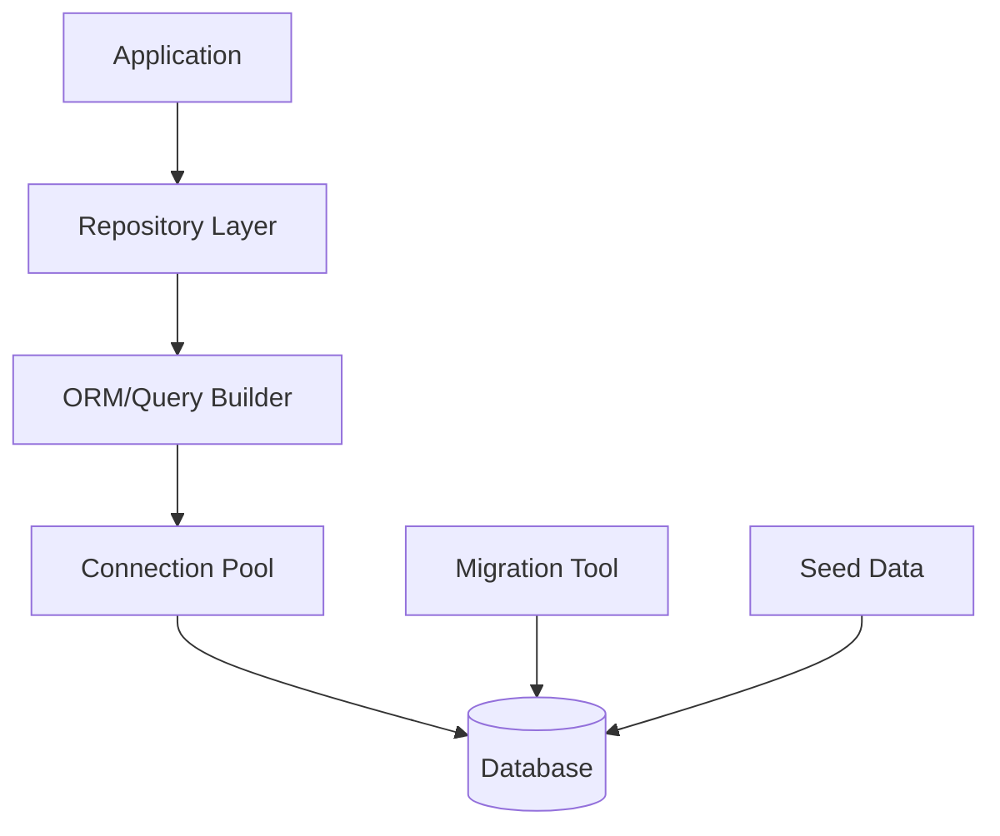
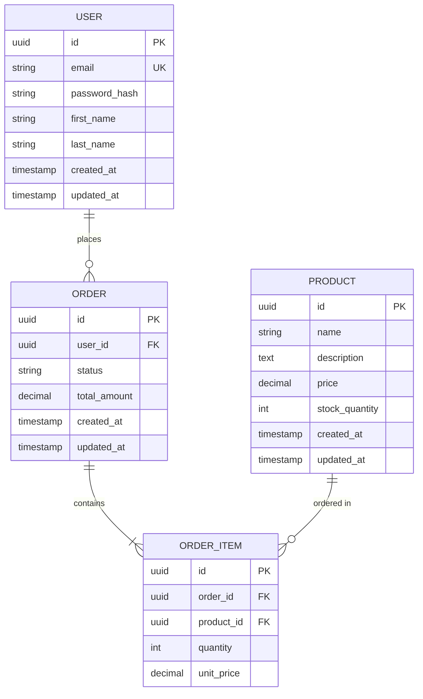

# Design Document: {{SPEC_NAME_TITLE}}

## Overview

This document describes the technical design for the {{SPEC_NAME}} database integration.

**Database**: [Specify: PostgreSQL / MySQL / MongoDB / SQLite]  
**ORM/Query Builder**: [Specify: Sequelize / TypeORM / Prisma / Knex.js]  
**Migration Tool**: [Specify: Built-in ORM migrations / Knex.js / Flyway]

## Architecture

### High-Level Architecture



### Component Responsibilities

**Repository Layer**: Abstracted data access interface  
**ORM/Query Builder**: Database query generation and execution  
**Connection Pool**: Manage database connections efficiently  
**Migration Tool**: Version control for schema changes  
**Seed Data**: Initial and test data population

## Database Schema

### Entity Relationship Diagram



### Table Definitions

#### Users Table

```sql
CREATE TABLE users (
  id UUID PRIMARY KEY DEFAULT gen_random_uuid(),
  email VARCHAR(255) UNIQUE NOT NULL,
  password_hash VARCHAR(255) NOT NULL,
  first_name VARCHAR(100) NOT NULL,
  last_name VARCHAR(100) NOT NULL,
  created_at TIMESTAMP DEFAULT CURRENT_TIMESTAMP,
  updated_at TIMESTAMP DEFAULT CURRENT_TIMESTAMP
);

CREATE INDEX idx_users_email ON users(email);
```

#### Products Table

```sql
CREATE TABLE products (
  id UUID PRIMARY KEY DEFAULT gen_random_uuid(),
  name VARCHAR(255) NOT NULL,
  description TEXT,
  price DECIMAL(10, 2) NOT NULL CHECK (price >= 0),
  stock_quantity INTEGER NOT NULL DEFAULT 0 CHECK (stock_quantity >= 0),
  created_at TIMESTAMP DEFAULT CURRENT_TIMESTAMP,
  updated_at TIMESTAMP DEFAULT CURRENT_TIMESTAMP
);

CREATE INDEX idx_products_name ON products(name);
```

## ORM Configuration

### Connection Setup

```javascript
// config/database.js
const { Sequelize } = require('sequelize');

const sequelize = new Sequelize({
  dialect: 'postgres',
  host: process.env.DB_HOST || 'localhost',
  port: process.env.DB_PORT || 5432,
  database: process.env.DB_NAME,
  username: process.env.DB_USER,
  password: process.env.DB_PASSWORD,
  
  pool: {
    max: 20,
    min: 5,
    acquire: 30000,
    idle: 10000
  },
  
  logging: process.env.NODE_ENV === 'development' ? console.log : false,
  
  dialectOptions: {
    ssl: process.env.DB_SSL === 'true' ? {
      require: true,
      rejectUnauthorized: false
    } : false
  }
});

module.exports = sequelize;
```

### Entity Models

```javascript
// models/User.js
const { DataTypes } = require('sequelize');
const sequelize = require('../config/database');

const User = sequelize.define('User', {
  id: {
    type: DataTypes.UUID,
    defaultValue: DataTypes.UUIDV4,
    primaryKey: true
  },
  email: {
    type: DataTypes.STRING,
    allowNull: false,
    unique: true,
    validate: {
      isEmail: true
    }
  },
  passwordHash: {
    type: DataTypes.STRING,
    allowNull: false,
    field: 'password_hash'
  },
  firstName: {
    type: DataTypes.STRING(100),
    allowNull: false,
    field: 'first_name'
  },
  lastName: {
    type: DataTypes.STRING(100),
    allowNull: false,
    field: 'last_name'
  }
}, {
  tableName: 'users',
  underscored: true,
  timestamps: true
});

module.exports = User;
```

## Repository Pattern

### Base Repository

```javascript
// repositories/BaseRepository.js
class BaseRepository {
  constructor(model) {
    this.model = model;
  }
  
  async findById(id) {
    return this.model.findByPk(id);
  }
  
  async findAll(filter = {}, options = {}) {
    const { limit = 20, offset = 0, order = [['createdAt', 'DESC']] } = options;
    
    return this.model.findAndCountAll({
      where: filter,
      limit,
      offset,
      order
    });
  }
  
  async create(data) {
    return this.model.create(data);
  }
  
  async update(id, data) {
    const entity = await this.findById(id);
    
    if (!entity) {
      throw new Error('Entity not found');
    }
    
    return entity.update(data);
  }
  
  async delete(id) {
    const entity = await this.findById(id);
    
    if (!entity) {
      throw new Error('Entity not found');
    }
    
    await entity.destroy();
    return true;
  }
}

module.exports = BaseRepository;
```

### Entity-Specific Repository

```javascript
// repositories/UserRepository.js
const BaseRepository = require('./BaseRepository');
const User = require('../models/User');

class UserRepository extends BaseRepository {
  constructor() {
    super(User);
  }
  
  async findByEmail(email) {
    return this.model.findOne({ where: { email } });
  }
  
  async findActive() {
    return this.model.findAll({
      where: { status: 'active' }
    });
  }
}

module.exports = new UserRepository();
```

## Migration Management

### Migration File Structure

```javascript
// migrations/20250131000001-create-users-table.js
module.exports = {
  up: async (queryInterface, Sequelize) => {
    await queryInterface.createTable('users', {
      id: {
        type: Sequelize.UUID,
        defaultValue: Sequelize.UUIDV4,
        primaryKey: true
      },
      email: {
        type: Sequelize.STRING,
        allowNull: false,
        unique: true
      },
      password_hash: {
        type: Sequelize.STRING,
        allowNull: false
      },
      first_name: {
        type: Sequelize.STRING(100),
        allowNull: false
      },
      last_name: {
        type: Sequelize.STRING(100),
        allowNull: false
      },
      created_at: {
        type: Sequelize.DATE,
        allowNull: false,
        defaultValue: Sequelize.literal('CURRENT_TIMESTAMP')
      },
      updated_at: {
        type: Sequelize.DATE,
        allowNull: false,
        defaultValue: Sequelize.literal('CURRENT_TIMESTAMP')
      }
    });
    
    await queryInterface.addIndex('users', ['email']);
  },
  
  down: async (queryInterface, Sequelize) => {
    await queryInterface.dropTable('users');
  }
};
```

## Transaction Support

```javascript
// services/OrderService.js
const sequelize = require('../config/database');
const OrderRepository = require('../repositories/OrderRepository');
const ProductRepository = require('../repositories/ProductRepository');

class OrderService {
  async createOrder(userId, items) {
    // Use transaction for atomic operation
    return sequelize.transaction(async (transaction) => {
      // Create order
      const order = await OrderRepository.create({
        userId,
        status: 'pending'
      }, { transaction });
      
      // Create order items and update stock
      for (const item of items) {
        const product = await ProductRepository.findById(item.productId, { transaction });
        
        if (product.stockQuantity < item.quantity) {
          throw new Error(`Insufficient stock for product ${product.name}`);
        }
        
        // Reduce stock
        await product.update({
          stockQuantity: product.stockQuantity - item.quantity
        }, { transaction });
        
        // Create order item
        await OrderItemRepository.create({
          orderId: order.id,
          productId: item.productId,
          quantity: item.quantity,
          unitPrice: product.price
        }, { transaction });
      }
      
      return order;
    });
  }
}

module.exports = new OrderService();
```

## Data Seeding

```javascript
// seeders/20250131000001-demo-users.js
module.exports = {
  up: async (queryInterface, Sequelize) => {
    await queryInterface.bulkInsert('users', [
      {
        id: '550e8400-e29b-41d4-a716-446655440000',
        email: 'admin@example.com',
        password_hash: '$2b$10$...',  // hashed password
        first_name: 'Admin',
        last_name: 'User',
        created_at: new Date(),
        updated_at: new Date()
      }
    ]);
  },
  
  down: async (queryInterface, Sequelize) => {
    await queryInterface.bulkDelete('users', null, {});
  }
};
```

## Testing Strategy

### Unit Tests
- Repository methods
- Model validations
- Query building logic

### Integration Tests
- Database connection
- CRUD operations
- Transaction handling
- Migration execution

### Property-Based Tests
- Data integrity constraints
- Transaction atomicity
- Query result consistency

---

**Version**: 1.0.0  
**Created**: {{DATE}}  
**Author**: {{AUTHOR}}


## Ontology Model (Backfilled)

### Business Rules
- **BR-001**: Mandatory fields must pass validation before persistence.
- **BR-002**: State transitions must comply with lifecycle policy.
- **BR-003**: Every mutating operation must emit an audit event.

### Decision Logic
- **DL-001**: If record does not exist, route to create flow; otherwise update flow.
- **DL-002**: If requested transition is invalid, reject and return violation reason.
- **DL-003**: If post-check fails, rollback and mark operation as failed.
