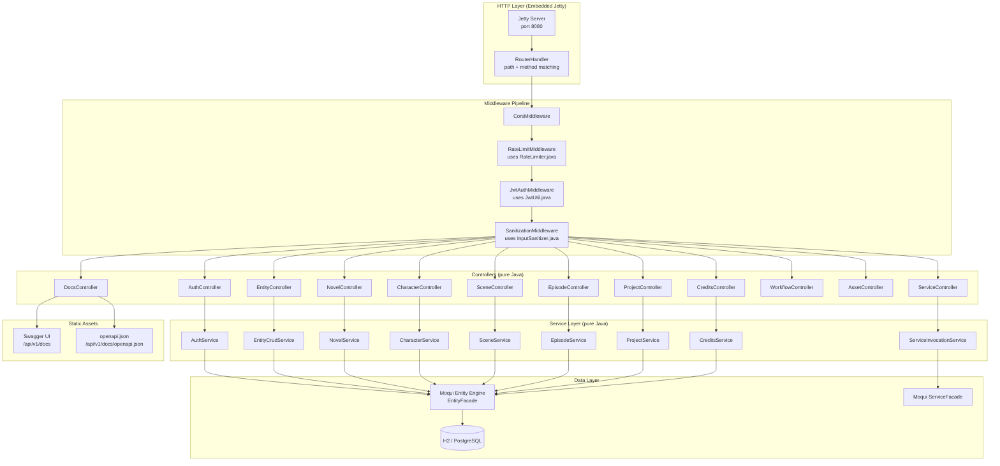
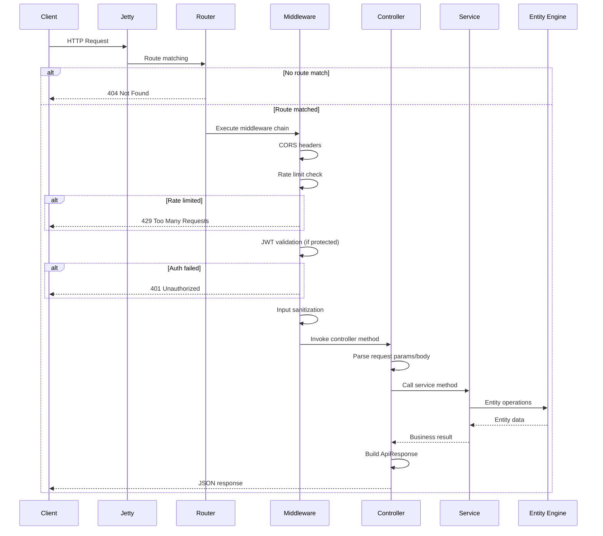
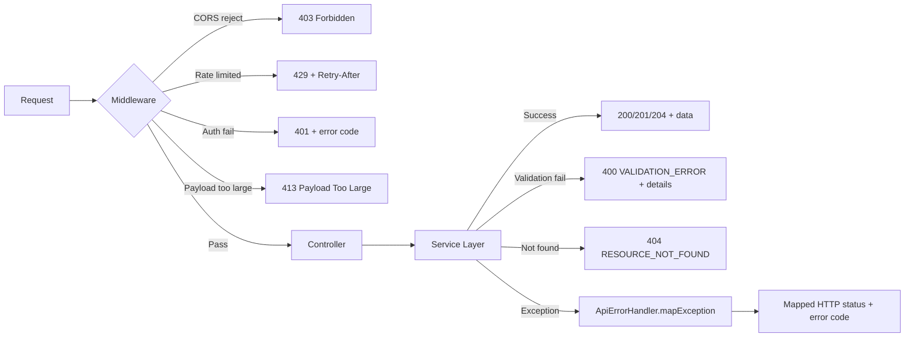

# Design Document: Pure RESTful Backend

## Overview

This design replaces the Moqui framework's HTTP layer (screen rendering, XML actions, Groovy script runner) with a pure Java REST API backend, AND converts all embedded Groovy scripts in XML service definitions across all components to pure Java service classes. The backend uses embedded Jetty directly, with a lightweight routing layer, middleware pipeline, and controller-service-repository architecture. All existing `/api/v1/` endpoint contracts are preserved.

Key design decisions:
1. **Embedded Jetty directly** — no servlet framework overhead, just Jetty handlers
2. **Annotation-free routing** — programmatic route registration for simplicity and transparency
3. **Reuse existing Java utilities** — ApiResponse, ApiErrorHandler, InputSanitizer, RateLimiter, JwtUtil are kept as-is
4. **Moqui Entity Engine retained** — only the data access layer is kept; screen rendering, XML actions, and Groovy runtime are excluded
5. **Layered architecture** — Controller → Service → Repository (Entity Engine), each layer has a single responsibility
6. **Complete Groovy elimination** — ALL embedded Groovy scripts in XML services (REST API, Framework, Mantle-USL, HiveMind, PopCommerce, MarbleERP) are converted to pure Java service classes

## Architecture

### System Architecture



### Request Processing Flow



## Components and Interfaces

### 1. RestServer (`org.moqui.rest.RestServer`)

The application entry point. Configures and starts embedded Jetty.

```java
// Pseudocode
public class RestServer {
    private Server server;
    private RestConfig config;

    public RestServer(RestConfig config, ExecutionContextFactory ecf) { }

    public void start() {
        // 1. Create Jetty Server with thread pool
        // 2. Create Router and register all routes
        // 3. Build middleware pipeline
        // 4. Set Jetty handler
        // 5. Start server
        // 6. Log registered routes
    }

    public void stop() {
        // Graceful shutdown with timeout
    }
}
```

### 2. RestConfig (`org.moqui.rest.RestConfig`)

Configuration loaded from properties file with environment variable overrides.

```java
// Pseudocode
public class RestConfig {
    private String host;           // default "0.0.0.0"
    private int port;              // default 8080
    private int minThreads;        // default 8
    private int maxThreads;        // default 200
    private int shutdownTimeout;   // default 30000ms
    private boolean productionMode;// default false
    private String corsOrigins;    // default "*"
    private int rateLimitPerMin;   // default 60
    private long maxPayloadBytes;  // default 1MB

    public static RestConfig load(String propertiesPath) {
        // Load from file, then override with env vars
        // REST_API_PORT, REST_API_HOST, etc.
    }
}
```

### 3. Router (`org.moqui.rest.Router`)

Programmatic route registration and matching.

```java
// Pseudocode
public class Router {
    // Route registration
    public void get(String pattern, RouteHandler handler) { }
    public void post(String pattern, RouteHandler handler) { }
    public void put(String pattern, RouteHandler handler) { }
    public void delete(String pattern, RouteHandler handler) { }

    // Group routes under prefix
    public void group(String prefix, Consumer<Router> registrar) { }

    // Mark routes as public (skip auth)
    public void publicRoute(String method, String pattern, RouteHandler handler) { }

    // Match request to route
    public RouteMatch match(String method, String path) { }
}

public class RouteMatch {
    RouteHandler handler;
    Map<String, String> pathParams;  // e.g., {id: "123"}
    boolean isPublic;
}

@FunctionalInterface
public interface RouteHandler {
    void handle(RequestContext ctx) throws Exception;
}
```

Path matching rules:
- Literal segments match before parameter segments: `/api/v1/novels/import-text` matches before `/api/v1/novels/{id}`
- Path parameters use `{name}` syntax
- Trailing slashes are normalized (removed)

### 4. RequestContext (`org.moqui.rest.RequestContext`)

Wraps HttpServletRequest/Response with convenience methods.

```java
// Pseudocode
public class RequestContext {
    // Request data
    public String pathParam(String name) { }
    public String queryParam(String name) { }
    public Map<String, String> queryParams() { }
    public <T> T bodyAs(Class<T> type) { }  // Jackson deserialization
    public String header(String name) { }

    // Auth context (set by JwtAuthMiddleware)
    public String userId() { }
    public String clientIp() { }

    // Response helpers
    public void json(int status, Object body) { }
    public void success(Object data) { }
    public void success(Object data, Map<String, Object> meta) { }
    public void error(int status, String code, String message) { }
    public void created(Object data) { }
    public void noContent() { }

    // Access to Moqui ExecutionContext
    public ExecutionContext ec() { }
}
```

### 5. Middleware Interface (`org.moqui.rest.Middleware`)

```java
// Pseudocode
public interface Middleware {
    // Return true to continue chain, false to short-circuit
    boolean handle(RequestContext ctx, RouteMatch route) throws Exception;
}
```

Middleware implementations:

**CorsMiddleware**: Sets CORS headers, handles preflight OPTIONS requests.

**RateLimitMiddleware**: Delegates to existing `RateLimiter.checkAndRecord()`. Key = userId or clientIp.

**JwtAuthMiddleware**: Skips public routes. Validates JWT via `JwtUtil.validateToken()`. Sets userId on RequestContext.

**SanitizationMiddleware**: Validates payload size via `InputSanitizer.validatePayloadSize()`.

**SecurityHeadersMiddleware**: Adds headers from `ApiErrorHandler.getSecurityHeaders()`.

### 6. Controllers

Each controller is a plain Java class with methods registered as route handlers.

**AuthController** (`org.moqui.rest.controller.AuthController`):
```java
// Pseudocode - routes registered in constructor
public class AuthController {
    private AuthService authService;

    public void register(Router router) {
        router.publicRoute("POST", "/api/v1/auth/login", this::login);
        router.publicRoute("POST", "/api/v1/auth/refresh", this::refresh);
        router.post("/api/v1/auth/logout", this::logout);
    }

    private void login(RequestContext ctx) {
        // Parse {username, password} from body
        // Call authService.login(username, password, clientIp)
        // Return success with tokens or error
    }

    private void refresh(RequestContext ctx) {
        // Parse {refreshToken} from body
        // Call authService.refresh(refreshToken, clientIp)
        // Return success with new tokens or error
    }

    private void logout(RequestContext ctx) {
        // Get token from Authorization header
        // Call authService.logout(token)
        // Return success
    }
}
```

**EntityController** (`org.moqui.rest.controller.EntityController`):
```java
// Pseudocode
public class EntityController {
    private EntityCrudService entityService;

    public void register(Router router) {
        router.get("/api/v1/entities/{entityName}", this::list);
        router.post("/api/v1/entities/{entityName}", this::create);
        router.get("/api/v1/entities/{entityName}/{entityId}", this::get);
        router.put("/api/v1/entities/{entityName}/{entityId}", this::update);
        router.delete("/api/v1/entities/{entityName}/{entityId}", this::delete);
    }
}
```

**ServiceController** (`org.moqui.rest.controller.ServiceController`):
```java
// Pseudocode
public class ServiceController {
    private ServiceInvocationService serviceService;

    public void register(Router router) {
        router.post("/api/v1/services/{serviceName}", this::invoke);
        router.get("/api/v1/services/jobs/{jobId}", this::getJobStatus);
    }
}
```

**Domain Controllers** (NovelController, CharacterController, SceneController, EpisodeController, ProjectController, CreditsController, WorkflowController, AssetController):

Each domain controller registers domain-specific routes and delegates to the corresponding service. Example:

```java
// Pseudocode - NovelController
public class NovelController {
    private NovelService novelService;

    public void register(Router router) {
        router.group("/api/v1/novels", r -> {
            r.post("/import-text", this::importText);
            r.post("/import-file", this::importFile);
            r.post("/analyze-structure", this::analyzeStructure);
            r.get("", this::list);           // ?projectId=X
            r.get("/{id}", this::get);
            r.put("/{id}", this::update);
            r.delete("/{id}", this::delete);
            r.post("/{id}/extract-characters", this::extractCharacters);
            r.get("/{id}/scenes", this::listScenes);
            r.post("/{id}/scenes/enhance", this::enhanceScenes);
            r.get("/{id}/scenes/stats", this::sceneStats);
            r.post("/{id}/episodes/generate", this::generateEpisodes);
            r.get("/{id}/episodes", this::listEpisodes);
            r.get("/{id}/episodes/stats", this::episodeStats);
        });
    }
}
```

### 7. Service Layer

Services contain business logic and interact with the Entity Engine.

**AuthService** (`org.moqui.rest.service.AuthService`):
```java
// Pseudocode
public class AuthService {
    private ExecutionContextFactory ecf;

    public AuthResult login(String username, String password, String clientIp) {
        // 1. Find UserAccount by username via Entity Engine
        // 2. Check account lockout (>=5 failed attempts)
        // 3. Validate password via ec.user.validatePassword()
        // 4. On failure: increment failedLogins, return error
        // 5. On success: reset failedLogins, generate JWT pair via JwtUtil
        // 6. Return tokens + userId
    }

    public AuthResult refresh(String refreshToken, String clientIp) {
        // Delegate to JwtUtil.refreshAccessToken()
    }

    public boolean logout(String token) {
        // Delegate to JwtUtil.revokeToken()
    }
}
```

**EntityCrudService** (`org.moqui.rest.service.EntityCrudService`):
```java
// Pseudocode
public class EntityCrudService {
    private ExecutionContextFactory ecf;

    public PaginatedResult list(String entityName, Map<String, String> filters,
                                 String orderBy, int pageIndex, int pageSize, String fields) {
        // 1. Validate entity name via InputSanitizer
        // 2. Get EntityDefinition, return 404 if not found
        // 3. Build EntityFind with conditions, ordering, pagination, field selection
        // 4. Execute query, build paginated result with ApiResponse.paginationMeta()
    }

    public Map<String, Object> get(String entityName, String entityId, String fields) { }
    public Map<String, Object> create(String entityName, Map<String, Object> data) { }
    public Map<String, Object> update(String entityName, String entityId, Map<String, Object> data) { }
    public void delete(String entityName, String entityId) { }
}
```

**ServiceInvocationService** (`org.moqui.rest.service.ServiceInvocationService`):
```java
// Pseudocode
public class ServiceInvocationService {
    private ExecutionContextFactory ecf;

    public Map<String, Object> invokeSync(String serviceName, Map<String, Object> params) {
        // 1. Validate service name via InputSanitizer
        // 2. Check service exists via ServiceFacade
        // 3. Execute synchronously, return result
    }

    public String invokeAsync(String serviceName, Map<String, Object> params, String userId) {
        // 1. Create AsyncJobRecord entity
        // 2. Execute async via ServiceFacade
        // 3. Return jobId
    }

    public Map<String, Object> getJobStatus(String jobId) { }
}
```

### 8. DocsController and Swagger UI

```java
// Pseudocode
public class DocsController {
    private Router router;  // to enumerate registered routes

    public void register(Router router) {
        router.publicRoute("GET", "/api/v1/docs", this::serveSwaggerUi);
        router.publicRoute("GET", "/api/v1/docs/openapi.json", this::serveOpenApiSpec);
        router.publicRoute("GET", "/api/v1/docs/*", this::serveStaticAsset);
    }

    private void serveOpenApiSpec(RequestContext ctx) {
        // Generate OpenAPI 3.0 spec from registered routes
        // Include path params, query params, request/response schemas
        // Use existing OpenApiGenerator as base, extend with route metadata
    }

    private void serveSwaggerUi(RequestContext ctx) {
        // Serve Swagger UI HTML (bundled as static resource)
        // Point to /api/v1/docs/openapi.json
    }
}
```

Swagger UI is bundled as a WebJar or static files in `src/main/resources/swagger-ui/`.

### 9. Route Registration (Application Wiring)

```java
// Pseudocode - in RestServer.start()
public void registerRoutes(Router router, ExecutionContextFactory ecf) {
    // Services
    AuthService authService = new AuthService(ecf);
    EntityCrudService entityService = new EntityCrudService(ecf);
    ServiceInvocationService serviceService = new ServiceInvocationService(ecf);
    NovelService novelService = new NovelService(ecf);
    CharacterService characterService = new CharacterService(ecf);
    SceneService sceneService = new SceneService(ecf);
    EpisodeService episodeService = new EpisodeService(ecf);
    ProjectService projectService = new ProjectService(ecf);
    CreditsService creditsService = new CreditsService(ecf);

    // Controllers
    new AuthController(authService).register(router);
    new EntityController(entityService).register(router);
    new ServiceController(serviceService).register(router);
    new NovelController(novelService).register(router);
    new CharacterController(characterService).register(router);
    new SceneController(sceneService).register(router);
    new EpisodeController(episodeService).register(router);
    new ProjectController(projectService).register(router);
    new CreditsController(creditsService).register(router);
    new WorkflowController(entityService).register(router);  // uses generic entity CRUD
    new AssetController(entityService).register(router);      // uses generic entity CRUD
    new DocsController(router).register(router);

    // Root redirect
    router.publicRoute("GET", "/", ctx -> ctx.redirect("/api/v1/docs"));
}
```

## Data Models

### Configuration Model

```java
public class RestConfig {
    String host = "0.0.0.0";
    int port = 8080;
    int minThreads = 8;
    int maxThreads = 200;
    int shutdownTimeoutMs = 30000;
    boolean productionMode = false;
    String corsAllowedOrigins = "*";
    int rateLimitPerMinute = 60;
    long maxPayloadBytes = 1_048_576L;  // 1MB
}
```

### Auth Models

```java
public class LoginRequest {
    String username;
    String password;
}

public class AuthResult {
    boolean success;
    String accessToken;
    String refreshToken;
    long expiresIn;
    String userId;
    String errorCode;
    String errorMessage;
}
```

### Route Metadata (for OpenAPI generation)

```java
public class RouteDefinition {
    String method;          // GET, POST, PUT, DELETE
    String pattern;         // /api/v1/novels/{id}
    String summary;         // "Get novel by ID"
    String description;
    boolean isPublic;
    List<ParamDef> pathParams;
    List<ParamDef> queryParams;
    Class<?> requestBodyType;   // for Jackson schema generation
    Class<?> responseType;
}
```

### Existing Models (reused as-is)

- `ApiResponse` — standardized response builder
- `ApiErrorHandler` — exception-to-HTTP mapping
- `InputSanitizer` — input validation
- `RateLimiter` — sliding window rate limiter
- `JwtUtil` / `JwtUtil.TokenPair` — JWT generation and validation
- `AsyncJobRecord` entity — async job tracking

### Package Structure

```
backend/runtime/component/rest-api/src/main/java/org/moqui/
├── api/                          # Existing utilities (kept as-is)
│   ├── ApiResponse.java
│   ├── ApiErrorHandler.java
│   ├── InputSanitizer.java
│   ├── RateLimiter.java
│   ├── OpenApiGenerator.java
│   └── ScreenJsonConverter.java
├── rest/                         # NEW: Pure REST framework
│   ├── RestServer.java           # Entry point, Jetty setup
│   ├── RestConfig.java           # Configuration
│   ├── Router.java               # Route registration + matching
│   ├── RouteMatch.java           # Match result with path params
│   ├── RouteHandler.java         # Functional interface
│   ├── RequestContext.java       # Request/response wrapper
│   ├── Middleware.java           # Middleware interface
│   ├── middleware/
│   │   ├── CorsMiddleware.java
│   │   ├── RateLimitMiddleware.java
│   │   ├── JwtAuthMiddleware.java
│   │   ├── SanitizationMiddleware.java
│   │   └── SecurityHeadersMiddleware.java
│   ├── controller/
│   │   ├── AuthController.java
│   │   ├── EntityController.java
│   │   ├── ServiceController.java
│   │   ├── NovelController.java
│   │   ├── CharacterController.java
│   │   ├── SceneController.java
│   │   ├── EpisodeController.java
│   │   ├── ProjectController.java
│   │   ├── CreditsController.java
│   │   ├── WorkflowController.java
│   │   ├── AssetController.java
│   │   └── DocsController.java
│   └── service/
│       ├── AuthService.java
│       ├── EntityCrudService.java
│       ├── ServiceInvocationService.java
│       ├── NovelService.java
│       ├── CharacterService.java
│       ├── SceneService.java
│       ├── EpisodeService.java
│       ├── ProjectService.java
│       └── CreditsService.java
└── jwt/                          # Existing (kept as-is)
    └── JwtUtil.java
```


## XML Service Groovy-to-Java Conversion Architecture

### Conversion Strategy

All embedded Groovy scripts in XML service `<script><![CDATA[...]]></script>` blocks are converted to pure Java service classes. The XML service files are either:
1. **Replaced entirely** — the Java service class is registered directly with the REST controllers (for REST API services)
2. **Updated to use Java delegation** — the XML `<actions>` block calls a Java method via `<java method="..." class="..."/>` (for Moqui-managed services that other components depend on)

### Conversion Mapping

#### Phase A: REST API Services (12 scripts → Java service methods)

| XML Service File | Scripts | Target Java Class |
|---|---|---|
| `rest-api/service/api/AuthApiServices.xml` | 3 (login, refresh, logout) | `org.moqui.rest.service.AuthService` |
| `rest-api/service/api/EntityApiServices.xml` | 5 (list, get, create, update, delete) | `org.moqui.rest.service.EntityCrudService` |
| `rest-api/service/api/ServiceApiServices.xml` | 2 (invoke, getJobStatus) | `org.moqui.rest.service.ServiceInvocationService` |
| `rest-api/service/api/ScreenApiServices.xml` | 1 (renderScreen) | `org.moqui.rest.service.ScreenService` |
| `rest-api/service/api/DocsApiServices.xml` | 1 (generateDocs) | `org.moqui.rest.controller.DocsController` |

These are fully replaced by the new REST controller + service architecture. The XML files become obsolete.

#### Phase B: Framework Services (6 scripts + 3 standalone Groovy files)

| Source | Scripts | Target Java Class |
|---|---|---|
| `framework/service/org/moqui/search/SearchServices.xml` | Embedded scripts | `org.moqui.impl.service.SearchServiceImpl.java` |
| `framework/service/org/moqui/SmsServices.xml` | Embedded scripts | `org.moqui.impl.service.SmsServiceImpl.java` |
| `framework/service/org/moqui/EmailServices.xml` | Standalone .groovy refs | `org.moqui.impl.service.EmailServiceImpl.java` |
| Standalone: `ScreenRenderEmail.groovy` etc. | 3 files | Merged into `EmailServiceImpl.java` |

#### Phase C: Mantle-USL Business Services (30+ scripts)

| XML Service File | Approx Scripts | Target Java Class |
|---|---|---|
| `mantle-usl/service/.../ReconciliationServices.xml` | 3-5 | `org.moqui.mantle.service.ReconciliationServiceImpl.java` |
| `mantle-usl/service/.../SubscriptionServices.xml` | 3-5 | `org.moqui.mantle.service.SubscriptionServiceImpl.java` |
| `mantle-usl/service/.../StoreServices.xml` | 2-3 | `org.moqui.mantle.service.StoreServiceImpl.java` |
| `mantle-usl/service/.../PromotionServices.xml` | 2-3 | `org.moqui.mantle.service.PromotionServiceImpl.java` |
| `mantle-usl/service/.../WorkEffortServices.xml` | 3-5 | `org.moqui.mantle.service.WorkEffortServiceImpl.java` |
| `mantle-usl/service/.../TimeServices.xml` | 2-3 | `org.moqui.mantle.service.TimeServiceImpl.java` |
| `mantle-usl/service/.../ShipmentWorkServices.xml` | 3-5 | `org.moqui.mantle.service.ShipmentWorkServiceImpl.java` |
| `mantle-usl/service/.../ProjectServices.xml` | 2-3 | `org.moqui.mantle.service.ProjectServiceImpl.java` |
| Other mantle-usl services with scripts | ~5 | Corresponding `*ServiceImpl.java` |
| Standalone: `PartyServices.groovy` | 1 file | `org.moqui.mantle.service.PartyServiceImpl.java` |

#### Phase D: Component AI Services (11 scripts)

| Component | XML Service File | Scripts | Target Java Class |
|---|---|---|---|
| HiveMind | AI services XML | 3 | `org.moqui.hivemind.service.AiServiceImpl.java` |
| PopCommerce | AI services XML | 4 | `org.moqui.popcommerce.service.AiServiceImpl.java` |
| MarbleERP | AI services XML | 4 | `org.moqui.marble.service.AiServiceImpl.java` |

### Conversion Pattern

Each Groovy script block follows a consistent conversion pattern:

**Before (Groovy in XML):**
```xml
<service verb="login" noun="User">
    <in-parameters>
        <parameter name="username" required="true"/>
    </in-parameters>
    <actions>
        <script><![CDATA[
            def userAccount = ec.entity.find("moqui.security.UserAccount")
                    .condition("username", username).one()
            // ... Groovy logic
        ]]></script>
    </actions>
</service>
```

**After (Pure Java):**
```java
public class AuthService {
    private final ExecutionContextFactory ecf;

    public AuthResult login(String username, String password, String clientIp) {
        ExecutionContext ec = ecf.getExecutionContext();
        EntityValue userAccount = ec.getEntity().find("moqui.security.UserAccount")
                .condition("username", username).one();
        // ... Java logic (same semantics, typed)
    }
}
```

Key conversion rules:
1. `ec.entity.find(...)` → `ec.getEntity().find(...)` (Java getter style)
2. `def` / dynamic typing → explicit Java types
3. `?.` safe navigation → null checks or Optional
4. GString `"${var}"` → String concatenation or String.format()
5. Groovy closures → Java lambdas or explicit loops
6. `as int` / `as String` → explicit casts or parse methods

## Correctness Properties

*A property is a characteristic or behavior that should hold true across all valid executions of a system — essentially, a formal statement about what the system should do. Properties serve as the bridge between human-readable specifications and machine-verifiable correctness guarantees.*

### Property 1: Route matching with parameter extraction

*For any* registered route pattern (with or without path parameters) and any request path that matches that pattern with the correct HTTP method, the Router SHALL return a successful match with correctly extracted path parameter values. Routes registered via `group()` with a prefix SHALL match as if registered with the full concatenated path.

**Validates: Requirements 2.1, 2.2, 2.3, 2.5**

### Property 2: Literal route priority over parameterized routes

*For any* pair of registered routes where one has a literal segment and the other has a parameter segment at the same position (e.g., `/novels/import-text` vs `/novels/{id}`), and a request path that matches the literal route, the Router SHALL select the literal route.

**Validates: Requirements 2.4**

### Property 3: Method Not Allowed response

*For any* registered route and any HTTP method not registered for that route's path, the Router SHALL return HTTP 405 with an `Allow` header containing the comma-separated list of valid methods for that path.

**Validates: Requirements 2.6**

### Property 4: Unknown resource returns 404

*For any* request path that does not match any registered route, or any entity name / service name that does not exist in the system, the REST_Server SHALL return HTTP 404 with a Standardized_Response containing error code `RESOURCE_NOT_FOUND`.

**Validates: Requirements 1.5, 5.7, 6.4**

### Property 5: Middleware short-circuit on rejection

*For any* middleware in the pipeline that rejects a request, all subsequent middleware and the controller SHALL NOT be invoked, and the rejection response SHALL be returned directly to the client.

**Validates: Requirements 3.2**

### Property 6: Public routes skip JWT authentication

*For any* route marked as public, the JWT_Filter SHALL not require a token, and requests without an `Authorization` header SHALL be processed by the controller.

**Validates: Requirements 3.3**

### Property 7: JWT token validation populates request context

*For any* valid JWT token containing a userId claim, after the JWT_Filter processes the request, the RequestContext SHALL contain the correct userId value.

**Validates: Requirements 3.4**

### Property 8: JWT rejects invalid tokens with correct error codes

*For any* protected route and any request with an expired token, the JWT_Filter SHALL return HTTP 401 with error code `TOKEN_EXPIRED`. *For any* protected route and any request with an invalid or missing token, the JWT_Filter SHALL return HTTP 401 with error code `AUTHENTICATION_REQUIRED`.

**Validates: Requirements 3.5, 3.6**

### Property 9: Successful login returns tokens and resets failure counter

*For any* valid username/password combination, the AuthService SHALL return a response containing non-empty `accessToken`, `refreshToken`, `expiresIn > 0`, and `userId`. If the account had previous failed login attempts, the failure counter SHALL be reset to zero.

**Validates: Requirements 4.1, 4.4**

### Property 10: Invalid login returns 401

*For any* invalid username or password, the AuthService SHALL return HTTP 401 with error code `AUTHENTICATION_REQUIRED`.

**Validates: Requirements 4.2**

### Property 11: Token refresh and revocation round-trip

*For any* valid refresh token, calling refresh SHALL return new `accessToken` and `refreshToken`. *For any* valid token, calling logout SHALL revoke it such that subsequent use of that token is rejected.

**Validates: Requirements 4.5, 4.6, 4.7**

### Property 12: Entity CRUD round-trip

*For any* valid entity name and valid entity data, creating an entity (POST) then retrieving it by the returned ID (GET) SHALL return equivalent data. Updating the entity (PUT) then retrieving it SHALL reflect the updates. Deleting the entity (DELETE) then retrieving it SHALL return 404.

**Validates: Requirements 5.3, 5.4, 5.5, 5.6**

### Property 13: Entity listing with query parameters

*For any* valid entity name and any combination of filter, orderBy, pageIndex, pageSize, and fields parameters, the entity list response SHALL contain only entities matching the filters, ordered according to orderBy, with the correct page of results, and only the requested fields.

**Validates: Requirements 5.1, 5.2**

### Property 14: Service invocation parameter pass-through

*For any* valid service name and any set of JSON parameters, the ServiceInvocationService SHALL pass all parameters to the Moqui ServiceFacade and return the service result in the Standardized_Response format.

**Validates: Requirements 6.1, 6.6**

### Property 15: Standardized response format with security headers

*For any* API response (success or error), the response body SHALL conform to the Standardized_Response format (`{ success, data?, meta?, error? }`), the `Content-Type` header SHALL be `application/json; charset=utf-8`, and the security headers (`X-Content-Type-Options`, `X-Frame-Options`, `X-XSS-Protection`) SHALL be present.

**Validates: Requirements 8.1, 8.2, 8.3, 10.1**

### Property 16: Pagination metadata completeness

*For any* paginated list response, the `meta` object SHALL contain `totalCount` (non-negative integer), `pageIndex` (non-negative integer), `pageSize` (positive integer), and `pageMaxIndex` (non-negative integer where `pageMaxIndex = ceil(totalCount / pageSize) - 1`).

**Validates: Requirements 8.4**

### Property 17: OpenAPI spec contains all registered routes

*For any* set of routes registered in the Router, the generated OpenAPI 3.0 specification SHALL contain a path entry for each route with the correct HTTP method, path parameters, and summary.

**Validates: Requirements 9.3**

### Property 18: Configuration loading with environment variable overrides

*For any* properties file and any set of environment variables, the RestConfig SHALL load values from the properties file first, then override with environment variable values where present. Missing values SHALL use defaults.

**Validates: Requirements 12.1, 12.2, 12.3**

## Error Handling

### Error Flow



### Error Handling Strategy

All errors flow through the existing `ApiErrorHandler.mapException()` and `ApiResponse.error()` utilities:

1. **Middleware rejections**: Each middleware returns the appropriate HTTP status and error code directly
2. **Controller/Service exceptions**: Caught by a top-level exception handler in `RequestContext.handle()`, delegated to `ApiErrorHandler.mapException()`
3. **Entity not found**: HTTP 404, code `RESOURCE_NOT_FOUND`
4. **Validation errors**: HTTP 400, code `VALIDATION_ERROR`, with `details` array of `{ field, message }`
5. **Auth errors**: HTTP 401, code `AUTHENTICATION_REQUIRED` or `TOKEN_EXPIRED`
6. **Permission errors**: HTTP 403, code `ACCESS_DENIED`
7. **Rate limiting**: HTTP 429, code `RATE_LIMIT_EXCEEDED`, with `Retry-After` header
8. **Unhandled exceptions**: HTTP 500, code `INTERNAL_ERROR`, message sanitized in production mode

### Global Exception Handler

The `RequestContext` wraps all controller invocations in a try-catch:

```java
// Pseudocode
try {
    handler.handle(ctx);
} catch (Exception e) {
    Map<String, Object> errorResponse = ApiErrorHandler.mapException(
        e.getClass().getName(), e.getMessage(), config.isProductionMode());
    ctx.json((int) errorResponse.get("error.httpStatus"), errorResponse);
    logger.error("Unhandled exception on {} {}", method, path, e);
}
```

## Testing Strategy

### Testing Framework

- **Unit tests**: JUnit 5 (already in project dependencies)
- **Property-based tests**: jqwik (Java property-based testing library)
- **HTTP testing**: Jetty test utilities + HttpClient for integration tests
- **Mocking**: Mockito for mocking Entity Engine and ServiceFacade

### Dual Testing Approach

**Unit tests** focus on:
- Specific examples: login with known credentials, entity CRUD with specific data
- Edge cases: empty entity names, null parameters, composite primary keys
- Integration: controller → service → mocked entity engine
- Error conditions: invalid JSON, oversized payloads, malformed tokens

**Property-based tests** focus on:
- Universal properties across all valid inputs (Properties 1-18)
- Minimum 100 iterations per property test
- Each test tagged: `Feature: {{SPEC_NAME}}, Property {N}: {title}`

### Property-Based Testing Configuration

```java
// Each property test follows this pattern
import net.jqwik.api.*;

// Feature: {{SPEC_NAME}}, Property 1: Route matching with parameter extraction
class RouterPropertyTest {
    @Property(tries = 100)
    void routeMatchingExtractsParams(
            @ForAll("validRoutePatterns") String pattern,
            @ForAll("matchingPaths") String path) {
        Router router = new Router();
        router.get(pattern, ctx -> {});
        RouteMatch match = router.match("GET", path);
        assertThat(match).isNotNull();
        // Verify extracted params match expected values
    }
}
```

### Test File Organization

```
backend/runtime/component/rest-api/src/test/java/org/moqui/rest/
├── RouterTest.java                    # Unit + property tests for Router
├── RequestContextTest.java            # Unit tests for request/response handling
├── RestConfigTest.java                # Unit + property tests for config loading
├── middleware/
│   ├── JwtAuthMiddlewareTest.java     # Unit + property tests for JWT validation
│   ├── CorsMiddlewareTest.java        # Unit tests for CORS
│   ├── RateLimitMiddlewareTest.java   # Unit tests for rate limiting
│   └── MiddlewarePipelineTest.java    # Property tests for pipeline behavior
├── controller/
│   ├── AuthControllerTest.java        # Unit + property tests for auth endpoints
│   ├── EntityControllerTest.java      # Unit + property tests for entity CRUD
│   └── ServiceControllerTest.java     # Unit tests for service invocation
├── service/
│   ├── AuthServiceTest.java           # Unit + property tests for auth logic
│   ├── EntityCrudServiceTest.java     # Unit + property tests for entity operations
│   └── ServiceInvocationServiceTest.java # Unit tests for service invocation
└── integration/
    ├── RestServerIntegrationTest.java # Full server startup + endpoint tests
    └── OpenApiGenerationTest.java     # Property tests for OpenAPI spec generation
```


## Ontology Model (Backfilled)

### Entities
- **PureRestfulBackendRecord**: Core domain record for Pure Restful Backend scenarios.
- **PureRestfulBackendProcess**: Process context handling lifecycle transitions.
- **PureRestfulBackendAuditEvent**: Immutable operation/audit trace entry.

### Relations
- **PureRestfulBackendRecord** 1:N **PureRestfulBackendProcess** (lifecycle orchestration).
- **PureRestfulBackendProcess** 1:N **PureRestfulBackendAuditEvent** (traceability and compliance).

### Business Rules
- **BR-001**: Mandatory fields must pass validation before persistence.
- **BR-002**: State transitions must comply with lifecycle policy.
- **BR-003**: Every mutating operation must emit an audit event.

### Decision Logic
- **DL-001**: If record does not exist, route to create flow; otherwise update flow.
- **DL-002**: If requested transition is invalid, reject and return violation reason.
- **DL-003**: If post-check fails, rollback and mark operation as failed.
