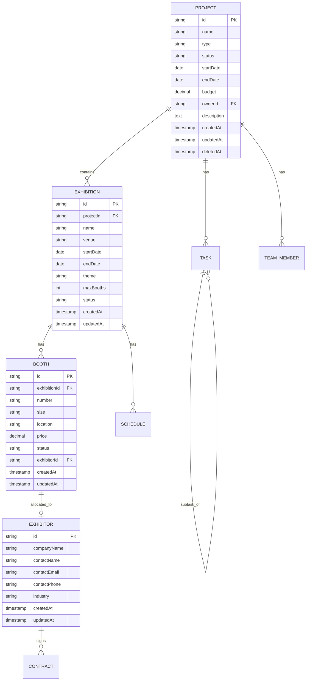
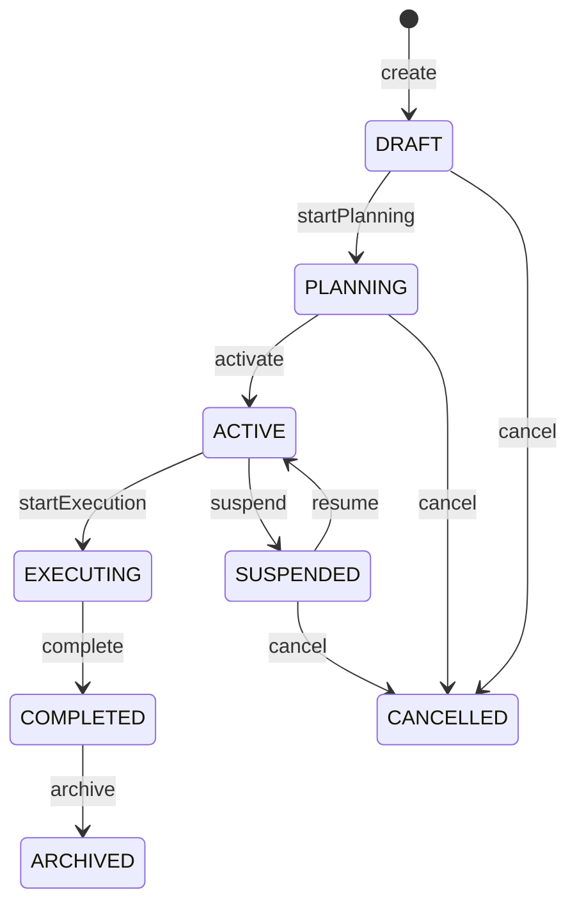

# Design Document: {{SPEC_NAME_TITLE}}

## Overview

<!-- Summarize the domain model design decisions -->
<!-- Example: "This design defines the data model for exhibition project management, consisting of 8 core entities with clearly defined relationships, state machines, and business rules. The model is designed for a REST API backend with relational database storage." -->

This design defines the domain model for {{SPEC_NAME_TITLE}}, covering entity definitions, relationships, state machines, business rules, and API endpoint planning.

Key design decisions:
1. **Relational model** — entities mapped to database tables with foreign key constraints
2. **State machine driven** — core entities use explicit state machines for lifecycle management
3. **Audit trail** — all entities include standard audit fields
4. **Soft delete** — logical deletion with deletedAt timestamp
5. **API-first** — endpoints derived directly from the domain model

## Entity-Relationship Model

### ER Diagram

<!-- Replace with actual entities and relationships -->
<!-- Example for exhibition project management: -->



<!-- Add more entities as needed -->

## Entity Definitions

### {{ENTITY_1}}: {{Entity Name}}

<!-- Define each entity in detail -->
<!-- Example: -->

| Field | Type | Constraints | Description |
|-------|------|-------------|-------------|
| id | String (UUID) | PK, NOT NULL | Unique identifier |
| name | String(200) | NOT NULL | Display name |
| status | String(20) | NOT NULL, DEFAULT 'DRAFT' | Current lifecycle state |
| createdAt | Timestamp | NOT NULL, AUTO | Creation timestamp |
| updatedAt | Timestamp | NOT NULL, AUTO | Last update timestamp |
| deletedAt | Timestamp | NULLABLE | Soft delete marker |

**Indexes:**
- `idx_{{entity}}_status` on (status)
- `idx_{{entity}}_created` on (createdAt)

**Unique Constraints:**
- {{unique constraint description}}

## State Machines

### {{Entity}} Lifecycle

<!-- Define state transitions for entities with lifecycles -->
<!-- Example: -->



**Transition Rules:**

| From | To | Trigger | Validation |
|------|----|---------|------------|
| DRAFT | PLANNING | startPlanning | Name and dates must be set |
| PLANNING | ACTIVE | activate | At least one sub-entity must exist |
| ACTIVE | EXECUTING | startExecution | Current date >= startDate |
| EXECUTING | COMPLETED | complete | All sub-tasks completed |

<!-- Repeat for each entity with a lifecycle -->

## Business Rules

### Rule 1: {{Rule Name}}

<!-- Define each business rule formally -->
<!-- Example:
**Rule**: Booth allocation constraint
**When**: A booth is being allocated to an exhibitor
**Then**: 
- The exhibition status must be PLANNING or ACTIVE
- The booth status must be AVAILABLE
- The exhibitor must have a signed contract for this exhibition
**Otherwise**: Reject with error code BOOTH_ALLOCATION_DENIED
-->

**Rule**: {{Rule description}}
**When**: {{Trigger condition}}
**Then**: {{Expected behavior}}
**Otherwise**: {{Error handling}}

### Rule 2: {{Rule Name}}

**Rule**: {{Rule description}}
**When**: {{Trigger condition}}
**Then**: {{Expected behavior}}
**Otherwise**: {{Error handling}}

## API Endpoint Planning

### Endpoints Derived from Domain Model

<!-- Each entity typically generates CRUD endpoints + business operation endpoints -->
<!-- Example: -->

| Method | Path | Description | Auth Required |
|--------|------|-------------|---------------|
| POST | /api/v1/projects | Create project | Yes |
| GET | /api/v1/projects | List projects (paginated, filterable) | Yes |
| GET | /api/v1/projects/{id} | Get project detail | Yes |
| PUT | /api/v1/projects/{id} | Update project | Yes |
| DELETE | /api/v1/projects/{id} | Soft delete project | Yes |
| POST | /api/v1/projects/{id}/activate | Transition to ACTIVE state | Yes |
| GET | /api/v1/projects/{id}/exhibitions | List exhibitions under project | Yes |
| GET | /api/v1/projects/{id}/tasks | List tasks under project | Yes |
| GET | /api/v1/projects/{id}/dashboard | Project dashboard summary | Yes |

<!-- Repeat for each entity -->

### Request/Response Patterns

**Standard List Response:**
```json
{
  "success": true,
  "data": [ ... ],
  "meta": {
    "page": 1,
    "pageSize": 20,
    "total": 150,
    "totalPages": 8
  }
}
```

**Standard Detail Response:**
```json
{
  "success": true,
  "data": {
    "id": "...",
    "name": "...",
    "status": "...",
    "...": "..."
  }
}
```

**Standard Error Response:**
```json
{
  "success": false,
  "error": {
    "code": "ENTITY_NOT_FOUND",
    "message": "Project not found",
    "details": { "id": "..." }
  }
}
```

## Data Migration Strategy

<!-- If migrating from an existing system, define the migration approach -->
<!-- Example:
1. Export existing data from legacy system as CSV/JSON
2. Map legacy fields to new entity fields (mapping table below)
3. Run migration script with validation
4. Verify data integrity post-migration
-->

- {{Migration step 1}}
- {{Migration step 2}}

## Correctness Properties

<!-- Define properties that must hold true for the domain model -->

### Property 1: Entity Referential Integrity
**For all** entity relationships, **when** a parent entity is soft-deleted, **then** child entities SHALL NOT be orphaned (cascade soft-delete or prevent deletion if active children exist).

### Property 2: State Machine Validity
**For all** state transitions, **the** resulting state SHALL always be a valid state reachable from the current state according to the defined state machine.

### Property 3: Business Rule Consistency
**For all** business operations, **the** system SHALL enforce all applicable business rules before persisting any state change.

## Testing Strategy

- **Unit Tests**: Entity validation, state machine transitions, business rule enforcement
- **Property-Based Tests**: State machine reachability, referential integrity, constraint validation across random inputs
- **Integration Tests**: API endpoint CRUD operations, cascading operations, concurrent access
- **Framework**: JUnit 5 + jqwik (property-based testing) for backend

**Validates: Requirements 1-5**
