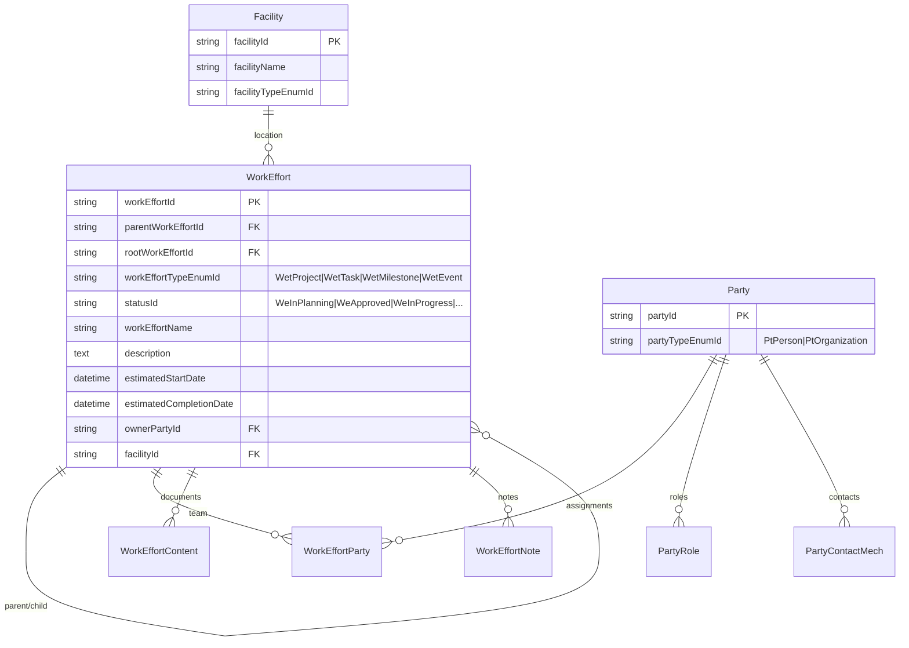
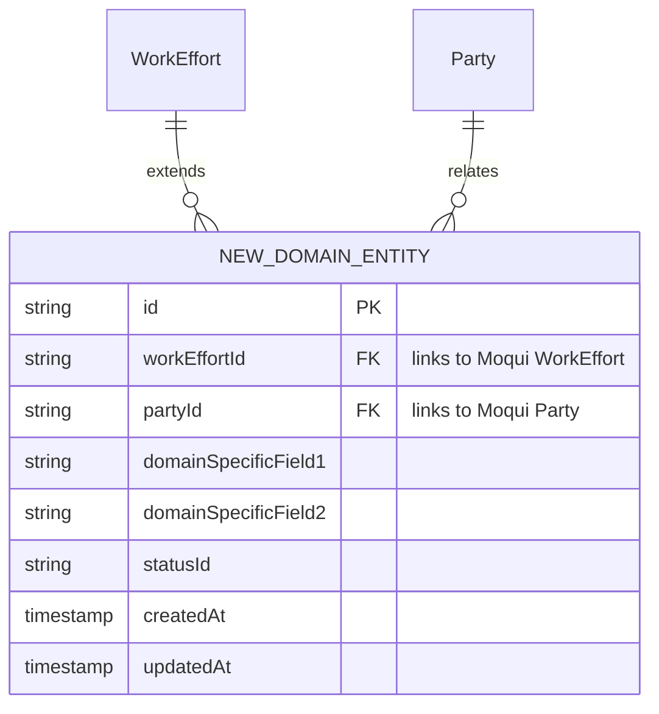
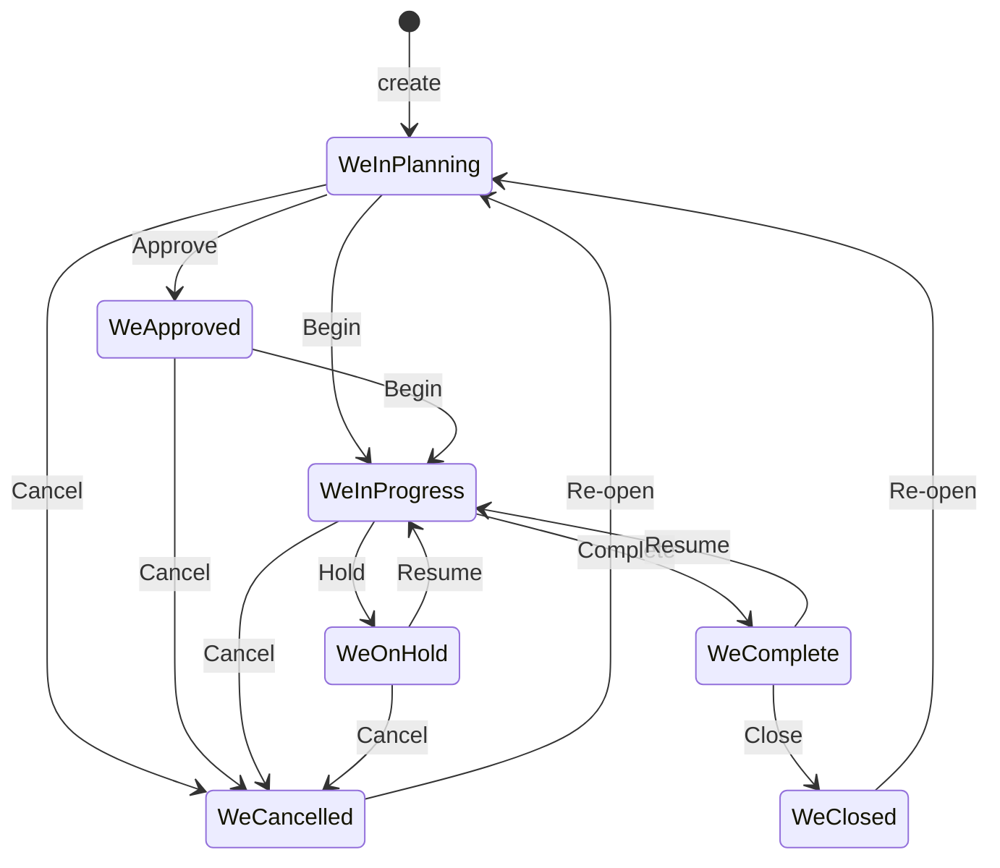
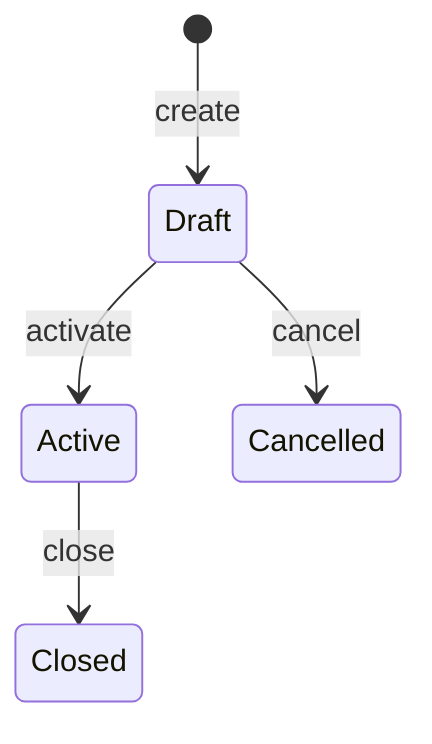

# Design Document: {{SPEC_NAME_TITLE}}

## Overview

This design extends Moqui's existing data model and REST API for {{INDUSTRY_DOMAIN}}. The core principle is **reuse-first**: maximize use of Moqui's proven entities, services, and generic REST APIs before creating anything new.

**Architecture Approach:**
1. **Reuse Layer** — Moqui entities (WorkEffort, Party, Facility) accessed via existing generic CRUD API
2. **Extension Layer** — New entity XML definitions for domain-specific concepts, auto-exposed via generic CRUD API
3. **Business Logic Layer** — New Java service classes for complex domain rules, invokable via generic Service API
4. **Composition Layer** — Optional new controller endpoints that orchestrate multiple entities/services for domain workflows

## Reuse Architecture

### How Moqui Generic APIs Work

```
┌─────────────────────────────────────────────────────────────────┐
│                    Existing Generic REST APIs                     │
│                    (NO code changes needed)                       │
├─────────────────────────────────────────────────────────────────┤
│                                                                   │
│  GET    /api/v1/entities/{entityName}              → List         │
│  GET    /api/v1/entities/{entityName}/{id}          → Get          │
│  POST   /api/v1/entities/{entityName}              → Create       │
│  PUT    /api/v1/entities/{entityName}/{id}          → Update       │
│  DELETE /api/v1/entities/{entityName}/{id}          → Delete       │
│  GET    /api/v1/entities/{entityName}/{id}/related/{rel} → Related │
│  POST   /api/v1/entities/{entityName}/batch        → Batch        │
│                                                                   │
│  POST   /api/v1/services/{serviceName}             → Invoke       │
│  GET    /api/v1/services/                          → List         │
│                                                                   │
└─────────────────────────────────────────────────────────────────┘
         │                              │
         ▼                              ▼
┌─────────────────┐          ┌─────────────────────┐
│ EntityCrudService│          │ServiceInvocationSvc  │
│ (generic CRUD)   │          │(generic invoke)      │
└────────┬────────┘          └──────────┬──────────┘
         │                              │
         ▼                              ▼
┌─────────────────────────────────────────────────────┐
│              Moqui Entity Engine / Service Engine     │
│  ┌──────────┐ ┌──────────┐ ┌──────────┐            │
│  │WorkEffort│ │  Party   │ │ Facility │  + NEW      │
│  │  Task    │ │  Role    │ │          │  entities   │
│  │Milestone │ │ContactMech│ │          │             │
│  └──────────┘ └──────────┘ └──────────┘            │
└─────────────────────────────────────────────────────┘
```

**Key insight:** When you add a new Entity XML definition to `runtime/component/`, Moqui's Entity Engine automatically picks it up. The generic CRUD API (`/api/v1/entities/{entityName}`) then works for it immediately — zero controller/service code needed for basic CRUD.

## Entity Model

### Reused Moqui Entities (No Changes)

<!-- Example for exhibition domain: -->



### New Domain-Specific Entities

<!-- Define ONLY entities that Moqui does not provide -->
<!-- Example: -->



### Entity XML Definition (Moqui Format)

<!-- New entities must follow Moqui's XML format to be auto-discovered -->
<!-- Place in: runtime/component/{{COMPONENT_NAME}}/entity/{{Domain}}Entities.xml -->

```xml
<?xml version="1.0" encoding="UTF-8"?>
<entities xmlns:xsi="http://www.w3.org/2001/XMLSchema-instance"
          xsi:noNamespaceSchemaLocation="http://moqui.org/xsd/entity-definition-3.xsd">

    <!-- Example: Exhibition Booth entity extending Moqui's model -->
    <entity entity-name="{{NewEntity}}" package="{{package.name}}" cache="never">
        <field name="{{entityId}}" type="id" is-pk="true"/>
        <!-- FK to Moqui WorkEffort -->
        <field name="workEffortId" type="id"/>
        <!-- FK to Moqui Party -->
        <field name="partyId" type="id"/>
        <!-- Domain-specific fields -->
        <field name="{{field1}}" type="text-medium"/>
        <field name="{{field2}}" type="text-medium"/>
        <field name="statusId" type="id"/>
        <!-- Audit fields -->
        <field name="createdDate" type="date-time" default="ec.user.nowTimestamp"/>
        <field name="lastUpdatedStamp" type="date-time"/>

        <!-- Relationships to Moqui entities -->
        <relationship type="one" related="mantle.work.effort.WorkEffort">
            <key-map field-name="workEffortId"/></relationship>
        <relationship type="one" related="mantle.party.Party">
            <key-map field-name="partyId"/></relationship>
        <relationship type="one" title="{{Entity}}" related="moqui.basic.StatusItem">
            <key-map field-name="statusId"/></relationship>

        <!-- Seed data for status flow -->
        <seed-data>
            <moqui.basic.StatusType description="{{Entity}} Status" statusTypeId="{{Entity}}"/>
            <moqui.basic.StatusItem description="Draft" statusId="{{Ent}}Draft" statusTypeId="{{Entity}}"/>
            <moqui.basic.StatusItem description="Active" statusId="{{Ent}}Active" statusTypeId="{{Entity}}"/>
            <moqui.basic.StatusItem description="Closed" statusId="{{Ent}}Closed" statusTypeId="{{Entity}}"/>
            <!-- Status transitions -->
            <moqui.basic.StatusFlowTransition statusFlowId="Default"
                statusId="{{Ent}}Draft" toStatusId="{{Ent}}Active" transitionName="Activate"/>
            <moqui.basic.StatusFlowTransition statusFlowId="Default"
                statusId="{{Ent}}Active" toStatusId="{{Ent}}Closed" transitionName="Close"/>
        </seed-data>
    </entity>
</entities>
```

## State Machines

### Reused: WorkEffort Lifecycle (Moqui Built-in)



**No code needed** — Moqui's StatusFlowTransition handles this automatically.

### New: {{Domain Entity}} Lifecycle

<!-- Only define state machines for NEW entities -->



## API Endpoint Planning

### Tier 1: Zero-Code Endpoints (Generic CRUD API)

<!-- These work immediately for ALL entities — existing and new -->

| Operation | Endpoint | Example |
|-----------|----------|---------|
| List projects | `GET /api/v1/entities/WorkEffort?workEffortTypeEnumId=WetProject` | Filter by type |
| Get project | `GET /api/v1/entities/WorkEffort/{id}` | By ID |
| Create project | `POST /api/v1/entities/WorkEffort` | With type=WetProject |
| Update project | `PUT /api/v1/entities/WorkEffort/{id}` | Any fields |
| List tasks | `GET /api/v1/entities/WorkEffort?rootWorkEffortId={projectId}&workEffortTypeEnumId=WetTask` | Filter by project + type |
| List new entities | `GET /api/v1/entities/{{NewEntity}}` | Auto-works for new XML entities |
| Create new entity | `POST /api/v1/entities/{{NewEntity}}` | Auto-works |

### Tier 2: Zero-Code Endpoints (Generic Service API)

<!-- Invoke existing Moqui services directly -->

| Operation | Endpoint | Service Name |
|-----------|----------|-------------|
| Create WorkEffort | `POST /api/v1/services/mantle.work.WorkEffortServices.create#WorkEffort` | With validation |
| Update status | `POST /api/v1/services/mantle.work.WorkEffortServices.update#WorkEffort` | Status transition |
| Assign party | `POST /api/v1/services/mantle.work.WorkEffortServices.create#WorkEffortParty` | Team assignment |

### Tier 3: New Endpoints (Domain Business Logic)

<!-- ONLY for complex operations that can't be done with generic APIs -->

| Method | Path | Description | Implementation |
|--------|------|-------------|----------------|
| POST | /api/v1/{{domain}}/{{operation}} | {{Complex business operation}} | New Java service class |

## Business Rules Implementation

### Rules Using Moqui's Built-in Mechanisms

<!-- Leverage Moqui's EECA (Entity Event Condition Action) for automatic rules -->

```xml
<!-- Example: Auto-validate before status change -->
<!-- Place in: runtime/component/{{COMPONENT}}/entity/{{Domain}}.eecas.xml -->
<eecas xmlns:xsi="http://www.w3.org/2001/XMLSchema-instance"
       xsi:noNamespaceSchemaLocation="http://moqui.org/xsd/eeca-definition-3.xsd">
    <eeca entity="{{NewEntity}}" on-update="true">
        <condition><expression>statusId != oldValues.statusId</expression></condition>
        <actions>
            <!-- Validate state transition -->
            <!-- Enforce business rules -->
        </actions>
    </eeca>
</eecas>
```

### Rules Requiring New Java Services

<!-- Only for rules too complex for EECA -->

| Rule | Trigger | Implementation |
|------|---------|----------------|
| {{Rule 1}} | {{When}} | Java service class |

## Component Structure

<!-- New files to create in Moqui's runtime component structure -->

```
backend/runtime/component/{{COMPONENT_NAME}}/
├── entity/
│   └── {{Domain}}Entities.xml          ← New entity definitions
├── service/
│   └── {{Domain}}Services.xml          ← New service definitions (if needed)
├── data/
│   └── {{Domain}}SetupData.xml         ← Seed data (enums, status types)
└── src/
    └── {{package}}/
        └── {{Domain}}Service.java      ← Java service (if needed)
```

## Correctness Properties

### Property 1: Entity Reuse Integrity
**For all** domain operations using reused Moqui entities, **the** operation SHALL produce results identical to direct Moqui entity operations (no behavioral divergence).

### Property 2: New Entity Compatibility
**For all** new entity definitions, **the** generic CRUD API (`/api/v1/entities/`) SHALL support list, get, create, update, delete operations without any controller code changes.

### Property 3: Service Discoverability
**For all** new services, **they** SHALL be discoverable via `sce scene discover -t services` after registration.

### Property 4: Status Flow Validity
**For all** entities with status fields, **the** status transitions SHALL follow the defined StatusFlowTransition rules.

### Property 5: Same-Domain Language Consistency
**For all** new services within the same business domain, **they** SHALL be implemented in the same language as the existing project stack (Java for Moqui projects). Cross-language integration SHALL only exist between independent domains via async messaging.

## Testing Strategy

- **Integration Tests**: Verify generic CRUD API works for new entities, verify service invocation for new services
- **Property-Based Tests**: Status transition validity, referential integrity between new and existing entities
- **Discovery Tests**: Verify new entities/services appear in `sce scene discover` results
- **Framework**: JUnit 5 + jqwik (property-based testing)

**Validates: Requirements 1-5**


## Ontology Model (Backfilled)

### Entities
- **MoquiDomainExtensionRecord**: Core domain record for Moqui Domain Extension scenarios.
- **MoquiDomainExtensionProcess**: Process context handling lifecycle transitions.
- **MoquiDomainExtensionAuditEvent**: Immutable operation/audit trace entry.

### Relations
- **MoquiDomainExtensionRecord** 1:N **MoquiDomainExtensionProcess** (lifecycle orchestration).
- **MoquiDomainExtensionProcess** 1:N **MoquiDomainExtensionAuditEvent** (traceability and compliance).

### Decision Logic
- **DL-001**: If record does not exist, route to create flow; otherwise update flow.
- **DL-002**: If requested transition is invalid, reject and return violation reason.
- **DL-003**: If post-check fails, rollback and mark operation as failed.
