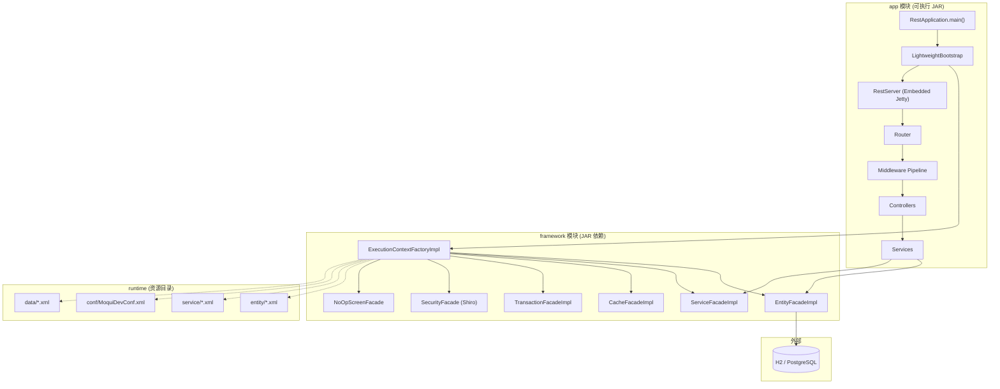

# Design Document: 架构重构

## Overview

本设计将 331-poc 项目从 Moqui 框架的遗留架构（WAR 打包、Groovy 编译、XML Screen 渲染、MoquiStart ClassLoader）重构为一个标准的纯 Java REST API 项目。核心策略是"保留数据层，替换一切上层"：

1. **保留**: Entity Engine、Service Facade、Cache、Transaction、Security（这些是 REST API 运行时实际依赖的 Moqui 子系统）
2. **移除**: Screen Engine（ScreenFacadeImpl、ScreenForm.groovy、ScreenRenderImpl.groovy）、WAR 打包、MoquiStart、FreeMarker、Groovy 运行时
3. **迁移**: Gradle Groovy DSL → Maven、`runtime/component/rest-api` 子模块 → 顶层项目入口
4. **简化**: ECFI 初始化流程，跳过 Screen Facade 和 Webapp 组件

关键设计决策：
- **不修改 Moqui 核心接口**（ExecutionContextFactory、ExecutionContext 仍保留 `getScreen()` 和 `getGroovyClassLoader()` 方法签名），而是让 ScreenFacade 返回一个 NoOp 实现，GroovyClassLoader 保留为 null-safe stub。这避免了对 Moqui 框架的大规模接口重构，降低风险。
- **Maven 多模块项目**：顶层 `pom.xml` 包含 `framework` 和 `app`（原 rest-api）两个模块，`app` 模块产出可执行 fat JAR。
- **渐进式迁移**：先确保 Maven 构建通过，再移除 Groovy/Screen 组件，最后清理遗留文件。

## Architecture

### 目标架构



### 当前架构 vs 目标架构对比

| 维度 | 当前 | 目标 |
|------|------|------|
| 启动入口 | MoquiStart → WAR → Servlet → ECFI | RestApplication.main() → LightweightBootstrap → ECFI |
| 打包格式 | WAR (含 execlib/) | 可执行 JAR (Maven Shade) |
| 构建工具 | Gradle Groovy DSL | Maven |
| Screen Engine | ScreenFacadeImpl (含 Groovy) | NoOpScreenFacade (空实现) |
| Groovy 运行时 | 必需 (joint compilation) | 移除 (保留 stub 接口) |
| 项目结构 | framework/ + runtime/component/rest-api/ | framework/ + app/ (顶层) |
| 配置 | MoquiDevConf.xml + MoquiInit.properties | application.properties + 环境变量 + MoquiConf.xml 兼容 |

## Components and Interfaces

### 1. LightweightBootstrap

新增的启动引导类，替代 MoquiStart 的角色。

```java
package org.moqui.rest;

/**
 * Lightweight bootstrap that initializes only the required Moqui subsystems.
 * Skips Screen Engine, Webapp components, and FreeMarker.
 */
public class LightweightBootstrap {
    
    /**
     * Initialize ECFI with REST-only configuration.
     * Sets system properties, creates ECFI, returns ready-to-use factory.
     */
    public ExecutionContextFactory initialize(RestConfig config) {
        // 1. Set moqui.runtime and moqui.conf system properties
        // 2. Create ECFI via Moqui.dynamicInit()
        // 3. Log startup time
        // 4. Return ECF
    }
    
    /**
     * Shutdown ECFI gracefully.
     */
    public void shutdown(ExecutionContextFactory ecf) {
        ecf.destroy();
    }
}
```

### 2. NoOpScreenFacade

空实现，满足 ExecutionContextFactory 接口契约但不做任何事。

```java
package org.moqui.impl.screen;

/**
 * No-operation ScreenFacade implementation.
 * Used when Screen Engine is not needed (REST-only mode).
 * All methods throw UnsupportedOperationException or return null/empty.
 */
public class NoOpScreenFacade implements ScreenFacade {
    @Override
    public ScreenRender makeRender() {
        throw new UnsupportedOperationException("Screen rendering not available in REST-only mode");
    }
    // ... other methods return null/empty/throw
}
```

### 3. 修改后的 ECFI 初始化

在 ExecutionContextFactoryImpl 中，将 `screenFacade = new ScreenFacadeImpl(this)` 替换为条件初始化：

```java
// 检查是否为 REST-only 模式
String restOnlyMode = System.getProperty("moqui.rest.only", "false");
if ("true".equals(restOnlyMode)) {
    screenFacade = new NoOpScreenFacade();
    logger.info("Screen Facade skipped (REST-only mode)");
} else {
    screenFacade = new ScreenFacadeImpl(this);
    logger.info("Screen Facade initialized");
}
```

### 4. 修改后的 RestApplication

```java
public class RestApplication {
    public void start() throws Exception {
        // 1. Load RestConfig from application.properties + env vars
        RestConfig config = RestConfig.load("application.properties");
        
        // 2. Initialize Moqui via LightweightBootstrap
        LightweightBootstrap bootstrap = new LightweightBootstrap();
        ExecutionContextFactory ecf = bootstrap.initialize(config);
        
        // 3. Create and start REST server (same as current)
        RestServer server = new RestServer(config, ecf);
        // ... wire controllers and services ...
        server.start();
    }
}
```

### 5. Maven 项目结构

```
331-poc/backend/
├── pom.xml                          # 父 POM (多模块)
├── framework/
│   ├── pom.xml                      # framework 模块 POM
│   └── src/main/java/               # Moqui 框架源码 (纯 Java)
│       └── org/moqui/
│           ├── Moqui.java
│           ├── context/
│           ├── entity/
│           ├── impl/
│           │   ├── context/
│           │   ├── entity/
│           │   ├── screen/
│           │   │   └── NoOpScreenFacade.java
│           │   └── service/
│           └── service/
├── app/
│   ├── pom.xml                      # app 模块 POM (产出 fat JAR)
│   └── src/main/java/
│       └── org/moqui/rest/
│           ├── RestApplication.java
│           ├── LightweightBootstrap.java
│           ├── RestServer.java
│           ├── Router.java
│           ├── controller/
│           ├── middleware/
│           └── service/
├── runtime/
│   ├── conf/
│   ├── entity/
│   ├── service/
│   ├── data/
│   └── component/
│       ├── mantle-udm/              # 保留 (实体定义)
│       └── mantle-usl/              # 保留 (服务定义)
└── application.properties           # 统一配置文件
```

### 6. 配置映射

`application.properties` 统一配置，同时保持 Moqui XML 配置兼容：

```properties
# Server
rest.api.host=0.0.0.0
rest.api.port=8080
rest.api.min.threads=8
rest.api.max.threads=200

# Database (映射到 Moqui datasource 配置)
db.url=jdbc:h2:file:./runtime/db/h2/moqui_default
db.username=sa
db.password=
db.pool.size=10

# Moqui runtime
moqui.runtime=./runtime
moqui.conf=conf/MoquiDevConf.xml
moqui.rest.only=true

# Security
rest.api.jwt.secret=${JWT_SECRET:}
```

## Data Models

本 Spec 不引入新的数据模型。所有现有实体定义（Mantle-UDM、自定义实体）保持不变，通过 Entity Engine 访问。

### 依赖矩阵

| Moqui 组件 | REST API 是否使用 | 处理方式 |
|------------|------------------|---------|
| EntityFacadeImpl | ✅ 核心依赖 | 保留 |
| ServiceFacadeImpl | ✅ 核心依赖 | 保留 |
| CacheFacadeImpl | ✅ 核心依赖 | 保留 |
| TransactionFacadeImpl | ✅ 核心依赖 | 保留 |
| UserFacadeImpl | ✅ 认证依赖 | 保留 |
| ResourceFacadeImpl | ✅ 间接依赖 | 保留 |
| LoggerFacadeImpl | ✅ 日志依赖 | 保留 |
| SecurityFacade (Shiro) | ✅ 认证依赖 | 保留 |
| ElasticFacadeImpl | ⚠️ 可选 | 保留但可禁用 |
| ScreenFacadeImpl | ❌ 不使用 | 替换为 NoOp，源码归档到 `docs/legacy-screen-engine/` |
| ScreenForm.groovy | ❌ 不使用 | 归档到 `docs/legacy-screen-engine/`（前端参考） |
| ScreenRenderImpl.groovy | ❌ 不使用 | 归档到 `docs/legacy-screen-engine/`（前端参考） |
| MoquiStart.java | ❌ 不使用 | 删除 |
| WAR 打包 | ❌ 不使用 | 移除 |
| FreeMarker | ❌ 不使用 | 从运行时移除，模板文件归档到 `docs/legacy-screen-engine/` |
| Groovy 运行时 | ⚠️ ECFI 内部使用 | 保留最小依赖 |

### Groovy 依赖分析

关键发现：Moqui 核心接口 (`ExecutionContextFactory`, `ExecutionContext`) 直接引用了 Groovy 类型：
- `ExecutionContextFactory.getGroovyClassLoader()` 返回 `groovy.lang.GroovyClassLoader`
- `ExecutionContext` 导入 `groovy.lang.Closure`

**策略**：在本 Spec 中保留 Groovy 作为编译时依赖（`provided` scope），但从运行时 classpath 中移除大部分 Groovy 模块。仅保留 `groovy` 核心 JAR 以满足类加载需求。完全移除 Groovy 需要重构 Moqui 核心接口，这超出本 Spec 范围。

修正后的处理方式：
- `groovy-3.0.19.jar` — 保留（核心接口依赖）
- `groovy-json`, `groovy-xml`, `groovy-templates`, `groovy-dateutil`, `groovy-groovysh` — 移除
- Groovy 编译插件 — 移除（不再有 .groovy 源文件）

### 前端参考资料归档策略

由于本项目是前后端分离架构，Screen Engine 中的渲染逻辑虽然后端不再需要，但包含了大量前端 UI 组件的结构定义、表单布局、数据绑定逻辑，这些在未来构建前端时是重要的参考资料。

**归档目录**: `docs/legacy-screen-engine/`

**归档内容**:
- `ScreenForm.groovy` — 表单定义、字段类型、验证规则、布局逻辑
- `ScreenRenderImpl.groovy` — 页面渲染流程、组件树结构、数据绑定
- `ScreenFacadeImpl.java` — Screen 生命周期管理
- `framework/screen/` 目录下的 XML Screen 定义文件
- `framework/template/` 目录下的 FreeMarker 模板文件
- 各组件的 `screen/` 目录（SimpleScreens、webroot 等）

**归档原则**:
1. 保持原始目录结构，方便查找
2. 添加 `README.md` 说明归档目的和内容索引
3. 不纳入编译路径，仅作为文档参考
4. 前端 Spec 创建时可从此处提取 UI 结构信息


## Correctness Properties

*A property is a characteristic or behavior that should hold true across all valid executions of a system — essentially, a formal statement about what the system should do. Properties serve as the bridge between human-readable specifications and machine-verifiable correctness guarantees.*

Based on the prework analysis, the following properties were identified after consolidating redundant criteria:

### Property 1: Configuration resolution priority

*For any* configuration key, the resolved value SHALL follow the priority order: environment variable > properties file value > default value. If an environment variable is set for a key, it overrides the properties file; if neither is set, the default is used.

**Validates: Requirements 5.5, 7.1, 7.2, 7.3**

### Property 2: Dependency version preservation

*For any* runtime dependency that existed in the Gradle build, the Maven build SHALL declare the same dependency with an identical version number.

**Validates: Requirements 4.3**

### Property 3: Bootstrap facade initialization

*For any* valid configuration (valid runtime path, valid conf file), after LightweightBootstrap completes initialization, the returned ExecutionContextFactory SHALL have non-null Entity, Service, Cache, Transaction, and Security facades.

**Validates: Requirements 5.1**

### Property 4: Endpoint regression

*For any* API endpoint that was registered before the migration, the endpoint SHALL still be reachable (not return 404) and SHALL return a valid HTTP status code (not 500) after the migration is complete.

**Validates: Requirements 2.5, 9.5**

## Error Handling

### 启动失败

| 场景 | 处理方式 |
|------|---------|
| `moqui.runtime` 路径不存在 | 日志输出 "Runtime path not found: {path}"，退出码 1 |
| `moqui.conf` 配置文件不存在 | 日志输出 "Configuration file not found: {path}"，退出码 1 |
| 数据库连接失败 | 日志输出 "Database connection failed: {url} - {error}"，退出码 1 |
| Entity Engine 初始化失败 | 日志输出 "Entity Engine initialization failed: {error}"，退出码 1 |
| 端口被占用 | 日志输出 "Port {port} already in use"，退出码 1 |

### 运行时错误

| 场景 | 处理方式 |
|------|---------|
| 调用 NoOpScreenFacade 方法 | 抛出 `UnsupportedOperationException("Screen rendering not available in REST-only mode")` |
| 调用 getGroovyClassLoader() | 返回 null（已有代码不应调用此方法） |
| 配置文件解析错误 | 使用默认值，日志 WARN 级别输出解析错误详情 |

### 迁移回滚策略

1. **Git 分支保护**: 所有迁移工作在独立分支进行，主分支保持不变
2. **渐进式验证**: 每个迁移步骤后运行构建和测试，失败则回退该步骤
3. **Gradle 文件保留**: 在 Maven 构建完全验证通过之前，不删除 Gradle 文件

## Testing Strategy

### 测试框架

- **单元测试**: JUnit 5 (junit-jupiter)
- **属性测试**: jqwik 1.9.0（已在项目中使用）
- **断言库**: JUnit 5 Assertions + Hamcrest

### 属性测试 (Property-Based Tests)

每个 Correctness Property 对应一个属性测试，最少运行 100 次迭代：

| Property | 测试方法 | 生成器 |
|----------|---------|--------|
| Property 1: Config resolution | 生成随机 config key/value 对，设置 env var 和 properties file，验证优先级 | 随机字符串 key/value |
| Property 2: Dependency versions | 解析 Gradle 和 Maven 依赖列表，逐一比较版本 | 从构建文件提取 |
| Property 3: Bootstrap facades | 使用有效配置初始化 bootstrap，检查所有 facade 非 null | 有效配置参数 |
| Property 4: Endpoint regression | 遍历所有注册路由，发送请求验证非 404/500 | 从 Router 提取路由列表 |

### 单元测试

| 测试目标 | 测试内容 |
|----------|---------|
| LightweightBootstrap | 正常初始化、无效路径处理、缺失配置处理 |
| NoOpScreenFacade | 所有方法抛出 UnsupportedOperationException |
| RestConfig (增强) | application.properties 加载、环境变量覆盖、默认值 |
| Maven 构建产物 | JAR 可执行、manifest 正确、依赖完整 |

### 测试标签格式

```java
// Feature: {{SPEC_NAME}}, Property 1: Configuration resolution priority
@Property(tries = 100)
void configResolutionPriority(@ForAll String key, @ForAll String fileValue, @ForAll String envValue) {
    // ...
}
```

### 回归测试

迁移完成后运行的验证清单：
1. `mvn clean compile` — 零错误零警告
2. `mvn test` — 所有测试通过
3. `java -jar target/app.jar` — 服务器启动成功
4. HTTP GET `/api/v1/docs` — 返回 200
5. 所有已注册 API 端点 — 返回非 404
