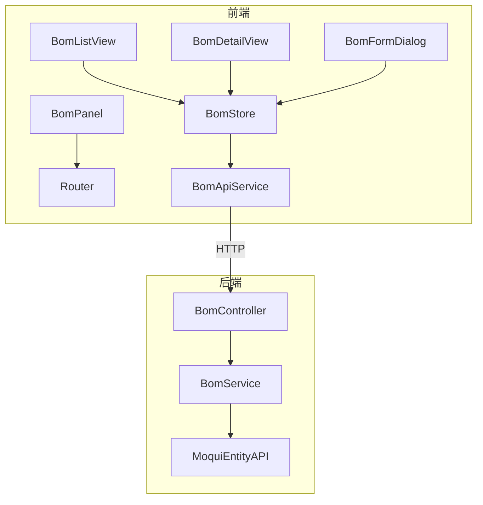

# BOM 管理模块 — 设计文档

## 1. 架构概览

遵循项目现有模式：Service → Controller → Router 注册（后端），Types → ApiService → Store → Views（前端）。

BOM 模块在已有 Order/Product 模块基础上新增，后端提供 BOM CRUD、BOM 项管理、替代料管理的 REST API；前端提供列表页、详情页（含 BOM 项表格和替代料展示）、创建/编辑对话框和侧边面板。



## 2. 后端设计

### 2.1 BomService.java

- 包路径: `org.moqui.rest.service.BomService`
- 构造函数注入 `ExecutionContextFactory`
- 遵循 OrderService 模式：`ecf.getExecutionContext()` → `disableAuthz()` → `try/catch/finally` → `enableAuthz()` + `ec.destroy()`
- 错误处理: 使用 `errorResult(errorCode, errorMessage)` 返回 `Map<String, Object>`

方法列表:

| 方法 | 说明 |
|------|------|
| `listBoms(pageIndex, pageSize, productId, bomType)` | 分页查询 BOM 列表，支持按产品和类型过滤 |
| `getBomDetail(bomId)` | 查询 BOM 头 + BOM 项列表 + 每项的替代料列表 |
| `createBom(data)` | 创建 BOM 头，必填 productId + bomType |
| `updateBom(bomId, data)` | 更新 BOM 头字段（仅更新请求中包含的字段） |
| `addBomItem(bomId, data)` | 添加 BOM 项，必填 productId + quantity，自动生成 itemSeqId |
| `updateBomItem(bomId, itemSeqId, data)` | 更新 BOM 项 |
| `deleteBomItem(bomId, itemSeqId)` | 删除 BOM 项 |
| `addSubstitute(bomId, itemSeqId, data)` | 添加替代料，必填 productId |
| `deleteSubstitute(bomId, itemSeqId, substituteId)` | 删除替代料 |

### 2.2 BomController.java

- 包路径: `org.moqui.rest.controller.BomController`
- 路由注册:

```
GET    /api/v1/bom                                                          → listBoms
GET    /api/v1/bom/{bomId}                                                  → getBomDetail
POST   /api/v1/bom                                                          → createBom
PUT    /api/v1/bom/{bomId}                                                  → updateBom
POST   /api/v1/bom/{bomId}/item                                             → addBomItem
PUT    /api/v1/bom/{bomId}/item/{itemSeqId}                                 → updateBomItem
DELETE /api/v1/bom/{bomId}/item/{itemSeqId}                                 → deleteBomItem
POST   /api/v1/bom/{bomId}/item/{itemSeqId}/substitute                      → addSubstitute
DELETE /api/v1/bom/{bomId}/item/{itemSeqId}/substitute/{substituteId}        → deleteSubstitute
```

- Controller 模式：解析参数 → 调用 service → 检查 `result.containsKey("error")` → `ctx.success()` / `ctx.error()`
- 使用 `mapErrorCodeToStatus()` 映射错误码到 HTTP 状态码

### 2.3 RestApplication.java 注册

```java
BomService bomService = new BomService(ecf);
new BomController(bomService).register(router);
```

## 3. 组件与接口

### 3.1 前端类型定义 — `types/bom.ts`

```typescript
/** BOM 列表项 */
interface BomListItem {
  bomId: string
  productId: string
  productName?: string
  bomType: string        // PRODUCTION | REPAIR | COST
  description?: string
  fromDate?: string
}

/** BOM 详情 */
interface BomDetail extends BomListItem {
  items: BomItemEntry[]
}

/** BOM 行项目 */
interface BomItemEntry {
  itemSeqId: string
  productId: string
  productName?: string
  quantity: number
  quantityUomId?: string
  fromDate?: string
  bomItemType?: string   // STANDARD | CO_PRODUCT | BY_PRODUCT
  substitutes: SubstituteEntry[]
}

/** 替代料 */
interface SubstituteEntry {
  substituteId: string
  productId: string
  productName?: string
  priority?: number
  ratio?: number
}

/** 创建 BOM 请求 */
interface CreateBomRequest {
  productId: string
  bomType: string
  description?: string
  fromDate?: string
}

/** 更新 BOM 请求 */
interface UpdateBomRequest {
  description?: string
  bomType?: string
  fromDate?: string
}

/** BOM 项请求 */
interface BomItemRequest {
  productId: string
  quantity: number
  quantityUomId?: string
  bomItemType?: string
}

/** 替代料请求 */
interface SubstituteRequest {
  productId: string
  priority?: number
  ratio?: number
}

/** 列表查询参数 */
interface BomListParams {
  pageIndex?: number
  pageSize?: number
  productId?: string
  bomType?: string
}

/** 分页元数据 */
interface BomPaginationMeta {
  pageIndex: number
  pageSize: number
  totalCount: number
  totalPages: number
}
```

### 3.2 API 服务 — `services/bomApiService.ts`

使用 `apiV1Client` 调用后端 API，路径前缀: `/bom`

```typescript
class BomApiService {
  listBoms(params?: BomListParams)
  getBomDetail(bomId: string)
  createBom(data: CreateBomRequest)
  updateBom(bomId: string, data: UpdateBomRequest)
  addBomItem(bomId: string, data: BomItemRequest)
  updateBomItem(bomId: string, itemSeqId: string, data: BomItemRequest)
  deleteBomItem(bomId: string, itemSeqId: string)
  addSubstitute(bomId: string, itemSeqId: string, data: SubstituteRequest)
  deleteSubstitute(bomId: string, itemSeqId: string, substituteId: string)
}
```

### 3.3 Pinia Store — `stores/bom.ts`

状态:
- `boms: BomListItem[]` — 列表数据
- `pagination: BomPaginationMeta | null` — 分页信息
- `loading / error` — 列表加载状态
- `currentBom: BomDetail | null` — 当前详情
- `detailLoading / detailError` — 详情加载状态
- `mutating / mutationError` — 变更操作状态
- `filterProductId / filterBomType / currentPageIndex / currentPageSize` — 过滤与分页

导出纯函数（用于属性测试）:
- `filterBomsByProduct(boms, productId)` — 按产品过滤
- `validateCreateBomForm(data)` — 验证创建表单必填字段

### 3.4 视图组件

| 组件 | 说明 |
|------|------|
| `BomListView.vue` | BOM 列表页，含搜索/过滤/分页/创建按钮 |
| `BomDetailView.vue` | BOM 详情页，含 BOM 头信息 + BOM 项表格（内嵌替代料展示）+ 联产品/副产品标记 |
| `BomFormDialog.vue` | 创建/编辑 BOM 对话框 |
| `BomPanel.vue` | 侧边面板，导航到 BOM 列表 |

### 3.5 BomDetailView 设计要点

- 使用 Tab 切换：基本信息 / BOM 项
- BOM 项表格列：序号、产品ID、产品名称、数量、单位、类型标记、操作
- 类型标记：STANDARD 无标记，CO_PRODUCT 显示绿色"联产品"徽章，BY_PRODUCT 显示橙色"副产品"徽章
- 每行可展开显示替代料列表（substituteId、产品、优先级、比例）
- 内联表单添加 BOM 项和替代料

## 4. 数据模型

### 4.1 Moqui 实体映射

BOM 模块使用自定义实体名（映射到 Mantle 数据模型概念）：

| 概念 | 实体名 | 主键 | 关键字段 |
|------|--------|------|----------|
| BOM 头 | `mantle.product.ProductConfigurableProduct` 或自定义 `BomHeader` | bomId | productId, bomType, description, fromDate |
| BOM 项 | 自定义 `BomItem` | bomId + itemSeqId | productId, quantity, quantityUomId, bomItemType |
| 替代料 | 自定义 `BomItemSubstitute` | bomId + itemSeqId + substituteId | productId, priority, ratio |

> 注：由于 Moqui/Mantle 标准实体中 BOM 结构可能不完全匹配需求，Service 层将使用通用 Entity API 操作。如果实体不存在，Service 将使用 `mantle.product.ProductAssoc`（type=PRODUCT_COMPONENT）作为 BOM 项的底层实体，或在运行时动态适配。

### 4.2 BOM 类型枚举

```
PRODUCTION — 生产 BOM（默认）
REPAIR     — 维修 BOM
COST       — 成本 BOM
```

### 4.3 BOM 项类型枚举

```
STANDARD   — 标准物料（默认）
CO_PRODUCT — 联产品
BY_PRODUCT — 副产品
```


## 5. 正确性属性 (Correctness Properties)

*属性是系统在所有合法执行中应保持为真的特征或行为——本质上是关于系统应该做什么的形式化陈述。属性是人类可读规范与机器可验证正确性保证之间的桥梁。*

### Property 1: 分页数学正确性

*For any* BOM 列表和任意合法的 pageIndex/pageSize 参数，返回的 totalPages 应等于 `ceil(totalCount / pageSize)`，且返回的数据条数应不超过 pageSize。

**Validates: Requirements 1.1**

### Property 2: 过滤返回匹配记录

*For any* BOM 列表和任意 productId 或 bomType 过滤参数，返回的所有 BOM 记录的对应字段应与过滤参数一致。

**Validates: Requirements 1.2, 1.3**

### Property 3: BOM 创建-查询往返一致性

*For any* 合法的 CreateBomRequest（含 productId、bomType、可选的 description 和 fromDate），创建后通过 getBomDetail 查询应返回与创建请求一致的所有字段值。

**Validates: Requirements 3.3, 3.4, 3.5**

### Property 4: BOM 创建验证拒绝缺失必填字段

*For any* 缺少 productId 或 bomType 的创建请求，BOM_System 应返回 400 错误码。

**Validates: Requirements 3.1, 3.2**

### Property 5: BOM 头部分更新保留未变更字段

*For any* 已存在的 BOM 和任意部分更新请求，更新后查询应显示：请求中包含的字段已更新，未包含的字段保持原值。

**Validates: Requirements 4.1**

### Property 6: BOM 项添加-查询往返一致性（含类型标记）

*For any* 已存在的 BOM 和合法的 BomItemRequest（含 productId、quantity、可选的 bomItemType），添加后通过 getBomDetail 查询应在 items 列表中包含该项，且所有字段值一致。

**Validates: Requirements 5.2, 5.6**

### Property 7: BOM 项添加验证拒绝缺失必填字段

*For any* 缺少 productId 或 quantity 的添加请求，BOM_System 应返回 400 错误码。

**Validates: Requirements 5.1**

### Property 8: 删除 BOM 项后不再出现

*For any* 已存在的 BOM 项，删除后通过 getBomDetail 查询应不再包含该项。

**Validates: Requirements 5.4**

### Property 9: BOM 项部分更新保留未变更字段

*For any* 已存在的 BOM 项和任意部分更新请求，更新后查询应显示：请求中包含的字段已更新，未包含的字段保持原值。

**Validates: Requirements 5.3**

### Property 10: 替代料添加-查询往返一致性

*For any* 已存在的 BOM 项和合法的 SubstituteRequest（含 productId、可选的 priority 和 ratio），添加后通过 getBomDetail 查询应在对应 BOM 项的 substitutes 列表中包含该替代料，且所有字段值一致。

**Validates: Requirements 6.2, 6.3**

### Property 11: 替代料添加验证拒绝缺失 productId

*For any* 缺少 productId 的替代料添加请求，BOM_System 应返回 400 错误码。

**Validates: Requirements 6.1**

### Property 12: 删除替代料后不再出现

*For any* 已存在的替代料，删除后通过 getBomDetail 查询应不再包含该替代料。

**Validates: Requirements 6.4**

### Property 13: 前端过滤函数正确性

*For any* BOM 列表和任意 productId，`filterBomsByProduct` 函数返回的所有 BOM 的 productId 应与过滤参数一致，且不遗漏任何匹配项。

**Validates: Requirements 7.2**

## 6. 错误处理

### 6.1 后端错误码映射

| 错误码 | HTTP 状态码 | 场景 |
|--------|------------|------|
| VALIDATION_ERROR | 400 | 必填字段缺失或格式错误 |
| RESOURCE_NOT_FOUND | 404 | BOM/BOM项/替代料不存在 |
| INTERNAL_ERROR | 500 | 服务器内部异常 |

### 6.2 错误响应格式

```json
{
  "error": true,
  "errorCode": "VALIDATION_ERROR",
  "errorMessage": "productId is required"
}
```

### 6.3 前端错误处理

- Store 中 `error` / `detailError` / `mutationError` 分别对应列表、详情、变更操作的错误
- 列表页和详情页显示错误提示条，提供重试按钮
- 变更操作失败时显示错误提示，提供关闭按钮
- `clearError()` 方法统一清除所有错误状态

## 7. 测试策略

### 7.1 后端测试

- **框架**: JUnit 5 + jqwik（属性测试）
- **单元测试**: 验证 Service 层的验证逻辑、错误处理、边界条件
- **属性测试**: 验证 Property 1-12 中的通用属性

### 7.2 前端测试

- **框架**: Vitest + fast-check（属性测试）
- **单元测试**: 验证 Store 纯函数（filterBomsByProduct、validateCreateBomForm）
- **属性测试**: 验证 Property 13（前端过滤函数正确性）

### 7.3 测试配置

- 属性测试最少运行 100 次迭代
- 每个属性测试必须注释引用设计文档中的属性编号
- 标签格式: `Feature: {{SPEC_NAME}}, Property N: {property_text}`

### 7.4 双重测试策略

- **单元测试**: 验证具体示例、边界条件、错误场景
- **属性测试**: 验证跨所有输入的通用属性
- 两者互补，共同提供全面覆盖
