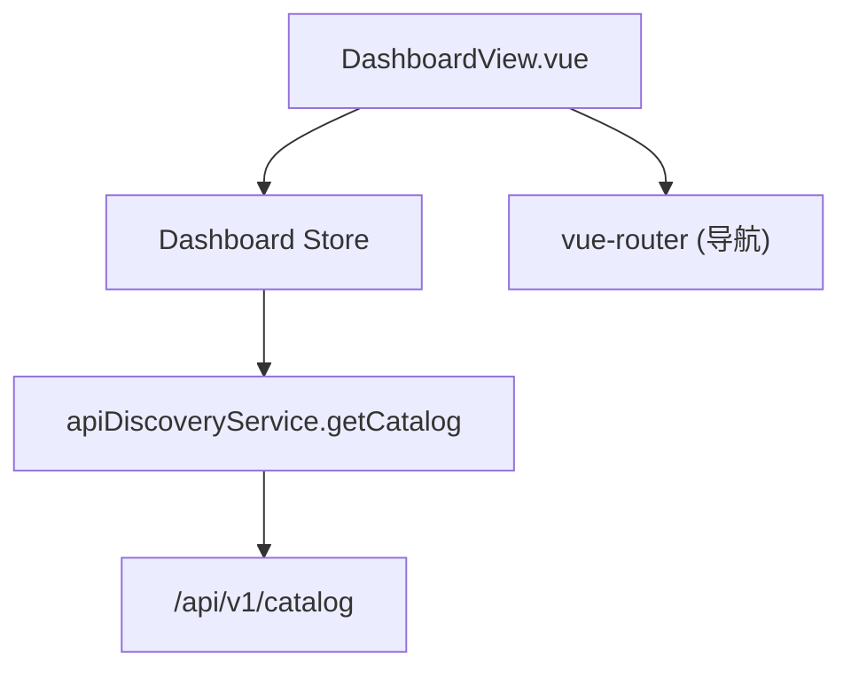

# Design Document: {{SPEC_NAME_TITLE}}

## Overview

为 DashboardView 增加目录统计展示和快速导航能力。核心改动：

1. 新建 `dashboard` Pinia Store — 调用已有 `apiDiscoveryService.getCatalog()` 获取 catalog 数据，提供 computed getters
2. 修改 `DashboardView.vue` — 新增 Catalog Stats、Component Breakdown、Quick Nav 三个区域

不新建子组件，所有 UI 直接嵌入 DashboardView。不涉及后端改动。

## Architecture



数据流：
1. DashboardView `onMounted` → 调用 `dashboardStore.fetchCatalog()`
2. Dashboard Store 调用 `apiDiscoveryService.getCatalog()` → 更新 state
3. DashboardView 通过 store getters 响应式渲染统计数据
4. 用户点击 Stat Card / Quick Nav Card → `router.push()` 跳转

## Components and Interfaces

### Dashboard Store (`frontend/src/renderer/stores/dashboard.ts`)

```typescript
// State
interface DashboardState {
  catalog: ApiCatalogPayload | null
  loading: boolean
  error: string | null
}

// Getters
totalEntities: number    // catalog?.entityCatalog.totalEntities ?? 0
totalServices: number    // catalog?.serviceCatalog.totalServices ?? 0
totalScreens: number     // catalog?.screenCatalog.totalScreens ?? 0
componentBreakdown: ComponentBreakdownItem[]  // 合并三个 catalog 的 components

// Actions
fetchCatalog(): Promise<void>  // 调用 API，管理 loading/error 状态
```

`ComponentBreakdownItem` 类型：

```typescript
interface ComponentBreakdownItem {
  name: string
  entityCount: number
  serviceCount: number
  screenCount: number
}
```

合并逻辑：遍历 `catalog.components` 列表，对每个 component name，从 entityCatalog.components、serviceCatalog.components、screenCatalog.components 中查找对应的 count。

### DashboardView.vue 新增区域

| 区域 | 位置 | 内容 |
|------|------|------|
| Catalog Stats Section | Welcome Card 下方 | 3 个 Stat Card（Entity/Service/Screen 总数），可点击跳转 |
| Component Breakdown | Stats 下方 | `<details>` 折叠表格，按组件展示各类资源数量 |
| Quick Nav Section | Breakdown 下方 | 3 个导航卡片（Entity/Service/Screen Explorer） |

## Data Models

### Store State

```typescript
interface DashboardState {
  catalog: ApiCatalogPayload | null  // 复用已有类型
  loading: boolean
  error: string | null
}
```

### Component Breakdown Item

```typescript
interface ComponentBreakdownItem {
  name: string
  entityCount: number
  serviceCount: number
  screenCount: number
}
```

### Stat Card 配置（模板内联数组）

```typescript
const statCards = [
  { label: 'Entities', count: totalEntities, icon: '🗃️', route: '/entities' },
  { label: 'Services', count: totalServices, icon: '⚙️', route: '/services' },
  { label: 'Screens', count: totalScreens, icon: '🖥️', route: '/screens' },
]
```

### Quick Nav 配置（模板内联数组）

```typescript
const quickNavCards = [
  { title: 'Entity Explorer', desc: '浏览和查看 Entity 定义', icon: '🗃️', route: '/entities' },
  { title: 'Service Explorer', desc: '浏览和调用 Service', icon: '⚙️', route: '/services' },
  { title: 'Screen Explorer', desc: '浏览 Screen 结构', icon: '🖥️', route: '/screens' },
]
```


## Correctness Properties

*A property is a characteristic or behavior that should hold true across all valid executions of a system — essentially, a formal statement about what the system should do. Properties serve as the bridge between human-readable specifications and machine-verifiable correctness guarantees.*

基于 prework 分析，本功能有两个可测试的 property：

### Property 1: Store 总数 getters 正确性

*For any* valid `ApiCatalogPayload`，Dashboard Store 的 `totalEntities` getter 应等于 `payload.entityCatalog.totalEntities`，`totalServices` 应等于 `payload.serviceCatalog.totalServices`，`totalScreens` 应等于 `payload.screenCatalog.totalScreens`。

**Validates: Requirements 1.6**

### Property 2: Component Breakdown 合并正确性

*For any* valid `ApiCatalogPayload`（包含任意数量的 components），`componentBreakdown` getter 应为每个 component 正确合并来自 entityCatalog、serviceCatalog、screenCatalog 的 count 值。具体地：对于 breakdown 中的每个 item，其 `entityCount` 应等于 entityCatalog.components 中同名 component 的 `entityCount`（不存在则为 0），serviceCount 和 screenCount 同理。

**Validates: Requirements 1.7**

## Error Handling

| 场景 | 处理方式 |
|------|---------|
| `getCatalog()` 网络错误 | catch error，store.error = error.message，loading = false |
| `getCatalog()` 返回 success=false | store.error = result.error.message，loading = false |
| catalog 数据为 null（未加载） | getters 返回 0 / 空数组，UI 显示 loading skeleton |
| 用户点击 retry | 重新调用 fetchCatalog |

## Testing Strategy

### 单元测试（Unit Tests）

- Dashboard Store: 测试 fetchCatalog 成功/失败状态转换、初始状态
- DashboardView: 测试组件挂载后触发 fetchCatalog、stat cards 渲染、导航点击、loading/error 状态 UI

### Property-Based Tests

- 使用 `fast-check` 库
- 每个 property test 运行至少 100 次迭代
- 生成随机 `ApiCatalogPayload` 数据验证 store getters 的正确性

**Property Test 标注格式**: `Feature: {{SPEC_NAME}}, Property {N}: {description}`

### 测试平衡

- Unit tests 覆盖具体场景：初始状态、加载中、加载成功、加载失败、点击导航、折叠展开
- Property tests 覆盖数据逻辑：store getters 对任意 catalog 数据的正确性
- 两者互补：unit tests 验证具体行为，property tests 验证通用正确性
