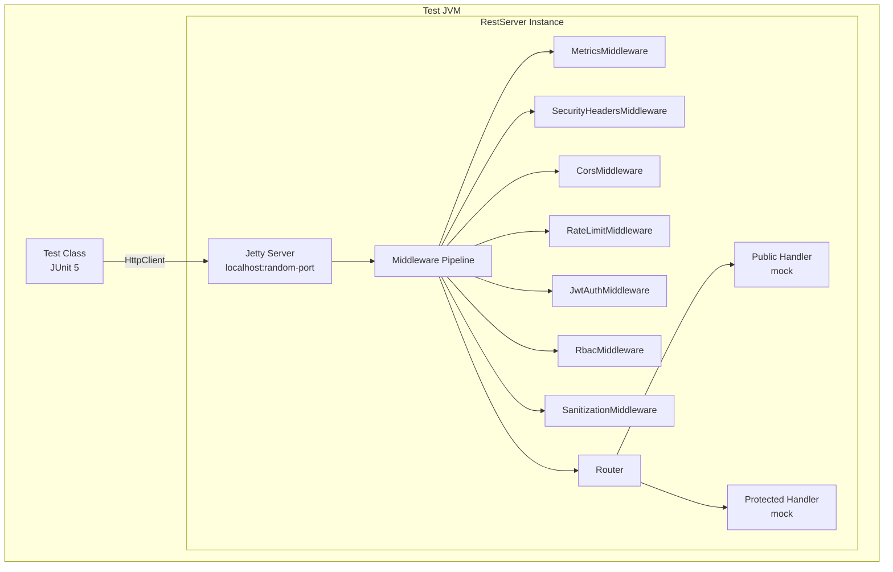

# Design Document: E2E Integration Tests

## Overview

本设计描述如何在不依赖完整 Moqui 运行时（ECFI）的情况下，对 REST API 的 HTTP 层进行端到端集成测试。核心策略是构建一个"轻量级测试服务器"——直接实例化 `RestServer`，注册带有 mock handler 的路由，使用真实的中间件链（Metrics → SecurityHeaders → CORS → RateLimit → JwtAuth → RBAC → Sanitization），通过 `java.net.http.HttpClient` 发送真实 HTTP 请求验证行为。

关键设计决策：
- 使用 `RestServer` 的真实构造函数，传入 mock `ExecutionContextFactory`（null 即可，因为测试不触及 Moqui 实体层）
- 使用随机可用端口避免端口冲突
- 每个测试类独立管理服务器生命周期（`@BeforeAll` / `@AfterAll`）
- 使用 `JwtUtil.createAccessToken()` 生成真实 JWT token 用于认证测试
- 不引入任何新依赖（使用 Java 标准库 HttpClient）

## Architecture



测试架构分为两层：
1. **测试基础设施层** — `E2eTestBase` 抽象基类，封装服务器启动/停止、HttpClient 创建、通用断言工具
2. **测试用例层** — 各个测试类继承基类，聚焦特定场景（安全头、CORS、认证、速率限制等）

## Components and Interfaces

### 1. E2eTestBase — 测试基类

抽象基类，提供服务器生命周期管理和 HTTP 请求工具方法。

```java
public abstract class E2eTestBase {
    protected static RestServer server;
    protected static HttpClient httpClient;
    protected static int port;
    protected static String baseUrl;
    
    // 子类可覆盖以自定义路由注册
    protected static void registerRoutes(Router router) {}
    
    // 子类可覆盖以自定义 RestConfig
    protected static RestConfig createConfig(int port) { ... }
    
    // 子类可覆盖以自定义 RoutePermissionRegistry
    protected static RoutePermissionRegistry createPermissionRegistry() { ... }
    
    @BeforeAll — 找到可用端口、创建 RestServer、注册路由、启动服务器
    @AfterAll — 停止服务器
    
    // HTTP 工具方法
    protected HttpResponse<String> get(String path) { ... }
    protected HttpResponse<String> get(String path, Map<String, String> headers) { ... }
    protected HttpResponse<String> post(String path, String body, Map<String, String> headers) { ... }
    protected HttpResponse<String> options(String path) { ... }
    protected HttpResponse<String> sendRequest(String method, String path, String body, Map<String, String> headers) { ... }
    
    // JSON 解析工具
    protected Map<String, Object> parseJson(String body) { ... }
    
    // 断言工具
    protected void assertSecurityHeaders(HttpResponse<?> response) { ... }
    protected void assertCorsHeaders(HttpResponse<?> response) { ... }
    protected void assertErrorResponse(HttpResponse<String> response, int status, String errorCode) { ... }
}
```

### 2. 测试类划分

| 测试类 | 职责 | 对应需求 |
|--------|------|----------|
| `SecurityHeadersE2eTest` | 验证所有响应包含安全头 | Req 2 |
| `CorsE2eTest` | 验证 CORS 预检和跨域头 | Req 3 |
| `JwtAuthE2eTest` | 验证 JWT 认证流程 | Req 4 |
| `RoutingE2eTest` | 验证 404/405 路由错误 | Req 5 |
| `RateLimitE2eTest` | 验证速率限制 | Req 6 |
| `PublicRouteE2eTest` | 验证公开端点可访问性 | Req 7 |
| `ErrorFormatE2eTest` | 验证错误响应格式一致性 | Req 8 |
| `MiddlewareOrderE2eTest` | 验证中间件执行顺序 | Req 9 |
| `PayloadSizeE2eTest` | 验证请求体大小限制 | Req 10 |

### 3. Mock ExecutionContextFactory

`RestServer` 构造函数需要 `ExecutionContextFactory`。由于测试不触及 Moqui 实体层，传入 `null` 即可。`RbacMiddleware` 在检查权限时会调用 `ecf.getExecutionContext()`，但对于测试中不注册 RBAC 权限的路由，该中间件会直接放行（`requiredPermission == null` → return true）。

对于需要测试 RBAC 拒绝场景的测试，可以注册需要权限的路由，此时 `ecf` 为 null 会导致 NPE，被 `RbacMiddleware.checkUserPermission` 的 catch 块捕获并返回 false（deny），这正好符合"fail-closed"的安全设计。

### 4. 端口分配策略

使用 `ServerSocket(0)` 获取操作系统分配的随机可用端口，避免并行测试时端口冲突：

```java
static int findAvailablePort() throws IOException {
    try (ServerSocket socket = new ServerSocket(0)) {
        return socket.getLocalPort();
    }
}
```

## Data Models

### HTTP 请求/响应模型

测试中不定义新的数据模型。使用 Java 标准库的 `HttpRequest` / `HttpResponse<String>` 和 Jackson `ObjectMapper` 解析 JSON 响应。

### 标准错误响应结构（已有）

```json
{
    "success": false,
    "error": {
        "code": "ERROR_CODE",
        "message": "Human readable message",
        "httpStatus": 401
    }
}
```

### 标准成功响应结构（已有）

```json
{
    "success": true,
    "data": { ... }
}
```

### 测试配置参数

| 参数 | 测试值 | 说明 |
|------|--------|------|
| host | "localhost" | 本地测试 |
| port | 随机 | 避免冲突 |
| minThreads | 2 | 最小化资源 |
| maxThreads | 10 | 最小化资源 |
| corsAllowedOrigins | "*" | 默认值 |
| rateLimitPerMinute | 5 | 低阈值便于测试 |
| maxPayloadBytes | 1024 | 1KB，便于测试 |
| productionMode | false | 开发模式 |


## Correctness Properties

*A property is a characteristic or behavior that should hold true across all valid executions of a system — essentially, a formal statement about what the system should do. Properties serve as the bridge between human-readable specifications and machine-verifiable correctness guarantees.*

基于 prework 分析，以下是从需求中提取的可测试属性。由于本 Spec 是端到端集成测试（example-based），大部分需求是特定场景验证，但仍有几个可以表述为通用属性：

### Property 1: Security headers invariant

*For any* HTTP request to the Test_Server (regardless of method, path, authentication status, or response status code), the response SHALL contain all 5 security headers with their correct values: X-Content-Type-Options="nosniff", X-Frame-Options="DENY", X-XSS-Protection="1; mode=block", Cache-Control="no-store, no-cache, must-revalidate", Pragma="no-cache".

**Validates: Requirements 2.1, 2.2, 2.3, 2.4, 2.5, 2.6**

### Property 2: CORS preflight response invariant

*For any* OPTIONS request to any registered route on the Test_Server, the response SHALL have status 204 and contain all CORS headers: Access-Control-Allow-Origin matching configured origins, Access-Control-Allow-Methods="GET, POST, PUT, DELETE, OPTIONS", Access-Control-Allow-Headers="Content-Type, Authorization, X-Async", Access-Control-Max-Age="3600".

**Validates: Requirements 3.1, 3.2, 3.3, 3.4, 3.5**

### Property 3: CORS headers on non-OPTIONS responses

*For any* non-OPTIONS HTTP request to the Test_Server, the response SHALL contain Access-Control-Allow-Origin header alongside the security headers.

**Validates: Requirements 3.6**

### Property 4: Error response format consistency

*For any* HTTP response from the Test_Server with a non-2xx status code, the response SHALL have Content-Type "application/json; charset=utf-8" and contain a JSON body with `success=false` and a nested `error` object containing `code` (string), `message` (string), and `httpStatus` (integer matching the HTTP status code).

**Validates: Requirements 5.4, 8.1, 8.2, 8.3**

### Property 5: Invalid JWT tokens are rejected

*For any* random non-JWT string used as Bearer token in a request to a Protected_Route, the Test_Server SHALL respond with HTTP 401.

**Validates: Requirements 4.2**

### Property 6: Non-existent paths return 404

*For any* random path that does not match any registered route, the Test_Server SHALL respond with HTTP 404 and error code "RESOURCE_NOT_FOUND".

**Validates: Requirements 5.1**

## Error Handling

### 测试服务器错误处理

| 场景 | 预期行为 | HTTP 状态 | 错误码 |
|------|----------|-----------|--------|
| 路径不存在 | 返回 404 + 安全头 | 404 | RESOURCE_NOT_FOUND |
| 方法不允许 | 返回 405 + Allow 头 | 405 | METHOD_NOT_ALLOWED |
| 无 Authorization 头 | 返回 401 | 401 | AUTHENTICATION_REQUIRED |
| 无效 JWT Token | 返回 401 | 401 | AUTHENTICATION_REQUIRED |
| 过期 JWT Token | 返回 401 | 401 | TOKEN_EXPIRED |
| 超过速率限制 | 返回 429 + Retry-After | 429 | RATE_LIMIT_EXCEEDED |
| 请求体过大 | 返回 413 | 413 | PAYLOAD_TOO_LARGE |

### 测试基础设施错误处理

- 服务器启动失败：`@BeforeAll` 抛出异常，JUnit 跳过整个测试类
- 端口不可用：使用 `ServerSocket(0)` 随机端口，极低概率失败
- HTTP 连接超时：HttpClient 设置 5 秒超时，超时则测试失败并报告

## Testing Strategy

### 测试框架选择

- **JUnit 5** — 主测试框架，用于 example-based 集成测试
- **jqwik 1.9.0** — 用于 property-based 测试（已在 pom.xml 中）
- **java.net.http.HttpClient** — HTTP 客户端（Java 标准库，无需新依赖）
- **Jackson ObjectMapper** — JSON 解析（已在项目依赖中）

### 双重测试策略

**Unit Tests (Example-based)**:
- 验证特定场景：认证流程、速率限制触发、405 响应、中间件顺序
- 覆盖边界条件：空 Authorization 头、过期 token、过大请求体
- 每个测试类聚焦一个关注点

**Property Tests (Property-based)**:
- 验证通用属性：安全头始终存在、错误格式一致、CORS 头正确
- 使用 jqwik 生成随机路径和 token 字符串
- 每个 property test 最少 100 次迭代
- 每个 property test 标注对应的 design property 编号

**Property-Based Testing 配置**:
- 库：jqwik 1.9.0（已在 pom.xml）
- 最少迭代：100 次
- 标注格式：`Feature: {{SPEC_NAME}}, Property {N}: {title}`

### 测试类结构

```
backend/app/src/test/java/org/moqui/rest/
├── e2e/
│   ├── E2eTestBase.java              — 抽象基类
│   ├── SecurityHeadersE2eTest.java   — 安全头验证 (Req 2)
│   ├── CorsE2eTest.java              — CORS 验证 (Req 3)
│   ├── JwtAuthE2eTest.java           — JWT 认证验证 (Req 4)
│   ├── RoutingE2eTest.java           — 路由错误验证 (Req 5)
│   ├── RateLimitE2eTest.java         — 速率限制验证 (Req 6)
│   ├── PublicRouteE2eTest.java       — 公开端点验证 (Req 7)
│   ├── ErrorFormatE2eTest.java       — 错误格式验证 (Req 8)
│   ├── MiddlewareOrderE2eTest.java   — 中间件顺序验证 (Req 9)
│   ├── PayloadSizeE2eTest.java       — 请求体大小验证 (Req 10)
│   └── E2ePropertyTest.java          — Property-based 测试 (Properties 1-6)
```
