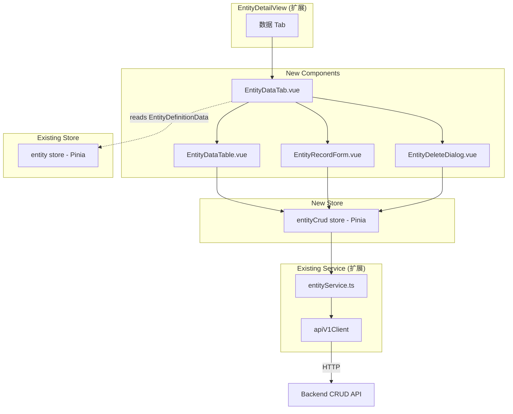
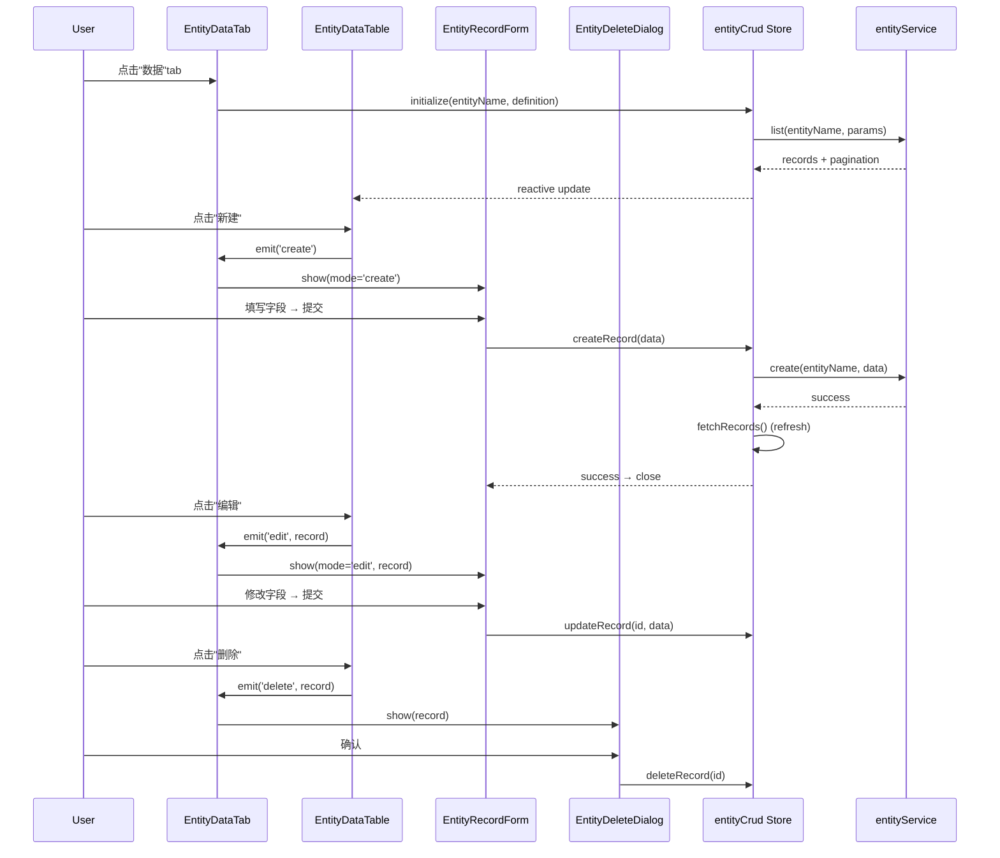

# Design Document: Entity CRUD

## Overview

Entity CRUD 模块为 Entity Explorer 添加数据操作能力，在 EntityDetailView 中新增"数据"标签页。模块遵循已有的分层架构（types → service → store → components → views），扩展而非替换现有代码。

核心设计决策：
- 扩展已有 `entityService.ts` 添加 `batch` 和 `listRelated` 方法
- 新建独立的 `entityCrud` Pinia Store，与现有 `entity` Store 共存（职责分离：元数据浏览 vs 数据操作）
- 在 EntityDetailView 中添加"数据"tab，复用已加载的 EntityDefinitionData 驱动表单生成
- 新建 4 个组件：EntityDataTable、EntityRecordForm、EntityDeleteDialog、EntityDataTab
- Field type → input type 映射集中在一个工具函数中，便于扩展

## Architecture



数据流：
1. 用户点击"数据"tab → EntityDataTab 从 entity store 读取 EntityDefinitionData
2. EntityDataTab 初始化 entityCrud store（设置 entityName + definition）→ 触发 fetchRecords
3. CRUD 操作通过 entityCrud store → entityService → apiV1Client → 后端 API
4. 操作成功后自动刷新记录列表

## Components and Interfaces

### 1. Entity Service 扩展 (`frontend/src/renderer/services/entityService.ts`)

在现有 EntityService 类中添加两个方法：

```typescript
// 新增方法
async batch<T>(entityName: string, body: Record<string, unknown>): Promise<ApiV1Result<T>> {
  return apiV1Client.post<T>(
    `/entities/${encodeURIComponent(entityName)}/batch`, body
  )
}

async listRelated<T>(
  entityName: string,
  entityId: string,
  relationshipName: string,
  params: EntityListParams = {}
): Promise<EntityListResult<T>> {
  const queryParams: Record<string, unknown> = {}
  if (params.orderBy) queryParams.orderBy = params.orderBy
  if (typeof params.pageIndex === 'number') queryParams.pageIndex = params.pageIndex
  if (typeof params.pageSize === 'number') queryParams.pageSize = params.pageSize
  if (params.fields) {
    queryParams.fields = Array.isArray(params.fields) ? params.fields.join(',') : params.fields
  }
  const result = await apiV1Client.get<T[]>(
    `/entities/${encodeURIComponent(entityName)}/${encodeURIComponent(entityId)}/related/${encodeURIComponent(relationshipName)}`,
    queryParams
  )
  return { ...result, pagination: result.meta }
}
```

### 2. Field Type Mapping 工具 (`frontend/src/renderer/utils/fieldTypeMapping.ts`)

```typescript
export interface FieldInputConfig {
  inputType: 'text' | 'number' | 'date' | 'datetime-local' | 'time' | 'checkbox' | 'textarea'
  step?: string        // for number inputs
  placeholder?: string
}

export function mapFieldToInput(fieldType: string): FieldInputConfig {
  switch (fieldType) {
    case 'id':
    case 'id-long':
    case 'text-short':
    case 'text-medium':
    case 'text-long':
      return { inputType: 'text' }
    case 'number-integer':
      return { inputType: 'number', step: '1' }
    case 'number-decimal':
    case 'number-float':
    case 'currency-amount':
    case 'currency-precise':
      return { inputType: 'number', step: 'any' }
    case 'date-time':
      return { inputType: 'datetime-local' }
    case 'date':
      return { inputType: 'date' }
    case 'time':
      return { inputType: 'time' }
    case 'text-indicator':
      return { inputType: 'checkbox' }
    case 'text-very-long':
    case 'text-long':
      return { inputType: 'textarea' }
    default:
      return { inputType: 'text' }
  }
}

/**
 * 构建复合主键 ID（逗号分隔，按 pkFields 顺序）
 */
export function buildCompositeId(
  record: Record<string, unknown>,
  pkFields: string[]
): string {
  return pkFields.map(pk => String(record[pk] ?? '')).join(',')
}

/**
 * 解析复合主键 ID 为字段值映射
 */
export function parseCompositeId(
  compositeId: string,
  pkFields: string[]
): Record<string, string> {
  const values = compositeId.split(',')
  const result: Record<string, string> = {}
  pkFields.forEach((pk, i) => {
    result[pk] = values[i] ?? ''
  })
  return result
}
```

### 3. Entity CRUD Store (`frontend/src/renderer/stores/entityCrud.ts`)

```typescript
export interface EntityCrudState {
  // 上下文
  entityName: string | null
  entityDefinition: EntityDefinitionData | null

  // 记录列表
  records: Record<string, unknown>[]
  pagination: EntityPaginationMeta | null
  listLoading: boolean
  listError: string | null

  // 筛选/排序/分页
  currentPageIndex: number
  currentPageSize: number
  currentOrderBy: string | null
  currentFilters: Record<string, string>

  // 变更操作状态
  mutating: boolean
  mutationError: string | null
  fieldErrors: FieldError[]
  successMessage: string | null
}

// Getters
totalPages: number
hasNextPage: boolean
hasPreviousPage: boolean
isReadOnly: boolean  // true when entityDefinition.isView

// Actions
initialize(entityName: string, definition: EntityDefinitionData): void
fetchRecords(): Promise<void>
createRecord(data: Record<string, unknown>): Promise<boolean>
updateRecord(entityId: string, data: Record<string, unknown>): Promise<boolean>
deleteRecord(entityId: string): Promise<boolean>
setPage(pageIndex: number): Promise<void>
setSort(orderBy: string | null): Promise<void>
setFilters(filters: Record<string, string>): Promise<void>
clearMutationState(): void
reset(): void
```

### 4. Vue Components

| 组件 | 文件路径 | 职责 |
|------|---------|------|
| `EntityDataTab.vue` | `components/entities/EntityDataTab.vue` | 数据 tab 容器，协调 DataTable/Form/Dialog，初始化 CRUD store |
| `EntityDataTable.vue` | `components/entities/EntityDataTable.vue` | 数据表格，列排序、筛选行、分页、行操作按钮 |
| `EntityRecordForm.vue` | `components/entities/EntityRecordForm.vue` | 创建/编辑表单，字段自动生成，验证错误展示 |
| `EntityDeleteDialog.vue` | `components/entities/EntityDeleteDialog.vue` | 删除确认对话框 |

### 5. EntityDetailView 扩展

在现有 tab-bar 中添加"数据"tab：

```typescript
// activeTab 类型扩展
const activeTab = ref<'overview' | 'fields' | 'relationships' | 'data'>('overview')
```

```html
<!-- 新增 tab 按钮 -->
<button class="tab-btn" :class="{ active: activeTab === 'data' }" @click="activeTab = 'data'">
  数据
</button>

<!-- 新增 tab 内容 -->
<EntityDataTab
  v-if="activeTab === 'data'"
  :entity-name="decodedEntityName"
  :entity-definition="entityStore.currentEntity"
/>
```

### 6. Component Interaction Flow



## Data Models

### CRUD API 请求/响应映射

| 操作 | HTTP 方法 | 端点 | 请求体 | 响应 |
|------|----------|------|--------|------|
| 列表 | GET | `/entities/{entityName}?orderBy=&pageIndex=&pageSize=&{filters}` | — | `{ data: Record[], meta: { totalCount, pageIndex, pageSize, pageMaxIndex } }` |
| 获取 | GET | `/entities/{entityName}/{entityId}?fields=` | — | `{ data: Record }` |
| 创建 | POST | `/entities/{entityName}` | `Record<string, unknown>` | `{ data: Record }` (201) |
| 更新 | PUT | `/entities/{entityName}/{entityId}` | `Record<string, unknown>` | `{ data: Record }` |
| 删除 | DELETE | `/entities/{entityName}/{entityId}` | — | 204 No Content 或 `{ data: ... }` |
| 批量 | POST | `/entities/{entityName}/batch` | `{ operations: [...] }` | `{ data: { results: [...] } }` |
| 关联 | GET | `/entities/{entityName}/{entityId}/related/{relName}` | — | `{ data: Record[], meta: {...} }` |

### Field Type → Input Type 映射表

| Moqui Field Type | HTML Input Type | step | 备注 |
|-----------------|-----------------|------|------|
| id, id-long, text-short, text-medium | text | — | 通用文本 |
| text-long | text | — | 较长文本 |
| text-very-long | textarea | — | 多行文本 |
| number-integer | number | 1 | 整数 |
| number-decimal, number-float | number | any | 小数 |
| currency-amount, currency-precise | number | any | 金额 |
| date-time | datetime-local | — | 日期时间 |
| date | date | — | 日期 |
| time | time | — | 时间 |
| text-indicator | checkbox | — | Y/N 布尔 |

### Composite PK ID 构建规则

- 单 PK: 直接使用字段值，如 `"enumId123"`
- 复合 PK: 按 `pkFields` 数组顺序用逗号连接，如 `"enumTypeId,enumId"` → `"EnumType1,Enum1"`
- 解析时按相同顺序拆分

## Correctness Properties

*A property is a characteristic or behavior that should hold true across all valid executions of a system — essentially, a formal statement about what the system should do. Properties serve as the bridge between human-readable specifications and machine-verifiable correctness guarantees.*

### Property 1: Service URL construction for new methods

*For any* entityName, entityId, and relationshipName strings, calling `batch(entityName, body)` should construct URL `/entities/{encoded(entityName)}/batch`, and calling `listRelated(entityName, entityId, relName, params)` should construct URL `/entities/{encoded(entityName)}/{encoded(entityId)}/related/{encoded(relName)}`, where all path segments are properly URI-encoded.

**Validates: Requirements 1.1, 1.2, 1.3**

### Property 2: Validation error detail preservation

*For any* CRUD operation that returns a validation error with field-level details, the Entity_Service result should contain the same error code, message, and field error details array as returned by the backend, without loss or transformation.

**Validates: Requirements 1.4, 8.4**

### Property 3: fetchRecords passes current store state

*For any* combination of entityName, currentFilters, currentOrderBy, currentPageIndex, and currentPageSize in the entityCrud store, calling `fetchRecords` should invoke `entityService.list` with parameters exactly matching those store values.

**Validates: Requirements 2.3**

### Property 4: Successful mutation refreshes record list

*For any* successful create, update, or delete operation, the entityCrud store should automatically call `fetchRecords` to refresh the record list after the mutation completes.

**Validates: Requirements 2.4, 2.5, 2.6**

### Property 5: Action state lifecycle transitions

*For any* store action (fetch or mutation): at the start, the corresponding loading flag should be true and previous error should be cleared; on success, loading should be false and (for mutations) successMessage should be set; on failure, loading should be false and the error message should be populated with user-friendly text (including "网络错误，请重试" for network errors).

**Validates: Requirements 2.7, 2.8, 2.9, 8.2**

### Property 6: Re-query actions reset pageIndex to zero

*For any* current pageIndex value, calling `setSort` or `setFilters` should reset `currentPageIndex` to 0 before triggering a re-fetch of records.

**Validates: Requirements 2.11, 2.12**

### Property 7: View entity enforces read-only mode

*For any* EntityDefinitionData where `isView` is true, the entityCrud store's `isReadOnly` getter should return true, and the EntityDataTab component should hide create, edit, and delete controls.

**Validates: Requirements 3.4**

### Property 8: Table columns match entity fields with PK highlight

*For any* EntityDefinitionData with a non-empty fields array, the EntityDataTable should render exactly one column per field, and columns corresponding to fields where `isPk` is true should have a visual PK indicator.

**Validates: Requirements 4.1, 4.2, 6.2**

### Property 9: Field type mapping correctness

*For any* known Moqui field type string, `mapFieldToInput` should return the correct HTML input type and step configuration as defined in the mapping table (e.g., "number-integer" → `{ inputType: 'number', step: '1' }`, "text-indicator" → `{ inputType: 'checkbox' }`).

**Validates: Requirements 5.2**

### Property 10: PK field editability by form mode

*For any* EntityField where `isPk` is true, in create mode the corresponding form input should be required and editable, and in edit mode the corresponding form input should be read-only (disabled).

**Validates: Requirements 5.3, 5.4, 6.3**

### Property 11: Form field generation with defaults

*For any* EntityDefinitionData fields array, the EntityRecordForm in create mode should generate one input per field, and fields with a non-null `default` value should have that value pre-populated.

**Validates: Requirements 5.1, 5.5**

### Property 12: Composite ID round-trip

*For any* record object and pkFields array, `parseCompositeId(buildCompositeId(record, pkFields), pkFields)` should produce a mapping where each PK field's value equals `String(record[field])`.

**Validates: Requirements 6.1, 6.4**

### Property 13: Field-level validation error display

*For any* set of FieldError objects returned by a failed form submission, the EntityRecordForm should display each error message adjacent to the input field identified by the error's `field` property.

**Validates: Requirements 5.8**

## Error Handling

| 场景 | 处理方式 | 用户反馈 |
|------|---------|---------|
| API 返回 404 (record not found) | Store 设置 mutationError | 显示 "记录未找到"，刷新列表 |
| API 返回 400 (validation error) | Store 设置 mutationError + fieldErrors | 表单字段旁显示具体错误 |
| API 返回 500 (server error) | Store 设置 listError/mutationError | 显示错误信息 + 重试按钮 |
| 网络错误 | Store 设置 user-friendly message | 显示 "网络错误，请重试" |
| 空记录列表 | 正常状态，records = [] | 显示 "暂无数据" 空状态 |
| 删除失败 | Dialog 显示错误，不关闭 | 用户可重试或取消 |
| 创建/更新成功 | 关闭表单，刷新列表 | 显示 "创建成功"/"更新成功" 通知 |
| 删除成功 | 关闭对话框，刷新列表 | 显示 "删除成功" 通知 |

错误处理原则：
- 列表加载错误和变更操作错误独立管理
- 变更操作失败不影响列表显示
- 所有错误状态提供重试或取消机制
- 字段级验证错误精确定位到对应输入框
- 成功操作后自动刷新列表保持数据一致

## Testing Strategy

### 测试框架

- **单元测试**: Vitest (已有配置)
- **属性测试**: fast-check (已有依赖)
- **组件测试**: @vue/test-utils + Vitest

### 属性测试

每个 Correctness Property 对应一个属性测试，使用 fast-check 生成随机输入：
- 最少 100 次迭代
- 每个测试标注对应的 Property 编号和 Requirements 引用
- 标签格式: **Feature: {{SPEC_NAME}}, Property {N}: {title}**

### 单元测试

覆盖范围：
- `fieldTypeMapping.ts`: 纯函数测试（mapFieldToInput, buildCompositeId, parseCompositeId）
- `entityCrud` store: 状态转换、action 行为、错误处理
- `entityService` 扩展: batch/listRelated URL 构造
- 组件: 渲染输出、用户交互、条件显示

### 测试分工

| 测试类型 | 覆盖内容 | 工具 |
|---------|---------|------|
| 属性测试 | Property 1-13 (通用正确性) | fast-check + Vitest |
| 单元测试 | 具体示例、边界情况、UI 交互 | Vitest + @vue/test-utils |

### 属性测试库

使用已有的 `fast-check` 库，无需新增依赖。每个属性测试必须：
1. 由单个 property-based test 实现
2. 运行至少 100 次迭代
3. 注释引用设计文档中的 Property 编号
