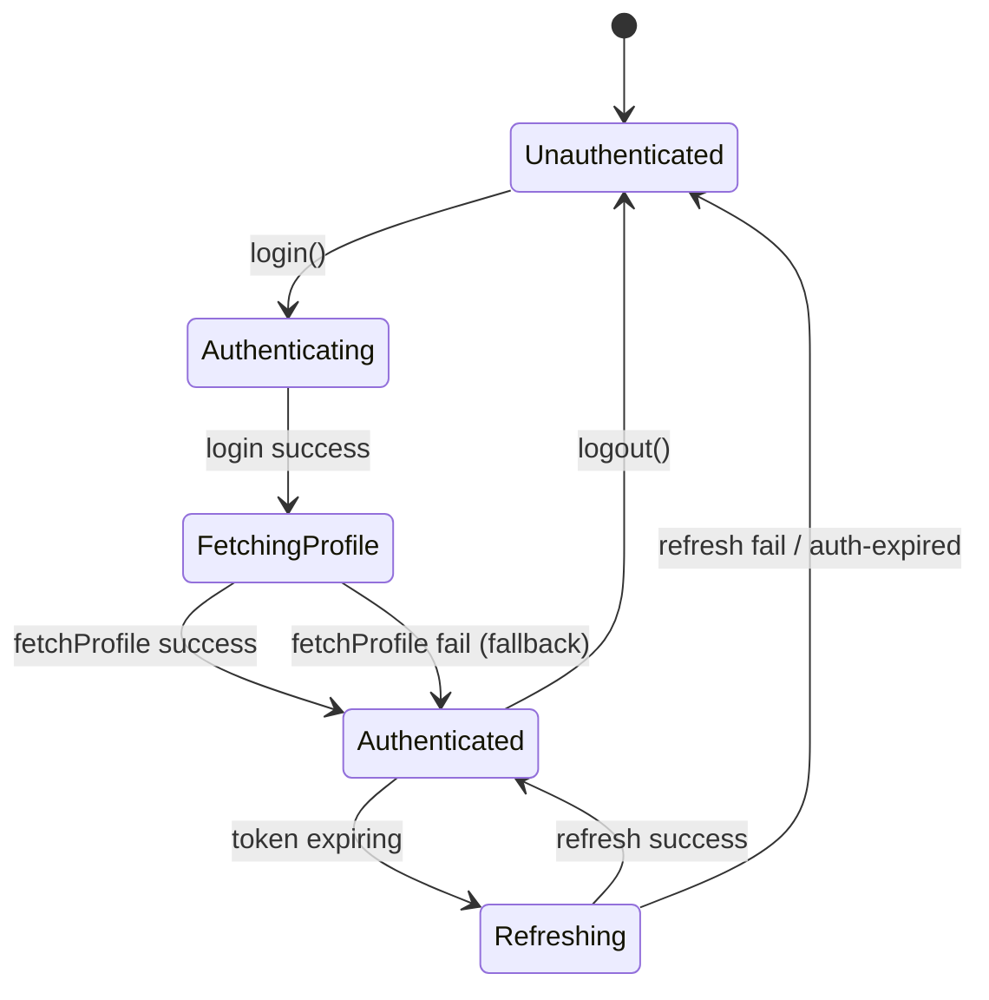

# Design Document: Frontend-Backend Integration

## Overview

本设计将前端认证层与后端 REST API 完成端到端集成。核心变更包括：

1. 登录后调用 `GET /api/v1/auth/me` 获取真实用户资料
2. 统一 Auth_Store 为认证状态的唯一数据源，User_Store 改为从 Auth_Store 同步
3. Router Guard 改用 TokenManager 验证 Token 有效性（而非仅检查 localStorage）
4. 建立错误码到中文消息的映射表
5. 限制 `VITE_SKIP_AUTH` 仅在 test 环境生效
6. 使用 fast-check 编写属性测试

所有变更仅涉及前端代码，不修改后端。

## Architecture

```mermaid
graph TD
    subgraph Frontend
        LV[LoginView] --> AS[Auth Store<br/>单一数据源]
        AS --> SV1[AuthServiceV1]
        AS --> TM[TokenManager]
        US[User Store] -.->|同步| AS
        
        SV1 --> AC[ApiV1Client]
        AC -->|Bearer Token| BE[Backend API]
        AC -->|401| TM
        TM -->|refresh| BE
        TM -->|auth-expired| AS
        
        RG[Router Guard] --> TM
        RG -->|redirect| LV
        
        EM[ErrorMapper] --> AC
    end
    
    subgraph Backend
        BE --> AUTH[/api/v1/auth/login]
        BE --> ME[/api/v1/auth/me]
        BE --> REF[/api/v1/auth/refresh]
        BE --> OUT[/api/v1/auth/logout]
    end
```

**设计决策**：
- Auth_Store 作为 SSOT（Single Source of Truth），符合数据原子性原则（CORE_PRINCIPLES #7）
- User_Store 不再独立调用 authApi，而是监听 Auth_Store 变化并同步字段
- Router Guard 通过 TokenManager 检查 Token 有效性，而非仅检查 localStorage 中是否存在 key

## Components and Interfaces

### 1. AuthServiceV1 — 新增 `fetchProfile()` 方法

```typescript
// services/authServiceV1.ts
interface UserProfile {
  userId: string
  username: string
  groups: string[]
}

class AuthServiceV1 {
  // 新增
  async fetchProfile(): Promise<ApiV1Result<UserProfile>> {
    return apiV1Client.get<UserProfile>('/auth/me')
  }
  
  // 现有方法保持不变
  async login(username: string, password: string): Promise<ApiV1Result<LoginResponse>>
  async refresh(refreshToken?: string): Promise<ApiV1Result<RefreshResponse>>
  async logout(): Promise<ApiV1Result<{ success: boolean }>>
  async validateToken(): Promise<ApiV1Result<{ valid: boolean; user?: Record<string, unknown> }>>
}
```

### 2. ErrorMapper — 新增错误码映射模块

```typescript
// services/errorMapper.ts
const ERROR_MESSAGES: Record<string, string> = {
  VALIDATION_ERROR: '输入数据验证失败',
  AUTHENTICATION_REQUIRED: '请先登录',
  TOKEN_EXPIRED: '登录已过期，请重新登录',
  ACCESS_DENIED: '权限不足，无法执行此操作',
  RATE_LIMIT_EXCEEDED: '请求过于频繁，请稍后再试',
  RESOURCE_NOT_FOUND: '请求的资源不存在',
  INTERNAL_ERROR: '服务器内部错误，请稍后再试',
  NETWORK_ERROR: '网络连接失败，请检查网络',
}

function mapErrorToMessage(error: ApiV1Error): string
function formatRateLimitMessage(error: ApiV1Error): string
function formatValidationErrors(error: ApiV1Error): string
```

### 3. Auth_Store — 重构为 SSOT

```typescript
// stores/auth.ts 关键变更
interface AuthState {
  // 保留现有字段
  user: AuthUser | null       // 改用精简的 AuthUser 类型
  accessToken: string | null
  refreshToken: string | null
  isAuthenticated: boolean
  isLoading: boolean
  isInitialized: boolean
  error: string | null
  // 新增
  groups: string[]            // 用户权限组
}

interface AuthUser {
  userId: string
  username: string
  groups: string[]
}

// 关键 action 变更
actions: {
  async login(credentials) {
    // 1. 调用 authServiceV1.login()
    // 2. 成功后调用 authServiceV1.fetchProfile() 获取完整资料
    // 3. 更新 state
  }
  
  async initialize() {
    // 1. 检查 localStorage 中的 token
    // 2. 通过 tokenManager 验证 token 有效性
    // 3. 调用 fetchProfile() 恢复用户资料
  }
}
```

### 4. User_Store — 改为同步模式

```typescript
// stores/user.ts 关键变更
actions: {
  // 删除独立的 login/logout 方法
  // 新增从 Auth_Store 同步的方法
  syncFromAuthStore(authUser: AuthUser | null) {
    if (authUser) {
      this.userId = authUser.userId
      this.username = authUser.username
      this.isLoggedIn = true
    } else {
      this.clearUserData()
    }
  }
}
```

### 5. Router Guard — 强化认证检查

```typescript
// router/index.js 关键变更
function checkAuthStatus(): boolean {
  // 不再仅检查 localStorage
  // 改用 tokenManager.isTokenExpiringSoon() 验证 token 有效性
  const token = tokenManager.getAccessToken()
  if (!token) return false
  return !tokenManager.isTokenExpiringSoon(token)
}

// VITE_SKIP_AUTH 仅在 test 环境生效
function shouldSkipAuth(): boolean {
  const skipAuth = import.meta.env.VITE_SKIP_AUTH === 'true'
  const isTest = typeof process !== 'undefined' && process.env?.NODE_ENV === 'test'
  return skipAuth && isTest
}
```

### 6. auth-expired 事件监听

```typescript
// 在 Auth_Store 初始化时注册
window.addEventListener('auth-expired', () => {
  authStore.clearAuthState()
  router.push('/login')
})
```

## Data Models

### UserProfile（后端 `/auth/me` 响应）

```typescript
interface UserProfile {
  userId: string
  username: string
  groups: string[]
}
```

### AuthUser（Auth_Store 内部用户模型）

```typescript
interface AuthUser {
  userId: string
  username: string
  groups: string[]
}
```

### ErrorMap 类型

```typescript
interface ErrorMessageConfig {
  code: string
  message: string
  actionHint?: string  // 可选的操作提示
}
```

### 状态转换图




## Correctness Properties

*A property is a characteristic or behavior that should hold true across all valid executions of a system — essentially, a formal statement about what the system should do. Properties serve as the bridge between human-readable specifications and machine-verifiable correctness guarantees.*

### Property 1: JWT Decode Round-Trip

*For any* valid JSON object used as a JWT payload, encoding it as a JWT token (with either standard Base64 or URL-safe Base64) and then decoding via `TokenManager.decodeTokenPayload()` SHALL produce an object with the same key-value pairs as the original payload.

**Validates: Requirements 3.4**

### Property 2: Concurrent Refresh Deduplication

*For any* number N (2 ≤ N ≤ 20) of concurrent calls to `TokenManager.refreshAccessToken()`, all N calls SHALL resolve with the same new access token, and exactly one HTTP refresh request SHALL be made to the backend.

**Validates: Requirements 3.2**

### Property 3: Known Error Code Mapping Completeness

*For any* error code in the set {`VALIDATION_ERROR`, `AUTHENTICATION_REQUIRED`, `TOKEN_EXPIRED`, `ACCESS_DENIED`, `RATE_LIMIT_EXCEEDED`, `RESOURCE_NOT_FOUND`, `INTERNAL_ERROR`, `NETWORK_ERROR`}, the error mapper SHALL return a non-empty string containing Chinese characters.

**Validates: Requirements 4.1, 4.2, 4.4, 4.5**

### Property 4: Rate Limit Message Includes RetryAfter

*For any* positive integer retryAfter value (1 ≤ retryAfter ≤ 3600), when formatting a `RATE_LIMIT_EXCEEDED` error with that retryAfter, the resulting message SHALL contain the string representation of the retryAfter value.

**Validates: Requirements 4.3**

### Property 5: Validation Error Includes Field Details

*For any* non-empty array of `FieldError` objects (each with a `field` and `message` string), when formatting a `VALIDATION_ERROR` error, the resulting message SHALL contain every field name from the input array.

**Validates: Requirements 4.6**

### Property 6: Unknown Error Code Preservation

*For any* string that is NOT one of the known error codes, the error mapper SHALL return a message that contains the original error code string.

**Validates: Requirements 4.7**

### Property 7: Error Normalization Structural Validity

*For any* AxiosError-like object (with or without response, with or without data, with or without error payload), `ApiV1Client.normalizeError()` SHALL always produce an `ApiV1Result` object where `success` is `false` and `error` is a non-null object with non-empty `code` and `message` string fields.

**Validates: Requirements 7.4**

## Error Handling

### Error Flow

```
Backend Error Response
  → ApiV1Client.normalizeError() → ApiV1Result { success: false, error: ApiV1Error }
  → ErrorMapper.mapErrorToMessage() → Chinese user-facing message
  → Store action → sets this.error = message
  → UI component → displays error
```

### Specific Error Handling

| Error Code | 处理方式 |
|---|---|
| `TOKEN_EXPIRED` | ApiV1Client 自动刷新 Token 并重试；若刷新失败，清除状态并跳转登录 |
| `AUTHENTICATION_REQUIRED` | 清除认证状态，跳转登录页 |
| `ACCESS_DENIED` | 显示权限不足提示，不清除认证状态 |
| `RATE_LIMIT_EXCEEDED` | 显示限流提示，包含 retryAfter 秒数 |
| `VALIDATION_ERROR` | 显示字段级错误详情 |
| `NETWORK_ERROR` | 显示网络连接失败提示 |
| Unknown | 显示通用错误消息，附带原始错误码 |

### Graceful Degradation

- `/auth/me` 调用失败时，使用 login 响应中的 userId 作为 fallback
- Token 刷新失败时，清除状态并触发 `auth-expired` 事件
- 网络断开时，所有 API 调用返回 `NETWORK_ERROR`

## Testing Strategy

### 测试框架

- **单元测试**: vitest + jsdom
- **属性测试**: fast-check（已在 `devDependencies` 中）
- **组件测试**: @vue/test-utils

### 属性测试配置

- 每个属性测试最少运行 100 次迭代（`{ numRuns: 100 }`）
- 每个测试用注释标注对应的设计属性编号
- 标注格式: `Feature: {{SPEC_NAME}}, Property N: {property_text}`

### 测试文件结构

```
frontend/src/renderer/services/__tests__/
  tokenManager.test.ts          — 已有，扩展 Property 1, 2
  errorMapper.test.ts           — 新建，Property 3, 4, 5, 6
  apiV1Client.test.ts           — 新建，Property 7
```

### 双重测试策略

**属性测试**（验证通用正确性）:
- Property 1: JWT 解码 round-trip
- Property 2: 并发刷新去重
- Property 3: 已知错误码映射完整性
- Property 4: 限流消息包含 retryAfter
- Property 5: 验证错误包含字段详情
- Property 6: 未知错误码保留
- Property 7: 错误规范化结构有效性

**单元测试**（验证具体场景和边界）:
- 登录后调用 `/auth/me` 的流程
- `/auth/me` 失败时的 fallback 行为
- Auth_Store 和 User_Store 同步
- `auth-expired` 事件处理
- Router Guard 重定向逻辑
- `VITE_SKIP_AUTH` 环境变量行为
