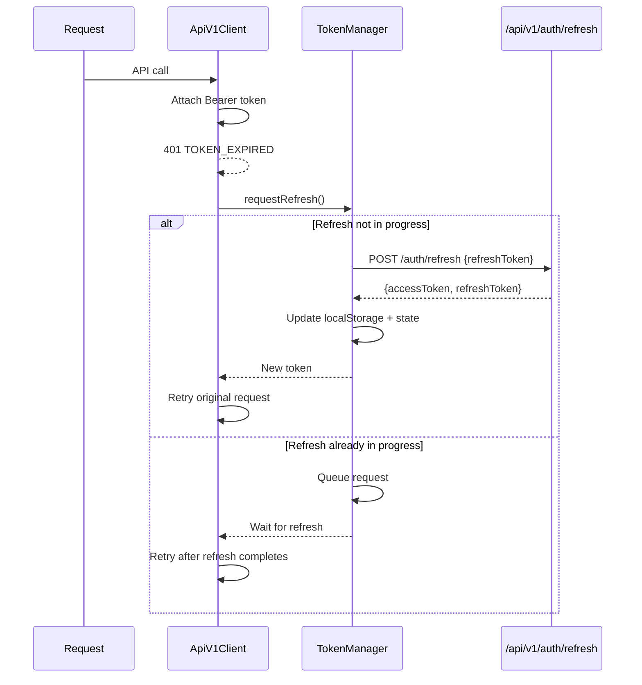
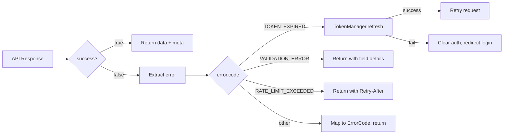

# Design Document: Frontend-Backend Separation

## Overview

This design migrates the Vue 3 + Electron frontend from the legacy `/rest/s1/novel-anime` API to the new `/api/v1/` REST API layer (built in Phase 2). The approach is layered: a new unified API client at the bottom, entity/service abstractions in the middle, and domain services on top that preserve existing public interfaces.

Key design decisions:
1. **Layered architecture**: `ApiV1Client` → `EntityService` / `ServiceInvoker` → Domain services (novelApi, characterApi, etc.)
2. **Backward compatibility**: Legacy API client preserved alongside new client; domain services maintain existing method signatures
3. **Incremental migration**: Each domain service can be migrated independently; `USE_LEGACY_API` flag enables rollback
4. **Type-safe contracts**: TypeScript interfaces match the backend's standardized response format exactly

## Architecture

### Layered API Architecture

```mermaid
graph TB
    subgraph "Vue Components & Pinia Stores"
        C[Components]
        S[Stores: auth, project, credits, etc.]
    end

    subgraph "Domain Services (existing public API preserved)"
        NA[novelApi]
        CA[characterApi]
        SA[sceneApi]
        EA[episodeApi]
        PA[pipelineApi]
        CR[creditsApi]
        AU[authApi]
    end

    subgraph "API Abstraction Layer (new)"
        ES[EntityService<br/>/api/v1/entities/{name}]
        SI[ServiceInvoker<br/>/api/v1/services/{name}]
        AS[AuthService<br/>/api/v1/auth/*]
    end

    subgraph "HTTP Client Layer (new)"
        AC[ApiV1Client<br/>axios + interceptors]
        EH[ErrorHandler<br/>error normalization]
        TM[TokenManager<br/>refresh + queue]
    end

    subgraph "Legacy (preserved during migration)"
        LC[Legacy ApiService<br/>/rest/s1/novel-anime]
    end

    C --> S
    S --> NA & CA & SA & EA & PA & CR & AU
    NA & CA & SA & EA & PA --> ES & SI
    CR --> ES & SI
    AU --> AS
    ES & SI & AS --> AC
    AC --> EH
    AC --> TM
    NA & CA & SA & EA & PA -.->|fallback| LC
```

### Token Refresh Flow



## Components and Interfaces

### 1. ApiV1Client (`services/apiV1Client.ts`)

The core HTTP client. Replaces the current `ApiService` class for new API calls.

```typescript
// Pseudocode
class ApiV1Client {
  private axios: AxiosInstance
  private tokenManager: TokenManager

  constructor(config: { baseURL: string, useLegacy?: boolean })

  // Generic typed HTTP methods
  async get<T>(path: string, params?: Record<string, any>): Promise<ApiV1Result<T>>
  async post<T>(path: string, data?: any): Promise<ApiV1Result<T>>
  async put<T>(path: string, data?: any): Promise<ApiV1Result<T>>
  async delete<T>(path: string, params?: Record<string, any>): Promise<ApiV1Result<T>>

  // Request interceptor: attach Bearer token
  // Response interceptor: parse StandardizedResponse, handle 401 refresh
}
```

Configuration:
- `VITE_API_V1_BASE_URL` → base URL (default: `http://localhost:8080/api/v1`)
- `VITE_USE_LEGACY_API` → boolean flag to use legacy endpoints

### 2. TokenManager (`services/tokenManager.ts`)

Handles JWT token lifecycle: storage, refresh, concurrent request queuing.

```typescript
// Pseudocode
class TokenManager {
  private isRefreshing: boolean = false
  private refreshQueue: Array<{ resolve, reject }>

  getAccessToken(): string | null
  getRefreshToken(): string | null
  setTokens(access: string, refresh: string): void
  clearTokens(): void

  // Returns true if token expires within 5 minutes
  isTokenExpiringSoon(): boolean

  // Refresh with concurrent request queuing
  async refreshAccessToken(): Promise<string>

  // Decode JWT payload without verification
  decodeTokenPayload(token: string): JwtPayload | null
}
```

Storage keys (preserved for backward compatibility):
- `novel_anime_access_token`
- `novel_anime_refresh_token`
- `novel_anime_user_id`
- `novel_anime_user_data`

### 3. EntityService (`services/entityService.ts`)

Generic typed CRUD operations via `/api/v1/entities/{entityName}`.

```typescript
// Pseudocode
class EntityService {
  constructor(private client: ApiV1Client)

  async list<T>(entityName: string, params?: ListParams): Promise<PaginatedResult<T>>
  async get<T>(entityName: string, id: string, fields?: string[]): Promise<ApiV1Result<T>>
  async create<T>(entityName: string, data: Partial<T>): Promise<ApiV1Result<T>>
  async update<T>(entityName: string, id: string, data: Partial<T>): Promise<ApiV1Result<T>>
  async delete(entityName: string, id: string): Promise<ApiV1Result<void>>
}

interface ListParams {
  filters?: Record<string, any>  // mapped to query params
  orderBy?: string               // e.g. "name ASC"
  pageIndex?: number
  pageSize?: number
  fields?: string[]              // field selection
}
```

### 4. ServiceInvoker (`services/serviceInvoker.ts`)

Invokes Moqui services via `/api/v1/services/{serviceName}`.

```typescript
// Pseudocode
class ServiceInvoker {
  constructor(private client: ApiV1Client)

  async invoke<T>(serviceName: string, params?: Record<string, any>): Promise<ApiV1Result<T>>
  async invokeAsync(serviceName: string, params?: Record<string, any>): Promise<{ jobId: string }>
  async getJobStatus(jobId: string): Promise<JobStatus>
}
```

### 5. AuthService (`services/authServiceV1.ts`)

Authentication against `/api/v1/auth/*`.

```typescript
// Pseudocode
class AuthServiceV1 {
  constructor(private client: ApiV1Client, private tokenManager: TokenManager)

  async login(username: string, password: string): Promise<AuthResult>
  async refresh(): Promise<AuthResult>
  async logout(): Promise<void>
}

interface AuthResult {
  success: boolean
  accessToken?: string
  refreshToken?: string
  user?: UserInfo
  error?: ApiV1Error
}
```

### 6. Domain Service Migration Pattern

Each domain service (novelApi, characterApi, etc.) is refactored to use EntityService/ServiceInvoker internally while preserving its public interface.

```typescript
// Example: novelApi migration pattern (pseudocode)
class NovelApiService {
  private entity: EntityService
  private service: ServiceInvoker
  private legacyApi: ApiService  // fallback

  // Public interface unchanged
  async importText(data: { projectId, title, author?, content }): Promise<ImportResult> {
    // NEW: route through ServiceInvoker
    return this.service.invoke('novel-anime.NovelServices.import#Text', data)
      .then(res => this.transformToLegacyFormat(res))
  }

  async getNovel(novelId: string): Promise<NovelResult> {
    // NEW: route through EntityService
    return this.entity.get('novel-anime.Novel', novelId)
      .then(res => this.transformToLegacyFormat(res))
  }

  async listNovels(projectId: string): Promise<NovelsResult> {
    // NEW: route through EntityService with filter
    return this.entity.list('novel-anime.Novel', { filters: { projectId } })
      .then(res => this.transformToLegacyFormat(res))
  }
}
```

### 7. Endpoint Mapping Table

Maps current legacy endpoints to new API endpoints:

| Legacy Endpoint | New Endpoint | Method | Notes |
|---|---|---|---|
| `/auth/login` | `/api/v1/auth/login` | POST | Response format changes |
| `/auth/refresh` | `/api/v1/auth/refresh` | POST | Response format changes |
| `/auth/logout` | `/api/v1/auth/logout` | POST | Response format changes |
| `/novels` | `/api/v1/entities/novel-anime.Novel` | GET | Use Entity API with filters |
| `/novel?novelId=X` | `/api/v1/entities/novel-anime.Novel/X` | GET | Path param instead of query |
| `/novels/import-text` | `/api/v1/services/novel-anime.NovelServices.import#Text` | POST | Service invocation |
| `/novels/analyze-structure` | `/api/v1/services/novel-anime.NovelServices.analyze#Structure` | POST | Service invocation |
| `/characters` | `/api/v1/entities/novel-anime.Character` | GET | Entity API with filters |
| `/character` | `/api/v1/entities/novel-anime.Character/{id}` | GET/PUT/DELETE | Entity CRUD |
| `/novels/extract-characters` | `/api/v1/services/novel-anime.CharacterServices.extract#Characters` | POST | Service invocation |
| `/novels/scenes` | `/api/v1/entities/novel-anime.Scene` | GET | Entity API with filters |
| `/scene` | `/api/v1/entities/novel-anime.Scene/{id}` | GET/PUT | Entity CRUD |
| `/novels/scenes/enhance` | `/api/v1/services/novel-anime.SceneServices.enhance#Scenes` | POST | Service invocation |
| `/novels/episodes` | `/api/v1/entities/novel-anime.Episode` | GET | Entity API with filters |
| `/episode` | `/api/v1/entities/novel-anime.Episode/{id}` | GET/PUT/DELETE | Entity CRUD |
| `/novels/episodes/generate` | `/api/v1/services/novel-anime.EpisodeServices.generate#Episodes` | POST | Service invocation |
| `/credits/balance` | `/api/v1/services/novel-anime.CreditsServices.get#Balance` | POST | Service invocation |
| `/credits/consume` | `/api/v1/services/novel-anime.CreditsServices.consume#Credits` | POST | Service invocation |
| `/credits/history` | `/api/v1/entities/novel-anime.CreditHistory` | GET | Entity API |
| `/projects` | `/api/v1/entities/novel-anime.Project` | GET/POST | Entity CRUD |
| `/project` | `/api/v1/entities/novel-anime.Project/{id}` | GET/PUT/DELETE | Entity CRUD |
| `/workflows` | `/api/v1/entities/novel-anime.Workflow` | GET/POST | Entity CRUD |
| `/workflow` | `/api/v1/entities/novel-anime.Workflow/{id}` | GET/PUT/DELETE | Entity CRUD |
| `/assets` | `/api/v1/entities/novel-anime.Asset` | GET/POST | Entity CRUD |
| `/asset` | `/api/v1/entities/novel-anime.Asset/{id}` | GET/PUT/DELETE | Entity CRUD |
| `/auth/oauth/*` | No equivalent yet | - | Keep legacy, log deprecation |
| `/auth/wechat/*` | No equivalent yet | - | Keep legacy, log deprecation |
| `/auth/profile` | No equivalent yet | - | Keep legacy, log deprecation |
| `/auth/change-password` | No equivalent yet | - | Keep legacy, log deprecation |
| `/auth/avatar` | No equivalent yet | - | Keep legacy, log deprecation |

### 8. ErrorHandler Updates (`services/errorHandler.ts`)

Extend the existing error handler to map new API error codes:

```typescript
// Backend error code → Frontend ErrorCode mapping
const BACKEND_ERROR_MAP: Record<string, ErrorCode> = {
  'VALIDATION_ERROR': ErrorCode.VALIDATION_ERROR,
  'INVALID_REQUEST': ErrorCode.BAD_REQUEST,
  'AUTHENTICATION_REQUIRED': ErrorCode.UNAUTHORIZED,
  'TOKEN_EXPIRED': ErrorCode.UNAUTHORIZED,
  'ACCESS_DENIED': ErrorCode.FORBIDDEN,
  'RESOURCE_NOT_FOUND': ErrorCode.NOT_FOUND,
  'RATE_LIMIT_EXCEEDED': ErrorCode.API_ERROR,  // add RATE_LIMITED to enum
  'INTERNAL_ERROR': ErrorCode.INTERNAL_ERROR,
  'PAYLOAD_TOO_LARGE': ErrorCode.API_ERROR,
}
```

New error codes to add to `ErrorCode` enum:
- `RATE_LIMITED = 'RATE_LIMITED'`
- `TOKEN_EXPIRED = 'TOKEN_EXPIRED'`
- `SERVER_ERROR` → rename to `INTERNAL_ERROR` for consistency (keep alias)

## Data Models

### TypeScript Type Definitions (`types/apiV1.ts`)

```typescript
// Standardized response from /api/v1/
interface ApiV1Response<T = any> {
  success: boolean
  data?: T
  meta?: ResponseMeta
  error?: ApiV1Error
}

interface ResponseMeta {
  totalCount?: number
  pageIndex?: number
  pageSize?: number
  pageMaxIndex?: number
}

interface ApiV1Error {
  code: string
  message: string
  details?: FieldError[]
}

interface FieldError {
  field: string
  message: string
}

// Internal result type used by ApiV1Client
type ApiV1Result<T> = {
  success: true
  data: T
  meta?: ResponseMeta
} | {
  success: false
  error: ApiV1Error
}

// Auth types
interface LoginResponse {
  accessToken: string
  refreshToken: string
  user: UserInfo
}

interface RefreshResponse {
  accessToken: string
  refreshToken: string
}

// JWT payload (decoded, not verified)
interface JwtPayload {
  sub?: string
  userId?: string
  exp?: number
  iat?: number
}

// Backend error codes as constants
const ApiErrorCodes = {
  VALIDATION_ERROR: 'VALIDATION_ERROR',
  INVALID_REQUEST: 'INVALID_REQUEST',
  AUTHENTICATION_REQUIRED: 'AUTHENTICATION_REQUIRED',
  TOKEN_EXPIRED: 'TOKEN_EXPIRED',
  ACCESS_DENIED: 'ACCESS_DENIED',
  RESOURCE_NOT_FOUND: 'RESOURCE_NOT_FOUND',
  RATE_LIMIT_EXCEEDED: 'RATE_LIMIT_EXCEEDED',
  INTERNAL_ERROR: 'INTERNAL_ERROR',
  PAYLOAD_TOO_LARGE: 'PAYLOAD_TOO_LARGE',
} as const
```

### File Structure (new/modified files)

```
frontend/src/renderer/
├── types/
│   ├── api.ts              # existing (keep, add new codes to ErrorCode enum)
│   └── apiV1.ts            # NEW: types for /api/v1/ responses
├── services/
│   ├── api.ts              # existing legacy client (preserved)
│   ├── apiV1Client.ts      # NEW: unified /api/v1/ HTTP client
│   ├── tokenManager.ts     # NEW: JWT token lifecycle
│   ├── entityService.ts    # NEW: generic entity CRUD
│   ├── serviceInvoker.ts   # NEW: service invocation
│   ├── authServiceV1.ts    # NEW: auth via /api/v1/auth/*
│   ├── authApi.ts          # existing (refactored to use authServiceV1)
│   ├── novelApi.ts         # existing (refactored internals)
│   ├── characterApi.ts     # existing (refactored internals)
│   ├── sceneApi.ts         # existing (refactored internals)
│   ├── episodeApi.ts       # existing (refactored internals)
│   ├── creditsApi.ts       # existing (refactored internals)
│   ├── pipelineApi.ts      # existing (refactored internals)
│   ├── errorHandler.ts     # existing (extended with new error codes)
│   └── index.ts            # existing (add new exports)
├── stores/
│   └── auth.ts             # existing (refactored to use authServiceV1)
└── .env.development        # updated with VITE_API_V1_BASE_URL
```

## Correctness Properties

*A property is a characteristic or behavior that should hold true across all valid executions of a system — essentially, a formal statement about what the system should do. Properties serve as the bridge between human-readable specifications and machine-verifiable correctness guarantees.*

### Property 1: Bearer Token Attachment

*For any* API request made through ApiV1Client and any non-null access token stored in localStorage, the outgoing request's `Authorization` header SHALL equal `Bearer {token}`.

**Validates: Requirements 1.2**

### Property 2: Standardized Response Parsing

*For any* valid JSON response body conforming to the `{ success, data, meta, error }` format, parsing it through ApiV1Client SHALL produce an `ApiV1Result` object where: if `success` is true, `data` matches the original `data` field; if `success` is false, `error.code` and `error.message` match the original error fields.

**Validates: Requirements 1.3, 3.3**

### Property 3: Token Persistence Round-Trip

*For any* pair of (accessToken, refreshToken) strings, calling `tokenManager.setTokens(access, refresh)` and then reading from localStorage SHALL yield the same values under keys `novel_anime_access_token` and `novel_anime_refresh_token`.

**Validates: Requirements 2.1, 2.4, 8.5, 9.3**

### Property 4: Login Response User Extraction

*For any* successful login response in Standardized_Response format with a `data.user` object, the Auth_Store SHALL set its `user` state to an object with matching `userId`, `email`, and `username` fields.

**Validates: Requirements 2.5**

### Property 5: Login Error Propagation

*For any* failed login response with an `error` object containing `code` and `message`, the Auth_Service return value SHALL contain the same `code` and `message` values.

**Validates: Requirements 2.6**

### Property 6: Entity Service URL Construction

*For any* entity name and any combination of ListParams (filters, orderBy, pageIndex, pageSize, fields), the EntityService SHALL construct a request URL of the form `/entities/{entityName}` with query parameters correctly encoding all provided params.

**Validates: Requirements 3.2, 3.4**

### Property 7: Validation Error Detail Preservation

*For any* error response with `error.details` containing an array of `{ field, message }` objects, the Error_Handler output SHALL preserve all field-message pairs without modification.

**Validates: Requirements 3.5, 5.2**

### Property 8: Error Code Mapping Completeness

*For any* backend error code in the set {VALIDATION_ERROR, AUTHENTICATION_REQUIRED, TOKEN_EXPIRED, ACCESS_DENIED, RESOURCE_NOT_FOUND, RATE_LIMIT_EXCEEDED, INTERNAL_ERROR}, the Error_Handler SHALL map it to a valid frontend ErrorCode, and `getErrorMessage()` SHALL return a non-empty Chinese string.

**Validates: Requirements 5.1, 5.3**

### Property 9: Domain Service Response Transformation

*For any* Standardized_Response with `success: true` and a `data` object, the Domain_Service transformation SHALL produce an output matching the legacy return type shape (with `success: true` and the domain-specific fields extracted from `data`).

**Validates: Requirements 4.4**

### Property 10: Domain Service Endpoint Mapping

*For any* legacy operation name in the endpoint mapping table, the Domain_Service SHALL route the request to the correct new API path (either `/api/v1/entities/{entityName}` or `/api/v1/services/{serviceName}`).

**Validates: Requirements 4.3**

### Property 11: Concurrent 401 Request Queuing

*For any* set of N concurrent requests that all receive 401 responses, the TokenManager SHALL trigger exactly one refresh request, and after the refresh completes, all N original requests SHALL be retried with the new token.

**Validates: Requirements 8.2**

### Property 12: Local JWT Expiration Validation

*For any* JWT token string with an `exp` claim, `tokenManager.isTokenExpiringSoon()` SHALL return `true` if and only if the current time is within 5 minutes of the expiration time or past it.

**Validates: Requirements 8.4**

## Error Handling

### Error Flow



### Error Handling Strategy

1. **Network errors** (no response): Map to `ErrorCode.NETWORK_ERROR`, include timeout info
2. **401 TOKEN_EXPIRED**: Trigger token refresh via TokenManager; queue concurrent requests
3. **401 AUTHENTICATION_REQUIRED**: Clear tokens, redirect to login (no refresh attempt)
4. **400 VALIDATION_ERROR**: Preserve `error.details` array for form-level display
5. **403 ACCESS_DENIED**: Surface permission error to UI
6. **429 RATE_LIMIT_EXCEEDED**: Extract `Retry-After` header, include in error
7. **404 RESOURCE_NOT_FOUND**: Surface as not-found error
8. **500 INTERNAL_ERROR**: Log details, show generic error message to user

### Backward Compatibility Error Handling

During migration, domain services that fall back to legacy endpoints must normalize legacy error responses (which don't follow the standardized format) into the same `ApiV1Result` shape. The legacy `ApiService` error interceptor remains unchanged.

## Testing Strategy

### Testing Framework

- **Unit tests**: Vitest (already configured in the project)
- **Property-based tests**: fast-check (already a dependency in the project)
- **HTTP mocking**: MSW (Mock Service Worker) or axios-mock-adapter for interceptor testing

### Dual Testing Approach

**Unit tests** focus on:
- Specific examples: login success/failure, entity CRUD happy paths
- Edge cases: empty responses, malformed JSON, missing fields
- Integration: auth store ↔ authServiceV1 ↔ tokenManager
- Error conditions: network timeout, 500 errors, invalid tokens

**Property-based tests** focus on:
- Universal properties across all valid inputs (Properties 1-12)
- Minimum 100 iterations per property test
- Each test tagged: `Feature: {{SPEC_NAME}}, Property {N}: {title}`

### Property-Based Testing Configuration

```typescript
// Each property test follows this pattern
import { fc } from 'fast-check'

// Feature: {{SPEC_NAME}}, Property 3: Token Persistence Round-Trip
describe('Property 3: Token Persistence Round-Trip', () => {
  it('should persist and retrieve tokens correctly', () => {
    fc.assert(
      fc.property(
        fc.string({ minLength: 1 }),  // accessToken
        fc.string({ minLength: 1 }),  // refreshToken
        (access, refresh) => {
          tokenManager.setTokens(access, refresh)
          expect(localStorage.getItem('novel_anime_access_token')).toBe(access)
          expect(localStorage.getItem('novel_anime_refresh_token')).toBe(refresh)
        }
      ),
      { numRuns: 100 }
    )
  })
})
```

### Test File Organization

```
frontend/src/renderer/services/__tests__/
├── apiV1Client.test.ts        # Unit + property tests for HTTP client
├── tokenManager.test.ts       # Unit + property tests for token lifecycle
├── entityService.test.ts      # Unit + property tests for entity CRUD
├── serviceInvoker.test.ts     # Unit tests for service invocation
├── authServiceV1.test.ts      # Unit + property tests for auth
├── errorHandler.test.ts       # Unit + property tests for error mapping
├── novelApi.migration.test.ts # Integration tests for novel API migration
└── auth.store.test.ts         # Integration tests for auth store
```
