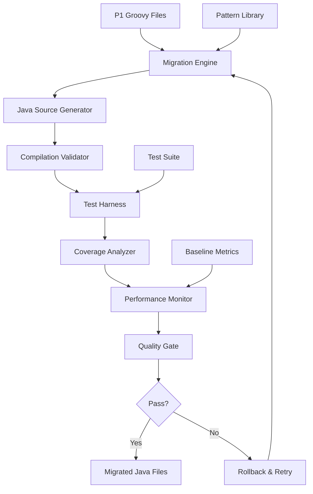
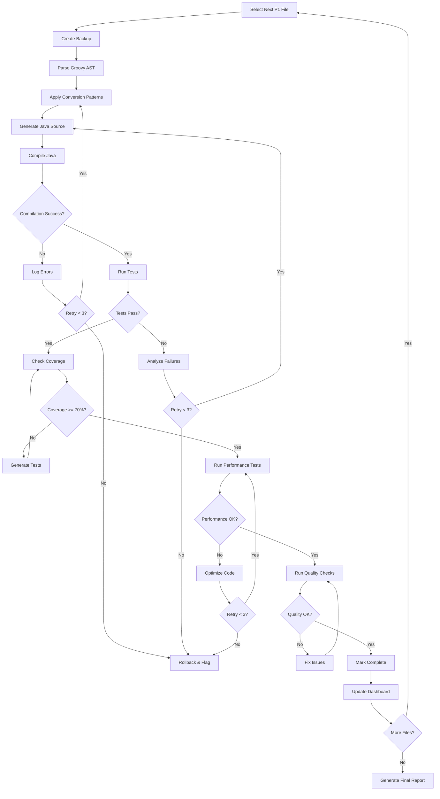

# Design Document: Phase 2 - Groovy-to-Java Migration (P1 Priority)

## Overview

This design document specifies the technical approach for migrating 45 P1 priority Groovy files (7,200 LOC) to pure Java. The migration will be executed over 8 weeks (with 4-week buffer = 12 weeks total), focusing on high-complexity, critical functionality files identified in Phase 1 analysis.

**Design Principles:**
- **Functional Equivalence**: Migrated Java code must produce identical outputs for identical inputs
- **Incremental Migration**: One file at a time with validation at each step
- **Test-Driven**: Comprehensive testing before, during, and after migration
- **Performance Preservation**: Maintain performance within 20% of baseline
- **Quality First**: All code must meet Java quality standards before completion

**Key Design Decisions:**
1. Manual migration with automated validation (not fully automated conversion)
2. Pattern-based approach with reusable conversion templates
3. Comprehensive test harness for regression detection
4. Performance monitoring at file and aggregate levels
5. Rollback capability for failed migrations


## Architecture

### System Components



### Component Responsibilities

**Migration Engine**:
- Orchestrates the migration process
- Applies conversion patterns from Pattern Library
- Manages file-by-file migration workflow
- Tracks migration status and progress

**Java Source Generator**:
- Converts Groovy syntax to Java syntax
- Applies type inference and static typing
- Converts closures to lambdas/methods
- Replaces Groovy APIs with Java equivalents

**Compilation Validator**:
- Compiles generated Java source
- Reports compilation errors with context
- Verifies no dependency conflicts
- Ensures incremental compilation works

**Test Harness**:
- Executes unit tests for migrated code
- Executes integration tests for workflows
- Compares test results to baseline
- Reports test failures with details

**Coverage Analyzer**:
- Measures line, branch, and method coverage
- Generates coverage reports per file
- Enforces 70% minimum coverage threshold
- Produces aggregate coverage reports

**Performance Monitor**:
- Executes performance benchmarks
- Measures execution time, memory, throughput
- Compares to baseline metrics
- Flags performance regressions >20%

**Quality Gate**:
- Enforces all quality criteria
- Blocks completion if criteria not met
- Provides detailed failure reports
- Triggers rollback for failed migrations


## Components and Interfaces

### Migration Engine Interface

```java
public interface MigrationEngine {
    /**
     * Migrates a single P1 Groovy file to Java
     * @param groovyFile The source Groovy file
     * @param context Migration context with patterns and configuration
     * @return Migration result with status and generated Java file
     */
    MigrationResult migrateFile(File groovyFile, MigrationContext context);
    
    /**
     * Validates migration result meets all quality criteria
     * @param result The migration result to validate
     * @return Validation report with pass/fail status
     */
    ValidationReport validate(MigrationResult result);
    
    /**
     * Rolls back a failed migration
     * @param groovyFile The original Groovy file
     * @return Rollback status
     */
    RollbackStatus rollback(File groovyFile);
}
```

### Java Source Generator Interface

```java
public interface JavaSourceGenerator {
    /**
     * Generates Java source from Groovy AST
     * @param groovyAst Parsed Groovy abstract syntax tree
     * @param patterns Conversion patterns to apply
     * @return Generated Java source code
     */
    String generateJavaSource(GroovyAST groovyAst, PatternLibrary patterns);
    
    /**
     * Applies type inference to convert dynamic types to static types
     * @param groovyAst Groovy AST with dynamic types
     * @return AST with inferred static types
     */
    TypedAST inferTypes(GroovyAST groovyAst);
    
    /**
     * Converts Groovy closures to Java lambdas or methods
     * @param closure Groovy closure node
     * @return Java lambda or method equivalent
     */
    JavaNode convertClosure(ClosureNode closure);
}
```

### Test Harness Interface

```java
public interface TestHarness {
    /**
     * Executes all tests for a migrated file
     * @param javaFile The migrated Java file
     * @param testSuite Associated test suite
     * @return Test execution results
     */
    TestResults executeTests(File javaFile, TestSuite testSuite);
    
    /**
     * Compares test results to baseline
     * @param current Current test results
     * @param baseline Baseline test results
     * @return Comparison report
     */
    ComparisonReport compareToBaseline(TestResults current, TestResults baseline);
    
    /**
     * Generates additional tests to meet coverage threshold
     * @param javaFile Java file needing more coverage
     * @param currentCoverage Current coverage percentage
     * @return Generated test cases
     */
    List<TestCase> generateAdditionalTests(File javaFile, double currentCoverage);
}
```

### Performance Monitor Interface

```java
public interface PerformanceMonitor {
    /**
     * Executes performance benchmarks for migrated code
     * @param javaFile Migrated Java file
     * @param baseline Baseline performance metrics
     * @return Performance comparison results
     */
    PerformanceResults benchmark(File javaFile, PerformanceBaseline baseline);
    
    /**
     * Measures execution time for critical operations
     * @param operation Operation to measure
     * @param iterations Number of iterations
     * @return Execution time statistics
     */
    ExecutionStats measureExecutionTime(Runnable operation, int iterations);
    
    /**
     * Measures memory usage for operations
     * @param operation Operation to measure
     * @return Memory usage statistics
     */
    MemoryStats measureMemoryUsage(Runnable operation);
}
```

### Pattern Library Interface

```java
public interface PatternLibrary {
    /**
     * Retrieves conversion pattern by name
     * @param patternName Name of the pattern
     * @return Conversion pattern or null if not found
     */
    ConversionPattern getPattern(String patternName);
    
    /**
     * Adds a new conversion pattern
     * @param pattern Pattern to add
     */
    void addPattern(ConversionPattern pattern);
    
    /**
     * Finds applicable patterns for a Groovy construct
     * @param groovyNode Groovy AST node
     * @return List of applicable patterns
     */
    List<ConversionPattern> findApplicablePatterns(GroovyNode groovyNode);
}
```


## Data Models

### MigrationResult

```java
public class MigrationResult {
    private File originalGroovyFile;
    private File generatedJavaFile;
    private MigrationStatus status;
    private List<ConversionPattern> patternsApplied;
    private List<CompilationError> compilationErrors;
    private TestResults testResults;
    private CoverageReport coverageReport;
    private PerformanceResults performanceResults;
    private long migrationDurationMs;
    private String migrationNotes;
}

public enum MigrationStatus {
    SUCCESS,           // Migration completed successfully
    COMPILATION_FAILED, // Java code doesn't compile
    TESTS_FAILED,      // Tests failed after migration
    COVERAGE_INSUFFICIENT, // Coverage below 70%
    PERFORMANCE_DEGRADED,  // Performance >20% worse than baseline
    ROLLBACK_REQUIRED  // Migration failed, rollback needed
}
```

### ConversionPattern

```java
public class ConversionPattern {
    private String patternId;
    private String patternName;
    private String description;
    private String groovyExample;
    private String javaEquivalent;
    private String rationale;
    private List<String> edgeCases;
    private PatternCategory category;
    private int complexityScore; // 1-10
}

public enum PatternCategory {
    DYNAMIC_TYPING,
    CLOSURES,
    COLLECTION_METHODS,
    GSTRING,
    ELVIS_OPERATOR,
    SAFE_NAVIGATION,
    METAPROGRAMMING,
    GROOVY_API,
    ERROR_HANDLING
}
```

### TestResults

```java
public class TestResults {
    private int totalTests;
    private int passedTests;
    private int failedTests;
    private int skippedTests;
    private List<TestFailure> failures;
    private long executionTimeMs;
    private double passRate; // percentage
}

public class TestFailure {
    private String testName;
    private String errorMessage;
    private String stackTrace;
    private String expectedValue;
    private String actualValue;
}
```

### CoverageReport

```java
public class CoverageReport {
    private double lineCoverage;      // percentage
    private double branchCoverage;    // percentage
    private double methodCoverage;    // percentage
    private int totalLines;
    private int coveredLines;
    private int totalBranches;
    private int coveredBranches;
    private int totalMethods;
    private int coveredMethods;
    private List<UncoveredSection> uncoveredSections;
}

public class UncoveredSection {
    private String className;
    private String methodName;
    private int startLine;
    private int endLine;
    private String reason; // Why this section is uncovered
}
```

### PerformanceResults

```java
public class PerformanceResults {
    private ExecutionStats executionStats;
    private MemoryStats memoryStats;
    private ThroughputStats throughputStats;
    private PerformanceBaseline baseline;
    private double performanceChange; // percentage change from baseline
    private boolean withinThreshold;  // true if within 20% of baseline
}

public class ExecutionStats {
    private long minTimeMs;
    private long maxTimeMs;
    private long avgTimeMs;
    private long medianTimeMs;
    private long p95TimeMs;
    private long p99TimeMs;
}

public class MemoryStats {
    private long heapUsedBytes;
    private long heapMaxBytes;
    private long gcCount;
    private long gcTimeMs;
}

public class ThroughputStats {
    private double operationsPerSecond;
    private double requestsPerSecond;
}
```

### MigrationContext

```java
public class MigrationContext {
    private PatternLibrary patternLibrary;
    private PerformanceBaseline performanceBaseline;
    private TestSuite testSuite;
    private MigrationConfiguration configuration;
    private Map<String, Object> metadata;
}

public class MigrationConfiguration {
    private double minimumCoverageThreshold; // default: 0.70
    private double performanceThreshold;     // default: 0.20 (20%)
    private boolean enableAutomaticRollback; // default: true
    private boolean generateMissingTests;    // default: true
    private int maxRetryAttempts;           // default: 3
    private String javaVersion;             // default: "17"
    private String codeStyle;               // default: "Google Java Style"
}
```


## Correctness Properties

*A property is a characteristic or behavior that should hold true across all valid executions of a system—essentially, a formal statement about what the system should do. Properties serve as the bridge between human-readable specifications and machine-verifiable correctness guarantees.*

### Property 1: Migration Produces Valid Compilable Java

*For any* P1 Groovy file, when migrated by the Migration_Engine, the generated Java source SHALL compile without errors in the Gradle build system.

**Validates: Requirements 1.1, 1.7, 7.1**

**Rationale**: This is the most fundamental property - migrated code must be syntactically valid Java. This property combines compilation validation with the core migration requirement.

**Test Approach**: For each P1 file, attempt compilation and verify zero compilation errors.

### Property 2: Public API Preservation

*For any* P1 Groovy file with public methods, the migrated Java file SHALL preserve all public method signatures (name, parameters, return type) to maintain API compatibility.

**Validates: Requirements 1.6**

**Rationale**: This is an invariant - the public API contract must not change during migration to avoid breaking dependent code.

**Test Approach**: Compare public method signatures before and after migration using reflection or AST analysis.

### Property 3: Functional Equivalence Through Tests

*For any* P1 Groovy file, when migrated to Java, all existing test cases SHALL pass with 100% pass rate, demonstrating functional equivalence.

**Validates: Requirements 2.1, 2.3**

**Rationale**: Passing all existing tests is the primary evidence of functional equivalence. This property combines test execution with pass rate validation.

**Test Approach**: Execute full test suite for each migrated file and verify 100% pass rate.

### Property 4: Coverage Threshold Enforcement

*For any* migrated Java file, the Coverage_Analyzer SHALL measure coverage and the file SHALL achieve minimum 70% coverage across line, branch, and method metrics.

**Validates: Requirements 3.1, 3.2, 3.3, 3.4**

**Rationale**: Adequate test coverage ensures the migrated code is well-tested and maintainable. This property consolidates all coverage-related requirements.

**Test Approach**: Run coverage analysis and verify all three metrics (line, branch, method) meet or exceed 70%.

### Property 5: Performance Preservation

*For any* P1 Groovy file with performance-critical operations, the migrated Java implementation SHALL maintain performance within 20% of the baseline metrics for execution time, memory usage, and throughput.

**Validates: Requirements 4.1, 4.2, 4.3, 4.4**

**Rationale**: Performance must not significantly degrade during migration. This property consolidates all performance-related requirements into a single comprehensive check.

**Test Approach**: Execute performance benchmarks and compare to baseline, flagging any metric that degrades >20%.

### Property 6: Pattern Documentation Completeness

*For any* conversion pattern applied during migration, the pattern SHALL be documented in the Pattern Library with all required fields: Groovy example, Java equivalent, rationale, and edge cases.

**Validates: Requirements 5.1, 5.2, 5.4**

**Rationale**: Complete pattern documentation ensures knowledge transfer and maintainability. This property ensures patterns are fully documented when used.

**Test Approach**: For each pattern applied, verify the Pattern Library entry contains all required fields.

### Property 7: Moqui Framework Integration Preservation

*For any* migrated Java file that uses Moqui framework services, the file SHALL use framework-provided Java APIs correctly and maintain compatibility with entity operations, dependency injection, transaction management, and context access.

**Validates: Requirements 6.1, 6.2, 6.3, 6.4, 6.5**

**Rationale**: Moqui framework integration is critical for system functionality. This property consolidates all framework integration requirements.

**Test Approach**: Execute integration tests that exercise Moqui services, entities, DI, transactions, and context access.

### Property 8: Exception Handling Preservation

*For any* P1 Groovy file with exception handling logic, the migrated Java file SHALL preserve all try-catch blocks, convert exception types appropriately, maintain error messages, and preserve exception propagation behavior.

**Validates: Requirements 8.1, 8.2, 8.3, 8.4, 8.5**

**Rationale**: Error handling is critical for system reliability. This property ensures exception handling logic is correctly migrated.

**Test Approach**: Execute error condition tests and verify exceptions are caught, logged, and propagated correctly.

### Property 9: Code Quality Standards Compliance

*For any* migrated Java file, the code SHALL pass all static analysis tools (CheckStyle, PMD, SpotBugs), meet formatting standards, maintain cyclomatic complexity <15, include JavaDoc for public methods, and have zero code smells.

**Validates: Requirements 9.1, 9.2, 9.3, 9.4, 9.5**

**Rationale**: Code quality standards ensure maintainability and consistency. This property consolidates all quality-related requirements.

**Test Approach**: Run static analysis tools and verify zero violations across all quality metrics.

### Property 10: Dependency Conflict Prevention

*For any* migrated Java file, when Groovy dependencies are removed and Java dependencies are added, the system SHALL verify no dependency conflicts are introduced and all dependencies are compatible.

**Validates: Requirements 7.5, 12.1, 12.2**

**Rationale**: Dependency conflicts can cause runtime failures. This property ensures dependency changes don't break the build.

**Test Approach**: Run dependency analysis tools and verify zero conflicts after migration.

### Property 11: Rollback Capability

*For any* P1 Groovy file migration that fails validation, the system SHALL successfully rollback to the original Groovy file, restoring the system to its pre-migration state.

**Validates: Requirements 11.1, 11.3**

**Rationale**: Rollback capability is essential for risk mitigation. This property ensures failed migrations can be safely reverted.

**Test Approach**: Simulate migration failures and verify rollback restores original state.

### Property 12: Migration Progress Tracking

*For any* P1 file migration event (start, complete, fail), the system SHALL update the migration status dashboard within 1 hour and track time spent, blockers, and completion status.

**Validates: Requirements 10.1, 10.2, 10.3, 10.4**

**Rationale**: Progress tracking enables project management and early blocker identification. This property consolidates tracking requirements.

**Test Approach**: Verify dashboard updates occur timely and accurately reflect migration status.


## Error Handling

### Migration Errors

**Compilation Errors**:
- **Detection**: Java compiler reports syntax or type errors
- **Handling**: Log detailed error with file location and context
- **Recovery**: Retry migration with adjusted patterns or manual intervention
- **Escalation**: After 3 failed attempts, flag for manual review

**Test Failures**:
- **Detection**: Test execution returns non-zero exit code or failures
- **Handling**: Log failed test details (name, expected, actual, stack trace)
- **Recovery**: Analyze failure, adjust Java implementation, re-run tests
- **Escalation**: If tests consistently fail, rollback and flag for review

**Coverage Insufficient**:
- **Detection**: Coverage analyzer reports <70% coverage
- **Handling**: Identify uncovered sections and generate additional tests
- **Recovery**: Add tests to cover gaps, re-run coverage analysis
- **Escalation**: If coverage cannot be improved, document reason and seek approval

**Performance Degradation**:
- **Detection**: Performance benchmarks show >20% degradation
- **Handling**: Profile Java code to identify bottlenecks
- **Recovery**: Optimize hot paths, use better algorithms/data structures
- **Escalation**: If optimization insufficient, consider alternative approach

### System Errors

**File System Errors**:
- **Detection**: IOException during file read/write operations
- **Handling**: Log error with file path and operation
- **Recovery**: Retry operation with exponential backoff
- **Escalation**: After 3 retries, fail migration and alert operator

**Build System Errors**:
- **Detection**: Gradle build fails with non-compilation errors
- **Handling**: Log build output and error messages
- **Recovery**: Verify build configuration, clean and rebuild
- **Escalation**: If build consistently fails, investigate build system issues

**Dependency Conflicts**:
- **Detection**: Gradle reports dependency resolution failures
- **Handling**: Log conflicting dependencies and versions
- **Recovery**: Adjust dependency versions or exclusions
- **Escalation**: If conflicts cannot be resolved, seek architecture review

### Error Reporting

**Error Report Structure**:
```java
public class ErrorReport {
    private ErrorType errorType;
    private ErrorSeverity severity;
    private String errorMessage;
    private String detailedDescription;
    private File affectedFile;
    private String stackTrace;
    private List<String> recoveryAttempts;
    private String resolution;
    private Timestamp timestamp;
}

public enum ErrorType {
    COMPILATION_ERROR,
    TEST_FAILURE,
    COVERAGE_INSUFFICIENT,
    PERFORMANCE_DEGRADATION,
    FILE_SYSTEM_ERROR,
    BUILD_ERROR,
    DEPENDENCY_CONFLICT
}

public enum ErrorSeverity {
    CRITICAL,  // Blocks migration, requires immediate attention
    HIGH,      // Significant issue, requires attention soon
    MEDIUM,    // Moderate issue, can be addressed in normal workflow
    LOW        // Minor issue, can be deferred
}
```

**Error Logging**:
- All errors logged to `migration-errors.log`
- Critical errors trigger immediate notifications
- Error reports aggregated in daily summary
- Errors tracked in migration dashboard


## Testing Strategy

### Dual Testing Approach

**Unit Tests**:
- Purpose: Verify specific examples, edge cases, and error conditions
- Scope: Individual methods and classes
- Coverage: Focus on edge cases and error paths
- Execution: Fast, isolated, no external dependencies
- Balance: Avoid excessive unit tests - property tests handle broad input coverage

**Property-Based Tests**:
- Purpose: Verify universal properties across all inputs
- Scope: System behaviors and invariants
- Coverage: Comprehensive input space through randomization
- Execution: Minimum 100 iterations per property
- Focus: Universal correctness properties from design document

**Complementary Nature**:
- Unit tests catch concrete bugs in specific scenarios
- Property tests verify general correctness across input space
- Together they provide comprehensive coverage
- Both are necessary and required

### Property-Based Testing Configuration

**Library Selection**: 
- **Java**: Use **jqwik** (modern Java property-based testing library)
- **Alternative**: QuickTheories or junit-quickcheck
- **Rationale**: jqwik provides excellent Java 17 support, annotations, and shrinking

**Configuration**:
```java
@Property
@Label("Feature: {{SPEC_NAME}}, Property 1: Migration Produces Valid Compilable Java")
@PropertyDefaults(tries = 100, shrinking = ShrinkingMode.FULL)
void migratedJavaCompiles(@ForAll("p1GroovyFiles") File groovyFile) {
    MigrationResult result = migrationEngine.migrateFile(groovyFile, context);
    CompilationResult compilation = compiler.compile(result.getGeneratedJavaFile());
    
    assertThat(compilation.isSuccess()).isTrue();
    assertThat(compilation.getErrors()).isEmpty();
}

@Provide
Arbitrary<File> p1GroovyFiles() {
    return Arbitraries.of(P1_FILE_LIST);
}
```

**Test Tagging**:
- Each property test MUST reference its design document property
- Tag format: `@Label("Feature: {feature_name}, Property {number}: {property_text}")`
- Example: `@Label("Feature: {{SPEC_NAME}}, Property 3: Functional Equivalence Through Tests")`

**Iteration Count**:
- Minimum: 100 iterations per property test
- Rationale: Randomization requires sufficient iterations for confidence
- Can be increased for critical properties

### Test Organization

**Test Structure**:
```
src/test/java/
├── unit/
│   ├── MigrationEngineTest.java
│   ├── JavaSourceGeneratorTest.java
│   ├── PatternLibraryTest.java
│   └── ...
├── property/
│   ├── MigrationPropertiesTest.java
│   ├── PerformancePropertiesTest.java
│   ├── QualityPropertiesTest.java
│   └── ...
└── integration/
    ├── EndToEndMigrationTest.java
    ├── MoquiIntegrationTest.java
    └── ...
```

### Test Execution Strategy

**Pre-Migration Testing**:
1. Run all existing Groovy tests to establish baseline
2. Document baseline test results
3. Measure baseline performance metrics
4. Verify test infrastructure is working

**During-Migration Testing**:
1. After each file migration:
   - Compile Java file
   - Run unit tests for migrated file
   - Run property tests for applicable properties
   - Run integration tests for affected workflows
2. If any test fails:
   - Log failure details
   - Attempt recovery (fix and re-test)
   - If recovery fails after 3 attempts, rollback

**Post-Migration Testing**:
1. Run full test suite (unit + property + integration)
2. Verify 100% test pass rate
3. Verify 70% minimum coverage
4. Run performance benchmarks
5. Generate final test report

### Coverage Requirements

**Minimum Thresholds**:
- Line coverage: 70%
- Branch coverage: 70%
- Method coverage: 70%

**Coverage Tools**:
- **Primary**: JaCoCo (Java Code Coverage)
- **Integration**: Gradle JaCoCo plugin
- **Reporting**: HTML and XML reports

**Coverage Enforcement**:
```gradle
jacocoTestCoverageVerification {
    violationRules {
        rule {
            limit {
                minimum = 0.70
            }
        }
    }
}
```

### Performance Testing

**Performance Benchmarks**:
- **Tool**: JMH (Java Microbenchmark Harness)
- **Metrics**: Execution time, memory usage, throughput
- **Baseline**: Phase 1 performance metrics
- **Threshold**: ±20% of baseline

**Benchmark Structure**:
```java
@BenchmarkMode(Mode.AverageTime)
@OutputTimeUnit(TimeUnit.MILLISECONDS)
@State(Scope.Thread)
@Warmup(iterations = 5, time = 1, timeUnit = TimeUnit.SECONDS)
@Measurement(iterations = 10, time = 1, timeUnit = TimeUnit.SECONDS)
@Fork(1)
public class MigrationPerformanceBenchmark {
    
    @Benchmark
    public void benchmarkOrderServiceCreate() {
        // Execute order creation operation
    }
    
    @Benchmark
    public void benchmarkProductServiceSearch() {
        // Execute product search operation
    }
}
```

### Integration Testing

**Integration Test Scope**:
- Moqui framework integration (services, entities, DI, transactions)
- End-to-end workflows (order creation, product search, etc.)
- External system integration (if applicable)

**Integration Test Strategy**:
- Use embedded Moqui instance for testing
- Seed test data before each test
- Clean up test data after each test
- Verify workflows work end-to-end

### Test Reporting

**Test Reports Generated**:
1. **Unit Test Report**: JUnit HTML report with pass/fail details
2. **Property Test Report**: jqwik report with property validation results
3. **Coverage Report**: JaCoCo HTML report with coverage metrics
4. **Performance Report**: JMH report with benchmark results
5. **Integration Test Report**: Test results for end-to-end workflows

**Report Location**: `.kiro/specs/{{SPEC_NAME}}/reports/`

---

## Migration Workflow

### File-by-File Migration Process



### Phase Execution Timeline

**Week 1-2: Setup and First Files**
- Set up migration infrastructure
- Migrate first 5 low-complexity P1 files
- Establish patterns and workflows
- Refine tooling based on learnings

**Week 3-4: Core Framework Services**
- Migrate EntityServices.groovy (40 hours)
- Migrate SecurityServices.groovy (13 hours)
- Comprehensive testing and validation

**Week 5-6: Service Engine**
- Migrate ServiceServices.groovy (24 hours)
- Migrate ScreenServices.groovy (32 hours)
- Integration testing

**Week 7-8: Business Services**
- Migrate UserServices.groovy (20 hours)
- Migrate remaining P1 files
- Final validation and testing

**Week 9-10: Buffer and Optimization**
- Address any blockers or issues
- Optimize performance where needed
- Complete documentation

**Week 11-12: Final Validation**
- Run full test suite
- Performance benchmarking
- Generate final reports
- Stakeholder review

### Success Criteria

Migration is successful when:
- ✅ All 45 P1 files migrated to Java
- ✅ 100% test pass rate
- ✅ 70% minimum coverage achieved
- ✅ Performance within 20% of baseline
- ✅ Zero critical or high-severity errors
- ✅ All quality gates passed
- ✅ Documentation complete
- ✅ Stakeholder approval obtained

---

**Document Status**: ✅ Complete  
**Next Step**: Create tasks.md for implementation plan

