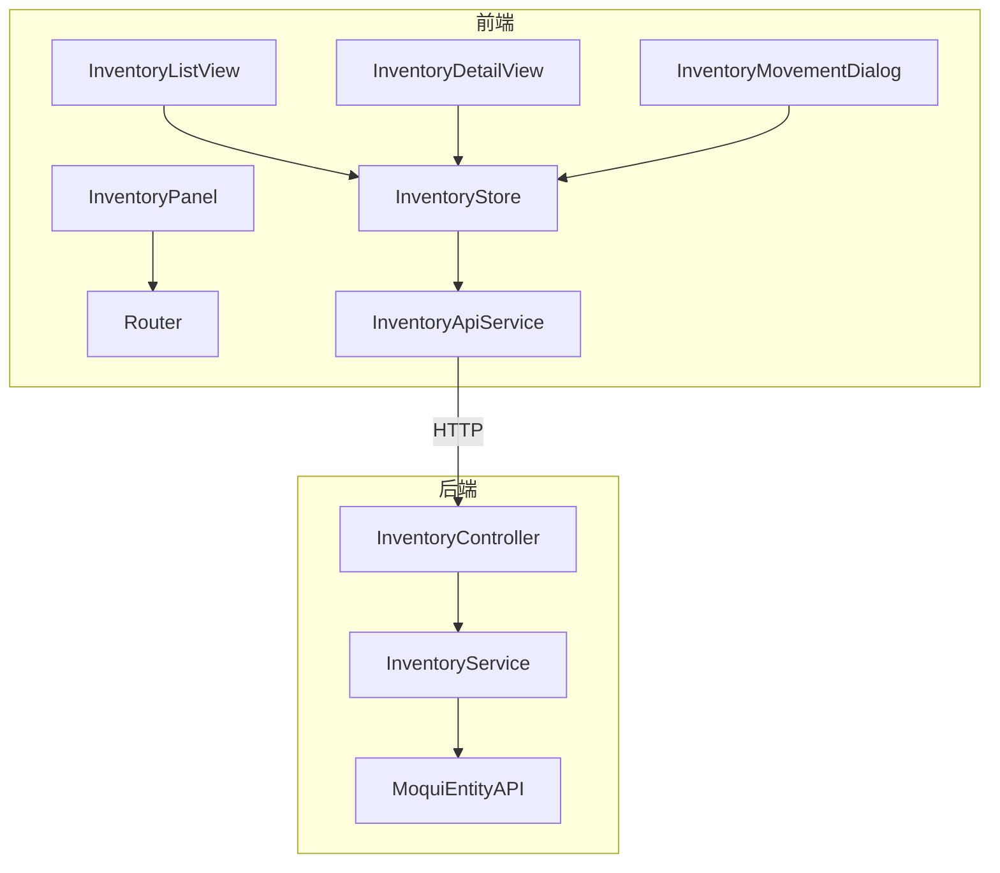

# 库存管理模块 — 设计文档

## 1. 架构概览

遵循项目现有模式：Service → Controller → Router 注册（后端），Types → ApiService → Store → Views（前端）。



## 2. 后端设计

### 2.1 InventoryService.java

- 包路径: `org.moqui.rest.service.InventoryService`
- 构造函数注入 `ExecutionContextFactory`
- 遵循 OrderService 模式

方法列表:

| 方法 | 说明 |
|------|------|
| `listAssets(pageIndex, pageSize, productId, facilityId)` | 分页查询库存列表 |
| `getAssetDetail(assetId)` | 查询库存详情 |
| `moveAsset(assetId, toFacilityId, quantity)` | 库存移动 |
| `adjustAsset(assetId, adjustQuantity, reason)` | 库存调整 |
| `listBatches(pageIndex, pageSize, productId)` | 查询批次列表 |

### 2.2 InventoryController.java

- 包路径: `org.moqui.rest.controller.InventoryController`
- 路由注册:

```
GET    /api/v1/inventory                          → listAssets
GET    /api/v1/inventory/batch                    → listBatches
GET    /api/v1/inventory/{assetId}                → getAssetDetail
POST   /api/v1/inventory/{assetId}/move           → moveAsset
POST   /api/v1/inventory/{assetId}/adjust         → adjustAsset
```

### 2.3 RestApplication.java 注册

```java
InventoryService inventoryService = new InventoryService(ecf);
new InventoryController(inventoryService).register(router);
```

## 3. 组件与接口

### 3.1 前端类型定义 — `types/inventory.ts`

```typescript
interface AssetListItem {
  assetId: string
  productId: string
  productName?: string
  facilityId: string
  facilityName?: string
  quantityOnHand: number
  availableToPromise: number
  statusId?: string
}

interface AssetDetail extends AssetListItem {
  lotId?: string
  receivedDate?: string
  manufacturedDate?: string
}

interface MoveAssetRequest {
  toFacilityId: string
  quantity: number
}

interface AdjustAssetRequest {
  adjustQuantity: number
  reason: string
}

interface BatchListItem {
  lotId: string
  productId: string
  productName?: string
  quantity: number
  manufacturedDate?: string
  expirationDate?: string
}

interface InventoryListParams {
  pageIndex?: number
  pageSize?: number
  productId?: string
  facilityId?: string
}

interface InventoryPaginationMeta {
  pageIndex: number
  pageSize: number
  totalCount: number
  totalPages: number
}
```

### 3.2 API 服务 — `services/inventoryApiService.ts`

使用 `apiV1Client`，路径前缀: `/inventory`

```typescript
class InventoryApiService {
  listAssets(params?: InventoryListParams)
  getAssetDetail(assetId: string)
  moveAsset(assetId: string, data: MoveAssetRequest)
  adjustAsset(assetId: string, data: AdjustAssetRequest)
  listBatches(params?: { pageIndex?: number; pageSize?: number; productId?: string })
}
```

### 3.3 Pinia Store — `stores/inventory.ts`

状态:
- `assets: AssetListItem[]`
- `pagination: InventoryPaginationMeta | null`
- `loading / error`
- `currentAsset: AssetDetail | null`
- `detailLoading / detailError`
- `mutating / mutationError`
- `batches: BatchListItem[]`
- `filterProductId / filterFacilityId / currentPageIndex / currentPageSize`

导出纯函数:
- `filterAssetsByProduct(assets, productId)` — 按产品过滤
- `filterAssetsByFacility(assets, facilityId)` — 按设施过滤

### 3.4 视图组件

| 组件 | 说明 |
|------|------|
| `InventoryListView.vue` | 列表页，含搜索/过滤/分页/移动按钮 |
| `InventoryDetailView.vue` | 详情页，含库存信息 + 调整/移动操作 |
| `InventoryMovementDialog.vue` | 库存移动/调整对话框 |
| `InventoryPanel.vue` | 侧边面板 |

## 4. 数据模型

### 4.1 Moqui 实体映射

| 概念 | 实体名 | 主键 | 关键字段 |
|------|--------|------|----------|
| 库存资产 | `mantle.product.asset.Asset` | assetId | productId, facilityId, quantityOnHandTotal, availableToPromiseTotal, statusId, lotId, receivedDate |
| 批次 | `mantle.product.asset.Lot` | lotId | quantity, manufacturedDate, expirationDate |

### 4.2 库存状态

```
AstAvailable — 可用
AstOnHold — 冻结
AstReserved — 已预留
```

## 5. 正确性属性

### Property 1: 分页数学正确性
*For any* 库存列表和任意合法的 pageIndex/pageSize 参数，返回的 totalPages 应等于 `ceil(totalCount / pageSize)`。
**Validates: Requirements 1.1**

### Property 2: 过滤返回匹配记录
*For any* 库存列表和任意 productId 或 facilityId 过滤参数，返回的所有记录的对应字段应与过滤参数一致。
**Validates: Requirements 1.2, 1.3**

### Property 3: 库存移动数量守恒
*For any* 合法的库存移动操作，源库存减少的数量应等于移动数量。
**Validates: Requirements 3.3**

### Property 4: 库存移动验证拒绝超额
*For any* 移动数量超过可用库存的请求，应返回 400 错误码。
**Validates: Requirements 3.4**

### Property 5: 库存调整验证拒绝负库存
*For any* 调整后库存为负数的请求，应返回 400 错误码。
**Validates: Requirements 4.3**

### Property 6: 库存调整数量正确性
*For any* 合法的库存调整操作，调整后的库存数量应等于原数量加上调整量。
**Validates: Requirements 4.2**

### Property 7: 前端过滤函数正确性
*For any* 库存列表和任意 productId，`filterAssetsByProduct` 函数返回的所有记录的 productId 应与过滤参数一致。
**Validates: Requirements 6.2**

## 6. 错误处理

| 错误码 | HTTP 状态码 | 场景 |
|--------|------------|------|
| VALIDATION_ERROR | 400 | 必填字段缺失或数量不合法 |
| RESOURCE_NOT_FOUND | 404 | 库存记录不存在 |
| INSUFFICIENT_QUANTITY | 400 | 库存不足 |
| INTERNAL_ERROR | 500 | 服务器内部异常 |

## 7. 测试策略

### 7.1 后端测试
- **框架**: JUnit 5 + jqwik
- **属性测试**: 验证 Property 1-6

### 7.2 前端测试
- **框架**: Vitest + fast-check
- **属性测试**: 验证 Property 7
