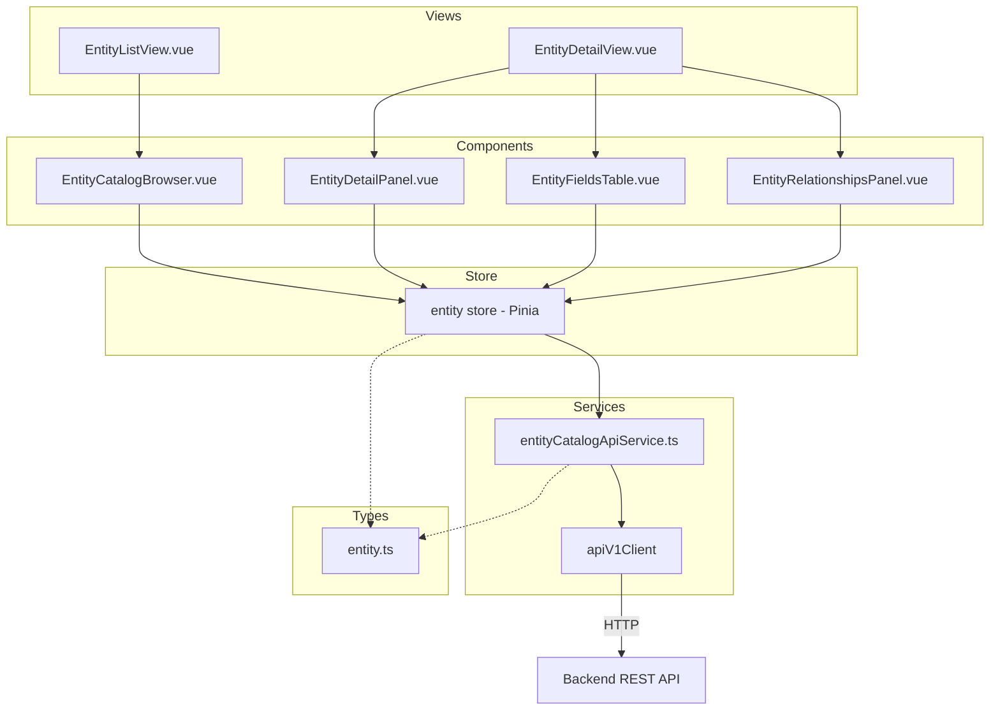
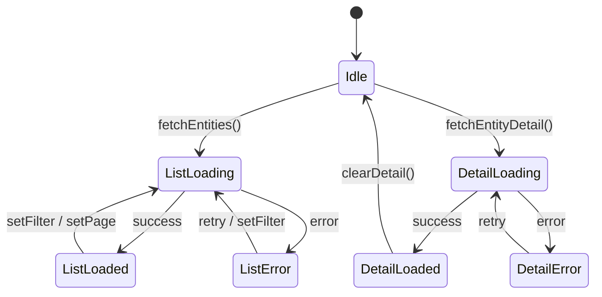

# Design Document: {{SPEC_NAME_TITLE}}

## Overview

Entity Explorer 是 331-poc 前端的 Entity 浏览和分析模块，遵循 Screen Explorer (22-00) 的架构模式。模块包含类型定义、API 服务层、Pinia Store、Vue 组件、视图和路由集成六个层次。

核心设计决策：
- 完全复用 Screen Explorer 的分层架构（types → service → store → components → views → routes）
- 复用已有的 `apiV1Client` 进行 HTTP 通信
- 与现有 `entityService.ts`（CRUD 操作）共存，新建 `entityCatalogApiService.ts` 专注目录浏览
- 导航集成到现有 Navigation Store

## Architecture



数据流：
1. View 挂载时触发 Store action
2. Store action 调用 API Service
3. API Service 通过 apiV1Client 发送 HTTP 请求
4. 响应数据通过 Store 状态更新驱动 UI 渲染

## Components and Interfaces

### 1. Type Definitions (`frontend/src/renderer/types/entity.ts`)

```typescript
// Entity 摘要 — 对应后端 EntitySummary.toMap()
export interface EntitySummary {
  entityName: string        // 完整实体名 (e.g. "moqui.basic.Enumeration")
  entityNameShort: string   // 短名 (e.g. "Enumeration")
  packageName: string       // 包名 (e.g. "moqui.basic")
  shortAlias: string        // 短别名
  groupName: string         // 组名
  isView: boolean           // 是否视图实体
  tableName: string         // 表名
  fieldCount: number        // 字段数
  relationshipCount: number // 关系数
  component: string         // 所属组件
}

// Entity 列表查询参数
export interface EntityListParams {
  component?: string
  packagePrefix?: string
  keyword?: string
  pageIndex?: number
  pageSize?: number
}

// Entity 列表分页元数据
export interface EntityPaginationMeta {
  totalCount: number
  pageIndex: number
  pageSize: number
  pageMaxIndex: number
}

// Entity 列表响应
export interface EntityListData {
  entities: EntitySummary[]
  totalCount: number
  pageIndex: number
  pageSize: number
  pageMaxIndex: number
  generatedAt?: string
  component?: string
  filters?: Record<string, string>
}

// Entity 字段
export interface EntityField {
  name: string
  type: string
  javaType: string
  isPk: boolean
  columnName: string
  encrypt: boolean
  createOnly: boolean
  default: string | null
}

// Entity 关系
export interface EntityRelationship {
  name: string
  shortAlias: string
  type: string
  isTypeOne: boolean
  relatedEntity: string
  title: string
  dependent: boolean
  keyMap: Record<string, string>
}

// Entity 定义响应
export interface EntityDefinitionData {
  entityName: string
  entityNameShort: string
  packageName: string
  shortAlias: string
  groupName: string
  isView: boolean
  isDynamicView: boolean
  tableName: string
  fullTableName: string
  pkFields: string[]
  component?: string
  fieldCount: number
  relationshipCount: number
  fields: EntityField[]
  relationships: EntityRelationship[]
}

// Entity 关系列表响应
export interface EntityRelationshipsData {
  entityName: string
  relationshipCount: number
  relationships: EntityRelationship[]
}
```

### 2. API Service (`frontend/src/renderer/services/entityCatalogApiService.ts`)

```typescript
class EntityCatalogApiService {
  async listEntities(params?: EntityListParams): Promise<ApiV1Result<EntityListData>>
  async getEntityDefinition(entityName: string): Promise<ApiV1Result<EntityDefinitionData>>
  async listRelationships(entityName: string): Promise<ApiV1Result<EntityRelationshipsData>>
}
```

端点映射：
- `listEntities` → `GET /entities?component=&keyword=&packagePrefix=&pageIndex=&pageSize=`
- `getEntityDefinition` → `GET /entities/{entityName}/definition`
- `listRelationships` → `GET /entities/{entityName}/relationships`

### 3. Pinia Store (`frontend/src/renderer/stores/entity.ts`)

```typescript
interface EntityState {
  // 列表状态
  entities: EntitySummary[]
  pagination: EntityPaginationMeta | null
  listLoading: boolean
  listError: string | null

  // 筛选状态
  currentComponent: string | null
  currentKeyword: string
  currentPageIndex: number
  currentPageSize: number

  // 详情状态
  currentEntity: EntityDefinitionData | null
  currentRelationships: EntityRelationshipsData | null
  detailLoading: boolean
  detailError: string | null
}

// Getters
hasEntities: boolean
hasDetail: boolean
totalPages: number
hasNextPage: boolean
hasPreviousPage: boolean

// Actions
fetchEntities(): Promise<void>
fetchEntityDetail(entityName: string): Promise<void>
fetchEntityRelationships(entityName: string): Promise<void>
setFilter(component?: string | null, keyword?: string): Promise<void>
setPage(pageIndex: number): Promise<void>
clearDetail(): void
```

### 4. Vue Components

| 组件 | 职责 | 父组件 |
|------|------|--------|
| `EntityCatalogBrowser.vue` | 搜索/筛选/列表/分页 | EntityListView |
| `EntityDetailPanel.vue` | 基本信息 + Tab 导航 | EntityDetailView |
| `EntityFieldsTable.vue` | 字段表格 | EntityDetailView |
| `EntityRelationshipsPanel.vue` | 关系列表 | EntityDetailView |

### 5. Views

| 视图 | 路由 | 职责 |
|------|------|------|
| `EntityListView.vue` | `/entities` | 挂载 EntityCatalogBrowser，触发 fetchEntities |
| `EntityDetailView.vue` | `/entities/:entityName` | Tab 布局（概览/字段/关系），触发 fetchEntityDetail + fetchEntityRelationships |

### 6. Navigation Integration

Navigation Store 变更：
- `NavId` 新增 `'entities'`
- `NAV_ITEMS` 新增 Entity 探索条目
- `PanelContext` 新增 `entities: EntitiesContext`
- `DEFAULT_CONTEXTS` 新增 entities 默认值

Router 变更：
- 新增 `/entities` → EntityListView
- 新增 `/entities/:entityName` → EntityDetailView

## Data Models

### 后端 → 前端数据映射

| 后端 Java 类型 | 前端 TypeScript 类型 | API 端点 |
|---------------|---------------------|---------|
| `EntitySummary.toMap()` | `EntitySummary` | `GET /entities` |
| `listEntities()` 响应 | `EntityListData` | `GET /entities` |
| `getEntityDefinition()` 响应 | `EntityDefinitionData` | `GET /entities/{name}/definition` |
| `listRelationships()` 响应 | `EntityRelationshipsData` | `GET /entities/{name}/relationships` |
| `FieldInfo` 字段 | `EntityField` | 嵌套在 definition 中 |
| `RelationshipInfo` 字段 | `EntityRelationship` | 嵌套在 definition/relationships 中 |

### Store 状态转换




## Correctness Properties

*A property is a characteristic or behavior that should hold true across all valid executions of a system — essentially, a formal statement about what the system should do. Properties serve as the bridge between human-readable specifications and machine-verifiable correctness guarantees.*

### Property 1: API error propagation

*For any* error response returned by the backend API (4xx or 5xx), the EntityCatalogApiService should propagate it as a typed `ApiV1Result` with `success: false` and a populated `error` field, without throwing unhandled exceptions.

**Validates: Requirements 1.5**

### Property 2: fetchEntities passes current filter/pagination state

*For any* combination of store filter state (currentComponent, currentKeyword) and pagination state (currentPageIndex, currentPageSize), calling `fetchEntities` should invoke the API service with parameters exactly matching those store values.

**Validates: Requirements 2.3**

### Property 3: setFilter always resets pageIndex to 0

*For any* current pageIndex value and any new filter values (component, keyword), calling `setFilter` should result in `currentPageIndex` being 0 before the subsequent fetch is triggered.

**Validates: Requirements 2.6**

### Property 4: Fetch action lifecycle state transitions

*For any* fetch action (fetchEntities, fetchEntityDetail, fetchEntityRelationships):
- At the start, the corresponding loading flag is true and the previous error is cleared
- On success, the corresponding data is updated and loading is set to false
- On failure, a user-friendly error message is set and loading is set to false

**Validates: Requirements 2.8, 2.9, 2.10, 7.2**

### Property 5: Entity list item renders all required fields

*For any* valid EntitySummary object, the rendered EntityCatalogBrowser list item should contain the entityName, component, packageName, fieldCount, and relationshipCount values.

**Validates: Requirements 4.5**

### Property 6: Entity detail panel renders all basic info

*For any* valid EntityDefinitionData object, the rendered EntityDetailPanel should contain the entityName, packageName, component, groupName, tableName, isView status, and pkFields values.

**Validates: Requirements 5.2**

### Property 7: Detail sub-components render all items

*For any* list of EntityField objects, the EntityFieldsTable should render a row for each field showing name, type, javaType, isPk, and columnName. *For any* list of EntityRelationship objects, the EntityRelationshipsPanel should render an entry for each relationship showing name, type, relatedEntity, and keyMap.

**Validates: Requirements 5.4, 5.5**

## Error Handling

| 场景 | 处理方式 | 用户反馈 |
|------|---------|---------|
| API 返回 404 (entity not found) | Store 设置 detailError | 显示 "Entity 未找到" + 返回列表按钮 |
| API 返回 503 (catalog not initialized) | Store 设置对应 error | 显示错误信息 + 重试按钮 |
| 网络错误 (timeout, connection refused) | catch 块设置 user-friendly message | 显示 "网络错误，请重试" + 重试按钮 |
| API 返回 400 (invalid params) | Store 设置 listError | 显示错误信息 |
| 空列表 (no matching entities) | 正常状态，entities = [] | 显示空状态提示 + 建议调整筛选 |

错误处理原则：
- 列表错误和详情错误独立管理，互不影响
- 非关键数据加载失败（如 relationships）不阻塞主视图
- 所有错误状态提供重试机制
- 导航离开详情页时清除详情错误状态

## Testing Strategy

### 测试框架

- **单元测试**: Vitest (已有配置)
- **属性测试**: fast-check (需新增依赖)
- **组件测试**: @vue/test-utils + Vitest

### 单元测试

覆盖范围：
- API Service: 验证请求参数构造、错误处理
- Store: 验证状态转换、action 行为
- Components: 验证渲染输出、用户交互

### 属性测试

每个 Correctness Property 对应一个属性测试，使用 fast-check 生成随机输入：
- 最少 100 次迭代
- 每个测试标注对应的 Property 编号和 Requirements 引用
- 标签格式: **Feature: {{SPEC_NAME}}, Property {N}: {title}**

### 测试分工

| 测试类型 | 覆盖内容 | 工具 |
|---------|---------|------|
| 属性测试 | Property 1-7 (通用正确性) | fast-check + Vitest |
| 单元测试 | 具体示例、边界情况、错误条件 | Vitest |
| 组件测试 | UI 渲染、交互、状态绑定 | @vue/test-utils |
