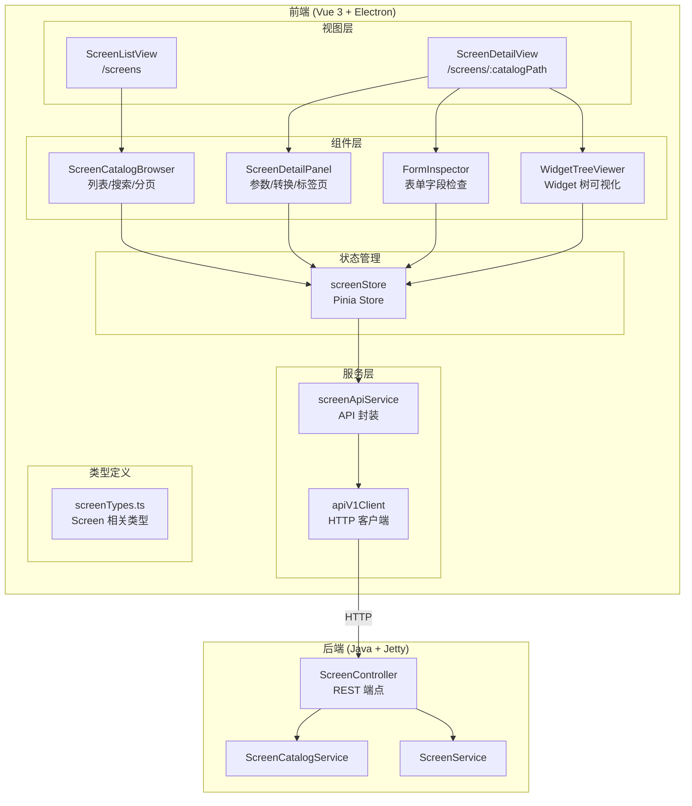

# 设计文档: {{SPEC_NAME_TITLE}}

## 概述

{{SPEC_NAME_TITLE}} 是前端 Screen 探索模块，构建在已有的后端 Screen REST API 之上。该模块遵循项目现有的前端架构模式（Vue 3 + Pinia + Vue Router + TypeScript），新增 Screen 相关的类型定义、API 服务层、状态管理 Store、视图组件和路由配置。

设计目标：
- 复用现有 `apiV1Client` 和 `ApiV1Result` 模式，保持 API 调用风格一致
- 复用现有 `navigation store` 模式，将 Screen Explorer 集成到侧边栏导航
- 组件采用 Vue 3 Composition API (`<script setup lang="ts">`)，与现有视图风格一致
- 所有数据结构使用 TypeScript 类型定义，确保类型安全

## 架构



## 组件和接口

### 1. Screen API 服务 (`screenApiService.ts`)

封装后端 Screen REST 端点调用，遵循 `entityService.ts` 的模式。

```typescript
// 接口定义
interface ScreenApiService {
  listScreens(params?: ScreenListParams): Promise<ApiV1Result<ScreenListData>>
  getScreenDefinition(catalogPath: string): Promise<ApiV1Result<ScreenDefinitionData>>
  getScreenForms(catalogPath: string): Promise<ApiV1Result<ScreenFormsData>>
  getScreenWidgets(catalogPath: string): Promise<ApiV1Result<ScreenWidgetsData>>
}

interface ScreenListParams {
  component?: string
  keyword?: string
  pageIndex?: number
  pageSize?: number
}
```

端点映射：
| 方法 | 后端端点 | 说明 |
|------|---------|------|
| `listScreens` | `GET /screens` | 列表查询，支持分页/筛选 |
| `getScreenDefinition` | `GET /screens/definition?path=X` | 获取 Screen 定义 |
| `getScreenForms` | `GET /screens/forms?path=X` | 获取表单数据 |
| `getScreenWidgets` | `GET /screens/widgets?path=X` | 获取 Widget 数据 |

### 2. Screen Store (`screenStore.ts`)

Pinia Store，管理 Screen 数据的获取、缓存和状态。遵循 `auth.ts` store 的模式。

```typescript
interface ScreenState {
  // 列表状态
  screens: ScreenSummary[]
  pagination: ResponseMeta | null
  listLoading: boolean
  listError: string | null
  
  // 筛选状态
  currentComponent: string | null
  currentKeyword: string
  currentPageIndex: number
  currentPageSize: number
  
  // 详情状态
  currentScreen: ScreenDefinitionData | null
  currentForms: ScreenFormsData | null
  currentWidgets: ScreenWidgetsData | null
  detailLoading: boolean
  detailError: string | null
}
```

Actions:
| Action | 说明 | 调用的 API |
|--------|------|-----------|
| `fetchScreens` | 获取 Screen 列表 | `screenApiService.listScreens` |
| `fetchScreenDetail` | 获取 Screen 定义 | `screenApiService.getScreenDefinition` |
| `fetchScreenForms` | 获取表单数据 | `screenApiService.getScreenForms` |
| `fetchScreenWidgets` | 获取 Widget 数据 | `screenApiService.getScreenWidgets` |
| `setFilter` | 设置筛选条件并重新获取列表 | `fetchScreens` |
| `setPage` | 设置分页并重新获取列表 | `fetchScreens` |
| `clearDetail` | 清除当前详情数据 | — |

### 3. 视图组件

#### ScreenListView (`/screens`)
- 顶层路由视图，包含 `ScreenCatalogBrowser` 组件
- 从 `screenStore` 读取列表数据和加载状态
- 进入时触发 `fetchScreens`

#### ScreenDetailView (`/screens/:catalogPath`)
- 顶层路由视图，包含标签页切换（概览/表单/Widget）
- 从路由参数获取 `catalogPath`，触发 `fetchScreenDetail`
- 包含 `ScreenDetailPanel`、`FormInspector`、`WidgetTreeViewer` 子组件

### 4. 子组件

#### ScreenCatalogBrowser
- 搜索框 + 组件筛选下拉 + Screen 列表 + 分页控件
- 点击条目通过 `router.push` 导航到详情页
- 加载中显示 spinner，错误时显示错误信息和重试按钮

#### ScreenDetailPanel
- 展示 Screen 基本信息：名称、路径、组件
- 参数列表表格：名称、是否必填
- 转换列表表格：名称、关联服务

#### FormInspector
- 表单列表，每个表单可展开/折叠
- 展开后显示字段表格：字段名、类型
- 无表单时显示空状态提示

#### WidgetTreeViewer
- 递归树形组件，展示 Widget 层次
- 每个节点显示类型和关键属性
- 点击节点展开/折叠子节点
- 使用缩进和连接线表示层次关系
- 无 Widget 时显示空状态提示

### 5. 路由配置

```typescript
// 新增路由
{ path: '/screens', name: 'screens', component: ScreenListView, meta: { requiresAuth: true } }
{ path: '/screens/:catalogPath(.*)', name: 'screen-detail', component: ScreenDetailView, meta: { requiresAuth: true } }
```

### 6. 导航集成

在 `navigation.ts` 中扩展：
- 新增 `NavId` 类型: `'screens'`
- 新增 `NAV_ITEMS` 条目: `{ id: 'screens', route: '/screens', label: 'Screen 探索', description: '浏览和分析 Moqui Screen 定义' }`
- 新增 `PanelContext` 类型: `screens: ScreensContext`

## 数据模型

### Screen 类型定义 (`screenTypes.ts`)

```typescript
/** Screen 摘要 — 对应后端 ScreenSummary.toMap() */
export interface ScreenSummary {
  component: string
  fileName: string
  relativePath: string
  catalogPath: string
}

/** Screen 列表响应数据 */
export interface ScreenListData {
  screens: ScreenSummary[]
}

/** Screen 定义响应 — 包含 catalog 摘要和完整定义 */
export interface ScreenDefinitionData {
  catalog: ScreenSummary
  definition: ScreenDefinitionDetail
}

/** Screen 定义详情 */
export interface ScreenDefinitionDetail {
  screenName: string
  parameters: ScreenParameter[]
  transitions: ScreenTransition[]
  widgets: ScreenWidget[]
  [key: string]: unknown  // 后端可能返回额外字段
}

/** Screen 参数 */
export interface ScreenParameter {
  name: string
  required: boolean
  [key: string]: unknown
}

/** Screen 转换 */
export interface ScreenTransition {
  name: string
  serviceName?: string
  [key: string]: unknown
}

/** Screen Widget — 递归结构 */
export interface ScreenWidget {
  type: string
  attributes: Record<string, string>
  children: ScreenWidget[]
}

/** Screen 表单响应数据 */
export interface ScreenFormsData {
  forms: ScreenForm[]
  [key: string]: unknown
}

/** Screen 表单 */
export interface ScreenForm {
  formName: string
  formType: string
  fields: ScreenFormField[]
  [key: string]: unknown
}

/** 表单字段 */
export interface ScreenFormField {
  name: string
  type?: string
  [key: string]: unknown
}

/** Screen Widget 响应数据 */
export interface ScreenWidgetsData {
  widgets: ScreenWidget[]
  [key: string]: unknown
}
```

### 类型与后端映射关系

| 前端类型 | 后端来源 | API 端点 |
|---------|---------|---------|
| `ScreenSummary` | `ScreenSummary.toMap()` | `GET /screens` |
| `ScreenDefinitionData` | `ScreenController.getScreenDefinitionByQuery` | `GET /screens/definition?path=X` |
| `ScreenFormsData` | `ScreenService.getScreenForms` | `GET /screens/forms?path=X` |
| `ScreenWidgetsData` | `ScreenService.getScreenWidgets` | `GET /screens/widgets?path=X` |


## 正确性属性 (Correctness Properties)

*属性（Property）是在系统所有有效执行中都应成立的特征或行为——本质上是关于系统应该做什么的形式化陈述。属性是人类可读规范与机器可验证正确性保证之间的桥梁。*

### Property 1: API 服务端点映射正确性

*For any* Screen API 服务方法调用及其参数，该方法 SHALL 构造正确的 HTTP 请求路径和查询参数，并将后端响应转换为类型化的 `ApiV1Result`。

具体而言：
- `listScreens({component: c, keyword: k, pageIndex: p, pageSize: s})` → `GET /screens?component=c&keyword=k&pageIndex=p&pageSize=s`
- `getScreenDefinition(path)` → `GET /screens/definition?path={path}`
- `getScreenForms(path)` → `GET /screens/forms?path={path}`
- `getScreenWidgets(path)` → `GET /screens/widgets?path={path}`

**Validates: Requirements 1.1, 1.2, 1.3, 1.4**

### Property 2: Store 获取操作状态机

*For any* Screen Store 的 fetch action（fetchScreens、fetchScreenDetail、fetchScreenForms、fetchScreenWidgets），执行该 action 时：
- 开始时对应的 loading 状态 SHALL 为 true
- 成功完成后 loading 状态 SHALL 为 false，数据 SHALL 被更新
- 失败时 loading 状态 SHALL 为 false，error 状态 SHALL 包含错误信息

**Validates: Requirements 2.3, 2.4, 2.5, 2.6, 2.7, 2.8**

### Property 3: 目录浏览器筛选传播

*For any* 关键词或组件筛选值，Screen Catalog Browser 将筛选值传递给 Screen Store 的 fetch 方法时，Store SHALL 使用该筛选值调用 API 服务的 `listScreens` 方法。

**Validates: Requirements 3.2, 3.3**

### Property 4: Screen 条目点击导航

*For any* Screen 摘要条目（包含 catalogPath），点击该条目 SHALL 触发路由导航到 `/screens/{catalogPath}`。

**Validates: Requirements 3.5**

### Property 5: 详情查看器渲染完整性

*For any* Screen 定义（包含参数列表和转换列表），Screen Detail Viewer SHALL 渲染所有参数的名称和必填状态，以及所有转换的名称和关联服务。

**Validates: Requirements 4.2, 4.3**

### Property 6: 表单检查器字段渲染

*For any* 包含表单的 Screen，Form Inspector SHALL 渲染每个表单的所有字段，每个字段显示名称和类型信息。

**Validates: Requirements 5.2**

### Property 7: Widget 树完整渲染

*For any* Widget 树结构，Widget Tree Viewer SHALL 递归渲染所有 Widget 节点，每个节点显示其类型名称和关键属性。

**Validates: Requirements 6.1, 6.2**

### Property 8: 导航状态保留（往返属性）

*For any* Screen 列表的筛选和分页状态，从列表导航到详情页再返回列表页后，之前的筛选条件和分页位置 SHALL 被保留。

**Validates: Requirements 7.4**

## 错误处理

### API 层错误处理

| 错误场景 | 处理方式 |
|---------|---------|
| 网络错误 | `apiV1Client` 拦截器返回 `NETWORK_ERROR`，Store 存储错误信息，组件显示"网络连接失败" |
| 401 未认证 | `apiV1Client` 自动尝试 token 刷新，失败则跳转登录页 |
| 404 Screen 不存在 | Store 存储错误信息，详情页显示"Screen 未找到"并提供返回列表链接 |
| 503 服务不可用 | Store 存储错误信息，组件显示"Screen 目录服务未初始化" |
| 其他服务端错误 | Store 存储错误信息，组件显示通用错误信息和重试按钮 |

### 组件层错误处理

- 列表加载失败：显示错误信息 + 重试按钮
- 详情加载失败：显示错误信息 + 返回列表链接
- 空数据：表单/Widget 为空时显示友好的空状态提示

## 测试策略

### 属性测试 (Property-Based Testing)

使用 `fast-check` 库（vitest 生态中的 PBT 库）进行属性测试。

每个属性测试：
- 最少运行 100 次迭代
- 使用注释标注对应的设计属性编号
- 标签格式: `Feature: {{SPEC_NAME}}, Property N: {property_text}`

重点属性测试：
1. **Property 1** — API 服务端点映射：生成随机参数组合，验证构造的请求路径和参数正确
2. **Property 2** — Store 状态机：生成随机 API 响应（成功/失败），验证 Store 状态转换正确
3. **Property 7** — Widget 树渲染：生成随机 Widget 树结构，验证所有节点都被渲染

### 单元测试

使用 `vitest` 进行单元测试，覆盖：
- API 服务方法的基本调用（example-based）
- Store actions 的成功和失败路径
- 组件渲染的关键状态（加载中、错误、空数据）
- 路由配置和导航守卫
- 边缘情况：空表单、空 Widget、无搜索结果

### 测试文件组织

```
frontend/src/renderer/
├── services/__tests__/
│   └── screenApiService.spec.ts     # API 服务测试
├── stores/__tests__/
│   └── screenStore.spec.ts          # Store 测试
└── components/__tests__/
    ├── ScreenCatalogBrowser.spec.ts  # 目录浏览器测试
    ├── FormInspector.spec.ts         # 表单检查器测试
    └── WidgetTreeViewer.spec.ts      # Widget 树测试
```
