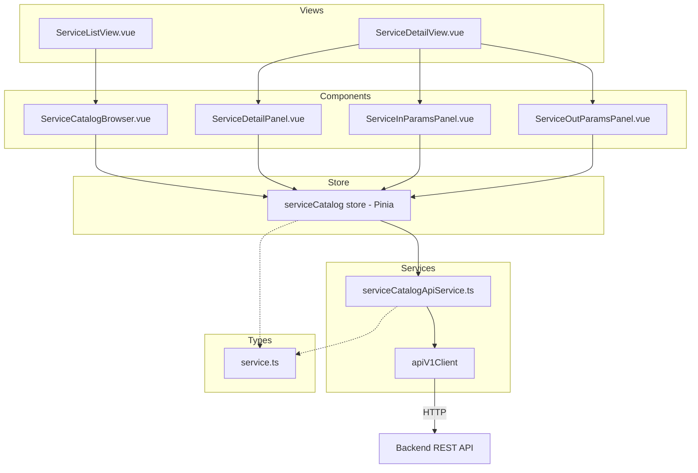
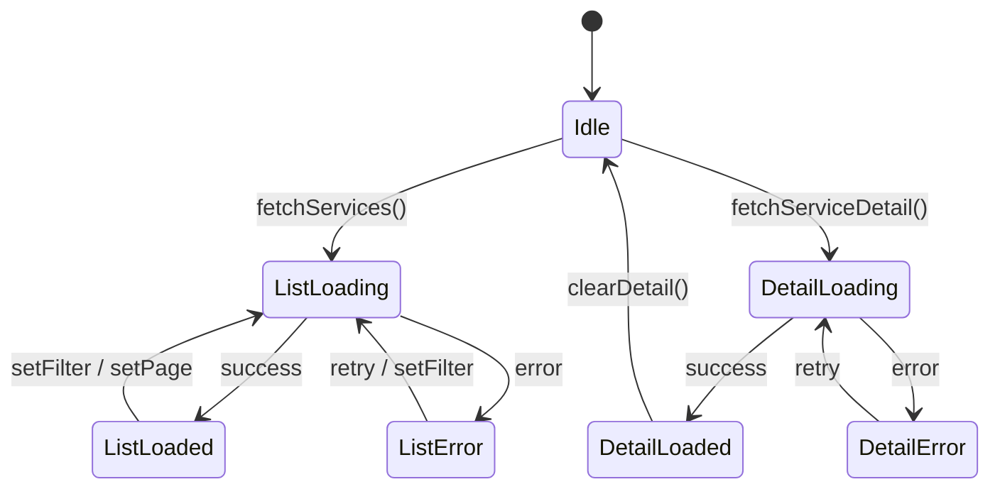

# Design Document: {{SPEC_NAME_TITLE}}

## Overview

Service Explorer 是 331-poc 前端的 Service 浏览和分析模块，遵循 Screen Explorer (22-00) 和 Entity Explorer (23-00) 的架构模式。模块包含类型定义、API 服务层、Pinia Store、Vue 组件、视图和路由集成六个层次。

核心设计决策：
- 完全复用 Entity Explorer 的分层架构（types → service → store → components → views → routes）
- 复用已有的 `apiV1Client` 进行 HTTP 通信
- Store 文件命名为 `serviceCatalog.ts`，避免与已有 `serviceInvoker.ts` 冲突
- 导航集成到现有 Navigation Store，新增 `'services'` NavId
- 分页使用 `total` 字段（非 Entity 的 `totalCount`），搜索参数使用 `q`（非 Entity 的 `keyword`）

## Architecture



数据流：
1. View 挂载时触发 Store action
2. Store action 调用 API Service
3. API Service 通过 apiV1Client 发送 HTTP 请求
4. 响应数据通过 Store 状态更新驱动 UI 渲染

## Components and Interfaces

### 1. Type Definitions (`frontend/src/renderer/types/service.ts`)

```typescript
// Service 摘要 — 对应后端 ServiceCatalogService.ServiceSummary.toMap()
export interface ServiceSummary {
  component: string         // 所属组件 (e.g. "framework", "mantle-usl")
  serviceName: string       // 完整服务名 (e.g. "org.moqui.impl.BasicServices.create#DataDocument")
  path: string              // 路径 (e.g. "org.moqui.impl.BasicServices")
  verb: string              // 动词 (e.g. "create", "update", "delete", "find", "store")
  noun: string | null       // 名词 (e.g. "DataDocument")
  authenticate: string      // 认证模式 (e.g. "true", "false", "anonymous-all")
  allowRemote: boolean      // 是否允许远程调用
  inParams?: string[]       // 入参列表 (仅 includeParams=true 时返回)
  outParams?: string[]      // 出参列表 (仅 includeParams=true 时返回)
}

// Service 列表查询参数
export interface ServiceListParams {
  component?: string
  q?: string                // 关键词搜索 (注意: 非 Entity 的 "keyword")
  pageIndex?: number
  pageSize?: number
  includeParams?: boolean
}

// Service 列表分页元数据
// 注意: 使用 "total" 字段（非 Entity 的 "totalCount"），无 "pageMaxIndex"
export interface ServicePaginationMeta {
  total: number
  pageIndex: number
  pageSize: number
}

// Service 列表响应
export interface ServiceListData {
  services: ServiceSummary[]
  pageIndex: number
  pageSize: number
  total: number             // 注意: 非 Entity 的 "totalCount"
  generatedAt: string
  component?: string        // 当前筛选的组件 (仅在指定 component 参数时返回)
}
```

### 2. API Service (`frontend/src/renderer/services/serviceCatalogApiService.ts`)

```typescript
class ServiceCatalogApiService {
  async listServices(params?: ServiceListParams): Promise<ApiV1Result<ServiceListData>>
  async getServiceDefinition(serviceName: string): Promise<ApiV1Result<ServiceSummary>>
}
```

端点映射：
- `listServices` → `GET /services?component=&q=&pageIndex=&pageSize=&includeParams=`
- `getServiceDefinition` → `GET /services/{serviceName}/definition?includeParams=true`

### 3. Pinia Store (`frontend/src/renderer/stores/serviceCatalog.ts`)

```typescript
interface ServiceCatalogState {
  // 列表状态
  services: ServiceSummary[]
  pagination: ServicePaginationMeta | null
  listLoading: boolean
  listError: string | null

  // 筛选状态
  currentComponent: string | null
  currentKeyword: string
  currentPageIndex: number
  currentPageSize: number

  // 详情状态
  currentService: ServiceSummary | null  // 含 inParams/outParams
  detailLoading: boolean
  detailError: string | null
}

// Getters
hasServices: boolean
hasDetail: boolean
totalPages: number
hasNextPage: boolean
hasPreviousPage: boolean

// Actions
fetchServices(): Promise<void>
fetchServiceDetail(serviceName: string): Promise<void>
setFilter(component?: string | null, keyword?: string): Promise<void>
setPage(pageIndex: number): Promise<void>
clearDetail(): void
```

### 4. Vue Components

| 组件 | 职责 | 父组件 |
|------|------|--------|
| `ServiceCatalogBrowser.vue` | 搜索/筛选/列表/分页 | ServiceListView |
| `ServiceDetailPanel.vue` | 基本信息（概览标签页） | ServiceDetailView |
| `ServiceInParamsPanel.vue` | 入参列表 | ServiceDetailView |
| `ServiceOutParamsPanel.vue` | 出参列表 | ServiceDetailView |

### 5. Views

| 视图 | 路由 | 职责 |
|------|------|------|
| `ServiceListView.vue` | `/services` | 挂载 ServiceCatalogBrowser，触发 fetchServices |
| `ServiceDetailView.vue` | `/services/:serviceName` | Tab 布局（概览/入参/出参），触发 fetchServiceDetail |

### 6. Navigation Integration

Navigation Store 变更：
- `NavId` 新增 `'services'`
- `NAV_ITEMS` 新增 Service 探索条目
- `PanelContext` 新增 `services: ServicesContext`
- `DEFAULT_CONTEXTS` 新增 services 默认值
- `componentMap` 新增 services 映射

Router 变更：
- 新增 `/services` → ServiceListView
- 新增 `/services/:serviceName` → ServiceDetailView

## Data Models

### 后端 → 前端数据映射

| 后端 Java 类型 | 前端 TypeScript 类型 | API 端点 |
|---------------|---------------------|---------|
| `ServiceSummary.toMap()` | `ServiceSummary` | `GET /services` |
| `listServices()` 响应 | `ServiceListData` | `GET /services` |
| `getServiceDefinition()` 响应 | `ServiceSummary` (含 params) | `GET /services/{name}/definition` |

### 与 Entity Explorer 的关键差异

| 维度 | Entity Explorer | Service Explorer |
|------|----------------|-----------------|
| 分页总数字段 | `totalCount` | `total` |
| 搜索参数名 | `keyword` | `q` |
| 最大页码字段 | `pageMaxIndex` | 无（需计算） |
| 详情端点 | 返回 EntityDefinitionData | 返回 ServiceSummary (含 params) |
| 关系数据 | 独立 relationships 端点 | 无（参数内嵌在 definition 中） |

### Store 状态转换




## Correctness Properties

*A property is a characteristic or behavior that should hold true across all valid executions of a system — essentially, a formal statement about what the system should do. Properties serve as the bridge between human-readable specifications and machine-verifiable correctness guarantees.*

### Property 1: API error propagation

*For any* error response returned by the backend API (4xx or 5xx), the ServiceCatalogApiService should propagate it as a typed `ApiV1Result` with `success: false` and a populated `error` field, without throwing unhandled exceptions.

**Validates: Requirements 1.4**

### Property 2: fetchServices passes current filter/pagination state

*For any* combination of store filter state (currentComponent, currentKeyword) and pagination state (currentPageIndex, currentPageSize), calling `fetchServices` should invoke the API service with parameters exactly matching those store values — component maps to `component`, keyword maps to `q`, and pagination maps to `pageIndex`/`pageSize`.

**Validates: Requirements 2.3**

### Property 3: setFilter always resets pageIndex to 0

*For any* current pageIndex value and any new filter values (component, keyword), calling `setFilter` should result in `currentPageIndex` being 0 before the subsequent fetch is triggered.

**Validates: Requirements 2.5**

### Property 4: Fetch action lifecycle state transitions

*For any* fetch action (fetchServices, fetchServiceDetail):
- At the start, the corresponding loading flag is true and the previous error is cleared
- On success, the corresponding data is updated and loading is set to false
- On failure, a user-friendly error message is set and loading is set to false

**Validates: Requirements 2.7, 2.8, 2.9, 7.2**

### Property 5: Service list item renders all required fields

*For any* valid ServiceSummary object, the rendered ServiceCatalogBrowser list item should contain the serviceName, component, verb, and authenticate/allowRemote indicator values.

**Validates: Requirements 4.5**

### Property 6: Service detail panel renders all basic info

*For any* valid ServiceSummary object (with params), the rendered ServiceDetailPanel should contain the serviceName, path, verb, noun, component, authenticate, and allowRemote values.

**Validates: Requirements 5.2**

### Property 7: Params panels render all items

*For any* list of inParams strings, the ServiceInParamsPanel should render each param string. *For any* list of outParams strings, the ServiceOutParamsPanel should render each param string.

**Validates: Requirements 5.4, 5.5**

## Error Handling

| 场景 | 处理方式 | 用户反馈 |
|------|---------|---------|
| API 返回 404 (service not found) | Store 设置 detailError | 显示 "Service 未找到" + 返回列表按钮 |
| API 返回 503 (catalog not initialized) | Store 设置对应 error | 显示错误信息 + 重试按钮 |
| 网络错误 (timeout, connection refused) | catch 块设置 user-friendly message | 显示 "网络错误，请重试" + 重试按钮 |
| API 返回 400 (invalid params) | Store 设置 listError | 显示错误信息 |
| 空列表 (no matching services) | 正常状态，services = [] | 显示空状态提示 + 建议调整筛选 |

错误处理原则：
- 列表错误和详情错误独立管理，互不影响
- 所有错误状态提供重试机制
- 导航离开详情页时清除详情错误状态

## Testing Strategy

### 测试框架

- **单元测试**: Vitest (已有配置)
- **属性测试**: fast-check (已有依赖)
- **组件测试**: @vue/test-utils + Vitest

### 单元测试

覆盖范围：
- API Service: 验证请求参数构造、错误处理
- Store: 验证状态转换、action 行为
- Components: 验证渲染输出、用户交互

### 属性测试

每个 Correctness Property 对应一个属性测试，使用 fast-check 生成随机输入：
- 最少 100 次迭代
- 每个测试标注对应的 Property 编号和 Requirements 引用
- 标签格式: **Feature: {{SPEC_NAME}}, Property {N}: {title}**

### 测试分工

| 测试类型 | 覆盖内容 | 工具 |
|---------|---------|------|
| 属性测试 | Property 1-7 (通用正确性) | fast-check + Vitest |
| 单元测试 | 具体示例、边界情况、错误条件 | Vitest |
| 组件测试 | UI 渲染、交互、状态绑定 | @vue/test-utils |
