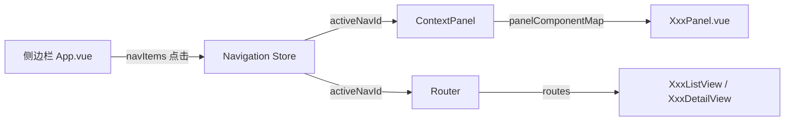

# 设计文档

## 概述

本设计描述如何将 4 个已实现的业务模块（Order、Facility、Invoice、Shipment）集成到前端导航系统中。这是一个纯配置性集成，不涉及新组件开发，仅需在 5 个现有文件中添加配置项，遵循已有的 Party/Product 导航模式。

## 架构

现有导航架构为三层联动：



集成方式：在每一层的配置数组/映射中追加 4 个模块的条目。

## 组件与接口

### 修改文件清单（5 个文件）

| 文件 | 修改内容 | 模式参考 |
|------|---------|---------|
| `icons.js` | 导入 4 个图标，注册到 icons 对象 | 已有 Package 图标模式 |
| `App.vue` | navItems 追加 4 项，route watcher 追加 4 个路径匹配 | 已有 party/product 模式 |
| `navigation.ts` | NavId 追加 4 值，PanelContext 追加 4 类型，DEFAULT_CONTEXTS 追加 4 项，componentMap 追加 4 映射 | 已有 party/product 模式 |
| `ContextPanel.vue` | defineAsyncComponent 追加 4 个面板，panelComponentMap 追加 4 映射 | 已有 PartyPanel/ProductPanel 模式 |
| `router/index.js` | 追加 8 条路由（每模块 list + detail） | 已有 party/product 路由模式 |

### 具体配置

#### icons.js 新增导入

```javascript
import { ShoppingCart, Warehouse, Receipt, Truck } from 'lucide-vue-next';
```

icons 对象新增：
```javascript
shoppingCart: ShoppingCart,
warehouse: Warehouse,
receipt: Receipt,
truck: Truck
```

#### App.vue navItems 新增

```javascript
{ id: 'order', route: '/order', label: '订单管理', icon: icons.shoppingCart, description: '管理销售订单' },
{ id: 'facility', route: '/facility', label: '设施管理', icon: icons.warehouse, description: '管理仓库设施' },
{ id: 'invoice', route: '/invoice', label: '发票管理', icon: icons.receipt, description: '管理财务发票' },
{ id: 'shipment', route: '/shipment', label: '发货管理', icon: icons.truck, description: '管理发货物流' }
```

route watcher 新增匹配：
```javascript
if (newPath.startsWith('/order')) { navigationStore.setActiveNav('order'); return; }
if (newPath.startsWith('/facility')) { navigationStore.setActiveNav('facility'); return; }
if (newPath.startsWith('/invoice')) { navigationStore.setActiveNav('invoice'); return; }
if (newPath.startsWith('/shipment')) { navigationStore.setActiveNav('shipment'); return; }
```

#### navigation.ts 类型扩展

```typescript
export type NavId = 'dashboard' | 'screens' | 'entities' | 'services' | 'settings' | 'admin' | 'party' | 'product' | 'order' | 'facility' | 'invoice' | 'shipment';
```

PanelContext 新增：
```typescript
order: Record<string, never>;
facility: Record<string, never>;
invoice: Record<string, never>;
shipment: Record<string, never>;
```

#### ContextPanel.vue 新增面板

```javascript
const OrderPanel = defineAsyncComponent(() => import('./OrderPanel.vue'));
const FacilityPanel = defineAsyncComponent(() => import('./FacilityPanel.vue'));
const InvoicePanel = defineAsyncComponent(() => import('./InvoicePanel.vue'));
const ShipmentPanel = defineAsyncComponent(() => import('./ShipmentPanel.vue'));
```

#### router/index.js 新增路由（8 条）

```javascript
{ path: '/order', name: 'order-list', component: () => import('../views/OrderListView.vue'), meta: { requiresAuth: true } },
{ path: '/order/:orderId', name: 'order-detail', component: () => import('../views/OrderDetailView.vue'), meta: { requiresAuth: true } },
{ path: '/facility', name: 'facility-list', component: () => import('../views/FacilityListView.vue'), meta: { requiresAuth: true } },
{ path: '/facility/:facilityId', name: 'facility-detail', component: () => import('../views/FacilityDetailView.vue'), meta: { requiresAuth: true } },
{ path: '/invoice', name: 'invoice-list', component: () => import('../views/InvoiceListView.vue'), meta: { requiresAuth: true } },
{ path: '/invoice/:invoiceId', name: 'invoice-detail', component: () => import('../views/InvoiceDetailView.vue'), meta: { requiresAuth: true } },
{ path: '/shipment', name: 'shipment-list', component: () => import('../views/ShipmentListView.vue'), meta: { requiresAuth: true } },
{ path: '/shipment/:shipmentId', name: 'shipment-detail', component: () => import('../views/ShipmentDetailView.vue'), meta: { requiresAuth: true } },
```

## 数据模型

无新增数据模型。所有模块的 types/stores/api 已在各自的 Spec（32-00 ~ 35-00）中实现。


## 正确性属性

*属性是系统在所有有效执行中应保持为真的特征或行为——本质上是关于系统应该做什么的形式化陈述。属性作为人类可读规范与机器可验证正确性保证之间的桥梁。*

基于 prework 分析，本集成任务的大部分验收标准属于具体配置值的例子检查（example），合并冗余后提炼出以下属性：

### Property 1：导航配置完整性

*For any* 新增模块 ID（order、facility、invoice、shipment），icons 导出对象、navItems 数组、panelComponentMap、DEFAULT_CONTEXTS 和 componentMap 均应包含该模块 ID 对应的条目。

**Validates: Requirements 1.2, 2.1, 3.3, 3.4, 4.2**

### Property 2：路由完整性与认证保护

*For any* 新增模块（order、facility、invoice、shipment），路由表应包含该模块的 list 路由和 detail 路由，且两条路由的 meta.requiresAuth 均为 true。

**Validates: Requirements 5.1, 5.2, 5.3, 5.4, 5.5**

### Property 3：路由路径与导航状态同步

*For any* 新增模块路径前缀（/order、/facility、/invoice、/shipment），当路由变化到该路径时，activeNavId 应被设置为对应的模块 ID。

**Validates: Requirements 6.1, 6.2, 6.3, 6.4**

## 错误处理

本 Spec 为纯配置集成，不涉及新的业务逻辑错误处理。潜在问题及应对：

| 问题 | 应对 |
|------|------|
| 图标导入名称拼写错误 | 前端编译时报错，npm run build 验证 |
| 路由路径冲突 | Vue Router 会在控制台警告，编译验证 |
| Panel 组件路径错误 | defineAsyncComponent 运行时报错，编译验证 |
| NavId 类型不匹配 | TypeScript 编译时报错 |
| BOM 编码问题（Codex agent 产物） | mvn clean package 验证后端编译 |

## 测试策略

### 单元测试

由于本 Spec 是纯配置集成（在 5 个文件中追加配置项），核心验证手段是编译通过：
- 后端：`mvn clean package` 验证 Java 编译
- 前端：`npm run build` 验证 Vue/TypeScript 编译

### 属性测试

本 Spec 的 3 个属性均可通过编译验证 + 配置检查实现，不需要传统的 property-based testing 库（如 fast-check），因为：
- 输入空间是固定的 4 个模块，不是随机生成的
- 验证的是静态配置的完整性，不是运行时行为

建议在前端编译验证通过后，通过人工检查或简单的配置完整性脚本验证 3 个属性。
