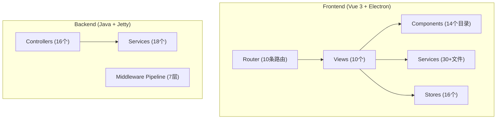
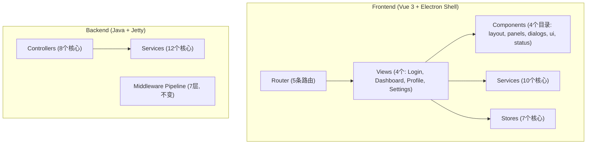
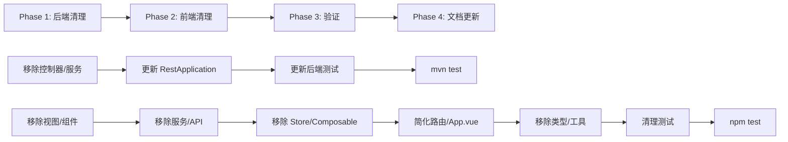

# Design Document: Novel-Anime Business Code Cleanup

## Overview

本设计描述从 331-poc 项目前后端完全移除小说转动漫（Novel-Anime）业务代码的方案。这是一个纯删除/简化操作，不引入新业务功能。清理后项目将成为一个干净的 Moqui ERP 现代化平台，前端为带认证基础设施的 Vue 3 + Electron 外壳，后端为带 JWT/RBAC 安全的 REST API 基础设施。

### 设计原则

1. **安全删除**: 先断开引用再删除文件，避免编译/运行时错误
2. **分层清理**: 按依赖关系从外到内清理（视图 → 组件 → 服务 → Store → 类型/工具）
3. **保留验证**: 每个清理阶段后验证保留代码的完整性
4. **最小改动**: 对保留文件只做必要的引用清理，不做功能增强

## Architecture

### 清理前架构



### 清理后架构



### 清理执行顺序



## Components and Interfaces

### 后端需移除的组件

| 组件类型 | 文件 | 依赖关系 |
|---------|------|---------|
| Controller | NovelController, CharacterController, SceneController, EpisodeController, ProjectController, CreditsController, WorkflowController, AssetController | 依赖对应 Service |
| Service | NovelService, CharacterService, SceneService, EpisodeService, ProjectService, CreditsService | 依赖 EntityCrudService, ServiceInvocationService |

### 后端需修改的组件

| 文件 | 修改内容 |
|------|---------|
| `RestApplication.java` | 移除 8 个 Controller 和 6 个 Service 的实例化和注册 |
| `EndpointRegressionPropertyTest.java` | 移除对已删除 Controller 的引用和对应端点路径 |

### 前端需移除的组件清单

| 类别 | 数量 | 文件/目录 |
|------|------|----------|
| 视图 | 7 + 6 子组件 | DashboardView, WorkflowEditor, CharactersView, CharacterDetailView, AssetsView, GeneratedContentView, PreviewView + dashboard/ 目录 |
| 组件目录 | 11 | novel/, character/, episode/, scene/, pipeline/, assets/, workflow/, progress/, welcome/, tutorial/, explorer/ |
| 业务服务 | 20 | AIService, AIVideoGenerator, AssetLibrary, AssetSearchEngine, AutoSaveManager, BackupManager, CharacterSystem, EpisodeGenerator, ExportService, FileSystemService, ImageGenerationService, KeyStorageService, NovelParser, PipelineOrchestrator, PlotAnalyzer, ProjectManager(.js+.ts), ScriptConverter, StoryboardCreator, workflowService |
| API 服务 | 6 | novelApi, episodeApi, sceneApi, characterApi, pipelineApi, creditsApi |
| README | 11 | 各服务 README 文件 |
| Store | 9 | project, file, novel, tab, task, session, command, credits, workflowStore |
| Composable | 4 | useCreditsCheck, useTutorial, useVirtualList, useLazyLoad |
| 类型 | 2 | project.ts, workflow.ts |
| 工具 | 5 | encryption.ts, memoryManager.ts, performance.ts, versionManager.js, SessionManager.ts |
| 测试 | 7 | AIService.test, BackupManager.test, domainMigration.test, errorHandler.spec, workflowService.spec, workflowStore.checkpoint.test, workflowStore.spec |

### 前端需修改的组件

| 文件 | 修改内容 |
|------|---------|
| `router/index.js` | 移除 6 条路由，保留 login/dashboard/settings/profile |
| `App.vue` | 移除小说动漫导航项、已删除 Store/Composable 引用、业务函数 |
| `services/index.ts` | 移除 novel-anime API 服务导出 |
| `composables/index.ts` | 移除 useCreditsCheck 导出 |
| `types/index.ts` | 移除 workflow 和 project 类型导出 |
| `stores/navigation.ts` | 简化为只有 dashboard + settings |

### 前端新增组件

| 文件 | 内容 |
|------|------|
| `views/DashboardView.vue` (替换) | 简化的占位仪表盘，显示欢迎信息和系统状态 |

## Data Models

本 Spec 不引入新的数据模型。清理操作涉及：

### 前端类型清理

- 移除 `types/project.ts`: 包含 Project、ProjectConfig 等小说动漫项目类型
- 移除 `types/workflow.ts`: 包含 Workflow、WorkflowStep 等工作流类型
- 保留 `types/api.ts`: 核心 API 响应类型
- 保留 `types/apiV1.ts`: V1 API 类型定义
- 简化 `types/index.ts`: 只导出 api 和 apiV1

### 前端 Navigation Store 类型简化

清理前:
```typescript
type NavId = 'dashboard' | 'workflow' | 'assets' | 'characters' | 'settings';
// 包含 WorkflowContext, AssetsContext, CharactersContext 等
```

清理后:
```typescript
type NavId = 'dashboard' | 'settings';
// 只保留 DashboardContext, SettingsContext
```

### 后端无数据模型变更

后端的 novel-anime 服务类（NovelService, CharacterService 等）都是通过 Moqui 的 EntityCrudService 和 ServiceInvocationService 间接操作实体的，不直接定义实体。Moqui 核心实体定义（mantle-udm, mantle-usl XML）不受影响。


## Correctness Properties

*A property is a characteristic or behavior that should hold true across all valid executions of a system — essentially, a formal statement about what the system should do. Properties serve as the bridge between human-readable specifications and machine-verifiable correctness guarantees.*

### Prework 分析总结

本 Spec 是代码清理/删除操作，所有验收标准都是具体的文件存在性/内容检查（example 类型），而非可生成随机输入的通用属性（property 类型）。关键验证点：

1. 已删除文件不存在
2. 保留文件仍然存在
3. 修改后的文件内容正确（无悬空引用）
4. 所有保留测试通过

经过 Property Reflection，识别出一个有意义的可测试属性：

### Property 1: 无悬空导入（No Dangling Imports）

*For any* TypeScript/JavaScript/Vue 源文件在保留文件集合中，该文件中的所有 import 语句引用的模块都必须存在于文件系统中（即不引用任何已删除的模块）。

**Validates: Requirements 3.4, 5.7, 6.4, 7.3, 9.1**

> 注：此属性的最佳验证方式是通过 TypeScript 编译器和构建工具（`npm test` / `mvn test`）。如果构建通过且所有测试通过，则此属性成立。因此本 Spec 不需要额外的 property-based test，而是依赖现有测试套件作为正确性保证。

## Error Handling

### 清理过程中的风险和缓解

| 风险 | 影响 | 缓解措施 |
|------|------|---------|
| 删除文件后存在悬空引用 | 编译失败 | 按依赖关系从外到内删除；每阶段运行测试 |
| 误删核心基础设施文件 | 功能丢失 | 严格按清单操作；保留文件清单明确 |
| 后端测试引用已删除端点 | 测试失败 | 已识别 EndpointRegressionPropertyTest 需更新 |
| Navigation Store 简化后类型不匹配 | TypeScript 编译错误 | 同步更新类型定义和所有引用 |
| App.vue 引用已删除组件/Store | 运行时错误 | 逐一清理导入和引用 |

### 回滚策略

本操作为纯删除操作，所有文件都在 Git 版本控制下。如果清理导致不可修复的问题，可通过 `git checkout` 回滚。

## Testing Strategy

### 测试方法

本 Spec 的测试策略与常规功能开发不同。由于这是代码清理操作，不引入新功能，因此：

1. **不需要新的 property-based tests**: 没有新的业务逻辑需要验证
2. **不需要新的 unit tests**: 没有新的函数/类需要测试
3. **依赖现有测试套件**: 清理后运行 `npm test` 和 `mvn test` 验证保留功能完整性

### 验证检查点

| 阶段 | 验证命令 | 预期结果 |
|------|---------|---------|
| 后端清理完成 | `mvn test` (backend/) | 所有保留测试通过（数量可能略减） |
| 前端清理完成 | `npm test` (frontend/) | 所有保留测试通过（数量会显著减少） |
| 全量验证 | 两个命令都运行 | 全部通过 |

### 测试计数预期变化

- **后端**: 256 tests → ~250+ tests（移除 EndpointRegressionPropertyTest 中的 novel-anime 端点路径）
- **前端**: 111 tests → ~50-60 tests（移除 AIService、BackupManager、domainMigration、errorHandler、workflowService、workflowStore 相关测试）

### 保留的核心测试文件

**后端** (全部保留):
- 所有 PBT 测试（jqwik）
- 所有 E2E 测试
- EndpointRegressionPropertyTest（更新后）

**前端** (保留):
- `services/__tests__/apiV1Client.test.ts`
- `services/__tests__/authServiceV1.test.ts`
- `services/__tests__/tokenManager.test.ts`
- `services/__tests__/apiDiscoveryService.test.ts`
- `services/__tests__/entityService.test.ts`
- `composables/useAppInit.spec.ts`
