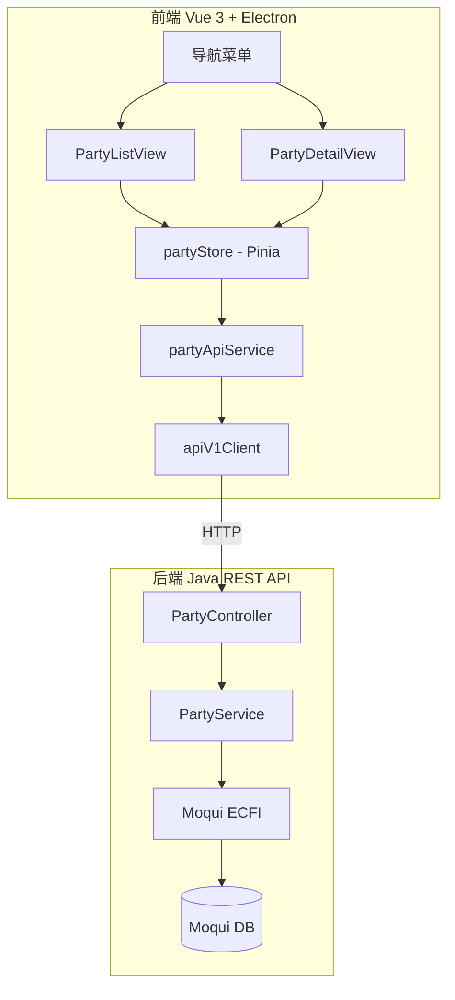

# 设计文档：Party（组织与联系人）管理模块

## 概述

Party 管理模块为 331-poc 项目提供对 Moqui mantle-udm 中 Party 相关实体的现代化 CRUD 管理能力。模块遵循项目已有的 Controller → Service → Moqui ECFI 后端架构和 Vue 3 + Pinia 前端架构，新增 PartyController、PartyService（后端）以及 Party 相关的 Vue 页面、Pinia Store 和 API Service（前端）。

核心设计决策：
- Party 列表查询需要跨 Party + Organization/Person 表联合查询，因此不使用 Generic CRUD API（entityService），而是通过专用的 Party REST API 实现
- 联系方式、角色、关系的管理也通过专用 API 实现，因为涉及多表操作和业务逻辑
- 前端新增 partyApiService 封装所有 Party 相关 API 调用，partyStore 管理状态

## 架构



### 后端架构

遵循已有的 AdminController/UserManagementService 模式：

1. **PartyController** — 注册 REST 路由，处理请求参数验证，委托给 PartyService，统一错误响应格式
2. **PartyService** — 通过 Moqui ExecutionContextFactory 获取 ExecutionContext，使用 Entity Facade 进行数据操作，管理 authz 禁用/恢复

### 前端架构

遵循已有的 userAdmin store + adminApiService 模式：

1. **partyApiService** — 封装 Party 专用 API 调用（列表、详情、创建、更新、联系方式、角色、关系）
2. **partyStore** — Pinia Store，管理 Party 列表/详情状态、分页、搜索、筛选、CRUD 操作
3. **PartyListView** — Party 列表页面，表格展示 + 搜索 + 筛选 + 分页 + 创建入口
4. **PartyDetailView** — Party 详情/编辑页面，Tab 切换展示基本信息、联系方式、角色、关系

## 组件与接口

### 后端 REST API

| 方法 | 路径 | 描述 | 需求 |
|------|------|------|------|
| GET | `/api/v1/party` | 分页查询 Party 列表（支持筛选和搜索） | 1.1-1.6 |
| GET | `/api/v1/party/{partyId}` | 获取 Party 详情（含联系方式、角色、关系） | 2.1-2.5 |
| POST | `/api/v1/party` | 创建 Party（Organization 或 Person） | 3.1-3.4 |
| PUT | `/api/v1/party/{partyId}` | 更新 Party 基本信息 | 4.1-4.4 |
| POST | `/api/v1/party/{partyId}/toggle-status` | 切换 Party 启用/禁用状态 | 4.3 |
| POST | `/api/v1/party/{partyId}/contact-mechs` | 添加联系方式 | 5.1-5.3 |
| PUT | `/api/v1/party/{partyId}/contact-mechs/{contactMechId}` | 更新联系方式 | 5.4 |
| DELETE | `/api/v1/party/{partyId}/contact-mechs/{contactMechId}` | 删除联系方式（软删除） | 5.5 |
| GET | `/api/v1/party/role-types` | 获取可用角色类型列表 | 6.3 |
| POST | `/api/v1/party/{partyId}/roles` | 分配角色 | 6.1 |
| DELETE | `/api/v1/party/{partyId}/roles/{roleTypeId}` | 移除角色 | 6.2 |
| GET | `/api/v1/party/relationship-types` | 获取可用关系类型列表 | 7.3 |
| POST | `/api/v1/party/{partyId}/relationships` | 建立关系 | 7.1 |
| DELETE | `/api/v1/party/relationships/{partyRelationshipId}` | 解除关系（软删除） | 7.2 |

### PartyController

```java
public class PartyController {
    private final PartyService partyService;

    public PartyController(PartyService partyService) {
        this.partyService = partyService;
    }

    public void register(Router router) {
        // Party CRUD
        router.get("/api/v1/party", this::listParties);
        router.get("/api/v1/party/role-types", this::listRoleTypes);
        router.get("/api/v1/party/relationship-types", this::listRelationshipTypes);
        router.get("/api/v1/party/{partyId}", this::getPartyDetail);
        router.post("/api/v1/party", this::createParty);
        router.put("/api/v1/party/{partyId}", this::updateParty);
        router.post("/api/v1/party/{partyId}/toggle-status", this::toggleStatus);
        // 联系方式
        router.post("/api/v1/party/{partyId}/contact-mechs", this::addContactMech);
        router.put("/api/v1/party/{partyId}/contact-mechs/{contactMechId}", this::updateContactMech);
        router.delete("/api/v1/party/{partyId}/contact-mechs/{contactMechId}", this::deleteContactMech);
        // 角色
        router.post("/api/v1/party/{partyId}/roles", this::addRole);
        router.delete("/api/v1/party/{partyId}/roles/{roleTypeId}", this::removeRole);
        // 关系
        router.post("/api/v1/party/{partyId}/relationships", this::addRelationship);
        router.delete("/api/v1/party/relationships/{partyRelationshipId}", this::removeRelationship);
    }
}
```

### PartyService

```java
public class PartyService {
    private final ExecutionContextFactory ecf;

    // Party 列表查询 — 联合 Party + Organization/Person
    public Map<String, Object> listParties(int pageIndex, int pageSize,
            String partyType, String disabled, String searchKeyword);

    // Party 详情 — 聚合基本信息 + 联系方式 + 角色 + 关系
    public Map<String, Object> getPartyDetail(String partyId);

    // 创建 Party — 创建 Party + Organization/Person 记录
    public Map<String, Object> createParty(String partyType, Map<String, Object> data);

    // 更新 Party — 更新 Organization/Person 记录
    public Map<String, Object> updateParty(String partyId, Map<String, Object> data);

    // 切换状态
    public Map<String, Object> toggleStatus(String partyId);

    // 联系方式管理
    public Map<String, Object> addContactMech(String partyId, Map<String, Object> data);
    public Map<String, Object> updateContactMech(String partyId, String contactMechId, Map<String, Object> data);
    public Map<String, Object> deleteContactMech(String partyId, String contactMechId);

    // 角色管理
    public Map<String, Object> addRole(String partyId, String roleTypeId);
    public Map<String, Object> removeRole(String partyId, String roleTypeId);
    public Map<String, Object> listRoleTypes();

    // 关系管理
    public Map<String, Object> addRelationship(String partyId, Map<String, Object> data);
    public Map<String, Object> removeRelationship(String partyRelationshipId);
    public Map<String, Object> listRelationshipTypes();
}
```

### 前端组件

#### partyApiService

```typescript
class PartyApiService {
  // Party CRUD
  listParties(params: PartyListParams): Promise<ApiV1Result<PartyListItem[]>>
  getPartyDetail(partyId: string): Promise<ApiV1Result<PartyDetail>>
  createParty(data: CreatePartyRequest): Promise<ApiV1Result<{ partyId: string }>>
  updateParty(partyId: string, data: UpdatePartyRequest): Promise<ApiV1Result<void>>
  toggleStatus(partyId: string): Promise<ApiV1Result<{ partyId: string; disabled: string }>>

  // 联系方式
  addContactMech(partyId: string, data: ContactMechRequest): Promise<ApiV1Result<void>>
  updateContactMech(partyId: string, contactMechId: string, data: ContactMechRequest): Promise<ApiV1Result<void>>
  deleteContactMech(partyId: string, contactMechId: string): Promise<ApiV1Result<void>>

  // 角色
  listRoleTypes(): Promise<ApiV1Result<RoleType[]>>
  addRole(partyId: string, roleTypeId: string): Promise<ApiV1Result<void>>
  removeRole(partyId: string, roleTypeId: string): Promise<ApiV1Result<void>>

  // 关系
  listRelationshipTypes(): Promise<ApiV1Result<RelationshipType[]>>
  addRelationship(partyId: string, data: RelationshipRequest): Promise<ApiV1Result<void>>
  removeRelationship(partyRelationshipId: string): Promise<ApiV1Result<void>>
}
```

#### partyStore (Pinia)

```typescript
// 状态
interface PartyState {
  parties: PartyListItem[]
  pagination: PaginationMeta | null
  loading: boolean
  error: string | null
  searchKeyword: string
  filterType: string       // '' | 'PtyOrganization' | 'PtyPerson'
  filterDisabled: string   // '' | 'Y' | 'N'
  currentPageIndex: number
  currentPageSize: number
  // 详情
  currentParty: PartyDetail | null
  detailLoading: boolean
  detailError: string | null
  // 引用数据
  roleTypes: RoleType[]
  relationshipTypes: RelationshipType[]
  // 变更操作
  mutating: boolean
  mutationError: string | null
}
```

## 数据模型

### 后端数据流

Party 列表查询需要联合多个 Moqui 实体：

```
Party (partyId, partyTypeEnumId, disabled, pseudoId)
  ├── Organization (partyId → organizationName)
  └── Person (partyId → firstName, lastName)
```

Party 详情聚合：

```
Party
  ├── Organization / Person（基本信息）
  ├── PartyContactMech → ContactMech
  │     ├── TelecomNumber（电话）
  │     ├── PostalAddress（地址）
  │     └── infoString（邮箱）
  ├── PartyRole → RoleType（角色）
  └── PartyRelationship（关系）
        ├── fromParty → Party + Organization/Person
        └── toParty → Party + Organization/Person
```

### 前端 TypeScript 类型

```typescript
// Party 列表项
interface PartyListItem {
  partyId: string
  pseudoId: string
  partyTypeEnumId: string   // 'PtyOrganization' | 'PtyPerson'
  disabled: string          // 'Y' | 'N'
  displayName: string       // organizationName 或 firstName + ' ' + lastName
  organizationName?: string
  firstName?: string
  lastName?: string
}

// Party 详情
interface PartyDetail extends PartyListItem {
  contactMechs: ContactMechItem[]
  roles: PartyRoleItem[]
  relationships: PartyRelationshipItem[]
  // Organization 特有
  officeSiteName?: string
  annualRevenue?: number
  numEmployees?: number
  // Person 特有
  salutation?: string
  middleName?: string
  nickname?: string
  gender?: string
  birthDate?: string
}

// 联系方式
interface ContactMechItem {
  contactMechId: string
  contactMechTypeEnumId: string  // 'CmtTelecomNumber' | 'CmtEmailAddress' | 'CmtPostalAddress'
  purposeId: string
  purposeDescription: string
  // 电话
  countryCode?: string
  areaCode?: string
  contactNumber?: string
  // 邮箱
  infoString?: string
  // 地址
  address1?: string
  address2?: string
  city?: string
  stateProvinceGeoId?: string
  postalCode?: string
  countryGeoId?: string
}

// 角色
interface PartyRoleItem {
  roleTypeId: string
  description: string
}

// 关系
interface PartyRelationshipItem {
  partyRelationshipId: string
  relationshipTypeEnumId: string
  relationshipTypeDescription: string
  fromPartyId: string
  fromPartyName: string
  fromRoleTypeId: string
  toPartyId: string
  toPartyName: string
  toRoleTypeId: string
  fromDate: string
  thruDate?: string
  statusId?: string
  comments?: string
}

// 角色类型
interface RoleType {
  roleTypeId: string
  description: string
  parentTypeId?: string
}

// 关系类型
interface RelationshipType {
  enumId: string
  description: string
}

// 请求类型
interface PartyListParams {
  pageIndex?: number
  pageSize?: number
  partyType?: string
  disabled?: string
  searchKeyword?: string
}

interface CreatePartyRequest {
  partyType: 'PtyOrganization' | 'PtyPerson'
  organizationName?: string
  firstName?: string
  lastName?: string
  [key: string]: unknown
}

interface UpdatePartyRequest {
  organizationName?: string
  firstName?: string
  lastName?: string
  [key: string]: unknown
}

interface ContactMechRequest {
  contactMechTypeEnumId: string
  purposeId: string
  // 电话
  countryCode?: string
  areaCode?: string
  contactNumber?: string
  // 邮箱
  infoString?: string
  // 地址
  address1?: string
  address2?: string
  city?: string
  stateProvinceGeoId?: string
  postalCode?: string
  countryGeoId?: string
}

interface RelationshipRequest {
  toPartyId: string
  relationshipTypeEnumId: string
  fromRoleTypeId?: string
  toRoleTypeId?: string
  comments?: string
}
```

### 纯函数（可测试）

以下纯函数从 Store 中导出，便于单元测试和属性测试：

```typescript
// 按关键词过滤 Party 列表（前端本地过滤，用于搜索防抖期间的即时反馈）
function filterPartiesByKeyword(parties: PartyListItem[], keyword: string): PartyListItem[]

// 验证创建 Party 表单 — 返回缺失的必填字段名列表
function validateCreatePartyForm(data: CreatePartyRequest): string[]

// 验证邮箱格式
function validateEmail(email: string): boolean

// 构建 Party 显示名称
function buildDisplayName(party: { partyTypeEnumId: string; organizationName?: string; firstName?: string; lastName?: string }): string
```


## 正确性属性

*属性（Property）是一种在系统所有有效执行中都应成立的特征或行为——本质上是关于系统应该做什么的形式化陈述。属性是人类可读规范与机器可验证正确性保证之间的桥梁。*

以下属性基于需求文档中的验收标准推导而来，经过冗余消除和合并优化。

### 后端属性

Property 1: 分页数学正确性
*For any* Party 数据集和有效的 pageIndex/pageSize 参数，返回的分页元信息应满足：totalPages = ceil(totalCount / pageSize)，返回数据条数 <= pageSize，且 pageIndex 在有效范围内。
**Validates: Requirements 1.2**

Property 2: 筛选条件正确性
*For any* Party 列表和任意类型筛选（partyTypeEnumId）或状态筛选（disabled）组合，返回的所有记录应匹配所有指定的筛选条件。
**Validates: Requirements 1.3, 1.4**

Property 3: 搜索关键词过滤正确性
*For any* Party 列表和任意搜索关键词，返回的所有记录的显示名称（organizationName 或 firstName/lastName）应包含该关键词（不区分大小写）。
**Validates: Requirements 1.5**

Property 4: 创建 Party 往返一致性
*For any* 有效的 Party 创建请求（Organization 含 organizationName，或 Person 含 firstName + lastName），创建后通过 partyId 查询详情应返回与创建请求一致的数据。
**Validates: Requirements 3.1, 3.2, 2.1**

Property 5: 更新 Party 往返一致性
*For any* 已存在的 Party 和有效的更新数据，更新后查询详情应反映更新后的字段值。
**Validates: Requirements 4.1, 4.2**

Property 6: 状态切换双重切换恢复
*For any* Party，连续两次切换启用/禁用状态后，disabled 字段应恢复到初始值。
**Validates: Requirements 4.3**

Property 7: 联系方式添加往返一致性
*For any* Party 和有效的联系方式数据（电话/邮箱/地址），添加后查询 Party 详情的联系方式列表应包含新添加的联系方式，且内容一致。
**Validates: Requirements 5.1, 5.2, 5.3, 2.2**

Property 8: 联系方式删除从活跃列表移除
*For any* Party 的已有联系方式，删除（软删除）后查询 Party 详情的联系方式列表不应包含该联系方式。
**Validates: Requirements 5.5**

Property 9: 角色分配/移除往返一致性
*For any* Party 和有效的 roleTypeId，分配角色后详情应包含该角色；移除后详情不应包含该角色。重复分配同一角色不应创建重复记录。
**Validates: Requirements 6.1, 6.2, 6.4, 2.3**

Property 10: 关系建立/解除往返一致性
*For any* 两个已存在的 Party 和有效的关系类型，建立关系后详情应包含该关系；解除后详情不应包含该关系。
**Validates: Requirements 7.1, 7.2, 2.4**

Property 11: 不存在的 partyId 返回 404
*For any* 不存在的 partyId，查询详情、更新、切换状态等操作应返回 404 错误。
**Validates: Requirements 2.5, 4.4, 7.4**

### 前端纯函数属性

Property 12: validateCreatePartyForm 验证正确性
*For any* CreatePartyRequest，当 partyType 为 PtyOrganization 且 organizationName 为空/空白时，返回的错误列表应包含 organizationName；当 partyType 为 PtyPerson 且 firstName 或 lastName 为空/空白时，返回的错误列表应包含对应字段名。
**Validates: Requirements 3.3, 3.4**

Property 13: filterPartiesByKeyword 过滤正确性
*For any* PartyListItem 数组和搜索关键词，返回的所有记录的 displayName 应包含该关键词（不区分大小写）；空白关键词应返回全部记录。
**Validates: Requirements 1.5, 8.3**

Property 14: buildDisplayName 构建正确性
*For any* Party 数据，当 partyTypeEnumId 为 PtyOrganization 时应返回 organizationName；当为 PtyPerson 时应返回 firstName + ' ' + lastName。
**Validates: Requirements 1.6**

Property 15: validateEmail 验证正确性
*For any* 字符串，包含 @ 且 @ 前后均非空的字符串应通过验证；不包含 @ 或 @ 前后为空的字符串应不通过验证。
**Validates: Requirements 5.6**

## 错误处理

### 后端错误处理

遵循已有的 AdminController 错误处理模式：

| 错误码 | HTTP 状态码 | 场景 |
|--------|------------|------|
| VALIDATION_ERROR | 400 | 缺少必填字段、格式无效 |
| RESOURCE_NOT_FOUND | 404 | partyId/contactMechId/roleTypeId 不存在 |
| DUPLICATE_ERROR | 409 | 重复分配角色 |
| INTERNAL_ERROR | 500 | Moqui ECFI 调用异常 |

PartyService 返回 `Map<String, Object>`，包含 `error`、`errorCode`、`errorMessage` 字段表示错误。PartyController 通过 `mapErrorCodeToStatus` 映射为 HTTP 状态码。

### 前端错误处理

- partyStore 维护 `error`（列表错误）和 `mutationError`（变更操作错误）
- API 失败时设置错误信息，UI 显示错误提示和重试按钮
- 网络异常统一捕获并显示"网络错误，请重试"

## 测试策略

### 双重测试方法

本模块采用单元测试 + 属性测试的双重测试策略：

- **单元测试**：验证具体示例、边界条件和错误场景
- **属性测试**：验证跨所有输入的通用属性

### 后端测试

- **框架**：JUnit 5 + Mockito（mock Moqui ECFI）
- **属性测试库**：jqwik（Java 属性测试框架）
- **单元测试**：PartyService 各方法的正常流程和错误流程
- **属性测试**：Property 1-11 的后端属性（通过 mock ECFI 验证业务逻辑）
- **每个属性测试最少 100 次迭代**

### 前端测试

- **框架**：Vitest
- **属性测试库**：fast-check
- **单元测试**：partyStore actions 的正常和错误流程
- **属性测试**：Property 12-15 的前端纯函数属性
- **每个属性测试最少 100 次迭代**
- **标签格式**：`Feature: {{SPEC_NAME}}, Property {number}: {property_text}`
