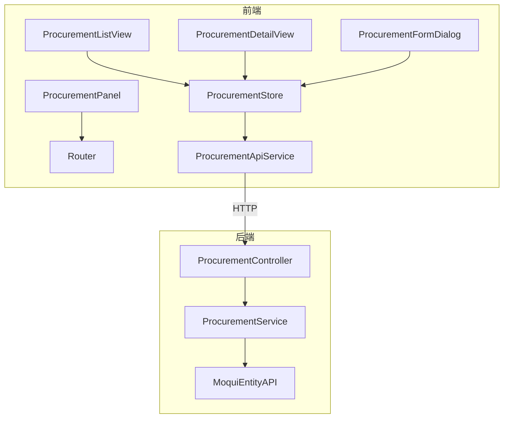

# 采购管理模块 — 设计文档

## 1. 架构概览

遵循项目现有模式：Service → Controller → Router 注册（后端），Types → ApiService → Store → Views（前端）。



## 2. 后端设计

### 2.1 ProcurementService.java

- 包路径: `org.moqui.rest.service.ProcurementService`
- 构造函数注入 `ExecutionContextFactory`
- 遵循 OrderService 模式

方法列表:

| 方法 | 说明 |
|------|------|
| `listPurchaseOrders(pageIndex, pageSize, supplierId, statusId)` | 分页查询采购订单列表 |
| `getPurchaseOrderDetail(orderId)` | 查询订单头 + 行项目列表 |
| `createPurchaseOrder(data)` | 创建采购订单，必填 supplierId |
| `updatePurchaseOrder(orderId, data)` | 更新采购订单头字段 |
| `updatePurchaseOrderStatus(orderId, statusId)` | 更新采购订单状态 |
| `addPurchaseOrderItem(orderId, data)` | 添加行项目，必填 productId + quantity |
| `updatePurchaseOrderItem(orderId, itemSeqId, data)` | 更新行项目 |
| `deletePurchaseOrderItem(orderId, itemSeqId)` | 删除行项目 |

### 2.2 ProcurementController.java

- 包路径: `org.moqui.rest.controller.ProcurementController`
- 路由注册:

```
GET    /api/v1/procurement                                          → listPurchaseOrders
GET    /api/v1/procurement/{orderId}                                → getPurchaseOrderDetail
POST   /api/v1/procurement                                          → createPurchaseOrder
PUT    /api/v1/procurement/{orderId}                                → updatePurchaseOrder
PUT    /api/v1/procurement/{orderId}/status                         → updatePurchaseOrderStatus
POST   /api/v1/procurement/{orderId}/item                           → addPurchaseOrderItem
PUT    /api/v1/procurement/{orderId}/item/{itemSeqId}               → updatePurchaseOrderItem
DELETE /api/v1/procurement/{orderId}/item/{itemSeqId}               → deletePurchaseOrderItem
```

### 2.3 RestApplication.java 注册

```java
ProcurementService procurementService = new ProcurementService(ecf);
new ProcurementController(procurementService).register(router);
```

## 3. 组件与接口

### 3.1 前端类型定义 — `types/procurement.ts`

```typescript
interface PurchaseOrderListItem {
  orderId: string
  supplierId: string
  supplierName?: string
  statusId: string
  orderDate?: string
  totalAmount?: number
}

interface PurchaseOrderDetail extends PurchaseOrderListItem {
  description?: string
  items: PurchaseOrderItemEntry[]
}

interface PurchaseOrderItemEntry {
  itemSeqId: string
  productId: string
  productName?: string
  quantity: number
  unitPrice?: number
  amount?: number
}

interface CreatePurchaseOrderRequest {
  supplierId: string
  description?: string
  orderDate?: string
}

interface UpdatePurchaseOrderRequest {
  description?: string
  orderDate?: string
}

interface PurchaseOrderItemRequest {
  productId: string
  quantity: number
  unitPrice?: number
}

interface ProcurementListParams {
  pageIndex?: number
  pageSize?: number
  supplierId?: string
  statusId?: string
}

interface ProcurementPaginationMeta {
  pageIndex: number
  pageSize: number
  totalCount: number
  totalPages: number
}
```

### 3.2 API 服务 — `services/procurementApiService.ts`

使用 `apiV1Client`，路径前缀: `/procurement`

```typescript
class ProcurementApiService {
  listPurchaseOrders(params?: ProcurementListParams)
  getPurchaseOrderDetail(orderId: string)
  createPurchaseOrder(data: CreatePurchaseOrderRequest)
  updatePurchaseOrder(orderId: string, data: UpdatePurchaseOrderRequest)
  updatePurchaseOrderStatus(orderId: string, statusId: string)
  addPurchaseOrderItem(orderId: string, data: PurchaseOrderItemRequest)
  updatePurchaseOrderItem(orderId: string, itemSeqId: string, data: PurchaseOrderItemRequest)
  deletePurchaseOrderItem(orderId: string, itemSeqId: string)
}
```

### 3.3 Pinia Store — `stores/procurement.ts`

状态:
- `purchaseOrders: PurchaseOrderListItem[]`
- `pagination: ProcurementPaginationMeta | null`
- `loading / error`
- `currentOrder: PurchaseOrderDetail | null`
- `detailLoading / detailError`
- `mutating / mutationError`
- `filterSupplierId / filterStatusId / currentPageIndex / currentPageSize`

导出纯函数:
- `filterOrdersBySupplier(orders, supplierId)` — 按供应商过滤
- `validateCreatePurchaseOrderForm(data)` — 验证创建表单必填字段

### 3.4 视图组件

| 组件 | 说明 |
|------|------|
| `ProcurementListView.vue` | 列表页，含搜索/过滤/分页/创建按钮 |
| `ProcurementDetailView.vue` | 详情页，含订单头信息 + 行项目表格 + 状态流转按钮 |
| `ProcurementFormDialog.vue` | 创建/编辑对话框 |
| `ProcurementPanel.vue` | 侧边面板 |

## 4. 数据模型

### 4.1 Moqui 实体映射

| 概念 | 实体名 | 主键 | 关键字段 |
|------|--------|------|----------|
| 采购订单头 | `mantle.order.OrderHeader` | orderId | vendorPartyId(supplierId), statusId, placedDate, grandTotal |
| 采购订单项 | `mantle.order.OrderItem` | orderId + orderItemSeqId | productId, quantity, unitAmount |

> 注：采购订单使用 OrderHeader 的 orderTypeEnumId=PurchaseOrder 来区分。

### 4.2 采购订单状态

```
OrderCreated → OrderApproved → OrderSent → OrderPartiallyReceived → OrderCompleted
OrderCreated → OrderCancelled
OrderApproved → OrderCancelled
```

## 5. 正确性属性

### Property 1: 分页数学正确性
*For any* 采购订单列表和任意合法的 pageIndex/pageSize 参数，返回的 totalPages 应等于 `ceil(totalCount / pageSize)`。
**Validates: Requirements 1.1**

### Property 2: 过滤返回匹配记录
*For any* 采购订单列表和任意 supplierId 或 statusId 过滤参数，返回的所有记录的对应字段应与过滤参数一致。
**Validates: Requirements 1.2, 1.3**

### Property 3: 创建-查询往返一致性
*For any* 合法的 CreatePurchaseOrderRequest，创建后通过详情查询应返回与创建请求一致的字段值。
**Validates: Requirements 3.3**

### Property 4: 创建验证拒绝缺失必填字段
*For any* 缺少 supplierId 的创建请求，应返回 400 错误码。
**Validates: Requirements 3.1, 3.2**

### Property 5: 部分更新保留未变更字段
*For any* 已存在的采购订单和任意部分更新请求，更新后查询应显示：请求中包含的字段已更新，未包含的字段保持原值。
**Validates: Requirements 4.1**

### Property 6: 行项目添加-查询往返一致性
*For any* 已存在的采购订单和合法的 PurchaseOrderItemRequest，添加后通过详情查询应在 items 列表中包含该项。
**Validates: Requirements 5.2**

### Property 7: 删除行项目后不再出现
*For any* 已存在的行项目，删除后通过详情查询应不再包含该项。
**Validates: Requirements 5.4**

### Property 8: 前端过滤函数正确性
*For any* 采购订单列表和任意 supplierId，`filterOrdersBySupplier` 函数返回的所有记录的 supplierId 应与过滤参数一致。
**Validates: Requirements 7.2**

## 6. 错误处理

| 错误码 | HTTP 状态码 | 场景 |
|--------|------------|------|
| VALIDATION_ERROR | 400 | 必填字段缺失 |
| RESOURCE_NOT_FOUND | 404 | 订单/行项目不存在 |
| INVALID_STATUS_TRANSITION | 400 | 非法状态流转 |
| INTERNAL_ERROR | 500 | 服务器内部异常 |

## 7. 测试策略

### 7.1 后端测试
- **框架**: JUnit 5 + jqwik
- **属性测试**: 验证 Property 1-7

### 7.2 前端测试
- **框架**: Vitest + fast-check
- **属性测试**: 验证 Property 8
