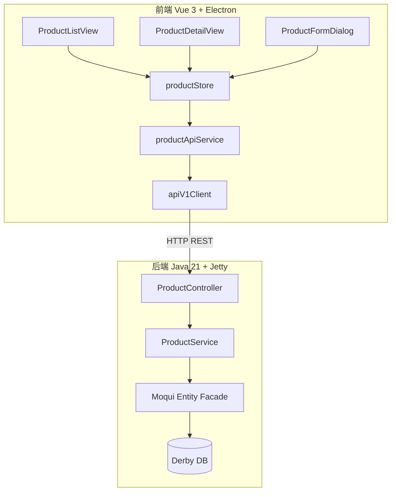
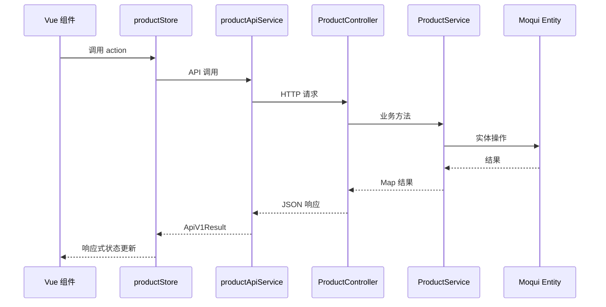

# 设计文档：产品管理模块（{{SPEC_NAME_TITLE}}）

## 概述

产品管理模块是 Moqui ERP 渐进式现代化项目的核心基础数据模块，遵循已有的 Party 管理模块架构模式。模块采用前后端分离架构：后端提供 RESTful API（Java 21 + Embedded Jetty），前端提供 Vue 3 + Pinia 桌面应用界面。

本模块管理产品全生命周期数据，包括基本信息、价格、分类和标识码，为后续订单、库存、发货模块提供数据基础。

## 架构

### 整体架构

沿用 Party 模块的分层架构：



### 请求流程



## 组件与接口

### 后端组件

#### ProductController

REST 控制器，注册路由并处理 HTTP 请求。遵循 PartyController 模式。

```java
public class ProductController {
    private final ProductService productService;
    
    public void register(Router router) {
        // 产品 CRUD
        router.get("/api/v1/product", this::listProducts);
        router.get("/api/v1/product/categories", this::listCategories);
        router.get("/api/v1/product/{productId}", this::getProductDetail);
        router.post("/api/v1/product", this::createProduct);
        router.put("/api/v1/product/{productId}", this::updateProduct);
        router.post("/api/v1/product/{productId}/toggle-status", this::toggleStatus);
        // 价格管理
        router.post("/api/v1/product/{productId}/prices", this::addPrice);
        router.put("/api/v1/product/{productId}/prices/{productPriceId}", this::updatePrice);
        router.delete("/api/v1/product/{productId}/prices/{productPriceId}", this::deletePrice);
        // 分类管理
        router.post("/api/v1/product/{productId}/categories", this::addCategory);
        router.delete("/api/v1/product/{productId}/categories/{productCategoryId}", this::removeCategory);
        // 标识码管理
        router.post("/api/v1/product/{productId}/identifications", this::addIdentification);
        router.put("/api/v1/product/{productId}/identifications/{productIdTypeEnumId}", this::updateIdentification);
        router.delete("/api/v1/product/{productId}/identifications/{productIdTypeEnumId}", this::deleteIdentification);
    }
}
```

#### ProductService

业务逻辑层，通过 Moqui ExecutionContextFactory 操作实体数据。遵循 PartyService 模式。

核心方法签名：

```java
public class ProductService {
    // 列表查询（分页、搜索、筛选）
    Map<String, Object> listProducts(int pageIndex, int pageSize, 
                                      String productType, String statusId, String searchKeyword);
    // 详情查询（含价格、分类、标识码）
    Map<String, Object> getProductDetail(String productId);
    // CRUD
    Map<String, Object> createProduct(Map<String, Object> data);
    Map<String, Object> updateProduct(String productId, Map<String, Object> data);
    Map<String, Object> toggleStatus(String productId);
    // 价格管理
    Map<String, Object> addPrice(String productId, Map<String, Object> data);
    Map<String, Object> updatePrice(String productId, String productPriceId, Map<String, Object> data);
    Map<String, Object> deletePrice(String productId, String productPriceId);
    // 分类管理
    Map<String, Object> listCategories();
    Map<String, Object> addCategory(String productId, String productCategoryId);
    Map<String, Object> removeCategory(String productId, String productCategoryId);
    // 标识码管理
    Map<String, Object> addIdentification(String productId, Map<String, Object> data);
    Map<String, Object> updateIdentification(String productId, String productIdTypeEnumId, Map<String, Object> data);
    Map<String, Object> deleteIdentification(String productId, String productIdTypeEnumId);
}
```

### 前端组件

#### productApiService.ts

API 服务层，封装 HTTP 调用。遵循 partyApiService 模式。

```typescript
class ProductApiService {
    listProducts(params?: ProductListParams): Promise<ApiV1Result<ProductListResponse>>
    getProductDetail(productId: string): Promise<ApiV1Result<ProductDetail>>
    createProduct(data: CreateProductRequest): Promise<ApiV1Result<{ productId: string }>>
    updateProduct(productId: string, data: UpdateProductRequest): Promise<ApiV1Result<void>>
    toggleStatus(productId: string): Promise<ApiV1Result<{ productId: string; statusId: string }>>
    // 价格
    addPrice(productId: string, data: PriceRequest): Promise<ApiV1Result<{ productPriceId: string }>>
    updatePrice(productId: string, productPriceId: string, data: PriceRequest): Promise<ApiV1Result<void>>
    deletePrice(productId: string, productPriceId: string): Promise<ApiV1Result<void>>
    // 分类
    listCategories(): Promise<ApiV1Result<{ data: ProductCategory[] }>>
    addCategory(productId: string, productCategoryId: string): Promise<ApiV1Result<void>>
    removeCategory(productId: string, productCategoryId: string): Promise<ApiV1Result<void>>
    // 标识码
    addIdentification(productId: string, data: IdentificationRequest): Promise<ApiV1Result<void>>
    updateIdentification(productId: string, typeEnumId: string, data: IdentificationRequest): Promise<ApiV1Result<void>>
    deleteIdentification(productId: string, typeEnumId: string): Promise<ApiV1Result<void>>
}
```

#### productStore (Pinia)

状态管理，遵循 partyStore 模式。导出纯函数以支持属性测试。

```typescript
// 导出纯函数（属性测试用）
export function filterProductsByKeyword(products: ProductListItem[], keyword: string): ProductListItem[]
export function validateCreateProductForm(data: CreateProductRequest): string[]

// Store state
interface ProductState {
    products: ProductListItem[]
    pagination: PaginationMeta | null
    loading: boolean
    error: string | null
    searchKeyword: string
    filterType: string
    filterStatus: string
    currentPageIndex: number
    currentPageSize: number
    currentProduct: ProductDetail | null
    detailLoading: boolean
    detailError: string | null
    categories: ProductCategory[]
    mutating: boolean
    mutationError: string | null
}
```

#### Vue 页面组件

| 组件 | 路由 | 功能 |
|------|------|------|
| ProductListView | /product | 产品列表（表格、搜索、筛选、分页） |
| ProductDetailView | /product/:productId | 产品详情（Tab：基本信息/价格/分类/标识码） |
| ProductFormDialog | — | 创建产品对话框 |
| ProductPanel | — | 二级导航面板 |

## 数据模型

### 后端实体映射（Moqui Entity）

| 实体 | 用途 | 关键字段 |
|------|------|---------|
| mantle.product.Product | 产品主表 | productId, pseudoId, productName, productTypeEnumId, statusId, description, amountUomId |
| mantle.product.category.ProductCategory | 产品分类 | productCategoryId, categoryName, parentCategoryId, productCategoryTypeEnumId |
| mantle.product.category.ProductCategoryMember | 产品-分类关联 | productCategoryId, productId, fromDate, thruDate |
| mantle.product.ProductPrice | 产品价格 | productPriceId, productId, priceTypeEnumId, price, priceUomId, fromDate, thruDate |
| mantle.product.ProductIdentification | 产品标识码 | productId, productIdTypeEnumId, idValue |

### 前端 TypeScript 类型

```typescript
// 产品列表项
interface ProductListItem {
    productId: string
    pseudoId: string
    productName: string
    productTypeEnumId: string  // PtAsset | PtDigital | PtService | ...
    statusId: string           // ProdActive | ProdInactive
    amountUomId?: string
}

// 产品详情
interface ProductDetail extends ProductListItem {
    description?: string
    comments?: string
    salesIntroductionDate?: string
    salesDiscontinuationDate?: string
    ownerPartyId?: string
    prices: ProductPriceItem[]
    categories: ProductCategoryMemberItem[]
    identifications: ProductIdentificationItem[]
}

// 价格
interface ProductPriceItem {
    productPriceId: string
    priceTypeEnumId: string
    pricePurposeEnumId?: string
    price: number
    priceUomId: string
    fromDate: string
    thruDate?: string
    minQuantity?: number
}

// 分类关联
interface ProductCategoryMemberItem {
    productCategoryId: string
    categoryName: string
    fromDate: string
    thruDate?: string
}

// 标识码
interface ProductIdentificationItem {
    productIdTypeEnumId: string
    idValue: string
}

// 分类（用于选择器）
interface ProductCategory {
    productCategoryId: string
    categoryName: string
    parentCategoryId?: string
    productCategoryTypeEnumId?: string
}

// 请求类型
interface ProductListParams {
    pageIndex?: number
    pageSize?: number
    productType?: string
    statusId?: string
    searchKeyword?: string
}

interface CreateProductRequest {
    productName: string
    productTypeEnumId: string
    description?: string
    amountUomId?: string
}

interface UpdateProductRequest {
    productName?: string
    description?: string
    comments?: string
    salesIntroductionDate?: string
    salesDiscontinuationDate?: string
    amountUomId?: string
}

interface PriceRequest {
    priceTypeEnumId: string
    price: number
    priceUomId: string
    pricePurposeEnumId?: string
    fromDate?: string
    minQuantity?: number
}

interface IdentificationRequest {
    productIdTypeEnumId: string
    idValue: string
}
```

### 产品类型枚举

| 枚举值 | 说明 |
|--------|------|
| PtAsset | 实物商品 |
| PtDigital | 数字商品 |
| PtService | 服务 |

### 产品状态

| 状态 | 说明 |
|------|------|
| ProdActive | 活跃（可用） |
| ProdInactive | 停用 |


## 正确性属性

*属性（Property）是在系统所有有效执行中都应成立的特征或行为——本质上是关于系统应该做什么的形式化陈述。属性是人类可读规格与机器可验证正确性保证之间的桥梁。*

### Property 1: 筛选结果正确性

*For any* 产品列表和任意搜索关键词、产品类型筛选、状态筛选的组合，返回的所有产品应满足：(a) 产品名称包含搜索关键词（不区分大小写），(b) productTypeEnumId 匹配类型筛选条件，(c) statusId 匹配状态筛选条件。

**Validates: Requirements 1.2, 1.3, 1.4**

### Property 2: 分页元数据正确性

*For any* 产品列表和分页参数（pageIndex, pageSize），返回的 totalPages 应等于 ceil(totalCount / pageSize)，且当前页数据量应不超过 pageSize。

**Validates: Requirements 1.5**

### Property 3: 详情只返回有效关联记录

*For any* 产品详情查询结果，价格列表中所有记录的 thruDate 应为空或晚于当前时间，分类列表中所有记录的 thruDate 应为空或晚于当前时间。

**Validates: Requirements 2.3, 2.4**

### Property 4: 创建产品后不变量

*For any* 有效的创建请求（包含非空 productName 和有效 productTypeEnumId），创建后返回的 productId 应非空，且查询该产品的 statusId 应为 ProdActive。

**Validates: Requirements 3.1, 3.4**

### Property 5: 更新产品 round-trip

*For any* 已存在的产品和任意有效的更新数据，更新后查询该产品详情，更新的字段值应与提交的更新数据一致。

**Validates: Requirements 4.1**

### Property 6: 状态双次 toggle round-trip

*For any* 产品，连续执行两次 toggle-status 操作后，产品的 statusId 应恢复为初始值。

**Validates: Requirements 5.1, 5.2**

### Property 7: 价格管理 round-trip

*For any* 产品和有效价格数据，添加价格后查询详情应包含该价格；更新价格后查询详情应反映新值；删除价格后查询详情不应包含该价格。

**Validates: Requirements 6.1, 6.2, 6.3**

### Property 8: 分类管理 round-trip

*For any* 产品和有效分类，分配后查询详情应包含该分类；移除后查询详情不应包含该分类。

**Validates: Requirements 7.1, 7.2**

### Property 9: 标识码管理 round-trip

*For any* 产品和有效标识码数据，添加后查询详情应包含该标识码；更新 idValue 后查询详情应反映新值；删除后查询详情不应包含该标识码。

**Validates: Requirements 8.1, 8.2, 8.3**

### Property 10: 重复标识码类型拒绝

*For any* 产品，如果已存在某 productIdTypeEnumId 的标识码，再次添加相同类型的标识码应返回 DUPLICATE_ERROR 错误。

**Validates: Requirements 8.5**

### Property 11: 前端表单验证——缺少产品名称

*For any* CreateProductRequest 对象，如果 productName 为空或仅包含空白字符，validateCreateProductForm 函数应返回包含 'productName' 的错误列表。

**Validates: Requirements 11.3**

### Property 12: 搜索/筛选重置分页

*For any* productStore 状态，当执行搜索或筛选操作时，currentPageIndex 应被重置为 0。

**Validates: Requirements 13.3**

## 错误处理

### 后端错误处理

遵循 PartyController/PartyService 的错误处理模式：

| 错误码 | HTTP 状态码 | 场景 |
|--------|------------|------|
| VALIDATION_ERROR | 400 | 缺少必填字段、无效参数 |
| RESOURCE_NOT_FOUND | 404 | productId/productCategoryId 不存在 |
| DUPLICATE_ERROR | 409 | 重复的标识码类型 |
| INTERNAL_ERROR | 500 | 数据库异常、未预期错误 |

错误响应格式（由 RequestContext 统一处理）：
```json
{
    "success": false,
    "error": {
        "code": "VALIDATION_ERROR",
        "message": "productName is required"
    }
}
```

### 前端错误处理

- productStore 维护 `error`、`detailError`、`mutationError` 三个错误状态
- 列表加载失败显示错误提示和重试按钮
- 详情加载失败显示错误信息和重试按钮
- 变更操作失败显示 mutation 错误提示和关闭按钮
- 网络异常统一捕获并显示"网络错误，请重试"

## 测试策略

### 双重测试方法

本模块采用单元测试 + 属性测试的双重策略：

- **单元测试**: 验证具体示例、边界情况和错误条件
- **属性测试**: 验证跨所有输入的通用属性

### 后端测试（JUnit 5）

- ProductService 单元测试：覆盖所有 CRUD 操作、验证逻辑、错误处理
- ProductController 集成测试：验证路由注册和请求处理
- 属性测试使用 jqwik 库（如果可用）或 JUnit 参数化测试模拟

### 前端测试（Vitest）

- 纯函数属性测试使用 fast-check 库
  - filterProductsByKeyword 过滤正确性
  - validateCreateProductForm 验证逻辑
- productStore 单元测试：验证状态管理逻辑
- 组件测试：验证关键交互行为

### 属性测试配置

- 每个属性测试最少运行 100 次迭代
- 每个测试用注释标注对应的设计属性
- 标注格式：**Feature: {{SPEC_NAME}}, Property {number}: {property_text}**
- 每个正确性属性由一个独立的属性测试实现

### 测试覆盖重点

| 层级 | 测试类型 | 覆盖范围 |
|------|---------|---------|
| ProductService | 单元测试 + 属性测试 | CRUD、验证、状态管理、关联数据管理 |
| ProductController | 单元测试 | 路由注册、参数验证、错误映射 |
| productStore 纯函数 | 属性测试 | filterProductsByKeyword、validateCreateProductForm |
| productStore actions | 单元测试 | 异步操作、状态更新、错误处理 |
| Vue 组件 | 单元测试 | 关键交互、渲染验证 |
