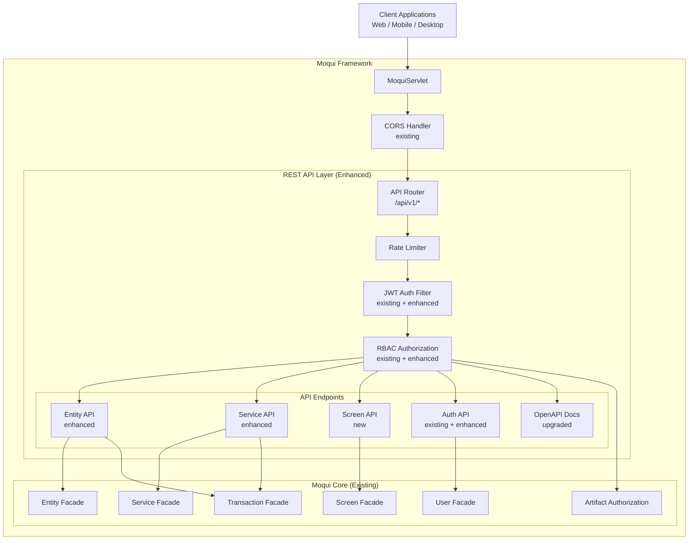
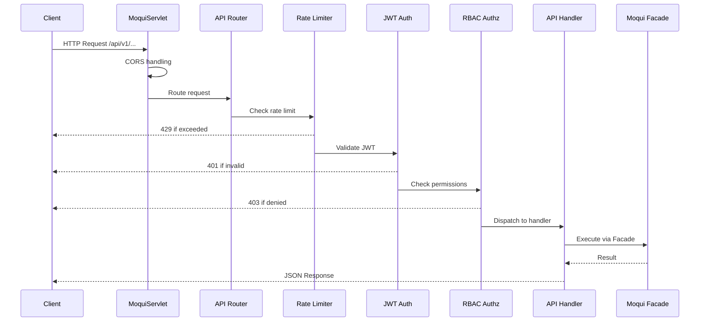
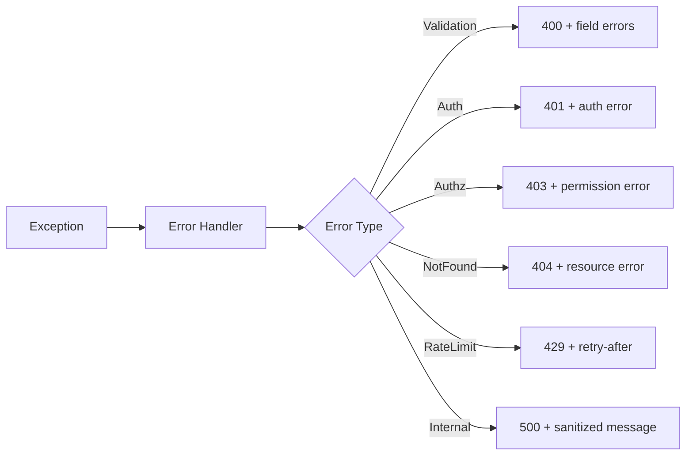

# Design Document: REST API Layer

## Overview

This design extends Moqui's existing REST API infrastructure to provide a modern, comprehensive API layer for frontend/backend separation. Rather than building from scratch, we leverage the existing `RestApi.groovy`, `RestSchemaUtil.groovy`, JWT authentication system (`org.moqui.jwt.*`), and the `rest-api-3.xsd` schema-driven approach.

The key architectural decision is to **enhance the existing Moqui REST API mechanism** rather than replace it. Moqui already supports:
- Schema-driven REST API definitions via `*.rest.xml` files
- Entity CRUD operations (one, list, count, create, update, store, delete)
- Service invocation via REST
- Swagger/RAML documentation generation
- JWT authentication via `com.auth0:java-jwt`
- CORS handling in `MoquiServlet`
- Pagination headers (X-Total-Count, X-Page-Index, etc.)

What's missing and needs to be built:
1. **Enhanced Entity API** — field selection, advanced filtering, batch operations
2. **Async Service Execution** — job tracking for long-running services
3. **Screen Definition API** — XML-to-JSON screen conversion
4. **OpenAPI 3.0 upgrade** — current implementation generates Swagger 2.0
5. **Standardized error responses** — consistent JSON error format
6. **Rate limiting middleware** — request throttling per user/IP
7. **Security hardening** — input sanitization, account lockout, security headers
8. **API versioning** — URL-based versioning (/api/v1/)

## Architecture

### High-Level Architecture



### Request Flow



### Integration Strategy

The REST API layer integrates into Moqui's existing request pipeline:

1. **Routing**: Requests to `/api/v1/` are handled by the existing `WebFacadeImpl.handleRestCall()` mechanism, which delegates to `RestApi.run()`. We extend this by adding a new REST API root resource defined in a `rest.xml` file within a dedicated component.

2. **Authentication**: The existing JWT system (`JwtUtil`, `JwtFilter`, `UnifiedAuthService`) already handles Bearer token validation. We enhance it with token refresh endpoints and account lockout.

3. **Authorization**: Moqui's `ArtifactAuthz` system already enforces permissions on entity and service access. We add field-level permission checks for the Entity API.

## Components and Interfaces

### 1. API Router Component

**Location**: `backend/runtime/component/rest-api/service/api.rest.xml`

The API router is defined as a Moqui REST API resource file following `rest-api-3.xsd`. This leverages the existing `RestApi.groovy` infrastructure for routing and Swagger generation.

```xml
<resource name="api" displayName="Modern REST API" version="1.0"
          require-authentication="true">
    <resource name="v1">
        <!-- Entity CRUD -->
        <resource name="entities">
            <resource name="entityName">
                <method type="get"><service name="api.EntityApiServices.list#Entity"/></method>
                <method type="post"><service name="api.EntityApiServices.create#Entity"/></method>
                <id name="entityId">
                    <method type="get"><service name="api.EntityApiServices.get#Entity"/></method>
                    <method type="put"><service name="api.EntityApiServices.update#Entity"/></method>
                    <method type="delete"><service name="api.EntityApiServices.delete#Entity"/></method>
                </id>
            </resource>
        </resource>
        
        <!-- Service Invocation -->
        <resource name="services">
            <resource name="serviceName">
                <method type="post"><service name="api.ServiceApiServices.invoke#Service"/></method>
            </resource>
            <resource name="jobs">
                <id name="jobId">
                    <method type="get"><service name="api.ServiceApiServices.get#JobStatus"/></method>
                </id>
            </resource>
        </resource>
        
        <!-- Screen Definitions -->
        <resource name="screens">
            <resource name="screenPath" allow-extra-path="true">
                <method type="get"><service name="api.ScreenApiServices.get#ScreenDefinition"/></method>
            </resource>
        </resource>
        
        <!-- Auth -->
        <resource name="auth" require-authentication="false">
            <resource name="login">
                <method type="post"><service name="api.AuthApiServices.login#User"/></method>
            </resource>
            <resource name="refresh">
                <method type="post"><service name="api.AuthApiServices.refresh#Token"/></method>
            </resource>
            <resource name="logout">
                <method type="post"><service name="api.AuthApiServices.logout#User"/></method>
            </resource>
        </resource>
        
        <!-- OpenAPI Docs -->
        <resource name="docs" require-authentication="false">
            <method type="get"><service name="api.DocsApiServices.get#OpenApiSpec"/></method>
        </resource>
    </resource>
</resource>
```

### 2. Standardized Response Format

**Success Response**:
```json
{
    "success": true,
    "data": { ... },
    "meta": {
        "totalCount": 100,
        "pageIndex": 0,
        "pageSize": 20,
        "pageMaxIndex": 4
    }
}
```

**Error Response**:
```json
{
    "success": false,
    "error": {
        "code": "VALIDATION_ERROR",
        "message": "Validation failed",
        "details": [
            { "field": "email", "message": "Invalid email format" },
            { "field": "name", "message": "Name is required" }
        ]
    }
}
```

**Error Codes**:
| HTTP Status | Error Code | Description |
|---|---|---|
| 400 | VALIDATION_ERROR | Request validation failed |
| 400 | INVALID_REQUEST | Malformed request |
| 401 | AUTHENTICATION_REQUIRED | No valid JWT token |
| 401 | TOKEN_EXPIRED | JWT token expired |
| 403 | ACCESS_DENIED | Insufficient permissions |
| 404 | RESOURCE_NOT_FOUND | Entity/service not found |
| 413 | PAYLOAD_TOO_LARGE | Request body exceeds limit |
| 415 | UNSUPPORTED_MEDIA_TYPE | Invalid content type |
| 429 | RATE_LIMIT_EXCEEDED | Too many requests |
| 500 | INTERNAL_ERROR | Server error |

### 3. Entity API Service

**File**: `backend/runtime/component/rest-api/service/api/EntityApiServices.xml`

Moqui services defined in XML that implement entity CRUD operations with enhanced features.

```java
// Pseudocode for Entity API logic
interface EntityApiHandler {
    // GET /api/v1/entities/{entityName}
    // Supports: ?fields=id,name&status=active&orderBy=name ASC&pageIndex=0&pageSize=20
    Map listEntity(String entityName, Map queryParams);
    
    // GET /api/v1/entities/{entityName}/{id}
    // Supports: ?fields=id,name
    Map getEntity(String entityName, String entityId);
    
    // POST /api/v1/entities/{entityName}
    // Body: single entity or array for batch
    Map createEntity(String entityName, Map entityData);
    
    // PUT /api/v1/entities/{entityName}/{id}
    Map updateEntity(String entityName, String entityId, Map entityData);
    
    // DELETE /api/v1/entities/{entityName}/{id}
    Map deleteEntity(String entityName, String entityId);
}
```

Key features:
- **Field selection**: Parse `fields` query parameter, use `EntityFind.selectField()` for each
- **Filtering**: Map query parameters to `EntityFind.condition()` calls
- **Sorting**: Parse `orderBy` parameter, use `EntityFind.orderBy()`
- **Pagination**: Use existing Moqui pagination via `searchFormMap()` — already supports `pageIndex`, `pageSize`
- **Batch operations**: Accept JSON array in POST body, execute in single transaction
- **RBAC**: Leverage Moqui's `ArtifactExecutionInfo` for entity-level permission checks

### 4. Service API Service

**File**: `backend/runtime/component/rest-api/service/api/ServiceApiServices.xml`

```java
// Pseudocode for Service API logic
interface ServiceApiHandler {
    // POST /api/v1/services/{serviceName}
    // Body: service parameters
    // Header: X-Async: true for async execution
    Map invokeService(String serviceName, Map parameters, boolean async);
    
    // GET /api/v1/services/jobs/{jobId}
    Map getJobStatus(String jobId);
}
```

Key features:
- **Sync execution**: Direct call via `ec.service.sync().name(serviceName).parameters(params).call()`
- **Async execution**: Use `ec.service.async().name(serviceName).parameters(params).call()`, store job ID in `ServiceJob` entity
- **Parameter validation**: Use `ServiceDefinition.getInParameterNames()` to validate required params
- **Transaction management**: Moqui handles transactions automatically per service definition

### 5. Screen API Service

**File**: `backend/runtime/component/rest-api/service/api/ScreenApiServices.xml`

```java
// Pseudocode for Screen API logic
interface ScreenApiHandler {
    // GET /api/v1/screens/{screenPath}
    // Converts Moqui XML screen definition to JSON
    Map getScreenDefinition(String screenPath, Map parameters);
}
```

Key features:
- **XML to JSON conversion**: Parse screen XML via `MNode`, convert to JSON structure
- **Form metadata**: Extract form fields, types, validation rules, default values
- **Transitions**: Include available screen transitions (actions)
- **Data rendering**: Optionally render section data when `?render=true`
- **RBAC**: Check screen artifact authorization

### 6. Auth API Service

**File**: `backend/runtime/component/rest-api/service/api/AuthApiServices.xml`

Enhances existing JWT system:
- **Login**: Validate credentials via `UserFacadeImpl`, return `JwtUtil.TokenPair`
- **Refresh**: Use `JwtUtil.refreshAccessToken()` (already implemented)
- **Logout**: Use `JwtUtil.revokeToken()` (already implemented)
- **Account lockout**: Track failed attempts in `UserAccount.successiveFailedLogins`, lock after 5

### 7. Rate Limiter

**File**: `backend/runtime/component/rest-api/src/main/java/org/moqui/api/RateLimiter.java`

```java
public class RateLimiter {
    // Per-user rate limiting using ConcurrentHashMap
    // Key: userId or IP address
    // Value: sliding window counter
    
    private final ConcurrentHashMap<String, SlidingWindowCounter> counters;
    private final int maxRequestsPerMinute; // configurable, default 60
    
    public boolean isAllowed(String key);
    public void recordRequest(String key);
}
```

### 8. API Response Utilities

**File**: `backend/runtime/component/rest-api/src/main/java/org/moqui/api/ApiResponse.java`

```java
public class ApiResponse {
    public static Map<String, Object> success(Object data);
    public static Map<String, Object> success(Object data, Map<String, Object> meta);
    public static Map<String, Object> error(int httpStatus, String code, String message);
    public static Map<String, Object> error(int httpStatus, String code, String message, List<Map> details);
    public static Map<String, Object> validationError(List<Map<String, String>> fieldErrors);
}
```

### 9. Input Sanitizer

**File**: `backend/runtime/component/rest-api/src/main/java/org/moqui/api/InputSanitizer.java`

```java
public class InputSanitizer {
    // Sanitize string inputs to prevent XSS and injection
    public static String sanitize(String input);
    // Validate and sanitize entity name to prevent path traversal
    public static String sanitizeEntityName(String entityName);
    // Validate service name format
    public static String sanitizeServiceName(String serviceName);
    // Check request payload size
    public static void validatePayloadSize(HttpServletRequest request, long maxBytes);
}
```

### 10. OpenAPI 3.0 Generator

**File**: `backend/runtime/component/rest-api/src/main/java/org/moqui/api/OpenApiGenerator.java`

Upgrades the existing Swagger 2.0 generation in `RestApi.groovy` and `RestSchemaUtil.groovy` to OpenAPI 3.0 format.

```java
public class OpenApiGenerator {
    // Convert existing Swagger 2.0 map to OpenAPI 3.0
    public Map<String, Object> generateOpenApi3(RestApi restApi, String basePath);
    // Generate schema for entity definition
    public Map<String, Object> entityToSchema(EntityDefinition ed);
    // Generate schema for service definition
    public Map<String, Object> serviceToSchema(ServiceDefinition sd);
}
```

## Data Models

### Existing Moqui Entities (Leveraged)

- **UserAccount**: User credentials, login tracking, `successiveFailedLogins`
- **SecurityGroup**: Role definitions
- **UserGroupMember**: User-to-role mapping
- **ArtifactAuthz**: Permission definitions (entity, service, screen artifacts)
- **EntityAuditLog**: Audit trail

### New Entities

#### AsyncJobRecord

Tracks async service execution jobs.

```xml
<entity entity-name="AsyncJobRecord" package="moqui.api">
    <field name="jobId" type="id" is-pk="true"/>
    <field name="serviceName" type="text-medium"/>
    <field name="parameters" type="text-very-long"/>
    <field name="status" type="text-short"/>  <!-- PENDING, RUNNING, COMPLETED, FAILED -->
    <field name="result" type="text-very-long"/>
    <field name="errorMessage" type="text-very-long"/>
    <field name="userId" type="id"/>
    <field name="createdDate" type="date-time"/>
    <field name="completedDate" type="date-time"/>
    <relationship type="one" related="moqui.security.UserAccount">
        <key-map field-name="userId"/>
    </relationship>
</entity>
```

#### ApiRateLimitRecord

Tracks rate limit state (optional, for persistent rate limiting across restarts).

```xml
<entity entity-name="ApiRateLimitRecord" package="moqui.api">
    <field name="rateLimitId" type="id" is-pk="true"/>
    <field name="clientKey" type="text-medium"/>  <!-- userId or IP -->
    <field name="requestCount" type="number-integer"/>
    <field name="windowStart" type="date-time"/>
</entity>
```

## Component Structure

```
backend/runtime/component/rest-api/
├── component.xml                          # Moqui component descriptor
├── entity/
│   └── ApiEntities.xml                    # AsyncJobRecord, ApiRateLimitRecord
├── service/
│   ├── api.rest.xml                       # REST API route definitions
│   └── api/
│       ├── EntityApiServices.xml          # Entity CRUD services
│       ├── ServiceApiServices.xml         # Service invocation services
│       ├── ScreenApiServices.xml          # Screen definition services
│       ├── AuthApiServices.xml            # Authentication services
│       └── DocsApiServices.xml            # OpenAPI documentation services
├── src/
│   └── main/java/org/moqui/api/
│       ├── ApiResponse.java               # Standardized response builder
│       ├── InputSanitizer.java            # Input validation/sanitization
│       ├── RateLimiter.java               # Rate limiting
│       ├── OpenApiGenerator.java          # OpenAPI 3.0 generation
│       └── ScreenJsonConverter.java       # XML screen to JSON converter
├── data/
│   └── ApiDemoData.xml                    # Demo/seed data
└── build.gradle                           # Component build file
```


## Correctness Properties

*A property is a characteristic or behavior that should hold true across all valid executions of a system — essentially, a formal statement about what the system should do. Properties serve as the bridge between human-readable specifications and machine-verifiable correctness guarantees.*

The following properties were derived from the acceptance criteria prework analysis. Each property is universally quantified and references the requirements it validates.

### Property 1: JSON Response Format Consistency

*For any* API endpoint and any request (success or error), the response body SHALL be valid JSON with Content-Type `application/json`, and error responses SHALL contain `success`, `error.code`, and `error.message` fields.

**Validates: Requirements 1.2, 1.4, 9.1**

### Property 2: HTTP Status Code Correctness

*For any* API request, the HTTP status code SHALL correctly reflect the outcome: 2xx for successful operations, 400 for validation errors, 401 for authentication failures, 403 for authorization failures, 404 for missing resources, and 5xx for server errors.

**Validates: Requirements 1.3, 2.2, 3.2**

### Property 3: Rate Limiter Enforcement

*For any* client (identified by userId or IP), if the number of requests within a sliding window exceeds the configured limit, subsequent requests SHALL be rejected with HTTP 429 until the window resets.

**Validates: Requirements 1.8**

### Property 4: JWT Token Properties

*For any* successfully authenticated user, the generated JWT token SHALL contain the userId claim, have an expiration time matching the configured duration, and be signed with the configured algorithm (HS256 or RS256).

**Validates: Requirements 2.1, 2.3, 2.4**

### Property 5: Token Refresh Round-Trip

*For any* valid refresh token, calling the refresh endpoint SHALL return a new valid access token that, when decoded, contains the same userId as the original token.

**Validates: Requirements 2.6**

### Property 6: RBAC Permission Enforcement

*For any* protected resource (entity or service) and any user, the API SHALL allow access if and only if the user's security groups grant the required permission via ArtifactAuthz. Unauthorized access SHALL return HTTP 403.

**Validates: Requirements 3.1, 3.4, 3.5**

### Property 7: Field-Level Permission Filtering

*For any* entity with field-level restrictions and any user without permission to view restricted fields, the API response SHALL exclude those fields from the returned data.

**Validates: Requirements 3.6**

### Property 8: Entity CRUD Round-Trip

*For any* valid entity data, creating an entity via POST and then retrieving it via GET with the returned ID SHALL produce equivalent data. Updating a field via PUT and retrieving SHALL reflect the update. Deleting via DELETE and retrieving SHALL return 404.

**Validates: Requirements 4.2, 4.3, 4.4, 4.5**

### Property 9: Entity List Filtering

*For any* entity list request with filter parameters, all returned entities SHALL satisfy the filter conditions. The result set SHALL be a subset of the unfiltered list.

**Validates: Requirements 4.6**

### Property 10: Entity List Sorting

*For any* entity list request with an orderBy parameter, the returned entities SHALL be in the specified sort order (ascending or descending by the given field).

**Validates: Requirements 4.7**

### Property 11: Entity Field Selection

*For any* entity request with a `fields` parameter, each returned entity object SHALL contain only the specified fields (plus primary key fields). No extra fields SHALL be present.

**Validates: Requirements 4.8**

### Property 12: Entity Pagination Consistency

*For any* paginated entity list request, the response metadata (totalCount, pageIndex, pageSize, pageMaxIndex) SHALL be mathematically consistent: `pageMaxIndex = ceil(totalCount / pageSize) - 1`, and the number of returned items SHALL be `min(pageSize, totalCount - pageIndex * pageSize)`.

**Validates: Requirements 4.1, 4.9**

### Property 13: Entity Validation Errors

*For any* entity create/update request with invalid data (missing required fields, wrong types), the API SHALL return HTTP 400 with field-level error details identifying which fields failed validation.

**Validates: Requirements 4.10**

### Property 14: Entity Batch Operations

*For any* batch create request with N valid entities, the API SHALL create exactly N entities, and each SHALL be retrievable by its returned ID.

**Validates: Requirements 4.12**

### Property 15: Service Invocation Correctness

*For any* valid service name and valid parameters, invoking the service via POST SHALL return the same result as calling the service directly through Moqui's ServiceFacade.

**Validates: Requirements 5.1**

### Property 16: Service Parameter Validation

*For any* service invocation missing required parameters (as defined in the service definition), the API SHALL return HTTP 400 with details about which parameters are missing.

**Validates: Requirements 5.9**

### Property 17: Async Service Round-Trip

*For any* service invoked asynchronously, the API SHALL return a jobId. Querying that jobId SHALL return a status of PENDING, RUNNING, COMPLETED, or FAILED. Once completed, the job result SHALL match the service's output.

**Validates: Requirements 5.6, 5.7, 5.8**

### Property 18: Screen Definition Completeness

*For any* valid screen path, the Screen API SHALL return a JSON object containing: form definitions with field metadata, available transitions, and referenced service/entity names. All elements present in the XML screen definition SHALL have corresponding entries in the JSON output.

**Validates: Requirements 6.1, 6.2, 6.3, 6.4, 6.8**

### Property 19: Input Sanitization

*For any* request containing potentially malicious input (SQL injection patterns, XSS scripts, path traversal sequences), the API SHALL either sanitize the input or reject the request. No unsanitized input SHALL reach entity queries or service parameters.

**Validates: Requirements 11.1**

### Property 20: Account Lockout

*For any* user account, after 5 consecutive failed authentication attempts, the Authentication_Service SHALL reject subsequent login attempts even with valid credentials, returning HTTP 401 with an account-locked error.

**Validates: Requirements 11.5**

### Property 21: Error Message Sanitization

*For any* error response in production mode, the error message SHALL NOT contain stack traces, internal class names, SQL queries, or file system paths.

**Validates: Requirements 9.9**

### Property 22: OpenAPI Spec Validity

*For any* generated OpenAPI specification, it SHALL be valid OpenAPI 3.0 JSON, and for every registered API endpoint, the spec SHALL contain the corresponding path, HTTP method, parameters, and response schemas.

**Validates: Requirements 7.1, 7.2**

## Error Handling

### Error Response Pipeline

All errors flow through a centralized error handler that produces the standardized error format:



### Exception Mapping

| Moqui Exception | HTTP Status | Error Code |
|---|---|---|
| `AuthenticationRequiredException` | 401 | AUTHENTICATION_REQUIRED |
| `ArtifactAuthorizationException` | 403 | ACCESS_DENIED |
| `ResourceNotFoundException` | 404 | RESOURCE_NOT_FOUND |
| `ArtifactTarpitException` | 429 | RATE_LIMIT_EXCEEDED |
| `EntityException` (validation) | 400 | VALIDATION_ERROR |
| `ServiceException` | 400/500 | SERVICE_ERROR |
| `Exception` (general) | 500 | INTERNAL_ERROR |

### Error Handling Strategy

1. **Input Validation**: Validate all inputs before processing. Return 400 with field-level details.
2. **Authentication Errors**: Catch `AuthenticationRequiredException`, return 401. Never reveal whether username or password was wrong.
3. **Authorization Errors**: Catch `ArtifactAuthorizationException`, return 403. Log the attempt.
4. **Not Found**: Catch entity/service not found, return 404.
5. **Rate Limiting**: Check rate limit before processing. Return 429 with `Retry-After` header.
6. **Internal Errors**: Catch all unhandled exceptions, log full stack trace, return sanitized 500 response.
7. **Transaction Rollback**: On any error during entity/service operations, ensure Moqui's transaction is rolled back.

### Production Error Sanitization

In production mode (`MoquiInit.properties` with `production=true`):
- Strip stack traces from error responses
- Replace internal exception messages with generic messages
- Log full details server-side for debugging
- Never expose entity names, SQL, or file paths in error messages

## Testing Strategy

### Testing Framework

- **Unit Tests**: JUnit 5 + Spock (already in project, see `build.gradle`)
- **Property-Based Tests**: jqwik (Java property-based testing library) — add `net.jqwik:jqwik:1.9.0` to test dependencies
- **Integration Tests**: Spock with Moqui's test infrastructure (see existing `ToolsRestApiTests.groovy`)
- **HTTP Testing**: Use Moqui's `WebFacadeStub` for simulating HTTP requests without a running server

### Why jqwik

- Native JUnit 5 integration (works with existing test infrastructure)
- Java-first (aligns with the Java migration direction)
- Rich generator API for complex domain objects
- Supports shrinking for minimal failing examples
- Active maintenance and good documentation

### Dependency Addition

```groovy
// In backend/runtime/component/rest-api/build.gradle
testImplementation 'net.jqwik:jqwik:1.9.0'
```

### Dual Testing Approach

**Unit Tests** (Spock/JUnit):
- Specific examples for each API endpoint
- Edge cases: empty inputs, null values, boundary conditions
- Error condition verification
- Integration with Moqui facades

**Property-Based Tests** (jqwik):
- Universal properties across all valid inputs
- Minimum 100 iterations per property test
- Each test tagged with: `Feature: {{SPEC_NAME}}, Property {N}: {title}`

### Test Organization

```
backend/runtime/component/rest-api/
└── src/test/
    ├── groovy/
    │   ├── EntityApiTests.groovy          # Spock integration tests
    │   ├── ServiceApiTests.groovy         # Spock integration tests
    │   ├── ScreenApiTests.groovy          # Spock integration tests
    │   └── AuthApiTests.groovy            # Spock integration tests
    └── java/org/moqui/api/
        ├── ApiResponsePropertyTest.java   # Property tests for response format
        ├── InputSanitizerPropertyTest.java # Property tests for sanitization
        ├── RateLimiterPropertyTest.java    # Property tests for rate limiting
        ├── JwtPropertyTest.java           # Property tests for JWT tokens
        └── PaginationPropertyTest.java    # Property tests for pagination math
```

### Property Test Configuration

Each property test class follows this pattern:

```java
@Tag("Feature: {{SPEC_NAME}}, Property 1: JSON Response Format Consistency")
@Property(tries = 100)
void jsonResponseFormatConsistency(@ForAll @From("apiResponses") Map<String, Object> response) {
    // Verify response structure
}
```

### Key Test Scenarios

| Property | Test Type | Generator Strategy |
|---|---|---|
| P1: JSON Format | Property | Generate random success/error responses |
| P4: JWT Properties | Property | Generate random userIds, verify token claims |
| P5: Token Refresh | Property | Generate tokens, refresh, verify userId preserved |
| P8: Entity CRUD | Property | Generate random entity data, test create-read-update-delete cycle |
| P9: Filtering | Property | Generate entity lists + filter criteria, verify subset |
| P10: Sorting | Property | Generate entity lists + sort field, verify order |
| P12: Pagination | Property | Generate totalCount + pageSize, verify math |
| P19: Sanitization | Property | Generate strings with injection patterns, verify sanitized |
| P20: Account Lockout | Property | Generate N failed attempts, verify lockout at threshold |

