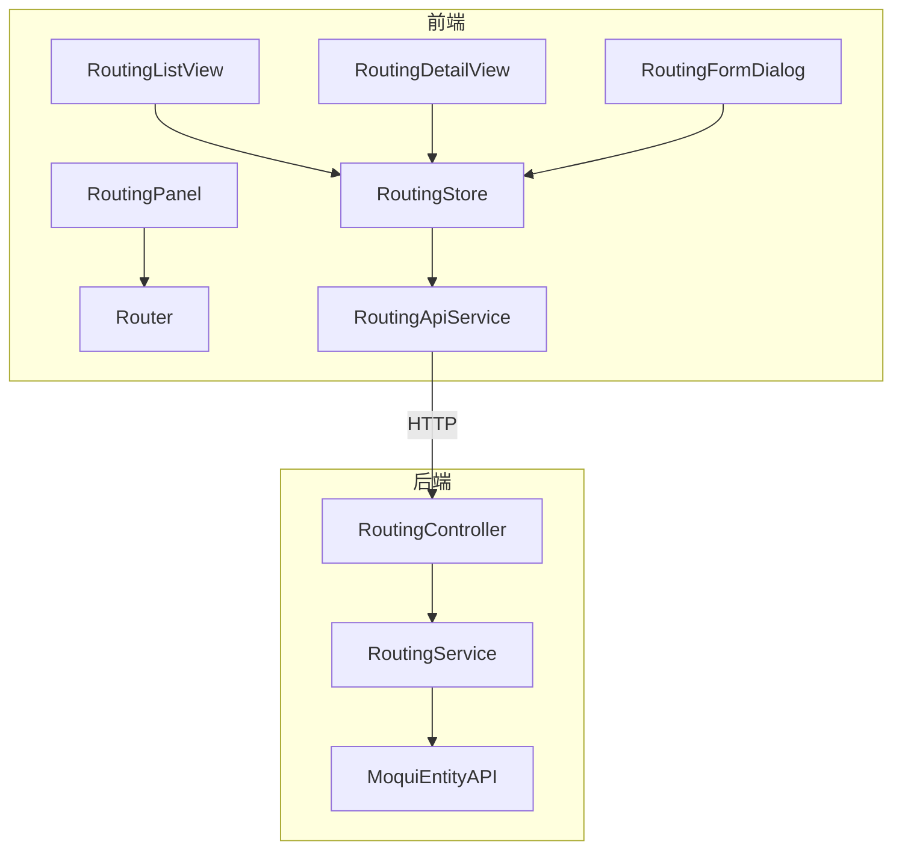

# 工艺路线管理模块 — 设计文档

## 1. 架构概览

遵循项目现有模式：Service → Controller → Router 注册（后端），Types → ApiService → Store → Views（前端）。



## 2. 后端设计

### 2.1 RoutingService.java

- 包路径: `org.moqui.rest.service.RoutingService`
- 构造函数注入 `ExecutionContextFactory`
- 遵循 OrderService 模式：`ecf.getExecutionContext()` → `disableAuthz()` → `try/catch/finally` → `enableAuthz()` + `ec.destroy()`

方法列表:

| 方法 | 说明 |
|------|------|
| `listRoutings(pageIndex, pageSize, productId)` | 分页查询工艺路线列表，支持按产品过滤 |
| `getRoutingDetail(routingId)` | 查询路线头 + 工序列表 |
| `createRouting(data)` | 创建路线头，必填 productId + routingName |
| `updateRouting(routingId, data)` | 更新路线头字段 |
| `addOperation(routingId, data)` | 添加工序，必填 operationName + workCenterId |
| `updateOperation(routingId, operationSeqId, data)` | 更新工序 |
| `deleteOperation(routingId, operationSeqId)` | 删除工序 |

### 2.2 RoutingController.java

- 包路径: `org.moqui.rest.controller.RoutingController`
- 路由注册:

```
GET    /api/v1/routing                                          → listRoutings
GET    /api/v1/routing/{routingId}                              → getRoutingDetail
POST   /api/v1/routing                                          → createRouting
PUT    /api/v1/routing/{routingId}                              → updateRouting
POST   /api/v1/routing/{routingId}/operation                    → addOperation
PUT    /api/v1/routing/{routingId}/operation/{operationSeqId}   → updateOperation
DELETE /api/v1/routing/{routingId}/operation/{operationSeqId}   → deleteOperation
```

### 2.3 RestApplication.java 注册

```java
RoutingService routingService = new RoutingService(ecf);
new RoutingController(routingService).register(router);
```

## 3. 组件与接口

### 3.1 前端类型定义 — `types/routing.ts`

```typescript
interface RoutingListItem {
  routingId: string
  productId: string
  productName?: string
  routingName: string
  description?: string
  fromDate?: string
}

interface RoutingDetail extends RoutingListItem {
  operations: OperationEntry[]
}

interface OperationEntry {
  operationSeqId: string
  operationName: string
  workCenterId: string
  workCenterName?: string
  setupTime?: number
  runTime?: number
  waitTime?: number
}

interface CreateRoutingRequest {
  productId: string
  routingName: string
  description?: string
  fromDate?: string
}

interface UpdateRoutingRequest {
  routingName?: string
  description?: string
  fromDate?: string
}

interface OperationRequest {
  operationName: string
  workCenterId: string
  setupTime?: number
  runTime?: number
  waitTime?: number
}

interface RoutingListParams {
  pageIndex?: number
  pageSize?: number
  productId?: string
}

interface RoutingPaginationMeta {
  pageIndex: number
  pageSize: number
  totalCount: number
  totalPages: number
}
```

### 3.2 API 服务 — `services/routingApiService.ts`

使用 `apiV1Client`，路径前缀: `/routing`

```typescript
class RoutingApiService {
  listRoutings(params?: RoutingListParams)
  getRoutingDetail(routingId: string)
  createRouting(data: CreateRoutingRequest)
  updateRouting(routingId: string, data: UpdateRoutingRequest)
  addOperation(routingId: string, data: OperationRequest)
  updateOperation(routingId: string, operationSeqId: string, data: OperationRequest)
  deleteOperation(routingId: string, operationSeqId: string)
}
```

### 3.3 Pinia Store — `stores/routing.ts`

状态:
- `routings: RoutingListItem[]` — 列表数据
- `pagination: RoutingPaginationMeta | null`
- `loading / error` — 列表加载状态
- `currentRouting: RoutingDetail | null` — 当前详情
- `detailLoading / detailError`
- `mutating / mutationError`
- `filterProductId / currentPageIndex / currentPageSize`

导出纯函数:
- `filterRoutingsByProduct(routings, productId)` — 按产品过滤
- `validateCreateRoutingForm(data)` — 验证创建表单必填字段

### 3.4 视图组件

| 组件 | 说明 |
|------|------|
| `RoutingListView.vue` | 列表页，含搜索/过滤/分页/创建按钮 |
| `RoutingDetailView.vue` | 详情页，含路线头信息 + 工序表格（含时间标准） |
| `RoutingFormDialog.vue` | 创建/编辑对话框 |
| `RoutingPanel.vue` | 侧边面板 |

## 4. 数据模型

### 4.1 Moqui 实体映射

| 概念 | 实体名 | 主键 | 关键字段 |
|------|--------|------|----------|
| 工艺路线头 | 自定义 `RoutingHeader` | routingId | productId, routingName, description, fromDate |
| 工序 | 自定义 `RoutingOperation` | routingId + operationSeqId | operationName, workCenterId, setupTime, runTime, waitTime |

> 注：Service 层使用通用 Entity API 操作，如实体不存在则使用 `mantle.work.effort.WorkEffort` 作为底层适配。

## 5. 正确性属性

### Property 1: 分页数学正确性
*For any* 工艺路线列表和任意合法的 pageIndex/pageSize 参数，返回的 totalPages 应等于 `ceil(totalCount / pageSize)`，且返回的数据条数应不超过 pageSize。
**Validates: Requirements 1.1**

### Property 2: 过滤返回匹配记录
*For any* 工艺路线列表和任意 productId 过滤参数，返回的所有记录的 productId 应与过滤参数一致。
**Validates: Requirements 1.2**

### Property 3: 创建-查询往返一致性
*For any* 合法的 CreateRoutingRequest，创建后通过 getRoutingDetail 查询应返回与创建请求一致的所有字段值。
**Validates: Requirements 3.3**

### Property 4: 创建验证拒绝缺失必填字段
*For any* 缺少 productId 或 routingName 的创建请求，应返回 400 错误码。
**Validates: Requirements 3.1, 3.2**

### Property 5: 部分更新保留未变更字段
*For any* 已存在的工艺路线和任意部分更新请求，更新后查询应显示：请求中包含的字段已更新，未包含的字段保持原值。
**Validates: Requirements 4.1**

### Property 6: 工序添加-查询往返一致性
*For any* 已存在的工艺路线和合法的 OperationRequest，添加后通过 getRoutingDetail 查询应在 operations 列表中包含该工序。
**Validates: Requirements 5.2**

### Property 7: 删除工序后不再出现
*For any* 已存在的工序，删除后通过 getRoutingDetail 查询应不再包含该工序。
**Validates: Requirements 5.4**

### Property 8: 前端过滤函数正确性
*For any* 工艺路线列表和任意 productId，`filterRoutingsByProduct` 函数返回的所有记录的 productId 应与过滤参数一致。
**Validates: Requirements 6.2**

## 6. 错误处理

| 错误码 | HTTP 状态码 | 场景 |
|--------|------------|------|
| VALIDATION_ERROR | 400 | 必填字段缺失 |
| RESOURCE_NOT_FOUND | 404 | 路线/工序不存在 |
| INTERNAL_ERROR | 500 | 服务器内部异常 |

## 7. 测试策略

### 7.1 后端测试
- **框架**: JUnit 5 + jqwik
- **属性测试**: 验证 Property 1-7

### 7.2 前端测试
- **框架**: Vitest + fast-check
- **属性测试**: 验证 Property 8
