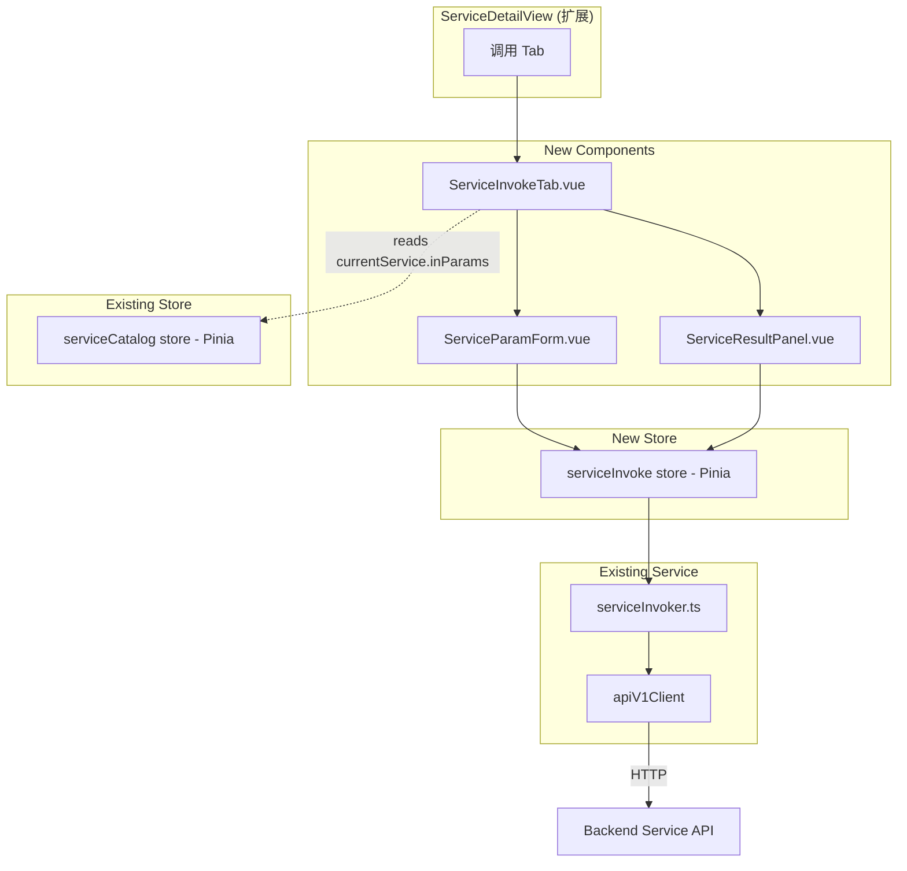
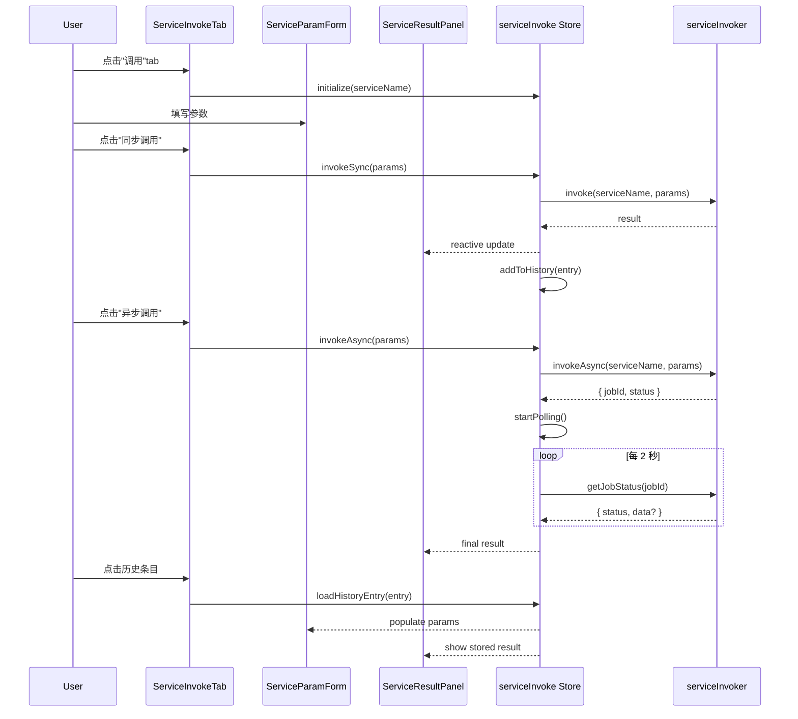

# Design Document: {{SPEC_NAME_TITLE}}

## Overview

{{SPEC_NAME_TITLE}} 模块为 Service Explorer 添加服务调用能力，在 ServiceDetailView 中新增"调用"标签页。模块遵循已有的分层架构（types → service → store → components → views），扩展而非替换现有代码。

核心设计决策：
- 复用已有 `serviceInvoker.ts` API 客户端（invoke / invokeAsync / getJobStatus），不新建 API 层
- 新建独立的 `serviceInvoke` Pinia Store，与现有 `serviceCatalog` Store 共存（职责分离：元数据浏览 vs 调用操作）
- 在 ServiceDetailView 中添加"调用"tab，从 serviceCatalog store 的 `currentService` 读取入参元数据
- 新建 3 个组件：ServiceParamForm、ServiceResultPanel、ServiceInvokeTab
- 参数类型 → 输入控件映射集中在一个工具函数中，便于扩展
- 异步调用通过 setInterval 轮询 jobId 状态，超时 60 秒自动停止
- 调用历史仅保存在内存中（最近 10 条），不持久化

## Architecture



数据流：
1. 用户点击"调用"tab → ServiceInvokeTab 从 serviceCatalog store 读取 currentService（含 inParams）
2. ServiceInvokeTab 初始化 serviceInvoke store（设置 serviceName）
3. 用户填写参数 → 点击"同步调用"或"异步调用"
4. 调用通过 serviceInvoke store → serviceInvoker → apiV1Client → 后端 API
5. 结果存入 store → ServiceResultPanel 响应式更新
6. 成功的调用自动添加到历史记录

## Components and Interfaces

### 1. Service Param Type Mapping 工具 (`frontend/src/renderer/utils/serviceParamMapping.ts`)

```typescript
export interface ParamInputConfig {
  inputType: 'text' | 'number' | 'checkbox' | 'date' | 'datetime-local' | 'time' | 'textarea'
  step?: string
}

/**
 * 将 Service 参数类型映射到 HTML 输入控件配置
 * 参数类型来自 Moqui service definition 的 Java 类型名
 */
export function mapParamToInput(paramType: string | undefined): ParamInputConfig {
  switch (paramType) {
    case 'Integer':
    case 'Long':
    case 'int':
    case 'long':
      return { inputType: 'number', step: '1' }
    case 'Float':
    case 'Double':
    case 'BigDecimal':
    case 'float':
    case 'double':
      return { inputType: 'number', step: 'any' }
    case 'Boolean':
    case 'boolean':
      return { inputType: 'checkbox' }
    case 'Date':
    case 'java.sql.Date':
      return { inputType: 'date' }
    case 'Timestamp':
    case 'java.sql.Timestamp':
      return { inputType: 'datetime-local' }
    case 'Time':
    case 'java.sql.Time':
      return { inputType: 'time' }
    case 'Map':
    case 'List':
    case 'java.util.Map':
    case 'java.util.List':
      return { inputType: 'textarea' }
    default:
      return { inputType: 'text' }
  }
}
```

### 2. Service Types 扩展 (`frontend/src/renderer/types/service.ts`)

在现有 service.ts 中添加调用相关类型：

```typescript
/** Service 参数元数据（完整定义，从 service definition 获取） */
export interface ServiceParamMeta {
  name: string
  type?: string
  required?: boolean
  defaultValue?: string
  description?: string
}

/** 调用历史条目 */
export interface InvocationHistoryEntry {
  id: string                    // 唯一标识 (timestamp-based)
  timestamp: number             // 调用时间戳
  mode: 'sync' | 'async'       // 调用模式
  params: Record<string, unknown>  // 调用参数
  success: boolean              // 是否成功
  result?: unknown              // 成功时的返回数据
  error?: string                // 失败时的错误信息
}
```

### 3. Service Invoke Store (`frontend/src/renderer/stores/serviceInvoke.ts`)

```typescript
export interface ServiceInvokeState {
  // 上下文
  serviceName: string | null

  // 调用状态
  loading: boolean
  result: unknown | null
  error: string | null
  fieldErrors: FieldError[]
  successMessage: string | null

  // 异步任务
  asyncJobId: string | null
  asyncJobStatus: string | null
  polling: boolean
  pollingTimer: ReturnType<typeof setInterval> | null

  // 历史
  history: InvocationHistoryEntry[]
}

// Actions
initialize(serviceName: string): void
invokeSync(params: Record<string, unknown>): Promise<void>
invokeAsync(params: Record<string, unknown>): Promise<void>
pollJobStatus(): Promise<void>
stopPolling(): void
clearResult(): void
resetAll(): void
loadHistoryEntry(entry: InvocationHistoryEntry): void
```

### 4. Vue Components

| 组件 | 文件路径 | 职责 |
|------|---------|------|
| `ServiceParamForm.vue` | `components/services/ServiceParamForm.vue` | 参数表单，根据 inParams 元数据自动生成输入控件，必填验证，默认值预填，JSON textarea |
| `ServiceResultPanel.vue` | `components/services/ServiceResultPanel.vue` | 结果面板，JSON 格式化展示，错误详情，事务元数据，复制按钮，异步轮询指示器 |
| `ServiceInvokeTab.vue` | `components/services/ServiceInvokeTab.vue` | 调用 Tab 容器，协调 ParamForm + ResultPanel，同步/异步调用按钮，历史列表 |

### 5. ServiceDetailView 扩展

在现有 tab-bar 中添加"调用"tab：

```typescript
// activeTab 类型扩展
const activeTab = ref<'overview' | 'inParams' | 'outParams' | 'invoke'>('overview')
```

```html
<!-- 新增 tab 按钮 -->
<button class="tab-btn" :class="{ active: activeTab === 'invoke' }" @click="activeTab = 'invoke'">
  调用
</button>

<!-- 新增 tab 内容 -->
<ServiceInvokeTab
  v-if="activeTab === 'invoke'"
  :service-name="decodedServiceName"
  :in-params="store.currentService?.inParams ?? []"
/>
```

### 6. Component Interaction Flow



## Data Models

### {{SPEC_NAME_TITLE}} API 请求/响应映射

| 操作 | HTTP 方法 | 端点 | 请求头 | 请求体 | 响应 |
|------|----------|------|--------|--------|------|
| 同步调用 | POST | `/services/{serviceName}` | — | `Record<string, unknown>` | `{ success, data, error, _tx }` |
| 异步调用 | POST | `/services/{serviceName}` | `X-Async: true` | `Record<string, unknown>` | `{ success, data: { jobId, status } }` |
| 查询任务 | GET | `/services/jobs/{jobId}` | — | — | `{ success, data: { status, ... } }` |

### 参数类型 → 输入控件映射表

| Java Type | HTML Input Type | step | 备注 |
|-----------|-----------------|------|------|
| String (default) | text | — | 通用文本 |
| Integer, Long, int, long | number | 1 | 整数 |
| Float, Double, BigDecimal, float, double | number | any | 小数 |
| Boolean, boolean | checkbox | — | 布尔 |
| Date, java.sql.Date | date | — | 日期 |
| Timestamp, java.sql.Timestamp | datetime-local | — | 日期时间 |
| Time, java.sql.Time | time | — | 时间 |
| Map, List, java.util.Map, java.util.List | textarea | — | JSON 编辑 |

### 异步任务状态流转

```
PENDING → RUNNING → COMPLETED / FAILED
                  → TIMEOUT (客户端 60s 超时)
```

### 调用历史条目结构

```typescript
{
  id: "inv-1700000000000",     // 唯一 ID
  timestamp: 1700000000000,     // 毫秒时间戳
  mode: "sync" | "async",      // 调用模式
  params: { ... },              // 调用参数快照
  success: true | false,        // 结果状态
  result: { ... },              // 成功时的数据
  error: "..."                  // 失败时的错误
}
```


## Correctness Properties

*A property is a characteristic or behavior that should hold true across all valid executions of a system — essentially, a formal statement about what the system should do. Properties serve as the bridge between human-readable specifications and machine-verifiable correctness guarantees.*

### Property 1: Invocation call delegation

*For any* service name and parameter object, calling `invokeSync(params)` should delegate to `serviceInvoker.invoke(serviceName, params)` with exactly those arguments, and calling `invokeAsync(params)` should delegate to `serviceInvoker.invokeAsync(serviceName, params)` with exactly those arguments.

**Validates: Requirements 1.2, 1.3**

### Property 2: Invocation start lifecycle

*For any* prior store state (with existing result, error, or history), starting either a sync or async invocation should set `loading` to true, clear the previous `result` to null, clear the previous `error` to null, and clear `fieldErrors` to an empty array.

**Validates: Requirements 1.5, 1.8**

### Property 3: Invocation success lifecycle

*For any* successful invocation result (sync or async), the store should set `loading` to false, store the result data in `result`, set `successMessage` to "调用成功", and append an entry to the `history` array with the correct parameters, result, and mode.

**Validates: Requirements 1.6, 1.9, 6.1**

### Property 4: Invocation failure lifecycle

*For any* failed invocation (sync or async), the store should set `loading` to false, store the error message in `error`, and if the response contains field-level validation details, store them in `fieldErrors`.

**Validates: Requirements 1.7, 1.10, 6.3**

### Property 5: History size invariant

*For any* sequence of N invocations (where N > 10), the `history` array length should never exceed 10, and the array should contain the 10 most recent entries in chronological order.

**Validates: Requirements 1.11, 5.1**

### Property 6: Reset returns to initial state

*For any* store state (with any combination of serviceName, result, error, history, polling), calling `resetAll` should return all state fields to their initial values and stop any active polling timer.

**Validates: Requirements 1.13**

### Property 7: Param type mapping correctness

*For any* known Java type string from the mapping table, `mapParamToInput` should return the correct `ParamInputConfig` with the expected `inputType` and `step` values. For Map/List types, the result should be `{ inputType: 'textarea' }`. For unknown types, the result should default to `{ inputType: 'text' }`.

**Validates: Requirements 2.2, 2.5**

### Property 8: Form default value handling

*For any* set of service parameters where some have `defaultValue` defined, the form should initialize those fields with their default values. After user modification, clicking "清空" should restore all fields to their default values (or empty for params without defaults).

**Validates: Requirements 2.3, 2.6**

### Property 9: Required field validation

*For any* set of service parameters where some are marked `required`, submitting the form with any required field empty should be prevented (form should not emit submit event).

**Validates: Requirements 2.4**

### Property 10: Field-level error display

*For any* set of FieldError objects passed to the Service_Param_Form, each error message should be rendered adjacent to the input field identified by the error's `field` property.

**Validates: Requirements 2.7**

### Property 11: Button disable while loading

*For any* store state where `loading` is true, both the "同步调用" and "异步调用" buttons in ServiceInvokeTab should be disabled (have the `disabled` attribute).

**Validates: Requirements 4.5, 6.5**

### Property 12: History entry completeness

*For any* invocation (sync or async, success or failure), the resulting history entry should contain all required fields: a non-empty `id`, a positive `timestamp`, the correct `mode` ('sync' or 'async'), the exact `params` object used, and the correct `success` boolean.

**Validates: Requirements 5.3**

### Property 13: History entry restore

*For any* history entry, calling `loadHistoryEntry(entry)` should set the store's `result` to the entry's result (or error) and make the entry's `params` available for form population.

**Validates: Requirements 5.2**

## Error Handling

| 场景 | 处理方式 | 用户反馈 |
|------|---------|---------|
| 同步调用成功 | Store 设置 result + successMessage | 显示 "调用成功" 通知 |
| 同步调用失败 (400) | Store 设置 error + fieldErrors | 表单字段旁显示具体验证错误 |
| 同步调用失败 (500) | Store 设置 error | 显示后端错误信息 |
| 网络错误 | Store 设置 error | 显示 "网络错误，请重试" |
| 异步调用提交成功 | Store 设置 asyncJobId，开始轮询 | 显示轮询指示器 |
| 异步任务完成 | Store 停止轮询，设置 result | 显示最终结果 |
| 异步任务失败 | Store 停止轮询，设置 error | 显示错误信息 |
| 异步轮询超时 (60s) | Store 停止轮询，设置 error | 显示 "异步任务超时，请稍后查询" |
| 必填参数为空 | 表单阻止提交 | 必填字段显示红色标记 |

错误处理原则：
- 调用前验证必填参数，阻止无效请求
- 网络错误和业务错误分别处理，提供不同的用户提示
- 字段级验证错误精确定位到对应输入框
- 异步轮询有超时保护，避免无限轮询
- 所有错误状态提供清除机制（clearResult / resetAll）

## Testing Strategy

### 测试框架

- **单元测试**: Vitest (已有配置)
- **属性测试**: fast-check (已有依赖)
- **组件测试**: @vue/test-utils + Vitest

### 属性测试

每个 Correctness Property 对应一个属性测试，使用 fast-check 生成随机输入：
- 最少 100 次迭代
- 每个测试标注对应的 Property 编号和 Requirements 引用
- 标签格式: **Feature: {{SPEC_NAME}}, Property {N}: {title}**

### 单元测试

覆盖范围：
- `serviceParamMapping.ts`: 纯函数测试（mapParamToInput 所有类型映射）
- `serviceInvoke` store: 状态转换、action 行为、轮询控制、历史管理、错误处理
- 组件: 渲染输出、用户交互、条件显示

### 测试分工

| 测试类型 | 覆盖内容 | 工具 |
|---------|---------|------|
| 属性测试 | Property 1-13 (通用正确性) | fast-check + Vitest |
| 单元测试 | 具体示例、边界情况、UI 交互 | Vitest + @vue/test-utils |

### 属性测试库

使用已有的 `fast-check` 库，无需新增依赖。每个属性测试必须：
1. 由单个 property-based test 实现
2. 运行至少 100 次迭代
3. 注释引用设计文档中的 Property 编号
