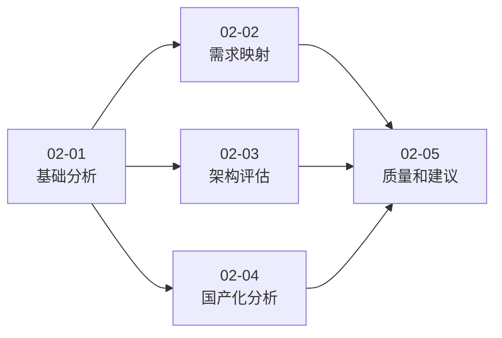

# Design: {{SPEC_NAME}}

**主 Spec**: 源代码分析总览  
**创建日期**: {{DATE}}

---

## Overview

本设计文档定义 Moqui ERP 系统源代码分析的总体架构、方法论和子 Spec 协调机制。

---

## Analysis Architecture

### 分层分析模型

```
┌─────────────────────────────────────────────────────────┐
│              Layer 5: 实施建议和路线图                    │
│         (02-05: Quality and Recommendations)            │
└─────────────────────────────────────────────────────────┘
                          ↑
        ┌─────────────────┼─────────────────┐
        │                 │                 │
┌───────▼────────┐ ┌──────▼──────┐ ┌───────▼────────┐
│  Layer 4a:     │ │  Layer 4b:  │ │  Layer 4c:     │
│  需求映射      │ │  架构评估   │ │  国产化分析    │
│  (02-02)       │ │  (02-03)    │ │  (02-04)       │
└───────┬────────┘ └──────┬──────┘ └───────┬────────┘
        │                 │                 │
        └─────────────────┼─────────────────┘
                          ↓
┌─────────────────────────────────────────────────────────┐
│              Layer 3: 组件功能分析                        │
│                   (02-01 Phase 3)                       │
└─────────────────────────────────────────────────────────┘
                          ↓
┌─────────────────────────────────────────────────────────┐
│              Layer 2: 技术栈识别                          │
│                   (02-01 Phase 2)                       │
└─────────────────────────────────────────────────────────┘
                          ↓
┌─────────────────────────────────────────────────────────┐
│              Layer 1: 项目结构分析                        │
│                   (02-01 Phase 1)                       │
└─────────────────────────────────────────────────────────┘
```

### 分析流程

1. **基础分析** (02-01): 建立对系统的基本认知
   - 输入: Moqui 项目源代码
   - 输出: 结构、技术栈、组件能力数据

2. **专项分析** (02-02, 02-03, 02-04): 深入特定领域
   - 输入: 02-01 的产物 + 客户需求
   - 输出: 需求覆盖度、架构评估、国产化分析

3. **综合建议** (02-05): 整合所有分析结果
   - 输入: 02-02, 02-03, 02-04 的产物
   - 输出: 质量评估、实施路线图

---

## Sub-Spec Coordination

### 依赖关系



### 数据流

```
02-01 产物:
├── component_capabilities.json  → 02-02 (需求映射)
├── tech_stack.json             → 02-04 (国产化分析)
└── project_structure.json      → 02-03 (架构评估)

02-02 产物:
└── coverage_matrix.json        → 02-05 (缺失功能清单)

02-03 产物:
└── architecture_assessment.json → 02-05 (架构改进建议)

02-04 产物:
└── compatibility_analysis.json  → 02-05 (国产化适配计划)
```

### 接口定义

每个子 Spec 应提供标准化的输出接口：

**数据接口** (JSON 格式):
```json
{
  "spec_id": "02-01-basic-analysis",
  "version": "1.0",
  "generated_at": "{{DATE}}T10:00:00Z",
  "data": {
    // 具体数据
  }
}
```

**报告接口** (Markdown 格式):
```markdown
# {Report Title}

## Executive Summary
[3-5 句话总结]

## Key Findings
[关键发现列表]

## Detailed Analysis
[详细分析内容]

## Recommendations
[建议列表]
```

---

## Methodology

### 分析方法

**1. 静态分析**
- 扫描源代码文件结构
- 解析 XML/Groovy 定义文件
- 提取元数据和配置

**2. 模式匹配**
- 关键词匹配（实体名 → 业务领域）
- 命名约定分析（服务名 → 功能类型）
- 依赖关系分析（组件 → 架构模式）

**3. 专家评估**
- 架构合理性（需要人工判断）
- 代码质量（基于样本评估）
- 实施可行性（基于经验判断）

### 质量标准

**准确性**:
- 自动化分析: 95%+ 准确率
- 人工评估: 标注不确定性
- 数据验证: 提供可验证的来源

**完整性**:
- 覆盖所有需求领域（18 个）
- 覆盖所有组件（6 个）
- 覆盖所有关键技术

**可执行性**:
- 建议具体可行
- 工作量可估算
- 优先级可排序

---

## Deliverables

### 报告类型

**1. 分析报告** (Analysis Reports)
- 目的: 呈现分析结果
- 格式: Markdown
- 受众: 技术团队

**2. 执行总结** (Executive Summary)
- 目的: 高层决策支持
- 格式: Markdown (简洁版)
- 受众: 管理层

**3. 数据产物** (Data Artifacts)
- 目的: 供后续分析使用
- 格式: JSON/CSV
- 受众: 分析脚本

**4. 实施计划** (Implementation Plan)
- 目的: 指导后续开发
- 格式: Markdown + Gantt 图
- 受众: 项目团队

### 报告结构标准

所有分析报告应遵循统一结构：

```markdown
# {Report Title}

**Generated**: {Date}
**Spec**: {Spec ID}
**Version**: {Version}

---

## Executive Summary
[3-5 段总结，包含关键发现、风险、建议]

## Analysis Scope
[分析范围和方法]

## Key Findings
[关键发现，分点列出]

## Detailed Analysis
[详细分析内容，分章节]

## Risks and Challenges
[风险和挑战]

## Recommendations
[建议，按优先级排序]

## Appendix
[附录：数据来源、方法论、术语表]
```

---

## Tools and Scripts

### 脚本架构

```
scripts/
├── utils.py                    # 共享工具模块
├── analyze_structure.py        # 项目结构分析
├── analyze_techstack.py        # 技术栈分析
├── analyze_components.py       # 组件能力分析
├── map_requirements.py         # 需求映射
├── evaluate_architecture.py    # 架构评估
├── assess_compatibility.py     # 国产化分析
├── assess_quality.py           # 质量评估
└── generate_recommendations.py # 建议生成
```

### 工具设计原则

1. **模块化**: 每个脚本独立可运行
2. **可复用**: 共享工具模块（utils.py）
3. **可扩展**: 易于添加新的分析功能
4. **可测试**: 提供单元测试（可选）

---

## Risk Management

### 已识别风险

**1. 分析准确性风险**
- 风险: 自动化分析可能遗漏或误判
- 缓解: 提供人工审核点，标注不确定性

**2. 范围蔓延风险**
- 风险: 分析范围可能扩大，超出预期
- 缓解: 严格遵循子 Spec 范围定义

**3. 依赖阻塞风险**
- 风险: 子 Spec 依赖关系可能导致阻塞
- 缓解: 02-03 和 02-04 可并行执行

**4. Token 消耗风险**
- 风险: 大型分析可能消耗过多 token
- 缓解: 子 Spec 切分，每个 < 50% token

### 质量保证措施

1. **Checkpoint 机制**: 每个子 Spec 完成后验证
2. **人工审核**: 关键决策点需要人工确认
3. **数据验证**: 提供可验证的数据来源
4. **迭代改进**: 根据反馈调整方法

---

## Success Criteria

### 主 Spec 成功标准

1. ✅ 所有 5 个子 Spec 完成
2. ✅ 生成完整的汇总报告
3. ✅ 功能覆盖度 > 60%
4. ✅ 实施建议可执行
5. ✅ 干系人满意度 > 80%

### 子 Spec 成功标准

1. ✅ 按时完成（1-2 sessions）
2. ✅ 产物完整（报告 + 数据）
3. ✅ 质量达标（准确性、完整性）
4. ✅ 可复用（后续 Spec 可使用）

---

**版本**: v1.0  
**状态**: Active  
**下一步**: 执行 02-02 子 Spec

