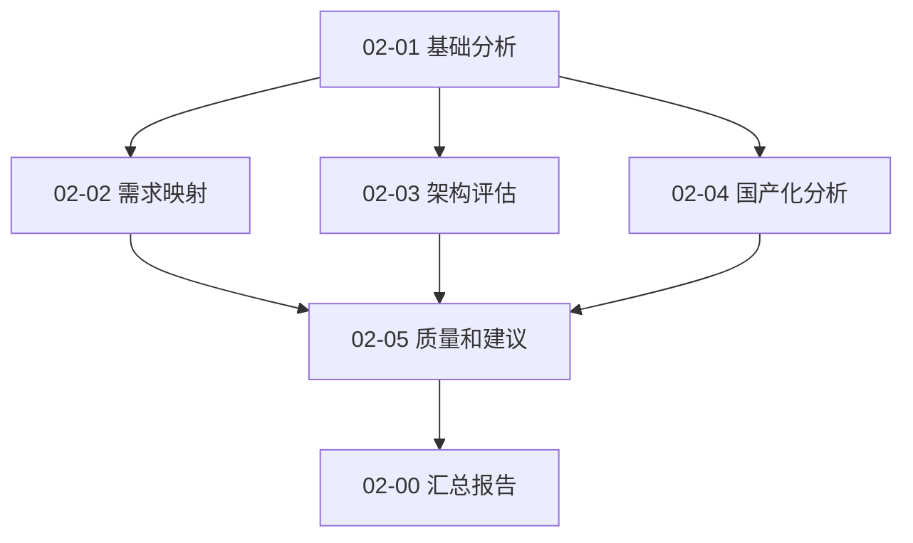

# Tasks: {{SPEC_NAME}}

**主 Spec**: 源代码分析总览  
**创建日期**: {{DATE}}

---

## Overview

本主 Spec 通过 5 个子 Spec 完成 Moqui ERP 系统的全面分析。每个子 Spec 是一个独立的、可交付的分析单元。

---

## Sub-Spec Checklist

### ✅ 02-01: Basic Analysis (基础分析)

**状态**: 已完成  
**完成日期**: {{DATE}}  
**负责人**: Kiro AI Assistant

**范围**:
- ✅ Phase 1: 项目结构分析
- ✅ Phase 2: 技术栈识别
- ✅ Phase 3: 组件功能分析

**产物**:
- ✅ `scripts/utils.py` - 共享工具模块
- ✅ `scripts/analyze_structure.py` - 项目结构分析脚本
- ✅ `scripts/analyze_techstack.py` - 技术栈分析脚本
- ✅ `scripts/analyze_components_simple.py` - 组件能力分析脚本
- ✅ `docs/analysis-reports/01-project-structure.md`
- ✅ `docs/analysis-reports/02-tech-stack.md`
- ✅ `docs/analysis-reports/03-component-capabilities.md`
- ✅ `docs/analysis-reports/00-executive-summary.md`

**关键发现**:
- 6 个 Moqui 组件（mantle-udm, mantle-usl, SimpleScreens, HiveMind, MarbleERP, moqui-fop）
- 674 个实体 + 795 个服务 + 406 个界面
- Vue 3.3.0 + Electron 28.0.0 前端
- Java + Groovy + Gradle 后端
- H2 (开发) + PostgreSQL/MySQL (生产) 数据库

**链接**: [02-01-basic-analysis](./../02-01-basic-analysis/)

---

### ✅ 02-02: Requirement Mapping (需求映射)

**状态**: 已完成  
**完成日期**: {{DATE}}  
**负责人**: Kiro AI Assistant

**范围**:
- ✅ Phase 1-3: 准备工作、脚本开发、执行分析
- ✅ 将 Moqui 能力映射到 110 项客户需求
- ✅ 计算功能覆盖度百分比（9 个需求领域）
- ✅ 识别 79 个功能缺口

**产物**:
- ✅ `scripts/extract_moqui_entities.py` - Moqui 实体提取脚本
- ✅ `scripts/map_requirements.py` - 需求映射脚本
- ✅ `data/moqui_capabilities_full.json` - 完整 Moqui 能力数据
- ✅ `docs/analysis-reports/04-functional-coverage-matrix.md` - 功能覆盖矩阵报告
- ✅ `data/coverage_matrix.json` - 映射矩阵数据
- ✅ `data/functional_gaps.json` - 功能缺口清单
- ✅ `PROGRESS_REPORT.md` - 详细进度报告
- ✅ `README.md` - 子 Spec 总览

**关键发现**:
- 总体功能覆盖率: **28.18%**
- 完全覆盖: 31 项需求 (28.2%)
- 功能缺口: 79 个
- 优势领域: 成本管理 (66.67%), 服务管理 (66.67%), 项目管理 (60.00%)
- 挑战领域: 主数据管理 (21.43%), 生产计划 (20.00%), 设备管理 (16.67%)
- **MarbleERP**: 综合 ERP + AI 智能服务（销售预测、库存优化、财务异常检测）
- **PopCommerce**: 电商解决方案（35 个界面）

**链接**: [02-02-requirement-mapping](./../02-02-requirement-mapping/)

---

### ✅ 02-03: Architecture Evaluation (架构评估)

**状态**: 已完成  
**完成日期**: {{DATE}}  
**负责人**: Kiro AI Assistant

**范围**:
- ✅ 微服务就绪度评估
- ✅ 集群支持评估
- ✅ 部署策略分析
- ✅ API 开放性评估

**产物**:
- ✅ `scripts/analyze_architecture.py` - 架构分析脚本
- ✅ `data/architecture_assessment.json` - 架构评估数据
- ✅ `data/architecture_improvements.json` - 改进建议清单
- ✅ `docs/analysis-reports/05-architecture-evaluation.md` - 架构评估报告
- ✅ `README.md` - 子 Spec 总览

**关键发现**:
- 微服务就绪度: 6.4/10 (良好)
- 集群支持: 1.0/10 (需改进)
- API 开放性: 7.8/10 (优秀)
- 识别 3 个单点故障（数据库、文件存储、缓存）
- 提供 8 项架构改进建议（短期 3 项、中期 3 项、长期 2 项）

**链接**: [02-03-architecture-evaluation](./../02-03-architecture-evaluation/)

---

### ✅ 02-04: Domestic Compatibility (国产化分析)

**状态**: 已完成  
**完成日期**: {{DATE}}  
**负责人**: Kiro AI Assistant

**范围**:
- ✅ 数据库国产化适配分析
- ✅ 操作系统兼容性分析
- ✅ JDK 国产化分析
- ✅ 中间件国产化分析

**产物**:
- ✅ `scripts/analyze_domestic_compatibility.py` - 国产化兼容性分析脚本
- ✅ `data/domestic_compatibility.json` - 兼容性评估数据
- ✅ `docs/analysis-reports/06-domestic-compatibility.md` - 国产化兼容性报告
- ✅ `README.md` - 子 Spec 总览

**关键发现**:
- 总体兼容性: 良好
- 推荐数据库: KingBase V8
- 推荐操作系统: Kylin V10 或 UOS V20
- 推荐 JDK: Dragonwell 21
- 推荐中间件: 保持 Jetty
- 总工作量: 16 周（约 4 个月），3-5 人

**链接**: [02-04-domestic-compatibility](./../02-04-domestic-compatibility/)

---

### ✅ 02-05: Quality and Recommendations (质量和建议)

**状态**: 已完成  
**完成日期**: {{DATE}}  
**负责人**: Kiro AI Assistant

**范围**:
- ✅ 综合分析结果整合
- ✅ 实施建议生成
- ✅ 实施路线图规划
- ✅ 工作量和成本估算

**产物**:
- ✅ `scripts/generate_final_report.py` - 最终报告生成脚本
- ✅ `data/implementation_summary.json` - 实施总结数据
- ✅ `docs/analysis-reports/08-implementation-recommendations.md` - 实施建议和路线图
- ✅ `README.md` - 子 Spec 总览

**关键发现**:
- 综合评分: 功能 28%, 微服务 6.4/10, 集群 1.0/10, API 7.8/10
- 总工作量: 71 周，101 人月，202 万元
- 实施策略: 分阶段实施，先易后难，快速见效
- 预期收益: 功能覆盖率提升到 80%+，可用性提升到 99.9%

**链接**: [02-05-quality-and-recommendations](./../02-05-quality-and-recommendations/)

---

## Overall Progress

### 进度统计

- **已完成**: 5/5 (100%) ✅
- **进行中**: 0/5 (0%)
- **待开始**: 0/5 (0%)

### 时间线

```
{{DATE}}: ✅ 02-01 完成
{{DATE}}: 🔄 02-02 开始
2026-01-31: 📋 02-02 完成, 02-03 开始, 02-04 开始
2026-02-01: 📋 02-03 完成, 02-04 完成, 02-05 开始
2026-02-02: 📋 02-05 完成, 主 Spec 汇总
```

### 依赖关系



---

## Master Report

### 汇总任务

- [x] 1 收集所有子 Spec 的执行总结
- [x] 2 提取关键发现和风险
- [x] 3 整合实施建议和路线图
- [x] 4 生成 MASTER_REPORT.md
- [x] 5 更新 CURRENT_CONTEXT.md

### 汇总报告结构

```markdown
# 源代码分析汇总报告

## 执行总结
- 分析范围和方法
- 关键发现
- 主要风险
- 总体建议

## 详细结果
- 基础分析结果（02-01）
- 功能覆盖度（02-02）
- 架构评估（02-03）
- 国产化分析（02-04）
- 质量评估（02-05）

## 实施路线图
- 优先级排序
- 工作量估算
- 时间线规划
- 资源需求

## 附录
- 各子 Spec 报告链接
- 数据来源和方法
- 术语表
```

---

## Notes

### 执行原则

1. **顺序执行**: 按依赖关系顺序执行子 Spec
2. **独立交付**: 每个子 Spec 完成后立即交付产物
3. **产物复用**: 后续子 Spec 复用前面的产物
4. **持续更新**: 完成每个子 Spec 后更新主 Spec 进度

### 上下文管理

1. **Session 切换**: 每个子 Spec 开始时更新 CURRENT_CONTEXT.md
2. **Token 管控**: 每个子 Spec 的 token 消耗 < 50%
3. **进度跟踪**: 使用本文件跟踪总体进度

### 质量保证

1. **Ultrawork 标准**: 每个子 Spec 遵循 Ultrawork 质量标准
2. **人工审核**: 标注需要人工审核的部分
3. **可验证性**: 提供数据来源和分析方法

---

**版本**: v1.0  
**最后更新**: {{DATE}}  
**下一步**: 创建 02-02 子 Spec


