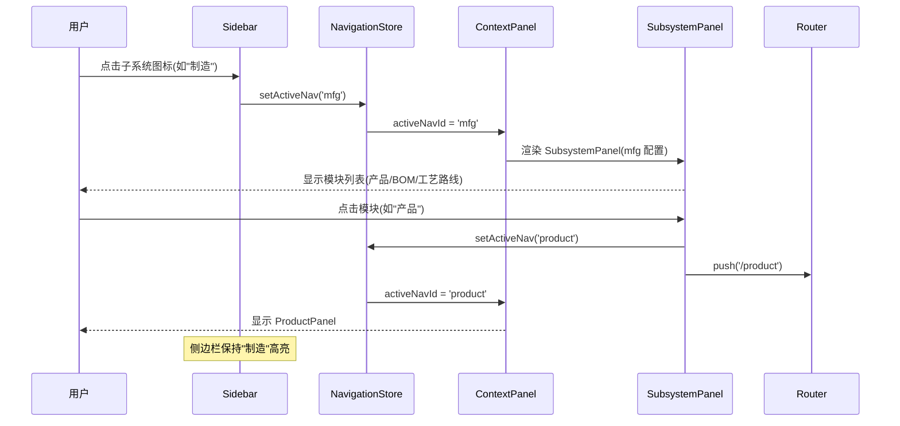

# 设计文档

## 概述

将 ERP 侧边栏从扁平的 11 个一级图标重构为 7 个子系统分组的二级导航结构。核心改动集中在 4 个前端文件：App.vue（navItems 结构）、navigation.ts（NavId 类型和状态管理）、ContextPanel.vue（面板映射）、icons.js（新图标导入）。新增 1 个组件 SubsystemPanel.vue 用于渲染子系统模块列表。路由和后端不做任何改动。

## 架构

### 导航层级

```
侧边栏 (Sidebar)
├── 概览 (dashboard) → 直接导航，DashboardPanel
├── 制造 (mfg) → SubsystemPanel → [产品, BOM, 工艺路线]
├── 供应链 (scm) → SubsystemPanel → [采购, 库存, 设施, 发货]
├── 财务 (finance) → SubsystemPanel → [发票]
├── 销售 (sales) → SubsystemPanel → [订单]
├── 组织 (org) → SubsystemPanel → [Party]
└── 系统 (admin) → 直接导航，AdminPanel
```

### 交互流程



## 组件与接口

### 1. navItems 数据结构（App.vue）

从扁平数组改为嵌套结构：

```javascript
// 新的 navItems 结构
const navItems = [
  {
    id: 'dashboard',
    route: '/dashboard',
    label: '概览',
    icon: icons.home,
    type: 'direct'  // 直接导航，无子模块
  },
  {
    id: 'mfg',
    label: '制造',
    icon: icons.factory,
    type: 'subsystem',  // 子系统，有子模块
    children: [
      { id: 'product', route: '/product', label: '产品管理', icon: icons.package, description: '管理产品信息' },
      { id: 'bom', route: '/bom', label: 'BOM 管理', icon: icons.layers, description: '管理物料清单' },
      { id: 'routing', route: '/routing', label: '工艺路线', icon: icons.workflow, description: '管理工艺路线' },
    ]
  },
  {
    id: 'scm',
    label: '供应链',
    icon: icons.boxes,
    type: 'subsystem',
    children: [
      { id: 'procurement', route: '/procurement', label: '采购管理', icon: icons.clipboardList, description: '管理采购订单' },
      { id: 'inventory', route: '/inventory', label: '库存管理', icon: icons.box, description: '管理库存资产' },
      { id: 'facility', route: '/facility', label: '设施管理', icon: icons.warehouse, description: '管理仓库设施' },
      { id: 'shipment', route: '/shipment', label: '发货管理', icon: icons.truck, description: '管理发货物流' },
    ]
  },
  {
    id: 'finance',
    label: '财务',
    icon: icons.dollarSign,
    type: 'subsystem',
    children: [
      { id: 'invoice', route: '/invoice', label: '发票管理', icon: icons.receipt, description: '管理财务发票' },
    ]
  },
  {
    id: 'sales',
    label: '销售',
    icon: icons.shoppingBag,
    type: 'subsystem',
    children: [
      { id: 'order', route: '/order', label: '订单管理', icon: icons.shoppingCart, description: '管理销售订单' },
    ]
  },
  {
    id: 'org',
    label: '组织',
    icon: icons.building2,
    type: 'subsystem',
    children: [
      { id: 'party', route: '/party', label: 'Party 管理', icon: icons.users, description: '管理组织与联系人' },
    ]
  },
  {
    id: 'admin',
    route: '/admin/users',
    label: '系统',
    icon: icons.settings,
    type: 'direct'
  }
];
```

### 2. NavId 类型扩展（navigation.ts）

```typescript
// 子系统 ID
export type SubsystemId = 'mfg' | 'scm' | 'finance' | 'sales' | 'org';

// 模块 ID（保持不变）
export type ModuleId = 'party' | 'product' | 'order' | 'facility' | 'invoice' 
  | 'shipment' | 'bom' | 'routing' | 'procurement' | 'inventory';

// 扩展 NavId 包含子系统
export type NavId = 'dashboard' | 'screens' | 'entities' | 'services' 
  | 'settings' | 'admin' | SubsystemId | ModuleId;

// 子系统到模块的映射
export const SUBSYSTEM_MODULE_MAP: Record<SubsystemId, ModuleId[]> = {
  mfg: ['product', 'bom', 'routing'],
  scm: ['procurement', 'inventory', 'facility', 'shipment'],
  finance: ['invoice'],
  sales: ['order'],
  org: ['party'],
};

// 模块到子系统的反向映射（用于路由变化时查找所属子系统）
export const MODULE_SUBSYSTEM_MAP: Record<ModuleId, SubsystemId> = {
  product: 'mfg', bom: 'mfg', routing: 'mfg',
  procurement: 'scm', inventory: 'scm', facility: 'scm', shipment: 'scm',
  invoice: 'finance',
  order: 'sales',
  party: 'org',
};
```

### 3. SubsystemPanel 组件（新增）

通用子系统面板组件，接收子系统配置，渲染模块列表：

```vue
<!-- SubsystemPanel.vue -->
<template>
  <div class="subsystem-panel">
    <div class="subsystem-header">
      <h3>{{ title }}</h3>
    </div>
    <div class="module-list">
      <div 
        v-for="mod in modules" 
        :key="mod.id"
        class="module-item"
        @click="handleModuleClick(mod)"
      >
        <component :is="mod.icon" :size="20" class="module-icon" />
        <div class="module-info">
          <span class="module-name">{{ mod.label }}</span>
          <span class="module-desc">{{ mod.description }}</span>
        </div>
        <ChevronRight :size="16" class="module-arrow" />
      </div>
    </div>
  </div>
</template>
```

Props 接口：
- `title: string` — 子系统显示名称
- `modules: Array<{ id, route, label, icon, description }>` — 模块列表

### 4. ContextPanel 面板映射更新

```javascript
// 新增子系统面板映射
const panelComponentMap = {
  dashboard: DashboardPanel,
  settings: SettingsPanel,
  // 子系统 → SubsystemPanel（通过 props 区分）
  mfg: SubsystemPanel,
  scm: SubsystemPanel,
  finance: SubsystemPanel,
  sales: SubsystemPanel,
  org: SubsystemPanel,
  // 模块面板保持不变
  party: PartyPanel,
  product: ProductPanel,
  order: OrderPanel,
  facility: FacilityPanel,
  invoice: InvoicePanel,
  shipment: ShipmentPanel,
  bom: BomPanel,
  routing: RoutingPanel,
  procurement: ProcurementPanel,
  inventory: InventoryPanel,
};
```

ContextPanel 需要根据 activeNavId 是子系统还是模块，传递不同的 props 给 SubsystemPanel。

### 5. handleNavClick 逻辑更新（App.vue）

```javascript
function handleNavClick(nav) {
  if (nav.type === 'direct') {
    // 直接导航（dashboard, admin）
    navigationStore.setActiveNav(nav.id);
    uiStore.setActiveRoute(nav.route);
    router.push(nav.route);
  } else if (nav.type === 'subsystem') {
    // 子系统：只切换 ContextPanel 到 SubsystemPanel，不导航路由
    navigationStore.setActiveNav(nav.id);
  }
}
```

### 6. 路由监听更新（App.vue watch）

路由变化时需要将 activeNavId 设置为模块 ID（用于 ContextPanel 显示正确面板），同时侧边栏高亮需要映射到子系统 ID。为此引入 `activeSubsystemId` 概念：

```javascript
// NavigationStore 新增
state: {
  activeNavId: 'dashboard',      // 当前面板 ID（可能是子系统或模块）
  activeSubsystemId: null,       // 当前高亮的子系统 ID（侧边栏用）
}
```

侧边栏高亮逻辑：
- 如果 activeNavId 是 dashboard/admin/settings → 直接高亮该项
- 如果 activeNavId 是子系统 ID → 高亮该子系统
- 如果 activeNavId 是模块 ID → 通过 MODULE_SUBSYSTEM_MAP 查找并高亮对应子系统

### 7. icons.js 扩展

```javascript
import {
  // ... 现有导入
  Factory,       // 制造子系统
  Boxes,         // 供应链子系统（lucide-vue-next 中为 PackageOpen 或 Boxes）
  DollarSign,    // 财务子系统
  ShoppingBag,   // 销售子系统
  Building2,     // 组织子系统
} from 'lucide-vue-next';

// 在 icons 对象中添加
export const icons = {
  // ... 现有图标
  factory: Factory,
  boxes: Boxes,
  dollarSign: DollarSign,
  shoppingBag: ShoppingBag,
  building2: Building2,
};
```

## 数据模型

### NavigationState 扩展

```typescript
interface NavigationState {
  activeNavId: NavId;           // 当前 ContextPanel 显示的面板 ID
  activeSubsystemId: SubsystemId | null;  // 当前侧边栏高亮的子系统（新增）
  panelContext: PanelContext;
  navigationHistory: NavId[];
}
```

### PanelContext 扩展

```typescript
export type PanelContext = {
  // 现有...
  // 新增子系统上下文
  mfg: Record<string, never>;
  scm: Record<string, never>;
  finance: Record<string, never>;
  sales: Record<string, never>;
  org: Record<string, never>;
};
```

### SubsystemConfig 类型

```typescript
interface SubsystemConfig {
  id: SubsystemId;
  label: string;
  icon: Component;
  modules: ModuleConfig[];
}

interface ModuleConfig {
  id: ModuleId;
  route: string;
  label: string;
  icon: Component;
  description: string;
}
```


## 正确性属性

*属性是系统在所有有效执行中应保持为真的特征或行为——本质上是关于系统应该做什么的形式化陈述。属性是人类可读规范与机器可验证正确性保证之间的桥梁。*

### Property 1: 子系统点击显示 SubsystemPanel

*For any* 类型为 'subsystem' 的导航项，点击该项后 ContextPanel 应显示 SubsystemPanel 组件，且该面板包含该子系统配置的所有子模块。

**Validates: Requirements 1.4**

### Property 2: 模块点击导航到正确路由

*For any* 子系统中的模块，在 SubsystemPanel 中点击该模块后，路由应变为该模块的 route 值，且 ContextPanel 应切换为该模块对应的业务面板。

**Validates: Requirements 2.2**

### Property 3: SubsystemPanel 渲染完整性

*For any* 子系统配置及其模块列表，SubsystemPanel 渲染的输出应包含每个模块的图标、名称和描述信息。

**Validates: Requirements 2.1, 2.3**

### Property 4: 模块路由到子系统高亮映射

*For any* 模块 ID，通过 MODULE_SUBSYSTEM_MAP 查找应返回正确的子系统 ID，且侧边栏应高亮该子系统图标。

**Validates: Requirements 4.1, 4.2, 6.2**

### Property 5: 导航状态持久化往返

*For any* 有效的导航状态（activeNavId + activeSubsystemId），持久化到 localStorage 后再恢复，应得到等价的状态。

**Validates: Requirements 4.3**

### Property 6: 子系统面板恢复

*For any* 模块，当用户从该模块返回其父子系统时，ContextPanel 应恢复显示该子系统的 SubsystemPanel。

**Validates: Requirements 2.4**

## 错误处理

1. **图标加载失败**: 如果 lucide-vue-next 中不存在某个图标（如 Boxes），使用备选图标（如 Package）
2. **无效 NavId**: 如果 activeNavId 不在已知映射中，回退到 DashboardPanel
3. **localStorage 损坏**: 恢复状态失败时使用默认值（dashboard），不抛出异常
4. **空子系统**: 如果子系统 children 为空数组，SubsystemPanel 显示"暂无模块"提示

## 测试策略

### 单元测试

- 验证 navItems 结构正确性（7 个一级项，正确的 children）
- 验证 MODULE_SUBSYSTEM_MAP 覆盖所有 10 个模块
- 验证 SUBSYSTEM_MODULE_MAP 覆盖所有 5 个子系统
- 验证 SubsystemPanel 组件渲染（传入 mock 配置）
- 验证 handleNavClick 对 direct 和 subsystem 类型的不同处理

### 属性测试

使用 fast-check 进行属性测试，每个属性至少运行 100 次迭代。

- **Feature: {{SPEC_NAME}}, Property 4**: 模块到子系统映射正确性
  - 生成随机模块 ID，验证 MODULE_SUBSYSTEM_MAP 返回正确子系统
- **Feature: {{SPEC_NAME}}, Property 5**: 导航状态持久化往返
  - 生成随机 NavId 和 SubsystemId，序列化后反序列化验证等价性

### 手动测试

- 侧边栏视觉效果（图标大小、间距、高亮样式）
- 子系统面板过渡动画
- 移动端适配
- Electron localStorage 缓存清除（Ctrl+Shift+R）
