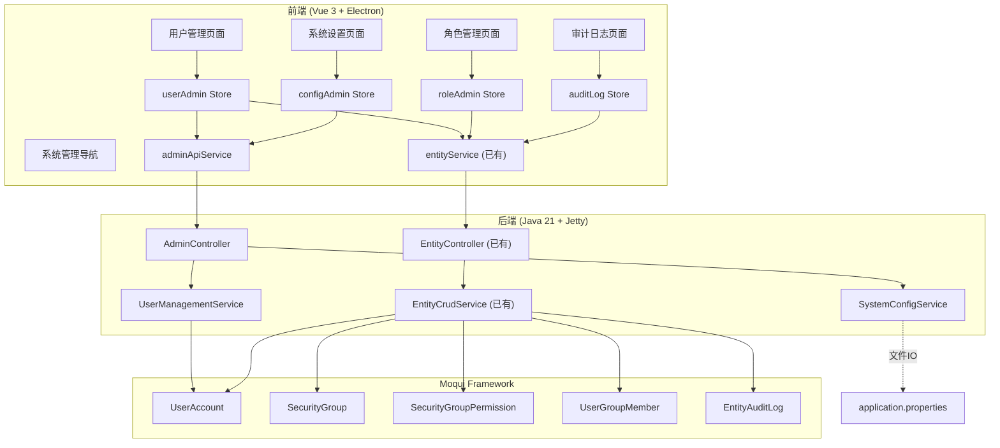

# 设计文档

## 概述

系统管理模块是 331-poc 项目的第一个业务功能模块，提供用户管理、角色/权限管理、用户-组分配、系统配置和审计日志功能。

设计原则：
- **复用优先**：最大化复用已有的 Generic CRUD API（`/api/v1/entities/{entityName}`）处理标准 CRUD 操作
- **新增服务仅覆盖超出 CRUD 的操作**：密码重置、启用/禁用、系统配置读写
- **前端遵循已有模式**：Pinia Store + apiV1Client + entityService，Vue 3 Composition API
- **后端遵循已有模式**：Controller → Service → Moqui Entity Engine，disableAuthz 安全模式

### 架构决策

| 决策 | 选择 | 理由 |
|------|------|------|
| 用户 CRUD | 复用 Generic CRUD API | UserAccount 是标准 Moqui 实体，无需重复实现 |
| 密码重置 | 新建 UserManagement_Service | 需要 Moqui 密码加密逻辑，超出简单 CRUD |
| 启用/禁用 | 新建 UserManagement_Service | 语义化操作，比直接 PUT disabled 字段更安全 |
| 角色/权限 CRUD | 复用 Generic CRUD API | SecurityGroup/Permission 是标准实体 |
| 用户-组分配 | 复用 Generic CRUD API | UserGroupMember 是标准实体 |
| 系统配置 | 新建 SystemConfig_Service | 需要文件 IO 和白名单安全控制 |
| 审计日志 | 复用 Generic CRUD API | AuditLog 是标准只读实体 |

## 架构



### API 路由设计

| 方法 | 路径 | 说明 | 来源 |
|------|------|------|------|
| GET | `/api/v1/entities/moqui.security.UserAccount` | 用户列表 | Generic CRUD |
| POST | `/api/v1/entities/moqui.security.UserAccount` | 创建用户 | Generic CRUD |
| PUT | `/api/v1/entities/moqui.security.UserAccount/{id}` | 更新用户 | Generic CRUD |
| POST | `/api/v1/admin/users/{userId}/toggle-status` | 启用/禁用用户 | 新增 |
| POST | `/api/v1/admin/users/{userId}/reset-password` | 重置密码 | 新增 |
| GET | `/api/v1/entities/moqui.security.SecurityGroup` | 安全组列表 | Generic CRUD |
| POST | `/api/v1/entities/moqui.security.SecurityGroup` | 创建安全组 | Generic CRUD |
| GET | `/api/v1/entities/moqui.security.SecurityGroupPermission` | 权限列表 | Generic CRUD |
| POST | `/api/v1/entities/moqui.security.SecurityGroupPermission` | 添加权限 | Generic CRUD |
| DELETE | `/api/v1/entities/moqui.security.SecurityGroupPermission/{id}` | 移除权限 | Generic CRUD |
| GET | `/api/v1/entities/moqui.security.UserGroupMember` | 成员列表 | Generic CRUD |
| POST | `/api/v1/entities/moqui.security.UserGroupMember` | 分配用户到组 | Generic CRUD |
| DELETE | `/api/v1/entities/moqui.security.UserGroupMember/{id}` | 移除分配 | Generic CRUD |
| GET | `/api/v1/entities/moqui.entity.EntityAuditLog` | 审计日志列表 | Generic CRUD |
| GET | `/api/v1/admin/config` | 获取系统配置 | 新增 |
| PUT | `/api/v1/admin/config` | 更新系统配置 | 新增 |

## 组件与接口

### 后端新增组件

#### AdminController

```java
public class AdminController {
    private final UserManagementService userService;
    private final SystemConfigService configService;
    
    public void register(Router router) {
        // 用户管理（超出 CRUD 的操作）
        router.post("/api/v1/admin/users/{userId}/toggle-status", this::toggleUserStatus);
        router.post("/api/v1/admin/users/{userId}/reset-password", this::resetPassword);
        // 系统配置
        router.get("/api/v1/admin/config", this::getConfig);
        router.put("/api/v1/admin/config", this::updateConfig);
    }
}
```

#### UserManagementService

```java
public class UserManagementService {
    private final ExecutionContextFactory ecf;
    
    /** 切换用户启用/禁用状态 */
    public Map<String, Object> toggleUserStatus(String userId) {
        // disableAuthz → 查找 UserAccount → 切换 disabled 字段 → enableAuthz
    }
    
    /** 重置用户密码 */
    public Map<String, Object> resetPassword(String userId, String newPassword) {
        // disableAuthz → 验证密码长度 → 使用 Moqui 加密 → 重置失败计数 → enableAuthz
    }
}
```

#### SystemConfigService

```java
public class SystemConfigService {
    private static final Set<String> CONFIG_WHITELIST = Set.of(
        "server.port", "server.host", "jwt.expiration", "jwt.refresh.expiration",
        "cors.allowed.origins", "log.level"
    );
    
    /** 获取白名单内的配置项 */
    public Map<String, Object> getConfig() {
        // 读取 application.properties → 过滤白名单 → 返回
    }
    
    /** 更新配置项 */
    public Map<String, Object> updateConfig(Map<String, String> updates) {
        // 验证 key 在白名单内 → 更新 properties 文件 → 返回结果
    }
}
```

### 前端新增组件

#### adminApiService.ts

```typescript
class AdminApiService {
  async toggleUserStatus(userId: string): Promise<ApiV1Result<UserStatusResult>>
  async resetPassword(userId: string, newPassword: string): Promise<ApiV1Result<void>>
  async getConfig(): Promise<ApiV1Result<ConfigItem[]>>
  async updateConfig(updates: Record<string, string>): Promise<ApiV1Result<void>>
}
```

#### Pinia Stores


**userAdminStore** — 用户管理状态

```typescript
interface UserAdminState {
  users: UserAccount[]
  pagination: PaginationMeta | null
  loading: boolean
  error: string | null
  searchKeyword: string
  currentPageIndex: number
  currentPageSize: number  // 默认 20
  selectedUser: UserAccount | null
  mutating: boolean
  mutationError: string | null
}
```

**roleAdminStore** — 角色管理状态

```typescript
interface RoleAdminState {
  groups: SecurityGroup[]
  loading: boolean
  error: string | null
  selectedGroup: SecurityGroup | null
  groupPermissions: SecurityGroupPermission[]
  groupMembers: UserGroupMember[]
  mutating: boolean
  mutationError: string | null
}
```

**configAdminStore** — 系统配置状态

```typescript
interface ConfigAdminState {
  configs: ConfigItem[]
  loading: boolean
  error: string | null
  mutating: boolean
  mutationError: string | null
  successMessage: string | null
}
```

**auditLogStore** — 审计日志状态

```typescript
interface AuditLogState {
  logs: AuditLogEntry[]
  pagination: PaginationMeta | null
  loading: boolean
  error: string | null
  filters: AuditLogFilters
  currentPageIndex: number
  currentPageSize: number  // 默认 50
}

interface AuditLogFilters {
  startDate: string | null
  endDate: string | null
  entityName: string | null
  userId: string | null
}
```

#### Vue 页面组件

| 组件 | 路由 | 说明 |
|------|------|------|
| UserListView.vue | `/admin/users` | 用户列表、搜索、分页 |
| UserFormDialog.vue | — (对话框) | 创建/编辑用户表单 |
| RoleListView.vue | `/admin/roles` | 安全组列表 |
| RoleDetailView.vue | `/admin/roles/:groupId` | 安全组详情（权限+成员） |
| SystemConfigView.vue | `/admin/config` | 系统配置编辑 |
| AuditLogView.vue | `/admin/audit` | 审计日志查看 |

#### 导航集成

在 `navigation.ts` 的 `NAV_ITEMS` 中新增系统管理分组：

```typescript
{
  id: 'admin',
  route: '/admin/users',
  label: '系统管理',
  description: '用户、角色、配置和审计日志管理',
  children: [
    { id: 'admin-users', route: '/admin/users', label: '用户管理' },
    { id: 'admin-roles', route: '/admin/roles', label: '角色管理' },
    { id: 'admin-config', route: '/admin/config', label: '系统设置' },
    { id: 'admin-audit', route: '/admin/audit', label: '审计日志' },
  ]
}
```

## 数据模型

### Moqui 已有实体（直接复用）

#### UserAccount (moqui.security.UserAccount)

| 字段 | 类型 | 说明 |
|------|------|------|
| userId | String (PK) | 用户ID |
| username | String | 用户名（唯一） |
| userFullName | String | 全名 |
| emailAddress | String | 邮箱 |
| disabled | String | 禁用标志 ("Y"/"N") |
| successiveFailedLogins | Integer | 连续失败登录次数 |
| currentPassword | String | 加密后的密码 |
| passwordSalt | String | 密码盐值 |
| passwordHashType | String | 密码哈希类型 |

#### SecurityGroup (moqui.security.SecurityGroup)

| 字段 | 类型 | 说明 |
|------|------|------|
| groupId | String (PK) | 安全组ID |
| description | String | 描述 |
| groupTypeEnumId | String | 组类型枚举 |

#### SecurityGroupPermission (moqui.security.SecurityGroupPermission)

| 字段 | 类型 | 说明 |
|------|------|------|
| groupId | String (PK) | 安全组ID |
| artifactAuthzId | String (PK) | 权限ID |
| fromDate | Timestamp | 生效日期 |
| thruDate | Timestamp | 失效日期 |

#### UserGroupMember (moqui.security.UserGroupMember)

| 字段 | 类型 | 说明 |
|------|------|------|
| userGroupId | String (PK) | 安全组ID |
| userId | String (PK) | 用户ID |
| fromDate | Timestamp (PK) | 生效日期 |
| thruDate | Timestamp | 失效日期 |

#### EntityAuditLog (moqui.entity.EntityAuditLog)

| 字段 | 类型 | 说明 |
|------|------|------|
| auditHistorySeqId | String (PK) | 审计序列ID |
| changedEntityName | String | 变更实体名 |
| changedFieldName | String | 变更字段名 |
| pkPrimaryValue | String | 主键值 |
| oldValueText | String | 旧值 |
| newValueText | String | 新值 |
| changedDate | Timestamp | 变更时间 |
| changedByUserId | String | 操作用户ID |

### 前端类型定义

```typescript
interface UserAccount {
  userId: string
  username: string
  userFullName: string | null
  emailAddress: string | null
  disabled: string | null  // "Y" or "N"
  successiveFailedLogins: number | null
}

interface SecurityGroup {
  groupId: string
  description: string | null
  groupTypeEnumId: string | null
}

interface UserGroupMember {
  userGroupId: string
  userId: string
  fromDate: string
  thruDate: string | null
}

interface ConfigItem {
  key: string
  value: string
  description: string
}

interface AuditLogEntry {
  auditHistorySeqId: string
  changedEntityName: string
  changedFieldName: string | null
  pkPrimaryValue: string | null
  oldValueText: string | null
  newValueText: string | null
  changedDate: string
  changedByUserId: string | null
}
```


## 正确性属性

*属性（Property）是一种在系统所有有效执行中都应成立的特征或行为——本质上是关于系统应该做什么的形式化陈述。属性是人类可读规范与机器可验证正确性保证之间的桥梁。*

### Property 1: 用户搜索过滤正确性

*For any* 用户列表和任意搜索关键词，过滤后的结果列表中每个用户的用户名或邮箱都应包含该搜索关键词（不区分大小写），且不遗漏任何匹配项。

**Validates: Requirements 1.2**

### Property 2: 必填字段验证完整性

*For any* 用户创建表单数据，当缺少任意必填字段（用户名、邮箱、密码）时，验证函数应返回包含所有缺失字段名称的错误列表，且错误列表长度等于缺失字段数量。

**Validates: Requirements 2.3**

### Property 3: 用户状态切换往返一致性

*For any* 用户账户，执行两次状态切换操作（启用→禁用→启用 或 禁用→启用→禁用）后，用户的 disabled 字段应恢复到初始值。

**Validates: Requirements 3.1, 3.2**

### Property 4: 密码重置后失败计数归零

*For any* 用户和任意有效新密码（长度 ≥ 6），执行密码重置后，该用户的 successiveFailedLogins 应为 0。

**Validates: Requirements 3.3**

### Property 5: 短密码拒绝

*For any* 长度小于 6 的字符串作为新密码，密码重置操作应返回错误，且用户的密码保持不变。

**Validates: Requirements 3.4**

### Property 6: 配置白名单强制执行

*For any* 配置键名，当该键名不在预定义白名单中时，读取和写入操作都应被拒绝并返回错误；当键名在白名单中时，操作应被允许。

**Validates: Requirements 6.5**

### Property 7: 配置更新往返一致性

*For any* 白名单内的配置键和有效值，更新配置后再读取该配置项，返回的值应等于更新时设置的值。

**Validates: Requirements 6.2**

### Property 8: 配置更新原子性

*For any* 配置更新操作，如果更新过程中发生 IO 错误，则所有配置项应保持更新前的值不变。

**Validates: Requirements 6.4**

### Property 9: 审计日志过滤正确性

*For any* 审计日志集合和任意过滤条件（时间范围、实体名称、操作用户），过滤后的结果中每条记录都应满足所有指定的过滤条件。

**Validates: Requirements 7.2, 7.3**

### Property 10: 用户-组成员关系双向查询一致性

*For any* 用户-组分配关系，通过用户查询其所属安全组得到的组列表应包含该组，且通过安全组查询其成员列表应包含该用户。

**Validates: Requirements 5.4, 5.5**

### Property 11: 管理接口认证保护

*For any* Admin_API 路由，未携带有效 JWT Token 的请求应返回 401 状态码。

**Validates: Requirements 9.3**

### Property 12: 输入参数安全验证

*For any* 包含 SQL 注入或 XSS 特殊字符的输入参数，Admin_API 应拒绝该请求并返回验证错误。

**Validates: Requirements 9.4**

## 错误处理

### 后端错误处理

| 场景 | HTTP 状态码 | 错误码 | 说明 |
|------|------------|--------|------|
| 用户不存在 | 404 | RESOURCE_NOT_FOUND | toggle-status / reset-password |
| 用户名重复 | 409 | DUPLICATE_RESOURCE | 创建用户时用户名已存在 |
| 安全组ID重复 | 409 | DUPLICATE_RESOURCE | 创建安全组时ID已存在 |
| 密码太短 | 400 | VALIDATION_ERROR | 密码长度 < 6 |
| 必填字段缺失 | 400 | VALIDATION_ERROR | 缺少必填参数 |
| 配置键不在白名单 | 403 | FORBIDDEN | 尝试读写非白名单配置 |
| 配置文件IO错误 | 500 | INTERNAL_ERROR | 文件读写失败 |
| 未认证 | 401 | AUTHENTICATION_REQUIRED | 缺少或无效 JWT Token |
| 输入非法字符 | 400 | VALIDATION_ERROR | SQL注入/XSS 检测 |

### 前端错误处理

- 网络错误：显示"网络错误，请重试"提示，提供重试按钮
- API 错误：解析 error.code 和 error.message，显示本地化错误信息
- 表单验证错误：在对应字段下方显示红色错误提示
- 操作成功：显示绿色成功提示，自动消失

## 测试策略

### 后端测试 (JUnit 5 + jqwik)

**单元测试**：
- UserManagementService: toggleUserStatus、resetPassword 的正常和异常路径
- SystemConfigService: getConfig、updateConfig 的正常和异常路径
- AdminController: 路由注册、请求参数解析、错误响应格式

**属性测试 (jqwik)**：
- Property 3: 用户状态切换往返 — 生成随机初始状态，验证双重切换恢复
- Property 4: 密码重置后计数归零 — 生成随机有效密码，验证 failedLogins = 0
- Property 5: 短密码拒绝 — 生成长度 0-5 的随机字符串，验证拒绝
- Property 6: 配置白名单 — 生成随机键名，验证白名单内外的行为差异
- Property 7: 配置更新往返 — 生成随机白名单键和值，验证写后读一致
- Property 8: 配置更新原子性 — 模拟 IO 错误，验证配置不变
- Property 11: 管理接口认证 — 验证所有 admin 路由需要认证
- Property 12: 输入安全验证 — 生成包含特殊字符的输入，验证拒绝

每个属性测试最少运行 100 次迭代。每个测试用注释标注对应的设计属性：
`// Feature: {{SPEC_NAME}}, Property N: {property_text}`

### 前端测试 (vitest + fast-check)

**单元测试**：
- adminApiService: API 调用参数构造和响应解析
- Store actions: 状态管理逻辑、错误处理、加载状态
- 表单验证函数: 必填字段、格式验证

**属性测试 (fast-check)**：
- Property 1: 用户搜索过滤 — 生成随机用户列表和搜索词，验证过滤正确性
- Property 2: 必填字段验证 — 生成随机缺失字段组合，验证错误列表完整性
- Property 9: 审计日志过滤 — 生成随机日志和过滤条件，验证过滤正确性

每个属性测试最少运行 100 次迭代。

### 测试文件位置

- 后端: `backend/app/src/test/java/org/moqui/rest/service/UserManagementServiceTest.java`
- 后端: `backend/app/src/test/java/org/moqui/rest/service/SystemConfigServiceTest.java`
- 后端: `backend/app/src/test/java/org/moqui/rest/controller/AdminControllerTest.java`
- 前端: `frontend/src/renderer/services/__tests__/adminApiService.test.ts`
- 前端: `frontend/src/renderer/stores/__tests__/userAdmin.test.ts`
- 前端: `frontend/src/renderer/stores/__tests__/auditLog.test.ts`
