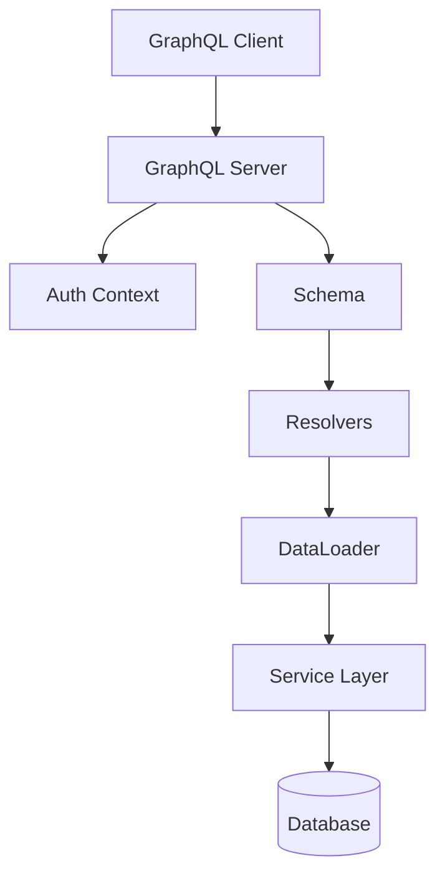

# Design Document: {{SPEC_NAME_TITLE}}

## Overview

This document describes the technical design for the {{SPEC_NAME}} GraphQL API feature.

**GraphQL Server**: [Specify: Apollo Server / GraphQL Yoga / Mercurius / etc.]  
**Schema Approach**: [Choose: Schema-first / Code-first]  
**Database**: [Specify: PostgreSQL / MongoDB / MySQL / etc.]

## Architecture

### High-Level Architecture



### Component Responsibilities

**GraphQL Server**: Handle HTTP requests, execute queries, format responses  
**Auth Context**: Extract and validate authentication tokens  
**Schema**: Define GraphQL type system and operations  
**Resolvers**: Implement data fetching logic for each field  
**DataLoader**: Batch and cache database queries  
**Service Layer**: Business logic implementation

## GraphQL Schema

### Type Definitions

```graphql
# Main entity type
type {{SPEC_NAME_TITLE}} {
  id: ID!
  name: String!
  description: String
  status: Status!
  createdAt: DateTime!
  updatedAt: DateTime!
  createdBy: User!
}

# Enum for status
enum Status {
  ACTIVE
  INACTIVE
  ARCHIVED
}

# Input type for creating
input Create{{SPEC_NAME_TITLE}}Input {
  name: String!
  description: String
  status: Status
}

# Input type for updating
input Update{{SPEC_NAME_TITLE}}Input {
  name: String
  description: String
  status: Status
}

# Filter input for queries
input {{SPEC_NAME_TITLE}}Filter {
  status: Status
  search: String
}

# Pagination input
input PaginationInput {
  first: Int
  after: String
  last: Int
  before: String
}

# Connection type for pagination
type {{SPEC_NAME_TITLE}}Connection {
  edges: [{{SPEC_NAME_TITLE}}Edge!]!
  pageInfo: PageInfo!
  totalCount: Int!
}

type {{SPEC_NAME_TITLE}}Edge {
  node: {{SPEC_NAME_TITLE}}!
  cursor: String!
}

type PageInfo {
  hasNextPage: Boolean!
  hasPreviousPage: Boolean!
  startCursor: String
  endCursor: String
}
```

### Query Operations

```graphql
type Query {
  # Get single entity by ID
  {{SPEC_NAME}}(id: ID!): {{SPEC_NAME_TITLE}}
  
  # List entities with filtering and pagination
  {{SPEC_NAME}}s(
    filter: {{SPEC_NAME_TITLE}}Filter
    pagination: PaginationInput
  ): {{SPEC_NAME_TITLE}}Connection!
  
  # Search entities
  search{{SPEC_NAME_TITLE}}s(query: String!): [{{SPEC_NAME_TITLE}}!]!
}
```

### Mutation Operations

```graphql
type Mutation {
  # Create new entity
  create{{SPEC_NAME_TITLE}}(
    input: Create{{SPEC_NAME_TITLE}}Input!
  ): {{SPEC_NAME_TITLE}}!
  
  # Update existing entity
  update{{SPEC_NAME_TITLE}}(
    id: ID!
    input: Update{{SPEC_NAME_TITLE}}Input!
  ): {{SPEC_NAME_TITLE}}!
  
  # Delete entity
  delete{{SPEC_NAME_TITLE}}(id: ID!): Boolean!
}
```

## Resolver Implementation

### Query Resolvers

```javascript
const Query = {
  {{SPEC_NAME}}: async (parent, { id }, context) => {
    // Check authentication
    if (!context.user) {
      throw new AuthenticationError('Authentication required');
    }
    
    // Fetch entity
    const entity = await context.dataSources.{{SPEC_NAME}}API.findById(id);
    
    if (!entity) {
      throw new UserInputError('Entity not found');
    }
    
    return entity;
  },
  
  {{SPEC_NAME}}s: async (parent, { filter, pagination }, context) => {
    // Check authentication
    if (!context.user) {
      throw new AuthenticationError('Authentication required');
    }
    
    // Fetch entities with pagination
    return context.dataSources.{{SPEC_NAME}}API.findAll(filter, pagination);
  }
};
```

### Mutation Resolvers

```javascript
const Mutation = {
  create{{SPEC_NAME_TITLE}}: async (parent, { input }, context) => {
    // Check authentication
    if (!context.user) {
      throw new AuthenticationError('Authentication required');
    }
    
    // Validate input
    validateInput(input);
    
    // Create entity
    const entity = await context.dataSources.{{SPEC_NAME}}API.create({
      ...input,
      createdBy: context.user.id
    });
    
    return entity;
  },
  
  update{{SPEC_NAME_TITLE}}: async (parent, { id, input }, context) => {
    // Check authentication and authorization
    if (!context.user) {
      throw new AuthenticationError('Authentication required');
    }
    
    const entity = await context.dataSources.{{SPEC_NAME}}API.findById(id);
    
    if (!entity) {
      throw new UserInputError('Entity not found');
    }
    
    if (!canUpdate(context.user, entity)) {
      throw new ForbiddenError('Insufficient permissions');
    }
    
    // Update entity
    return context.dataSources.{{SPEC_NAME}}API.update(id, input);
  }
};
```

### Field Resolvers

```javascript
const {{SPEC_NAME_TITLE}} = {
  createdBy: async (parent, args, context) => {
    // Use DataLoader to batch user queries
    return context.loaders.userLoader.load(parent.createdById);
  }
};
```

## DataLoader Implementation

```javascript
const createLoaders = () => ({
  userLoader: new DataLoader(async (userIds) => {
    const users = await User.findAll({
      where: { id: userIds }
    });
    
    // Return users in same order as requested IDs
    return userIds.map(id => 
      users.find(user => user.id === id)
    );
  })
});
```

## Error Handling

### Custom Error Classes

```javascript
class ValidationError extends ApolloError {
  constructor(message, field) {
    super(message, 'VALIDATION_ERROR', { field });
  }
}

class NotFoundError extends ApolloError {
  constructor(message) {
    super(message, 'NOT_FOUND');
  }
}
```

### Error Formatting

```javascript
const formatError = (error) => {
  // Log error for debugging
  logger.error('GraphQL Error:', {
    message: error.message,
    code: error.extensions?.code,
    path: error.path,
    timestamp: new Date().toISOString()
  });
  
  // Don't expose internal errors to client
  if (error.extensions?.code === 'INTERNAL_SERVER_ERROR') {
    return new Error('An internal error occurred');
  }
  
  return error;
};
```

## Authentication Context

```javascript
const createContext = async ({ req }) => {
  // Extract token from header
  const token = req.headers.authorization?.replace('Bearer ', '');
  
  if (!token) {
    return { user: null, loaders: createLoaders() };
  }
  
  // Verify token
  try {
    const user = await verifyToken(token);
    return {
      user,
      loaders: createLoaders(),
      dataSources: createDataSources()
    };
  } catch (error) {
    throw new AuthenticationError('Invalid token');
  }
};
```

## Query Complexity

```javascript
const complexityPlugin = {
  requestDidStart: () => ({
    didResolveOperation({ request, document }) {
      const complexity = getComplexity({
        schema,
        query: document,
        variables: request.variables,
        estimators: [
          fieldExtensionsEstimator(),
          simpleEstimator({ defaultComplexity: 1 })
        ]
      });
      
      if (complexity > MAX_COMPLEXITY) {
        throw new Error(
          `Query too complex: ${complexity}. Maximum: ${MAX_COMPLEXITY}`
        );
      }
    }
  })
};
```

## Testing Strategy

### Unit Tests
- Resolver logic
- Input validation
- Error handling
- DataLoader batching

### Integration Tests
- End-to-end query execution
- Mutation workflows
- Authentication/authorization
- Error scenarios

### Property-Based Tests
- Schema validation
- Input validation across all valid inputs
- Query complexity calculation

---

**Version**: 1.0.0  
**Created**: {{DATE}}  
**Author**: {{AUTHOR}}


## Ontology Model (Backfilled)

### Entities
- **GraphqlApiRecord**: Core domain record for Graphql Api scenarios.
- **GraphqlApiProcess**: Process context handling lifecycle transitions.
- **GraphqlApiAuditEvent**: Immutable operation/audit trace entry.

### Relations
- **GraphqlApiRecord** 1:N **GraphqlApiProcess** (lifecycle orchestration).
- **GraphqlApiProcess** 1:N **GraphqlApiAuditEvent** (traceability and compliance).

### Decision Logic
- **DL-001**: If record does not exist, route to create flow; otherwise update flow.
- **DL-002**: If requested transition is invalid, reject and return violation reason.
- **DL-003**: If post-check fails, rollback and mark operation as failed.
