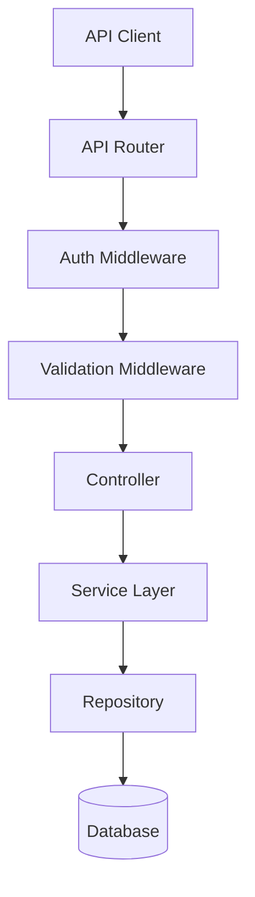

# Design Document: {{SPEC_NAME_TITLE}}

## Overview

This document describes the technical design for the {{SPEC_NAME}} REST API feature.

**Architecture Pattern**: [Choose: MVC / Layered / Clean Architecture]  
**Framework**: [Specify: Express.js / Fastify / Koa / etc.]  
**Database**: [Specify: PostgreSQL / MongoDB / MySQL / etc.]

## Architecture

### High-Level Architecture



### Component Responsibilities

**Router**: Route HTTP requests to appropriate controllers  
**Auth Middleware**: Verify authentication tokens  
**Validation Middleware**: Validate request payloads  
**Controller**: Handle HTTP request/response  
**Service**: Business logic implementation  
**Repository**: Data access layer

## API Endpoints

### GET /api/v1/{{SPEC_NAME}}/resources

**Purpose**: List all resources with pagination

**Request**:
```http
GET /api/v1/{{SPEC_NAME}}/resources?page=1&per_page=20
Authorization: Bearer <token>
```

**Response** (200 OK):
```json
{
  "data": [
    {
      "id": "123",
      "name": "Resource Name",
      "created_at": "2025-01-30T10:00:00Z"
    }
  ],
  "meta": {
    "page": 1,
    "per_page": 20,
    "total": 100
  }
}
```

### POST /api/v1/{{SPEC_NAME}}/resources

**Purpose**: Create a new resource

**Request**:
```http
POST /api/v1/{{SPEC_NAME}}/resources
Content-Type: application/json
Authorization: Bearer <token>

{
  "name": "New Resource",
  "description": "Description"
}
```

**Response** (201 Created):
```json
{
  "data": {
    "id": "124",
    "name": "New Resource",
    "created_at": "2025-01-30T10:05:00Z"
  }
}
```

<!-- Add more endpoints: GET /:id, PUT /:id, DELETE /:id -->

## Data Models

### Resource Model

```javascript
{
  id: String,           // UUID
  name: String,         // Required, max 255 chars
  description: String,  // Optional, max 1000 chars
  status: Enum,         // ['active', 'inactive']
  created_at: DateTime,
  updated_at: DateTime,
  created_by: String    // User ID
}
```

## Error Handling

### Error Response Format

```json
{
  "error": "Error message",
  "code": "ERROR_CODE",
  "details": {},
  "timestamp": "2025-01-30T10:00:00Z",
  "request_id": "req-123"
}
```

### Error Codes

- `VALIDATION_ERROR` - Invalid input data
- `NOT_FOUND` - Resource not found
- `UNAUTHORIZED` - Authentication failed
- `FORBIDDEN` - Insufficient permissions
- `RATE_LIMIT_EXCEEDED` - Too many requests
- `INTERNAL_ERROR` - Server error

## Testing Strategy

### Unit Tests
- Controller logic
- Service layer business logic
- Validation rules
- Error handling

### Integration Tests
- End-to-end API workflows
- Database interactions
- Authentication/authorization
- Error scenarios

### Property-Based Tests
- Input validation across all valid inputs
- Error handling consistency
- Response format consistency

---

**Version**: 1.0.0  
**Created**: {{DATE}}  
**Author**: {{AUTHOR}}


## Ontology Model (Backfilled)

### Entities
- **RestApiRecord**: Core domain record for Rest Api scenarios.
- **RestApiProcess**: Process context handling lifecycle transitions.
- **RestApiAuditEvent**: Immutable operation/audit trace entry.

### Relations
- **RestApiRecord** 1:N **RestApiProcess** (lifecycle orchestration).
- **RestApiProcess** 1:N **RestApiAuditEvent** (traceability and compliance).

### Business Rules
- **BR-001**: Mandatory fields must pass validation before persistence.
- **BR-002**: State transitions must comply with lifecycle policy.
- **BR-003**: Every mutating operation must emit an audit event.

### Decision Logic
- **DL-001**: If record does not exist, route to create flow; otherwise update flow.
- **DL-002**: If requested transition is invalid, reject and return violation reason.
- **DL-003**: If post-check fails, rollback and mark operation as failed.
